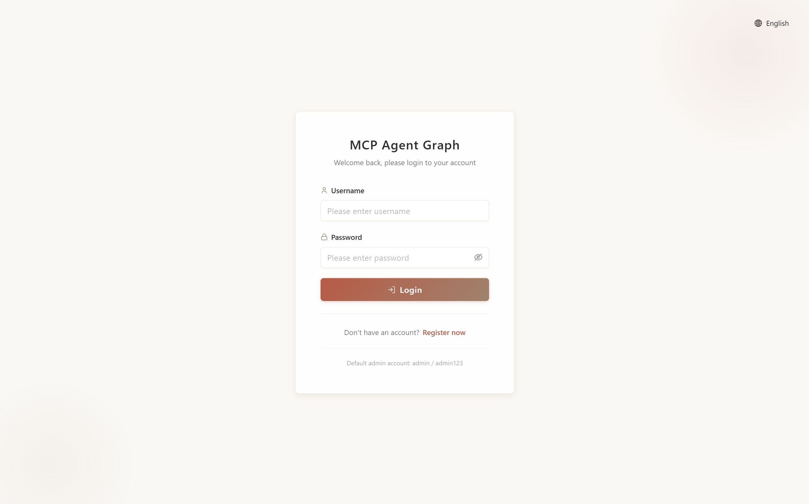
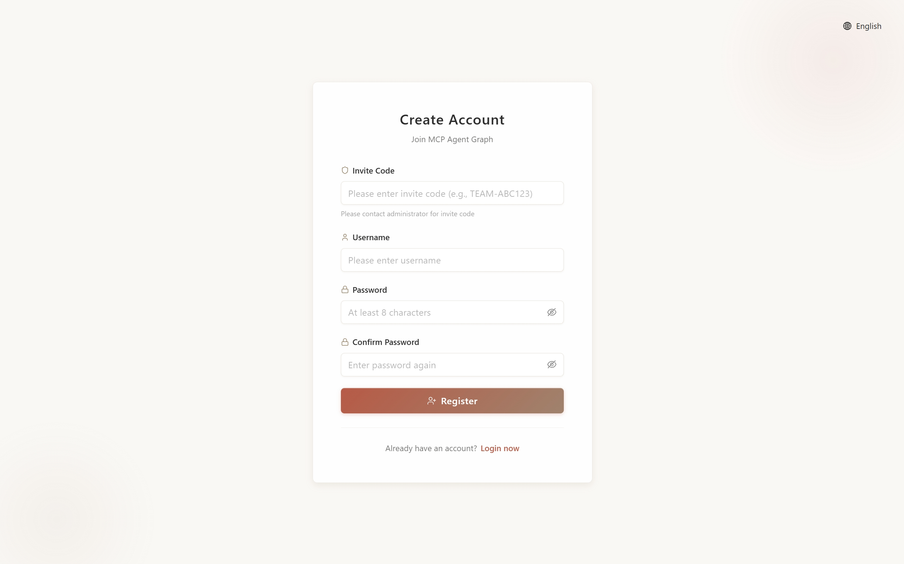
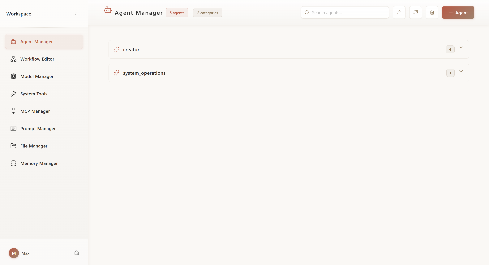
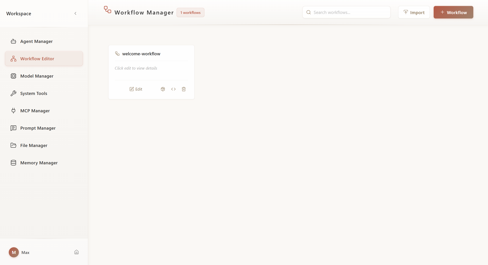
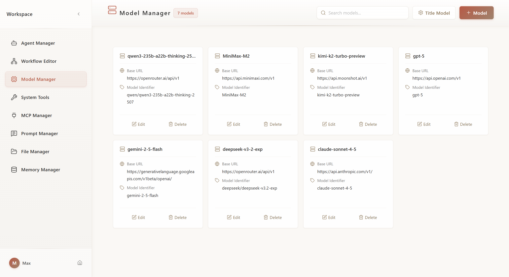
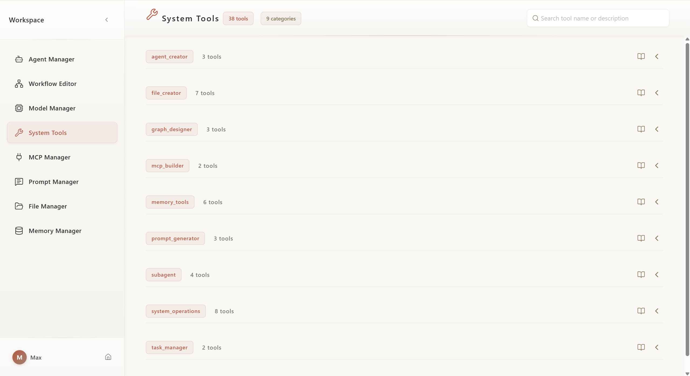
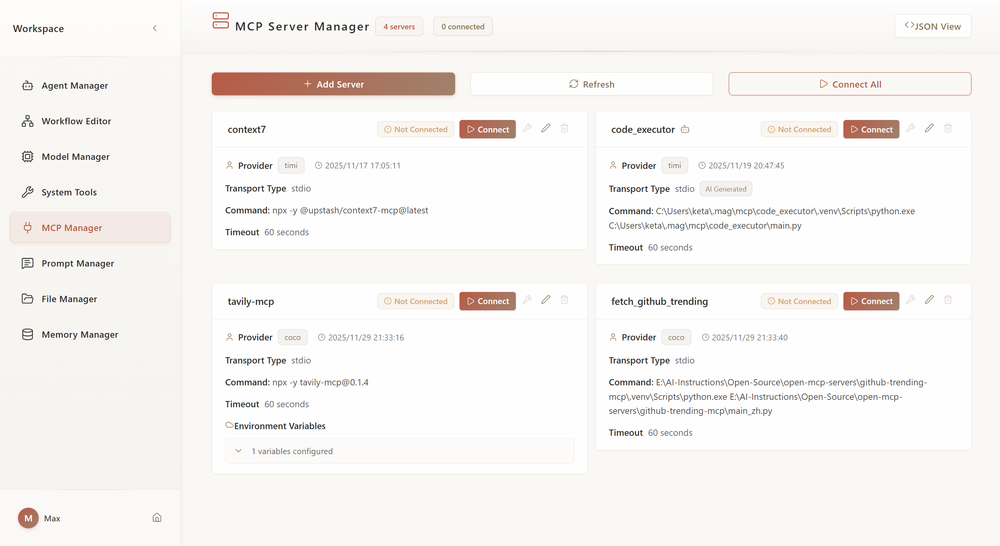
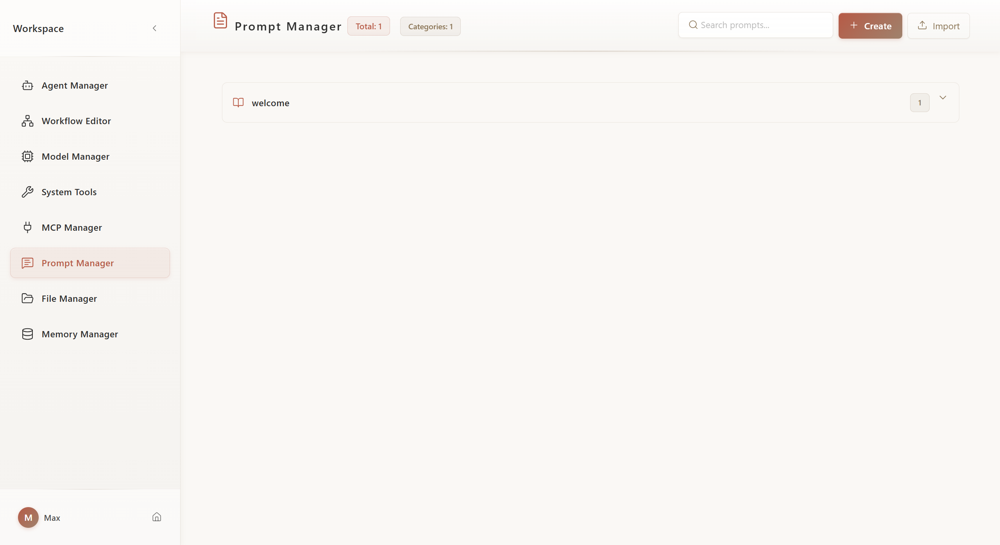
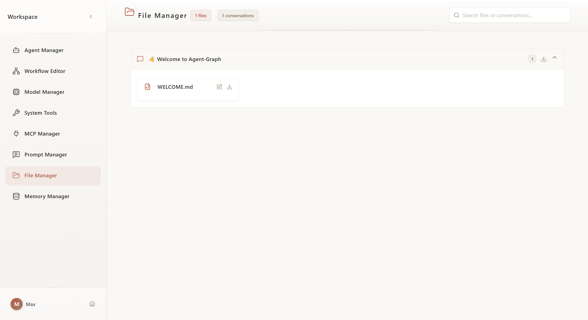
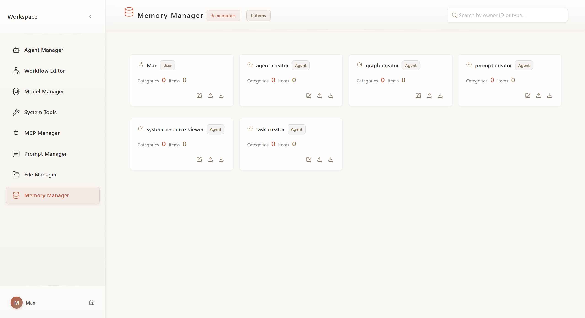

English | [中文](README_CN.md)

MCP Agent Graph is a Multi-Agent System built on the principles of Context Engineering. It integrates Sub-agent, Long-term Memory, MCP, Agent-based Workflow, and other capabilities. By integrating Context Engineering best practices into a visual development experience, MCP Agent Graph enables developers to rapidly build, test, and deploy complex multi-agent applications.

| | |
|---|---|
| **Try Online** | **https://agent-graph.com/** |
| **Invitation Code** | **TEAM-QI10IT** |
| **Documentation** | **https://keta1930.github.io/mcp-agent-graph/** |

> ⚠️ **Important Note**: The models on the demo site do not have API keys configured. You will need to add your own API keys in Model Management to use the platform.

## Table of Contents

1. [Framework](#1-framework)
2. [Deployment Guide](#2-deployment-guide)
   - [Clone Project](#21-clone-project)
   - [Configure and Start Docker Services](#22-configure-and-start-docker-services)
   - [Deploy Backend](#23-deploy-backend)
   - [Access Application](#24-access-application)
3. [Core Features](#3-core-features)
4. [Future Roadmap](#4-future-roadmap)
   - [Coming Soon](#coming-soon)
   - [Future Plans](#future-plans)
5. [Frontend Feature Showcase](#5-frontend-feature-showcase)
6. [Citation](#6-citation)
7. [WeChat Group](#7-wechat-group)

## 1. Framework

### System Architecture


### User Journey


## 2. Deployment Guide

> 📖 **Detailed Installation Documentation**: [docs/first-steps/install.md](docs/first-steps/install.md)

### System Requirements

| Component | Requirement |
|-----------|-------------|
| Operating System | Linux, macOS, or Windows (requires WSL2) |
| Docker | Version 20.10+ with Docker Compose |
| Python | Version 3.11+ |
| Memory | Minimum 4GB (8GB recommended) |
| Storage | At least 10GB available space |

### Quick Start

#### 2.1. Clone Project
```bash
git clone https://github.com/keta1930/mcp-agent-graph.git
cd mcp-agent-graph
```

#### 2.2. Configure and Start Docker Services

```bash
cd docker/mag_services
cp .env.example .env
# Edit .env file to configure necessary parameters (see installation documentation)
docker-compose up -d
```

**Service Addresses:**
- MongoDB Express (Database Management): http://localhost:8081
- MinIO Console (File Storage): http://localhost:9011

#### 2.3. Deploy Backend

**Using uv (Recommended):**
```bash
cd ../..  # Return to project root
uv sync
cd mag
uv run python main.py
```

**Using pip:**
```bash
cd ../..  # Return to project root
pip install -r requirements.txt
cd mag
python main.py
```

**Run in Background:**
```bash
nohup python main.py > app.log 2>&1 &
```

#### 2.4. Access Application

Open browser and visit: **http://localhost:9999**

**Login Page (Admin login with username and password configured in `.env`):**



**Registration Page (New users can register with invitation code):**



**Other Access Endpoints:**
- API Documentation: http://localhost:9999/docs
- Health Check: http://localhost:9999/health

### Frontend Development (Optional)

If you need to modify frontend code:

```bash
cd frontend
npm install
npm run dev  # Development server: http://localhost:5173
npm run build  # Build production version
```

**Note:** The repository includes pre-built frontend files. This step is only needed when developing or customizing the frontend.

## 3. Core Features

### Core Components

| Feature | Description | Documentation |
|---------|-------------|---------------|
| **Agent** | AI entities with capabilities to understand goals, use tools, iterate optimization, maintain context and long-term memory, solving open-ended tasks through autonomous action execution | [Agent Docs](docs/core-components/agent/index.md) |
| **Graph (Workflow)** | Orchestrate multiple agents into structured workflows, defining execution flow through nodes and edges, suitable for predictable multi-stage tasks | [Graph Docs](docs/core-components/graph/index.md) |
| **Model** | Support for LLM and VLM models (OpenAI compatible), flexible API Key configuration | [Model Docs](docs/core-components/model/multi-model.md) |
| **Memory** | Short-term memory maintains conversation context, long-term memory stores user preferences and Agent knowledge base across sessions | [Memory Docs](docs/core-components/memory/index.md) |
| **Prompt Center** | Centralized management of reusable Prompt templates, supporting categorization, import/export, and cross-project references | [Prompt Docs](docs/core-components/prompt/index.md) |
| **Projects** | Organize conversations into collections with shared files | [Projects Docs](docs/core-components/conversation/projects.md) |

### Workflow Capabilities

| Feature | Description | Documentation |
|---------|-------------|---------------|
| **Visual Graph Editor** | Frontend drag-and-drop workflow design, supporting linear, parallel, conditional, and nested graph types, WYSIWYG | [Graph Docs](docs/core-components/graph/index.md) |
| **Subgraph Nesting** | Use entire Graphs as single nodes for nesting, enabling modular, reusable, and hierarchical workflow construction | [Subgraph Docs](docs/core-components/graph/subgraph.md) |
| **Handoffs (Smart Routing)** | Nodes dynamically select next execution node, supporting intelligent decisions, conditional branching, and iterative optimization loops | [Handoffs Docs](docs/core-components/graph/handoffs.md) |
| **Task (Scheduling)** | Scheduled or periodic automatic Graph execution, supporting cron expressions, concurrent instances, and execution history tracking | [Task Docs](docs/core-components/graph/task.md) |

### Extension Capabilities

| Feature | Description | Documentation |
|---------|-------------|---------------|
| **MCP Protocol Integration** | Connect external tools and data sources (databases, APIs, file systems, cloud services, etc.) through standardized protocol, connect once and use everywhere | [MCP Docs](docs/core-components/mcp/index.md) |
| **Built-in Tool Set** | Provides resource creation (Agent Creator, Graph Designer, MCP Builder, Prompt Generator, Task Manager), collaboration (Sub-agent, File Tool), and query (Memory Tool, System Operations) system tools | [Tools Docs](docs/core-components/tools/index.md) |
| **Python SDK** | [Discontinued] Install via `pip install mcp-agent-graph`, build and manage Agent systems using Python code | [PyPI Package](https://pypi.org/project/mcp-agent-graph/) |

### Collaboration & Management

| Feature | Description | Documentation |
|---------|-------------|---------------|
| **Team Collaboration** | Admins create invitation codes, manage team members, assign role permissions (Super Admin, Admin, Regular User) | [Team Management](docs/core-components/team/manage.md) |
| **Conversation Management** | Support conversation history viewing, file attachment management, and session context maintenance | [Quick Start](docs/first-steps/quickstart.md) |

## 4. Future Roadmap

> 📖 **Complete Roadmap**: [docs/roadmap/index.md](docs/roadmap/index.md)

The platform continues to evolve, bringing more powerful Agent capabilities and better collaboration experiences to users.

### Recently Implemented

The following features have been recently implemented and are now available:

| Feature | Core Value | Documentation |
|---------|------------|---------------|
| **Multimodal Support** | VLM gives Agents visual understanding capabilities | [Details](docs/roadmap/multimodal.md) |
| **Projects** | Organize conversations into collections with shared resources | [Details](docs/core-components/conversation/projects.md) |

### Coming Soon

The following features are coming soon or actively under development:

| Feature | Core Value | Documentation |
|---------|------------|---------------|
| **Team Resource Sharing** | Share Agents, workflows, and Prompts within teams | [Details](docs/roadmap/resource-sharing.md) |
| **Agent Skills** | Progressive context engineering to improve efficiency and capabilities | [Details](docs/roadmap/skills-context.md) |

### Future Plans

These features are under continuous exploration and planning:

| Feature | Core Value | Documentation |
|---------|------------|---------------|
| **External Agent API** | Open Agents to external calls, building a service ecosystem | [Details](docs/roadmap/external-api.md) |
| **User Analytics** | Effect evaluation and team insights | [Details](docs/roadmap/analytics.md) |

## 5. Frontend Feature Showcase

### 5.1. Chat Welcome Page
Entry interface for starting conversations with Agents, supporting quick selection of preset Agents or creating new conversations.


---

### 5.2. Workspace - Agent Management
Create, configure, and manage agents, set system prompts, tools, and model parameters.



---

### 5.3. Workspace - Workflow Management
Visual drag-and-drop workflow designer, supporting multiple node types and complex process orchestration.



---

### 5.4. Workspace - Model Management
Configure and manage multiple LLM models, set API Keys and model parameters.



---

### 5.5. Workspace - System Toolbox
View and configure built-in system tools, including resource creation and collaboration tools.



---

### 5.6. Workspace - MCP Management
Manage MCP server connections, configure external tool and data source integrations.



---

### 5.7. Workspace - Prompt Management
Centrally manage reusable Prompt templates, supporting categorization and version control.



---

### 5.8. Workspace - File Management
Manage uploaded files and attachments, supporting file preview and organization.



---

### 5.9. Workspace - Memory Management
View and manage Agent's long-term memory and knowledge base.



---

## 6. Citation

If you find MCP Agent Graph helpful for your research or work, please consider citing it:

```bibtex
@misc{mcp_agent_graph_2025,
  title        = {mcp-agent-graph},
  author       = {Yan Yixin},
  howpublished = {\url{https://github.com/keta1930/mcp-agent-graph}},
  note         = {Accessed: 2025-04-24},
  year         = {2025}
}
```

## 7. Contact

For questions, suggestions, or collaboration inquiries, feel free to reach out:

📧 Email: [yandeheng1@gmail.com](mailto:yandeheng1@gmail.com)
