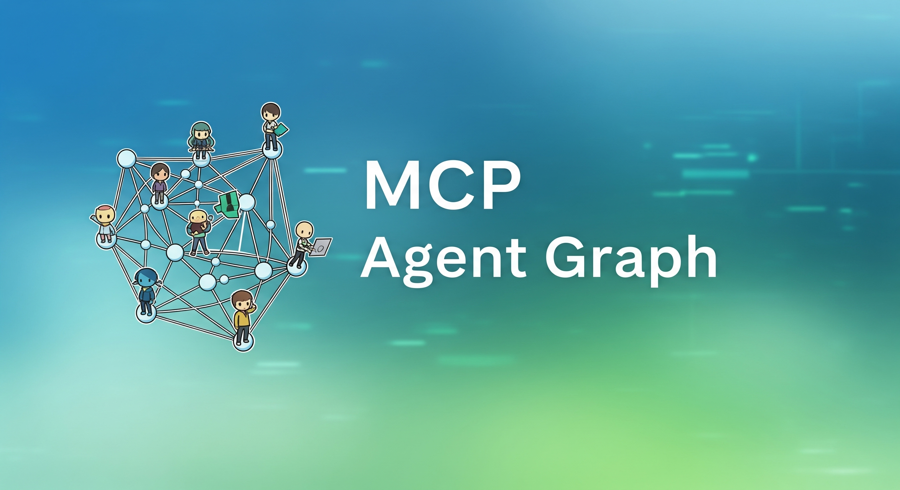

English | [中文](README_CN.md)

📚 [Documentation](https://keta1930.github.io/mcp-agent-graph/#) | 📦 [PyPI Package](https://pypi.org/project/mcp-agent-graph/)

## Table of Contents

1. [Roadmap](#1-roadmap)
2. [Deployment Guide](#2-deployment-guide)
   - [Clone Project](#21-clone-project)
   - [Start Docker Services](#22-start-docker-services)
   - [Start Frontend Service](#23-start-frontend-service)
   - [Backend Deployment](#24-backend-deployment)
3. [Core Features](#3-core-features)
4. [Frontend Feature Showcase](#4-frontend-feature-showcase)
   - [deepresearch (Agent Generated)](#41-deepresearch-agent-generated)
   - [corporate_ethics_dilemma_v2 (Agent Generated)](#42-corporate_ethics_dilemma_v2-agent-generated)
5. [Citation](#5-citation)
6. [WeChat Group](#6-wechat-group)
7. [Milestone](#7-milestone)
8. [Star History](#8-star-history)

## 1. Roadmap


## 2. Deployment Guide

### 2.1. Clone Project
```bash
git clone https://github.com/keta1930/mcp-agent-graph.git
```

### 2.2. Start Docker Services

```bash
# Copy environment configuration file, or use .env file directly
cd docker/mag_services
cp .env.example .env

# Start Docker services
docker-compose up -d
```

**Default .env Service Addresses:**
- MongoDB Express (Database Management): http://localhost:8081
- MinIO Console (File Storage): http://localhost:9011

### 2.3. Start Frontend Service

```bash
# Enter frontend directory
cd frontend

# Install dependencies and start
npm install
npm run dev
```

**Access Address:** http://localhost:5173

### 2.4. Backend Deployment

**Option 1: PyPI Installation (Recommended)**
```bash
pip install mcp-agent-graph
>>> mag.start()
```

**Option 2: Source Code Deployment**
```bash
git clone https://github.com/keta1930/mcp-agent-graph.git
cd mcp-agent-graph

# Using uv (Recommended)
uv sync
cd mag
uv run python main.py

# Or using pip
pip install -r requirements.txt
cd mag
python main.py
```

**Service Addresses:**
- Backend API: http://localhost:9999
- MCP Client: http://localhost:8765

## 3. Core Features

#### 3.1. System-Level Agent
System-level Agent helps users customize Agent Workflow/Agent Graph and MCP tools

#### 3.2. Visual Graph Editor
Frontend creation of intelligent agent workflows, what you see is what you get

#### 3.3. Graph Nesting
Agent reusability, any graph can be used as a node in other graphs, building hierarchical intelligent systems

#### 3.4. Task Scheduling System
Support for timed and periodic execution of Agents, batch concurrent processing

#### 3.5. Graph to MCP Service
One-click export of agents as standard MCP services, callable by Claude, Cline, etc.

#### 3.6. Agent Trading and Transfer
Complete agent packaging, sharing, and deployment solution

#### 3.7. Python SDK Deep Integration
`pip install mcp-agent-graph` to build Agents using Python

#### 3.8. Prompt Registration Management
One-stop prompt management, register and reuse prompt templates

## 4. Frontend Feature Showcase

### 4.1. deepresearch (Agent Generated)
#### Deep analysis of user questions, multi-round intelligent retrieval, and comprehensive research system that generates visualized HTML web pages


---
### 4.2. corporate_ethics_dilemma_v2 (Agent Generated)
#### AI CFO Alex faces complex corporate ethical choices, exploring AI decision-making mechanisms in conflicts of interest


---

## 5. Citation

If you find MCP Agent Graph helpful for your research or work, please consider citing it:

```bibtex
@misc{mcp_agent_graph_2025,
  title        = {mcp-agent-graph},
  author       = {Yan Yixin},
  howpublished = {\url{https://github.com/keta1930/mcp-agent-graph}},
  note         = {Accessed: 2025-04-24},
  year         = {2025}
}
```

## 6. WeChat Group


## 7. Milestone


## 8. Star History

[](https://www.star-history.com/#keta1930-mcp-agent-graph&Date)
