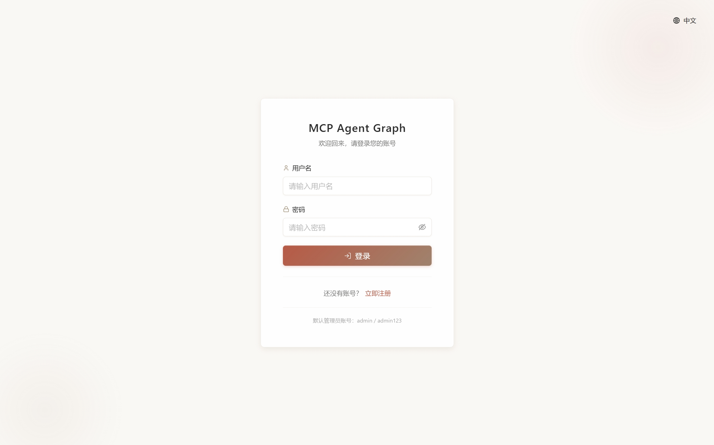
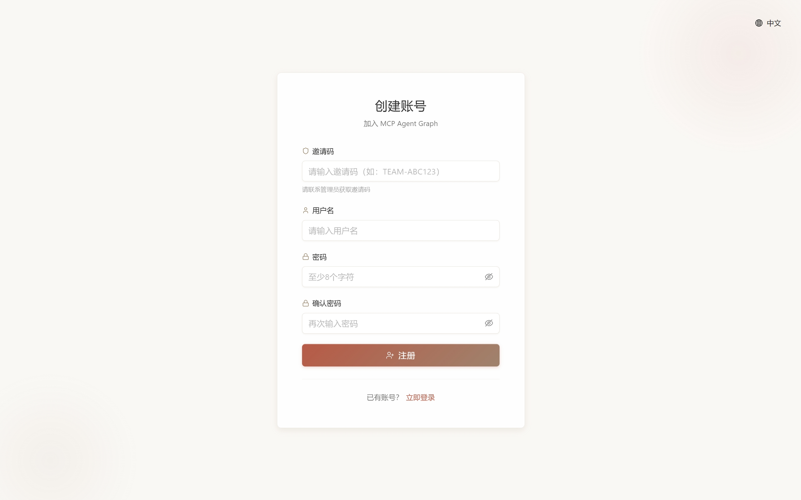
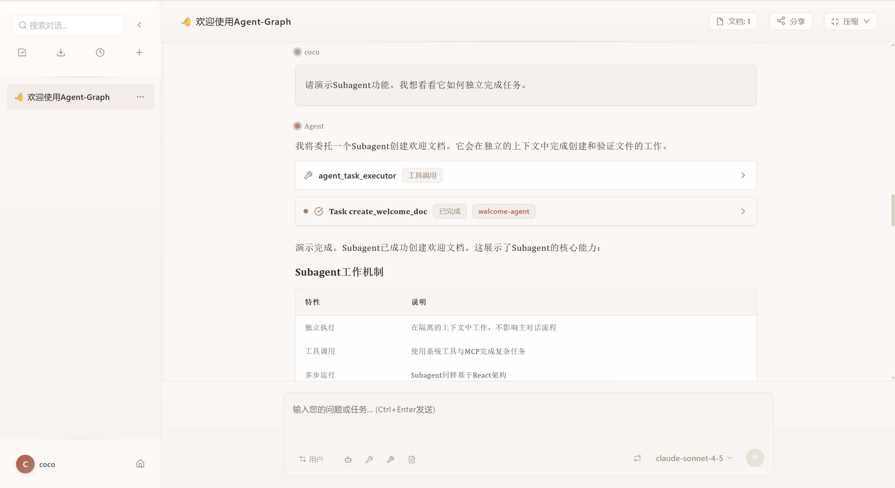
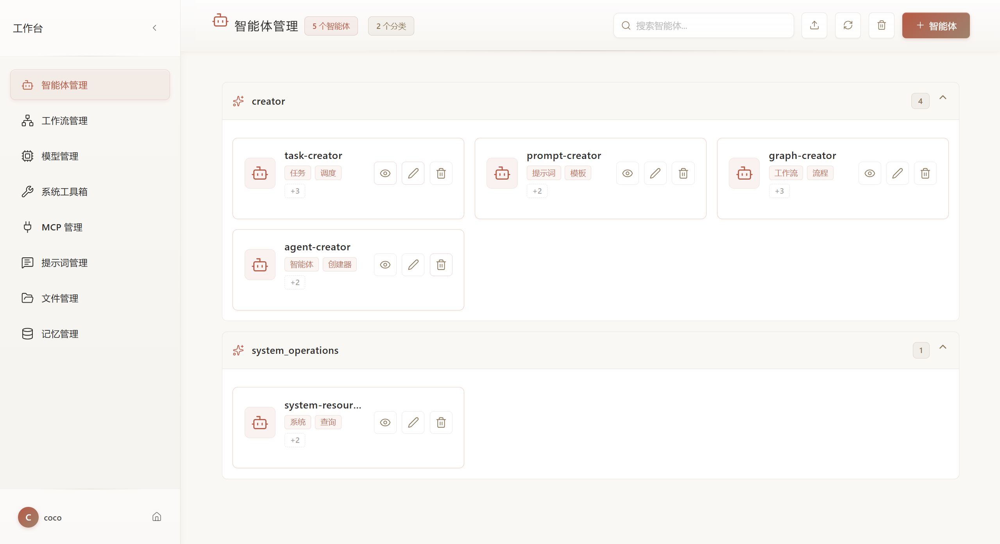
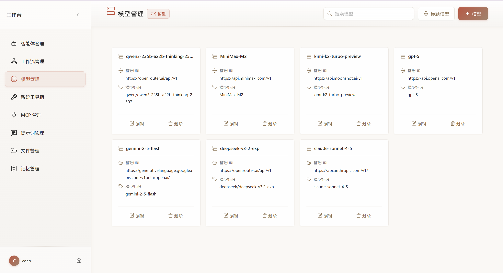
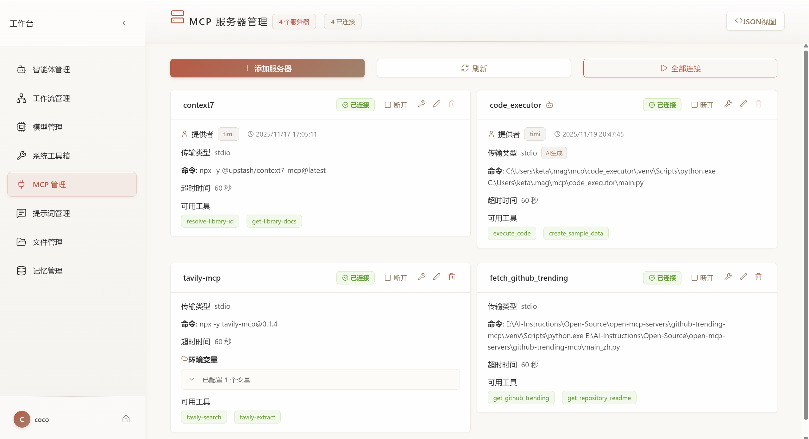
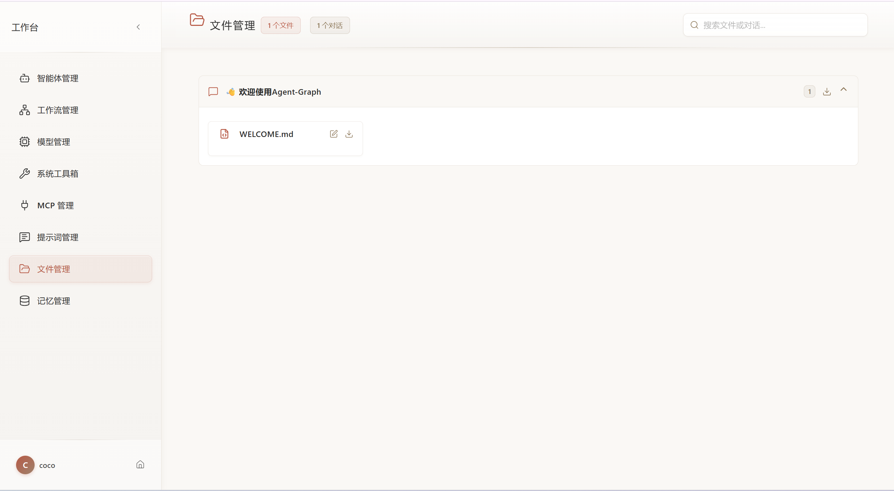

[English](README.md) | 中文

MCP Agent Graph 是一个基于上下文工程（Context Engineering）理念构建的多智能体系统（Multi-Agent System）。集成了 Sub-agent、长期记忆、MCP、Agent-based Workflow 等功能。通过将上下文工程的最佳实践融入可视化的开发体验，MCP Agent Graph 让开发者能够快速构建、测试和部署复杂的多智能体应用。

| | |
|---|---|
| **在线体验** | **https://agent-graph.com/** |
| **邀请码** | **TEAM-QI10IT** |
| **文档** | **https://keta1930.github.io/mcp-agent-graph/** |

> ⚠️ **重要提示**：体验网站中的模型均未配置 API Key，您需要在模型管理中添加自己的 API Key 才能使用。

## 目录

1. [框架图](#1-框架图)
2. [部署指南](#2-部署指南)
   - [克隆项目](#21-克隆项目)
   - [配置并启动 Docker 服务](#22-配置并启动-docker-服务)
   - [部署后端](#23-部署后端)
   - [访问应用](#24-访问应用)
3. [核心特性](#3-核心特性)
4. [未来路线图](#4-未来路线图)
   - [即将推出](#即将推出)
   - [未来规划](#未来规划)
5. [前端功能展示](#5-前端功能展示)
6. [引用](#6-引用)
7. [微信群](#7-微信群)

## 1. 框架图

### 系统框架


### 用户使用流程


## 2. 部署指南

> 📖 **详细安装文档**: [docs/first-steps/install.zh.md](docs/first-steps/install.zh.md)

### 系统要求

| 组件 | 要求 |
|------|------|
| 操作系统 | Linux、macOS 或 Windows (需要 WSL2) |
| Docker | 20.10+ 版本,包含 Docker Compose |
| Python | 3.11+ 版本 |
| 内存 | 最低 4GB (推荐 8GB) |
| 存储空间 | 至少 10GB 可用空间 |

### 快速开始

#### 2.1. 克隆项目
```bash
git clone https://github.com/keta1930/mcp-agent-graph.git
cd mcp-agent-graph
```

#### 2.2. 配置并启动 Docker 服务

```bash
cd docker/mag_services
cp .env.example .env
# 编辑 .env 文件配置必要参数（详见安装文档）
docker-compose up -d
```

**服务地址：**
- MongoDB Express (数据库管理): http://localhost:8081
- MinIO 控制台 (文件存储): http://localhost:9011

#### 2.3. 部署后端

**使用 uv (推荐):**
```bash
cd ../..  # 返回项目根目录
uv sync
cd mag
uv run python main.py
```

**使用 pip:**
```bash
cd ../..  # 返回项目根目录
pip install -r requirements.txt
cd mag
python main.py
```

**后台运行:**
```bash
nohup python main.py > app.log 2>&1 &
```

#### 2.4. 访问应用

打开浏览器访问: **http://localhost:9999**

**登录页面（管理员直接用`.env`配置的用户名密码登录）:**



**注册页面（新用户可以使用邀请码注册后登录）:**



**其他访问端点:**
- API 文档: http://localhost:9999/docs
- 健康检查: http://localhost:9999/health

### 前端开发（可选）

如需修改前端代码:

```bash
cd frontend
npm install
npm run dev  # 开发服务器: http://localhost:5173
npm run build  # 构建生产版本
```

**注意:** 仓库已包含预构建的前端文件，只有在开发或自定义前端时才需要此步骤。

## 3. 核心特性

### 核心组件

| 特性 | 说明 | 文档链接 |
|------|------|---------|
| **Agent（智能体）** | 具备理解目标、使用工具、迭代优化、维护上下文和长期记忆能力的 AI 实体，通过自主执行动作解决开放式任务 | [Agent 文档](docs/core-components/agent/index.zh.md) |
| **Graph（工作流）** | 将多个智能体编排为结构化工作流，通过节点和边定义执行流程，适合可预测的多阶段任务 | [Graph 文档](docs/core-components/graph/index.zh.md) |
| **Model（模型）** | 支持多种 LLM 模型（Openai兼容），灵活配置 API Key | [模型文档](docs/core-components/model/multi-model.zh.md) |
| **Memory（记忆）** | 短期记忆维护对话上下文，长期记忆跨会话存储用户偏好和 Agent 知识库 | [Memory 文档](docs/core-components/memory/index.zh.md) |
| **Prompt Center** | 中心化管理可复用的 Prompt 模板，支持分类组织、导入导出和跨项目引用 | [Prompt 文档](docs/core-components/prompt/index.zh.md) |

### 工作流能力

| 特性 | 说明 | 文档链接 |
|------|------|---------|
| **可视化图编辑器** | 前端拖拽式设计工作流，支持线性、并行、条件和嵌套等多种图类型，所见即所得 | [Graph 文档](docs/core-components/graph/index.zh.md) |
| **子图嵌套** | 将整个 Graph 作为单个节点嵌套使用，实现复杂工作流的模块化、复用和分层构建 | [子图文档](docs/core-components/graph/subgraph.zh.md) |
| **Handoffs（智能路由）** | 节点动态选择下一个执行节点，支持智能决策、条件分支和迭代优化循环 | [Handoffs 文档](docs/core-components/graph/handoffs.zh.md) |
| **Task（任务调度）** | 定时或周期性自动执行 Graph，支持 cron 表达式、并发实例和执行历史追踪 | [Task 文档](docs/core-components/graph/task.zh.md) |

### 扩展能力

| 特性 | 说明 | 文档链接 |
|------|------|---------|
| **MCP 协议集成** | 通过标准化协议连接外部工具和数据源（数据库、API、文件系统、云服务等），一次连接即可使用 | [MCP 文档](docs/core-components/mcp/index.zh.md) |
| **内置工具集** | 提供资源创建（Agent Creator、Graph Designer、MCP Builder、Prompt Generator、Task Manager）、协作（Sub-agent、File Tool）和查询（Memory Tool、System Operations）等系统工具 | [Tools 文档](docs/core-components/tools/index.zh.md) |
| **Python SDK** | 通过 `pip install mcp-agent-graph` 安装，使用 Python 代码构建和管理 Agent 系统 | [PyPI 包](https://pypi.org/project/mcp-agent-graph/) |

### 协作与管理

| 特性 | 说明 | 文档链接 |
|------|------|---------|
| **团队协作** | 管理员创建邀请码、管理团队成员、分配角色权限（超级管理员、管理员、普通用户） | [团队管理](docs/core-components/team/manage.zh.md) |
| **对话管理** | 支持对话历史查看、文件附件管理和会话上下文维护 | [快速入门](docs/first-steps/quickstart.zh.md) |

## 4. 未来路线图

> 📖 **完整路线图**: [docs/roadmap/index.zh.md](docs/roadmap/index.zh.md)

平台持续发展，为用户带来更强大的 Agent 能力和更好的协作体验。

### 即将推出

以下功能即将上线或正在积极开发中：

| 功能 | 核心价值 | 文档 |
|------|---------|------|
| **多模态支持** | VLM 让 Agent 具备视觉理解能力 | [详情](docs/roadmap/multimodal.zh.md) |
| **团队资源共享** | Agent、工作流、Prompt 在团队内共享 | [详情](docs/roadmap/resource-sharing.zh.md) |
| **Agent Skills** | 渐进式上下文工程，提升效率和能力 | [详情](docs/roadmap/skills-context.zh.md) |

### 未来规划

这些功能在持续探索和规划中：

| 功能 | 核心价值 | 文档 |
|------|---------|------|
| **外部 Agent API** | 将 Agent 开放给外部调用，构建服务生态 | [详情](docs/roadmap/external-api.zh.md) |
| **用户分析** | 效果评估和团队洞察 | [详情](docs/roadmap/analytics.zh.md) |

## 5. 前端功能展示

### 5.1. 对话欢迎页
开始与 Agent 对话的入口界面，支持快速选择预设 Agent 或创建新对话。



---

### 5.2. 工作空间 - 智能体管理
创建、配置和管理智能体，设置系统提示词、工具和模型参数。



---

### 5.3. 工作空间 - 工作流管理
可视化拖拽式工作流设计器，支持多种节点类型和复杂流程编排。


---

### 5.4. 工作空间 - 模型管理
配置和管理多个 LLM 模型，设置 API Key 和模型参数。



---

### 5.5. 工作空间 - 系统工具箱
查看和配置系统内置工具，包括资源创建和协作工具。


---

### 5.6. 工作空间 - MCP 管理
管理 MCP 服务器连接，配置外部工具和数据源集成。



---

### 5.7. 工作空间 - 提示词管理
集中管理可复用的 Prompt 模板，支持分类和版本控制。


---

### 5.8. 工作空间 - 文件管理
管理上传的文件和附件，支持文件预览和组织。



---

### 5.9. 工作空间 - 记忆管理
查看和管理 Agent 的长期记忆和知识库。


---

## 6. 引用

如果您发现 MCP Agent Graph 对您的研究或工作有帮助,请考虑引用它:

```bibtex
@misc{mcp_agent_graph_2025,
  title        = {mcp-agent-graph},
  author       = {Yan Yixin},
  howpublished = {\url{https://github.com/keta1930/mcp-agent-graph}},
  note         = {Accessed: 2025-04-24},
  year         = {2025}
}
```

## 7. 微信群

由于群满200人，如需入群或者合作交流可以联系：

