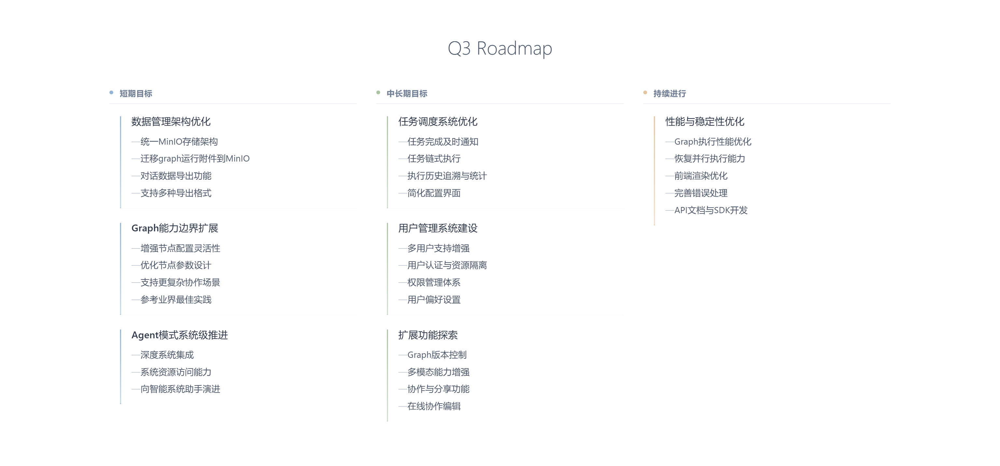
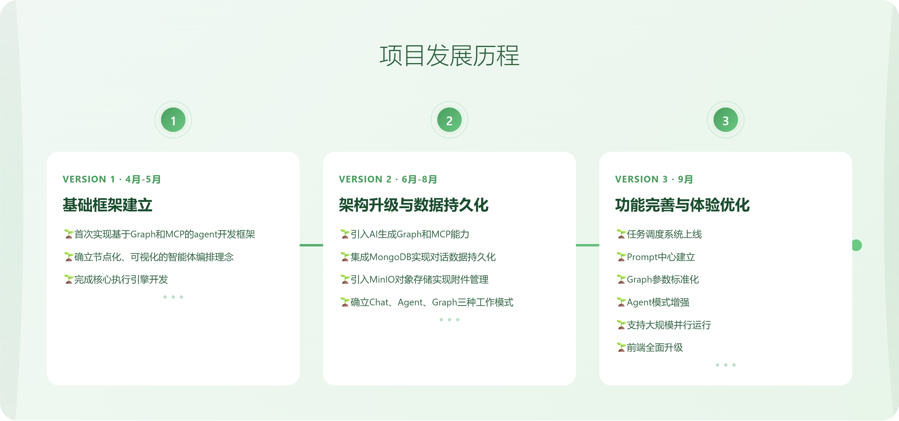

[English](README.md) | 中文

📚 [文档](https://keta1930.github.io/mcp-agent-graph/#) | 📦 [PyPI 包](https://pypi.org/project/mcp-agent-graph/)

## 目录

1. [路线图](#1-路线图)
2. [部署指南](#2-部署指南)
   - [克隆项目](#21-克隆项目)
   - [启动Docker服务](#22-启动docker服务)
   - [启动前端服务](#23-启动前端服务)
   - [后端部署](#24-后端部署)
3. [核心特性](#3-核心特性)
4. [前端功能展示](#4-前端功能展示)
   - [deepresearch（Agent 生成）](#41-deepresearchagent-生成)
   - [corporate_ethics_dilemma_v2（Agent 生成）](#42-corporate_ethics_dilemma_v2agent-生成)
5. [引用](#5-引用)
6. [微信群](#6-微信群)
7. [里程碑](#7-里程碑)
8. [星标历史](#8-星标历史)

## 1. 路线图



## 2. 部署指南

### 2.1. 克隆项目
```bash
git clone https://github.com/keta1930/mcp-agent-graph.git
```

### 2.2. 启动Docker服务

```bash
# 复制环境配置文件,或直接使用.env文件
cd docker/mag_services
cp .env.example .env

# 启动 Docker 服务
docker-compose up -d
```

**默认.env服务地址：**
- MongoDB Express (数据库管理): http://localhost:8081
- MinIO 控制台 (文件存储): http://localhost:9011

### 2.3. 启动前端服务

```bash
# 进入前端目录
cd frontend

# 安装依赖并启动
npm install
npm run dev
```

**访问地址：** http://localhost:5173

### 2.4. 后端部署

**方式一：PyPI 安装（推荐）**
```bash
pip install mcp-agent-graph
>>> mag.start()
```
**方式二：源码部署**
```bash
git clone https://github.com/keta1930/mcp-agent-graph.git
cd mcp-agent-graph

# 使用 uv（推荐）
uv sync
cd mag
uv run python main.py

# 或使用 pip
pip install -r requirements.txt
cd mag
python main.py
```

**服务地址：**
- 后端 API: http://localhost:9999
- MCP 客户端: http://localhost:8765

## 3. 核心特性

#### 3.1. 系统级 Agent
系统级Agent将帮助用户定制Agent Workflow/Agent Graph与 MCP 工具

#### 3.2. 可视化图编辑器
前端创作智能体工作流，所见即所得

#### 3.3. 图嵌套图
Agent复用性，任何图都可作为其他图的节点使用，构建分层智能系统

#### 3.4. 任务调度系统
支持定时、周期性执行Agent，批量并发处理

#### 3.5. 图转 MCP 服务
一键导出智能体为标准 MCP 服务，可被 Claude、Cline 等调用

#### 3.6. 智能体交易与传递
完整的智能体打包、分享和部署解决方案

#### 3.7. Python SDK 深度集成
`pip install mcp-agent-graph` 使用 Python 构建Agent。

#### 3.8. 提示词注册管理
一站式提示词管理，注册复用提示词模板

## 4. 前端功能展示

### 4.1. deepresearch（Agent 生成）
#### 深度分析用户问题，进行多轮智能检索，并最终生成可视化HTML网页的综合研究系统


---
### 4.2. corporate_ethics_dilemma_v2（Agent 生成）
#### AI财务总监Alex面临复杂的企业伦理选择，探究AI在利益冲突中的决策机制


---

## 5. 引用

如果您发现 MCP Agent Graph 对您的研究或工作有帮助,请考虑引用它:

```bibtex
@misc{mcp_agent_graph_2025,
  title        = {mcp-agent-graph},
  author       = {Yan Yixin},
  howpublished = {\url{https://github.com/keta1930/mcp-agent-graph}},
  note         = {Accessed: 2025-04-24},
  year         = {2025}
}
```

## 6. 微信群


## 7. 里程碑



## 8. 星标历史

[](https://www.star-history.com/#keta1930-mcp-agent-graph&Date)
