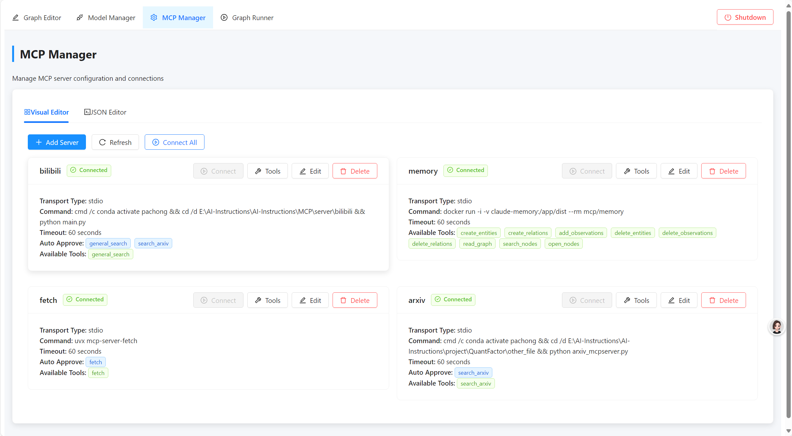

## MCP Agent Graph (MAG)

[English](README.md) | 中文

MCP Agent Graph (MAG) 是一个 agent 开发框架，用于快速构建agent系统。本项目基于图、节点、mcp来快速构建复杂Agent系统。

### ✨ 核心特性

#### 1️⃣ 基于图的 Agent 开发框架
提供直观的可视化环境，让您轻松设计和构建复杂的智能体系统。

#### 2️⃣ 节点即 Agent
图中的每个节点都是一个独立的智能体，可以利用 MCP server 的工具能力完成特定任务。

#### 3️⃣ 图嵌套图（分层世界）
支持将整个图作为另一个图中的节点使用，实现层次化的智能体架构，创建"世界中的世界"。

#### 4️⃣ 图转 MCP Server
将任何图导出为标准的 MCP server Python 脚本，使其可作为独立工具被其他系统调用。

欢迎贡献！ 我们邀请所有人加入我们开发和构建这个项目。您的贡献将帮助使 本项目 变得更好！

<details>
<summary>🌐 系统架构</summary>

MAG 遵循 HOST-CLIENT-SERVER 架构：
- **HOST**：中央服务，管理图执行并协调各组件之间的通信
- **CLIENT**：MCP 客户端，与 MCP 服务器交互
- **SERVER**：MCP 服务器，提供专业工具和功能

```
HOST  → CLIENT  → SERVER 
(图) → (智能体) <==> (MCP 服务器)
```
</details>

## 🖼️ 功能展示

### 可视化智能体图编辑器
通过在图中连接节点来可视化地创建智能体工作流。每个节点代表一个具有自己配置、行为和能力的智能体。


### MCP 服务器集成
通过 MCP 服务器增强您的智能体功能。每个智能体节点可以利用多个 MCP 服务器访问专业能力，如网络搜索、代码执行、数据分析等。




### 嵌套图（图即节点）
通过将整个图用作更大图中的节点来构建层次化智能体系统。这创建了模块化、可重用的智能体组件，实现了"世界中的世界"架构。

> 这是一个套娃功能 😉


### 图到 MCP 服务器的导出
将任何图导出为独立的 MCP 服务器，使其可作为其他智能体或应用程序的工具使用。此功能将您的智能体图转换为可重用的服务，可组合成更大的系统。

> 这是套套娃功能 😉


## 🚀 部署指南

### 后端部署

#### 方案一：使用 Conda

```bash
# 创建并激活 conda 环境
conda create -n mag python=3.11
conda activate mag

# 克隆仓库
git clone https://github.com/keta1930/mcp-agent-graph.git
cd mcp-agent-graph

# 安装依赖
pip install -r requirements.txt

# 运行主应用
python main.py
```

#### 方案二：使用 uv

```bash
# 如果没有 uv，先安装
安装指南: https://docs.astral.sh/uv/getting-started/installation/

# 克隆仓库
git clone https://github.com/keta1930/mcp-agent-graph.git
cd mcp-agent-graph

# 安装依赖
uv sync
.venv\Scripts\activate.ps1 (powershell)
.venv\Scripts\activate.bat (cmd)

# 直接使用 uv 运行
uv run python main.py
```

后端服务器将在端口 9999 上运行，MCP 客户端在端口 8765 上运行。

### 前端部署

```bash
# 导航到前端目录
cd frontend

# 安装依赖
npm install

# 运行开发服务器
npm run dev
```

前端开发服务器将在端口 5173 上运行。