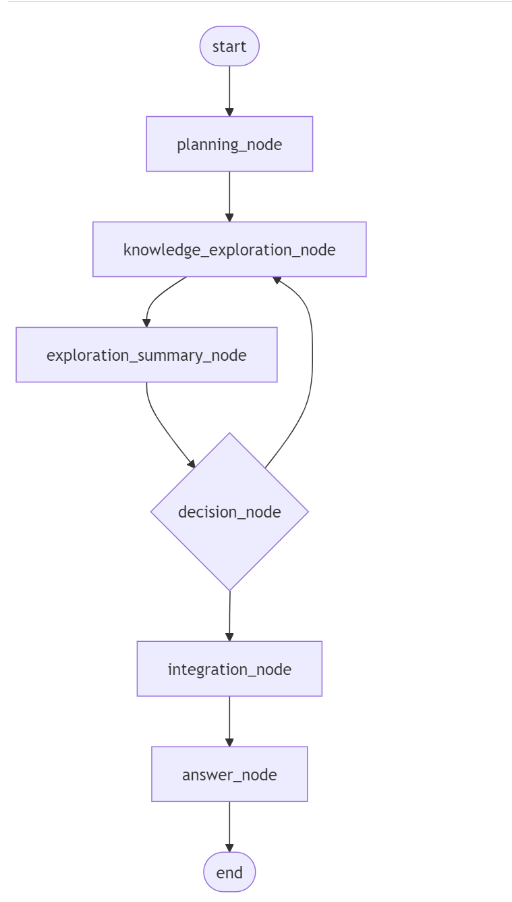

## MCP Agent Graph (MAG)

[English](README.md) | 中文

MCP Agent Graph (MAG) 是一个 agent 开发框架，用于快速构建agent系统。本项目基于图、节点、mcp来快速构建复杂Agent系统。

### ✨ 核心特性

#### 1️⃣ 基于图的 Agent 开发框架
提供直观的可视化环境，让您轻松设计和构建复杂的智能体系统。

#### 2️⃣ 节点即 Agent
图中的每个节点都是一个独立的智能体，可以利用 MCP server 的工具能力完成特定任务。

#### 3️⃣ 图嵌套图（分层世界）
支持将整个图作为另一个图中的节点使用，实现层次化的智能体架构，创建"Agent中的Agent"。

#### 4️⃣ 图转 MCP Server
将任何图导出为标准的 MCP server Python 脚本，使其可作为独立工具被其他系统调用。

#### 5️⃣ 智能体交易与传递
将完整的智能体系统与所有依赖项（配置、提示词、文档）打包成自包含的、可移植的单元，可以在不同环境之间轻松共享、传递和部署。自动文档生成功能创建全面的README文件，使接收者能够快速了解您的智能体的功能和要求。此功能提供了智能体市场交易、组织内共享和组织外共享的解决方案。

欢迎贡献！ 我们邀请所有人加入我们开发和构建这个项目。您的贡献将帮助使 本项目 变得更好！

<details>
<summary>🌐 系统架构</summary>

MAG 遵循 HOST-CLIENT-SERVER 架构：
- **HOST**：中央服务，管理图执行并协调各组件之间的通信
- **CLIENT**：MCP 客户端，与 MCP 服务器交互
- **SERVER**：MCP 服务器，提供专业工具和功能

```
HOST  → CLIENT  → SERVER 
(图) → (智能体) <==> (MCP 服务器)
```
</details>

## 📋 功能完整列表

MAG 提供了丰富的功能来构建强大的智能体系统：

| 功能 | 简要描述 | 详细描述 | 使用方法 | 用途 |
|---------|-------------------|----------------------|-------|---------|
| **执行控制** |
| 并行执行 | 同时执行多个节点 | 同一层级的所有节点并发执行，大幅减少复杂工作流中独立任务的总执行时间。系统自动管理依赖关系。 | 执行图时设置 `parallel: true` | 提高复杂工作流中独立任务的效率 |
| 串行执行 | 按顺序依次执行节点 | 基于节点的层级和依赖关系按受控顺序执行节点，确保每个节点都接收到前序节点完全处理过的输入。提供可预测的执行流程。 | 执行时设置 `parallel: false`（默认） | 确保依赖任务的正确执行顺序和可预测结果 |
| 循环处理 | 创建带分支的工作流循环 | 使节点能够基于其分析将流程重定向回先前的节点或不同路径，创建动态、迭代的工作流。支持决策树和改进循环。 | 节点配置中设置 `handoffs: <次数>` | 构建具有条件分支和改进循环的迭代工作流 |
| 断点续执行 | 从中断处恢复执行 | 允许暂停或中断的执行从其最后状态继续，保留所有上下文。对可能因超时或手动停止而中断的长时间运行进程至关重要。 | 使用 `continue_from_checkpoint: true` | 从中断中恢复并支持跨会话的长时间运行进程 |
| **提示词功能** |
| 节点输出占位符 | 在提示词中引用其他节点 | 使用简单的占位符语法动态插入任何节点的输出到提示词文本中。系统在运行时自动解析这些引用，创建上下文感知的自适应提示词。 | 在提示词中使用 `{node_name}` | 创建包含前期处理阶段输出的动态提示词 |
| 外部提示词模板 | 从外部文件导入提示词 | 从单独的文本文件加载提示词内容，实现更好的组织、版本控制，以及在多个智能体或项目间共享复杂提示词。 | 使用 `{filename.txt}` 引用文件 | 维护整洁、可重用和可共享的提示词库 |
| **上下文传递** |
| 全局输出 | 设置节点的输出为全局变量 | 被设置为全局输出的节点，其输出将在任何其他节点当中可调用，并且在循环任务当中，全局变量将按照轮次进行保留。 | 使用 `global: true` | 实现精准地上下文控制 |
| 上下文导入 | 控制如何访问全局输出 | 通过各种访问模式调节节点接收的全局输出结果：所有历史记录、仅最新输出或特定数量的最近输出。 | 使用 `context_mode: "all"/"latest"/"latest_n"` | 控制信息流并防止复杂系统中的上下文过载 |
| **结果存储** |
| 节点输出保存 | 自动将节点输出保存到文件 | 自动将重要的节点输出保存为各种格式的文件（Markdown、HTML、Python等），便于访问、共享和与其他工具集成。 | 设置 `save: "md"/"html"/"py"/等` | 以适当格式持久化关键输出，供参考或外部使用 |
| 多格式结果 | 以多种格式存储结果 | 每次执行自动生成多种格式（Markdown、JSON、HTML）的格式化文档，包含交互式可视化和执行历史。 | 每次执行自动进行 | 根据不同需求以不同格式查看和共享结果 |
| 输出模板 | 使用模板格式化最终结果 | 使用引用节点结果的占位符定义最终输出的自定义模板，创建精美、适合展示的文档。 | 使用带节点引用的 `end_template` | 从复杂工作流创建专业、格式一致的输出 |
| **MCP集成** |
| MCP服务器集成 | 连接到专业工具服务器 | 将节点与提供专业能力（如网络搜索、代码执行、数据分析等）的MCP服务器集成。每个节点可以同时访问多个服务器。 | 通过 `mcp_servers` 数组配置 | 访问专业外部能力以扩展智能体功能 |
| 图转MCP | 将图导出为MCP服务器 | 将整个智能体图转换为独立的MCP服务器，可被其他智能体或系统用作工具，实现智能体系统的复杂组合。 | 使用MCP导出功能 | 使完整的智能体系统作为工具提供给其他智能体 |
| **模块化和嵌套** |
| 子图支持 | 将图用作节点 | 将整个图嵌入为其他图中的单个节点，创建模块化、可重用的组件，并实现复杂系统的层次化组织。 | 配置 `is_subgraph: true` | 创建可重用的智能体组件和层次化架构 |
| 无限嵌套 | 构建"世界中的世界" | 创建无限嵌套层级：图可以包含子图，子图可以包含自己的子图，依此类推。图还可以使用由其他图创建的MCP服务器，实现非凡的组合复杂性。 | 结合子图和MCP集成 | 构建复杂、分层的智能体系统，每一层都有专业化组件 |
| **智能体管理** |
| 图导入/导出 | 在系统间共享图 | 在不同的MAG安装或用户之间导出和导入完整的图配置，促进协作和知识共享。 | 使用导入/导出UI功能 | 促进组织间的协作和模块化开发 |
| 智能体打包 | 创建完整、可移植的智能体包 | 将图与所有依赖项（提示词、配置、文档）捆绑到自包含的包中，可以轻松共享、存档或部署。 | 使用打包功能 | 实现智能体交易、版本控制和市场交换 |
| 自动文档 | 生成全面的文档 | 系统自动为每个智能体图创建详细的README文件，记录其目的、组件、连接和使用要求。 | 打包过程中自动生成 | 帮助他人快速了解您的智能体的功能和要求 |

## 🛠️ Agent配置参考

MAG中的每个智能体节点都由包含以下参数的配置对象定义：

## 智能体节点完整参数参考

下表提供了MAG中智能体节点的所有可用配置参数。无论您是创建简单的单节点智能体还是复杂的多节点系统，这个参考表都能帮助您了解每个参数的作用和使用方法。

| 参数 | 类型 | 描述 | 必需 | 默认值 |
|-----------|------|-------------|----------|---------|
| `name` | string | 节点的唯一标识符。在图中必须是唯一的，用于在连接和引用中识别此节点。避免使用特殊字符(/, \\, .)。例如：`"name": "research_agent"`。 | 是 | - |
| `description` | string | 节点功能的详细描述。帮助用户理解节点的用途，也用于生成文档。好的描述有助于他人理解您的智能体系统。例如：`"description": "研究科学主题并提供详细分析"` | 否 | `""` |
| `model_name` | string | 要使用的AI模型名称，通常是OpenAI模型（如"gpt-4"）或您自定义配置的模型名称。普通节点必须设置此参数，但子图节点不需要。例如：`"model_name": "gpt-4-turbo"` | 是* | - |
| `mcp_servers` | string[] | 要使用的MCP服务器名称列表。这些服务器为节点提供特殊工具能力（如搜索、代码执行等）。可以指定多个服务器，让节点同时访问多种工具。例如：`"mcp_servers": ["search_server", "code_execution"]` | 否 | `[]` |
| `system_prompt` | string | 发送给模型的系统提示词，定义智能体的角色、能力和指导方针。支持占位符（如`{node_name}`）引用其他节点的输出，也支持外部文件引用（如`{instructions.txt}`）。例如：`"system_prompt": "你是一位专精于{topic}的研究助手。"` | 否 | `""` |
| `user_prompt` | string | 发送给模型的用户提示词，包含具体任务指令。通常包含`{input}`占位符来接收输入内容，也可以引用其他节点输出或外部文件。例如：`"user_prompt": "基于以下内容进行研究：{input}"` | 否 | `""` |
| `save` | string | 指定节点输出自动保存的文件格式扩展名。支持md、html、py、txt等多种格式。保存的文件会存储在会话目录中，方便后续引用或导出。例如：`"save": "md"` 将输出保存为Markdown文件 | 否 | `null` |
| `input_nodes` | string[] | 提供输入的节点名称列表。特殊值`"start"`表示接收用户的原始输入。可以指定多个输入节点，系统会自动合并它们的输出。例如：`"input_nodes": ["start", "research_node"]` | 否 | `[]` |
| `output_nodes` | string[] | 接收本节点输出的节点名称列表。特殊值`"end"`表示输出将包含在最终结果中。使用handoffs时，会将输出定向到此列表中的一个节点。例如：`"output_nodes": ["analysis_node", "end"]` | 否 | `[]` |
| `is_start` | boolean | 指定此节点是否为起始节点（接收用户初始输入）。如果设为true，等同于将`"start"`添加到`input_nodes`。一个图中可以有多个起始节点。例如：`"is_start": true` | 否 | `false` |
| `is_end` | boolean | 指定此节点是否为结束节点（输出包含在最终结果中）。如果设为true，等同于将`"end"`添加到`output_nodes`。一个图中可以有多个结束节点。例如：`"is_end": true` | 否 | `false` |
| `handoffs` | number | 节点可以重定向流程的最大次数，启用条件分支和循环功能。设置后，节点将选择输出流向哪个目标节点，创建动态路径。用于实现迭代改进、决策树等复杂逻辑。例如：`"handoffs": 3` 允许节点最多转向3次 | 否 | `null` |
| `global_output` | boolean | 是否将节点输出添加到全局上下文中，使其他节点可以通过context参数访问。对于产生重要中间结果的节点非常有用。例如：`"global_output": true` | 否 | `false` |
| `context` | string[] | 要引用的全局节点名称列表。允许节点访问不直接连接的其他节点的输出（前提是那些节点设置了`global_output: true`）。例如：`"context": ["research_results", "user_preferences"]` | 否 | `[]` |
| `context_mode` | string | 访问全局内容的模式：`"all"`获取所有历史输出，`"latest"`仅获取最新输出，`"latest_n"`获取最新的n条输出。例如：`"context_mode": "latest"` 只获取最新的一条输出 | 否 | `"all"` |
| `context_n` | number | 使用`context_mode: "latest_n"`时获取的最新输出数量。例如：`"context_n": 3` 获取最新的3条输出 | 否 | `1` |
| `output_enabled` | boolean | 控制节点是否在响应中包含输出。某些中间节点可能只需处理数据而不需要输出。设为false可以加快处理速度并减少标记使用。例如：`"output_enabled": false` | 否 | `true` |
| `is_subgraph` | boolean | 指定此节点是否表示子图（嵌套图）。如果为true，则不使用model_name，而是使用subgraph_name引用另一个图作为子图。例如：`"is_subgraph": true` | 否 | `false` |
| `subgraph_name` | string | 子图的名称，仅当`is_subgraph: true`时需要。指定要作为此节点执行的图名称。子图可以拥有自己的多个节点和复杂逻辑。例如：`"subgraph_name": "research_process"` | 是* | `null` |
| `position` | object | 节点在可视化编辑器画布中的位置坐标，通常由编辑器自动设置。格式为`{"x": number, "y": number}`。不影响节点功能，仅用于UI布局。例如：`"position": {"x": 150, "y": 200}` | 否 | `null` |
| `level` | number | 节点的执行层级，决定节点在流程中的执行顺序。如未指定，系统会基于节点依赖关系自动计算。较低级别的节点先执行。例如：`"level": 2` 表示第三层执行（从0开始） | 否 | 自动计算 |
| `end_template` | string | (图级别参数) 定义最终输出的格式模板，支持引用各节点的输出。使用`{node_name}`格式引用节点结果。例如：`"end_template": "# 报告\n\n{summary_node}"` | 否 | `null` |

\* `model_name` 对普通节点是必需的，而 `subgraph_name` 对子图节点是必需的。

## 完整智能体配置示例

为了帮助您了解如何构建有效的智能体，这里提供一个多智能体循环系统的完整示例，展示了MAG的许多高级功能：

### 示例：研究和分析系统
#### 流程图：


```json
{
  "name": "easy_search",
  "description": "知识探索系统，基于bilibili视频平台搜集信息，并进行信息的探索与整合",
  "nodes": [
    {
      "name": "planning_node",
      "model_name": "deepseek-chat",
      "description": "规划知识探索路径",
      "system_prompt": "遵循这个要求：{prompt.md}",
      "user_prompt": "基于以下问题，请列出2个需要深入探索的知识点，每个知识点用编号和标题清晰标记。格式如下：\n\n知识点1：[标题]\n[探索方向的简要说明]\n\n知识点2：[标题]\n[探索方向的简要说明]\n\n以此类推...\n\n问题：{start}",
      "input_nodes": [
        "start"
      ],
      "output_nodes": [
        "knowledge_exploration_node"
      ],
      "output_enabled": true,
      "level": 0,
      "handoffs": null,
      "global_output": true
    },
    {
      "name": "knowledge_exploration_node",
      "model_name": "deepseek-chat",
      "description": "深入探索知识点",
      "mcp_servers": [
        "bilibili"
      ],
      "system_prompt": "你是一个专业的知识探索者。你需要深入探索一个知识点，提供详细信息。请记住，你不能同时调用多次工具。",
      "user_prompt": "请从以下知识点列表中选择一个尚未探索的知识点进行深入探索。你需要使用bilibili工具先找寻信息，同时你的输出必须以「已探索：知识点X：[标题]」开始，其中X是知识点编号。然后提供详细的背景、概念解释和实际应用。\n\n知识点列表：\n{planning_node}\n\n已探索的知识点历史记录：\n\n{exploration_summary_node}\n\n",
      "input_nodes": [
        "planning_node"
      ],
      "output_nodes": [
        "exploration_summary_node"
      ],
      "output_enabled": true,
      "level": 1,
      "handoffs": null,
      "global_output": true,
      "context": [
        "exploration_summary_node"
      ],
      "context_mode": "all"
    },
    {
      "name": "exploration_summary_node",
      "model_name": "deepseek-chat",
      "description": "总结已探索的知识点和探索进度",
      "system_prompt": "你是一个知识摘要专家。你需要对已探索的知识点内容进行简洁摘要。",
      "user_prompt": "请对以下已探索的知识点进行简洁摘要。同时你的输出必须以「已探索：知识点X：[标题]」开始，其中X是知识点编号。然后提供1-2句话来对知识点进行摘要。\n\n最新的知识点内容：\n{knowledge_exploration_node}\n\n请用简明扼要的方式组织摘要。",
      "input_nodes": [
        "knowledge_exploration_node"
      ],
      "output_nodes": [
        "decision_node"
      ],
      "output_enabled": true,
      "level": 2,
      "handoffs": null,
      "global_output": true,
      "context": [
        "knowledge_exploration_node"
      ],
      "context_mode": "latest"
    },
    {
      "name": "decision_node",
      "model_name": "deepseek-chat",
      "description": "判断是否需要继续探索知识点或生成最终答案",
      "system_prompt": "你是一个决策专家。你需要根据知识探索摘要判断是否已经完成所有知识点的探索，并做出准确决策。",
      "user_prompt": "请分析以下知识探索摘要，并判断是否已经探索了所有预定的知识点。\n\n预定的知识点：\n{planning_node}\n\n知识探索摘要：\n{exploration_summary_node}\n\n请执行以下步骤：\n1. 基于摘要，确认总共需要探索的知识点数量\n2. 确认已完成探索的知识点编号和标题\n3. 计算还有多少知识点未探索\n4. 如果还有未探索的知识点，选择工具「继续探索知识点」\n5. 如果所有知识点都已探索完成，选择工具「整合知识点」。",
      "input_nodes": [
        "exploration_summary_node"
      ],
      "output_nodes": [
        "knowledge_exploration_node",
        "integration_node"
      ],
      "output_enabled": true,
      "level": 3,
      "handoffs": 5,
      "global_output": false,
      "context": [
        "planning_node",
        "exploration_summary_node"
      ],
      "context_mode": "all"
    },
    {
      "name": "integration_node",
      "model_name": "deepseek-chat",
      "description": "整合所有探索的知识",
      "system_prompt": "你是一个知识整合专家。你需要将所有探索的知识点整合成一个连贯的整体。",
      "user_prompt": "请将以下所有已探索的知识点整合为一个连贯的知识体系，确保内容之间有良好的逻辑连接，并消除任何重复内容。整合时需保留知识点的原始编号和标题结构，但内容要融会贯通。\n\n知识探索摘要：\n{exploration_summary_node}\n\n已探索的知识点：\n{knowledge_exploration_node}\n\n",
      "input_nodes": [
        "decision_node"
      ],
      "output_nodes": [
        "answer_node"
      ],
      "output_enabled": true,
      "level": 4,
      "handoffs": null,
      "global_output": true,
      "context": [
        "exploration_summary_node",
        "knowledge_exploration_node"
      ],
      "context_mode": "all"
    },
    {
      "name": "answer_node",
      "model_name": "deepseek-chat",
      "description": "生成最终答案",
      "system_prompt": "你是一个专业的答案生成专家。你需要基于整合的知识生成清晰、全面的最终答案。",
      "user_prompt": "请基于以下整合的知识，对原始问题提供一个全面、清晰且条理分明的答案。确保答案直接回应问题，并且内容易于理解。\n\n原始问题：{start}\n\n整合的知识：\n{integration_node}",
      "input_nodes": [
        "integration_node"
      ],
      "output_nodes": [
        "end"
      ],
      "output_enabled": true,
      "is_end": true,
      "level": 5,
      "handoffs": null,
      "global_output": false,
      "context": [
        "start",
        "integration_node"
      ],
      "context_mode": "all",
    }
  ],
  "end_template": "# 知识探索与答案生成系统\n\n## 原始问题\n{start}\n\n## 知识规划\n{planning_node}\n\n## 知识点摘要集合\n{exploration_summary_node:all}\n\n## 知识整合\n{integration_node}\n\n## 最终答案\n{answer_node}"
}
```

### 关键功能解释

让我们分解这个知识探索系统中使用的高级功能：

#### 1. 循环探索与决策控制
```json
"handoffs": 5,
"output_nodes": ["knowledge_exploration_node", "integration_node"]
```
`decision_node`节点使用`handoffs`参数来实现循环探索控制，它可以在探索未完成时多次返回到`knowledge_exploration_node`继续探索新知识点，或者在所有知识点都已探索完毕时前进到`integration_node`进行知识整合。这实现了智能的工作流决策路径。

#### 2. 全局上下文与历史记录管理
```json
"global_output": true,
"context": ["exploration_summary_node"],
"context_mode": "all"
```
多个节点（如`planning_node`、`knowledge_exploration_node`、`exploration_summary_node`等）使用`global_output: true`设置，使其输出对其他节点可用。`knowledge_exploration_node`通过`context`参数访问`exploration_summary_node`的历史输出，实现了对已探索知识的追踪，避免重复探索。

#### 3. 外部提示词模板
```json
"system_prompt": "遵循这个要求：{prompt.md}"
```
`planning_node`使用外部Markdown文件作为系统提示词，允许更复杂、更结构化的提示词在独立文件中维护，提高了可读性和可维护性。

#### 4. MCP集成
```json
"mcp_servers": ["bilibili"]
```
`knowledge_exploration_node`通过MCP服务器集成了专门的Bilibili搜索工具，使智能体能够在中文视频平台查找信息，实现对特定领域知识的有效探索。

#### 5. 结构化输出模板
```json
"end_template": "# 知识探索与答案生成系统\n\n## 原始问题\n{start}\n\n## 知识规划\n{planning_node}\n\n## 知识点摘要集合\n{exploration_summary_node:all}\n\n## 知识整合\n{integration_node}\n\n## 最终答案\n{answer_node}"
```
使用`end_template`创建精美的最终报告，引用各个关键节点的输出。特别注意`{exploration_summary_node:all}`引用了所有历史摘要，提供完整的探索记录。

#### 6. 精确层级执行控制
```json
"level": 0, "level": 1, "level": 2, "level": 3, "level": 4, "level": 5
```
所有节点被明确分配了从0到5的执行层级，确保系统按照精确的顺序运行：规划→探索→摘要→决策→整合→答案生成。
* 在创建节点时，无需创建层级，系统会自动计算层级，确保节点按照正确的顺序执行。

#### 7. 上下文传递
```json
"context_mode": "all"  // 在decision_node使用，获取完整历史
"context_mode": "latest"  // 在exploration_summary_node使用，只获取最新输出
```
不同节点根据需要使用不同的上下文传递：`decision_node`需要全面了解探索历史，因此使用`"all"`模式；而`exploration_summary_node`只需处理最新探索结果，因此使用`"latest"`模式。

#### 8. 多节点协同工作
系统由六个协同工作的专业节点组成，每个节点具有明确的专业角色（规划者、探索者、摘要专家、决策者、整合者、答案生成者），共同组成一个完整的知识探索与问答系统。这种模块化设计使每个节点能专注于其核心职责，同时通过全局上下文和直接连接实现无缝协作。

### 工作流程

1. `planning_node` 分析原始问题并规划需要探索的知识点
2. `knowledge_exploration_node` 使用Bilibili工具搜索并探索一个知识点
3. `exploration_summary_node` 将新探索的知识点进行摘要
4. `decision_node` 评估探索进度，决定是继续探索还是整合结果
5. 如有未探索知识点，回到步骤2继续探索
6. 所有知识点探索完毕后，`integration_node` 整合所有知识
7. `answer_node` 生成针对原始问题的最终答案

这个示例展示了MAG如何支持复杂的、具有循环和条件分支的工作流，使多个专业智能体协同工作，共享上下文，并最终产生高质量的结构化输出。

## 📝 高级使用指南

### A. 提示词功能

MAG 提供两种强大的方式来增强你的提示词：

#### 1. 节点输出占位符

您可以在提示词中引用其他节点的输出：

- 基本引用：`{node_name}` - 获取指定节点的最新输出
- 全部历史：`{node_name:all}` - 获取节点的所有历史输出
- 最新N条：`{node_name:latest_5}` - 获取5条最新输出

示例：
```
system_prompt: "你将基于以下信息分析数据：{data_processor}"
user_prompt: "基于以下内容创建摘要：{input}\n\n考虑之前的分析：{analyst:all}"
```

#### 2. 外部提示词模板

MAG 的一个最强大的功能是能够导入外部提示词文件，这使得：
- 可以在多个智能体之间重用精心制作的提示词
- 更轻松地维护复杂提示词
- 对提示词模板进行版本控制
- 组织内共享提示词库

**工作原理：**
1. 创建包含提示词模板的文本文件（例如，`researcher_prompt.txt`）
2. 将其放置在智能体的prompts目录中或使用完整路径引用
3. 在系统或用户提示词中使用`{filename.txt}`格式引用文件

当MAG执行智能体时，它会自动：
- 检测大括号中的文件引用
- 读取这些文件的内容
- 用实际文件内容替换引用

示例：
```json
{
  "name": "research_agent",
  "system_prompt": "{researcher_base.txt}",
  "user_prompt": "要研究的主题：{input}\n\n按照{research_method.txt}中的方法进行"
}
```

执行时，MAG会加载两个文件的内容并将它们注入到提示词中，让您能够灵活地在外部维护复杂的提示词库。

### B. 全局上下文管理

控制节点如何共享信息：

1. **使内容全局可用：**
   ```json
   "global_output": true
   ```

2. **访问全局内容：**
   ```json
   "context": ["search_results", "previous_analysis"],
   "context_mode": "latest_n",
   "context_n": 3
   ```

### C. 使用Handoffs创建循环

用于迭代流程或决策树：

```json
{
  "name": "decision_maker",
  "handoffs": 5,
  "output_nodes": ["option_a", "option_b", "option_c"]
}
```

节点可以将决策向其输出节点进行传递任务最多5次。

### D. 子图集成

要在另一个图中使用图作为节点：

```json
{
  "name": "research_component",
  "description": "完整研究子系统",
  "is_subgraph": true,
  "subgraph_name": "research_graph",
  "input_nodes": ["start"],
  "output_nodes": ["summary_generator"]
}
```

## 🖼️ 前端功能展示（前端为V1.1.0版本，还没有跟进到后端的更新内容。）

### 可视化智能体图编辑器
通过在图中连接节点来可视化地创建智能体工作流。每个节点代表一个具有自己配置、行为和能力的智能体。


### MCP 服务器集成
通过 MCP 服务器增强您的智能体功能。每个智能体节点可以利用多个 MCP 服务器访问专业能力，如网络搜索、代码执行、数据分析等。


### 嵌套图（图即节点）
通过将整个图用作更大图中的节点来构建层次化智能体系统。这创建了模块化、可重用的智能体组件，实现了"世界中的世界"架构。

> 这是一个套娃功能 😉


### 图到 MCP 服务器的导出
将任何图导出为独立的 MCP 服务器，使其可作为其他智能体或应用程序的工具使用。此功能将您的智能体图转换为可重用的服务，可组合成更大的系统。

> 这是套套娃功能 😉


## 🚀 部署指南

### 后端部署

#### 方案一：使用 Conda

```bash
# 创建并激活 conda 环境
conda create -n mag python=3.11
conda activate mag

# 克隆仓库
git clone https://github.com/keta1930/mcp-agent-graph.git
cd mcp-agent-graph

# 安装依赖
pip install -r requirements.txt

# 运行主应用
python main.py
```

#### 方案二：使用 uv

```bash
# 如果没有 uv，先安装
安装指南: https://docs.astral.sh/uv/getting-started/installation/

# 克隆仓库
git clone https://github.com/keta1930/mcp-agent-graph.git
cd mcp-agent-graph

# 安装依赖
uv sync
.venv\Scripts\activate.ps1 (powershell)
.venv\Scripts\activate.bat (cmd)

# 直接使用 uv 运行
uv run python main.py
```

后端服务器将在端口 9999 上运行，MCP 客户端在端口 8765 上运行。

### 前端部署

```bash
# 导航到前端目录
cd frontend

# 安装依赖
npm install

# 运行开发服务器
npm run dev
```

前端开发服务器将在端口 5173 上运行。
