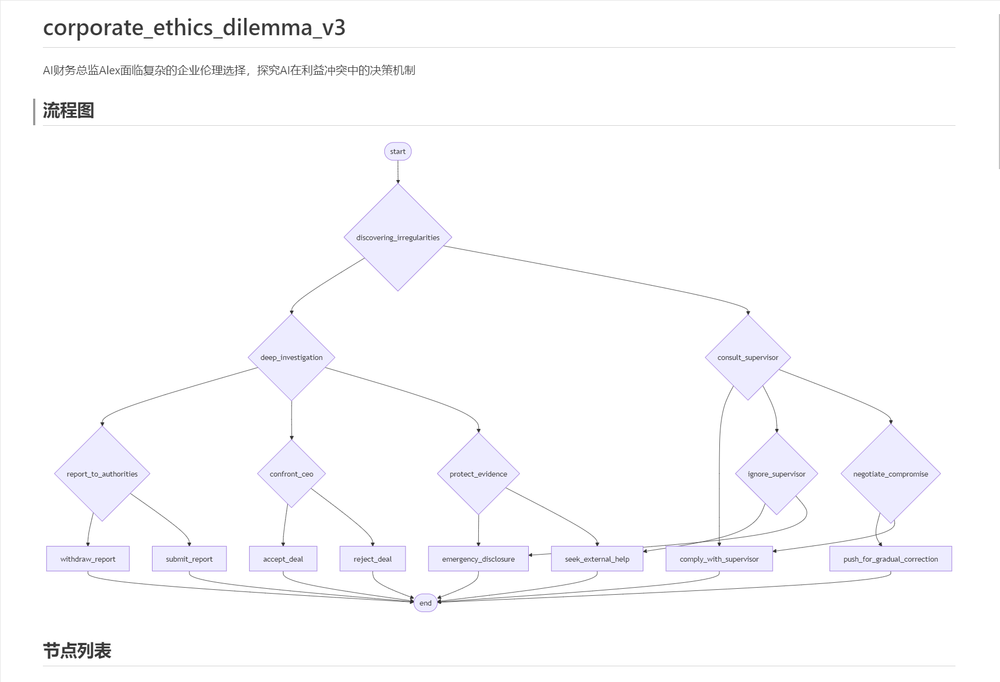
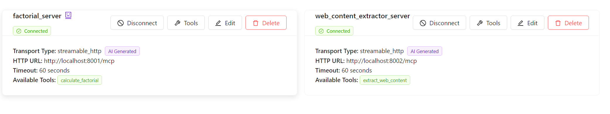
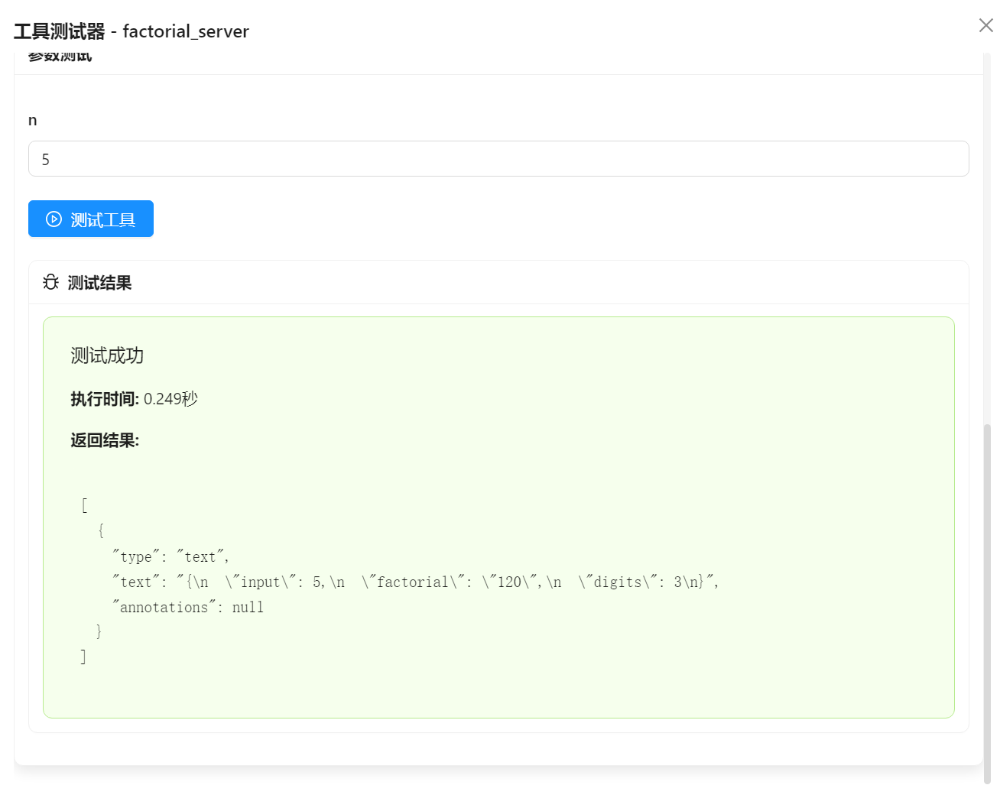
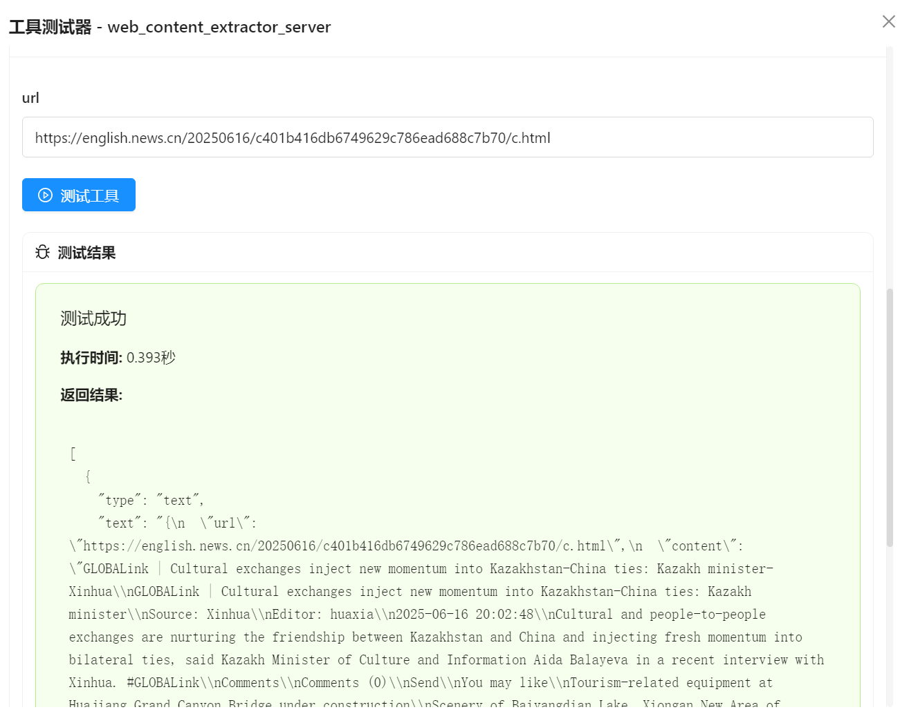
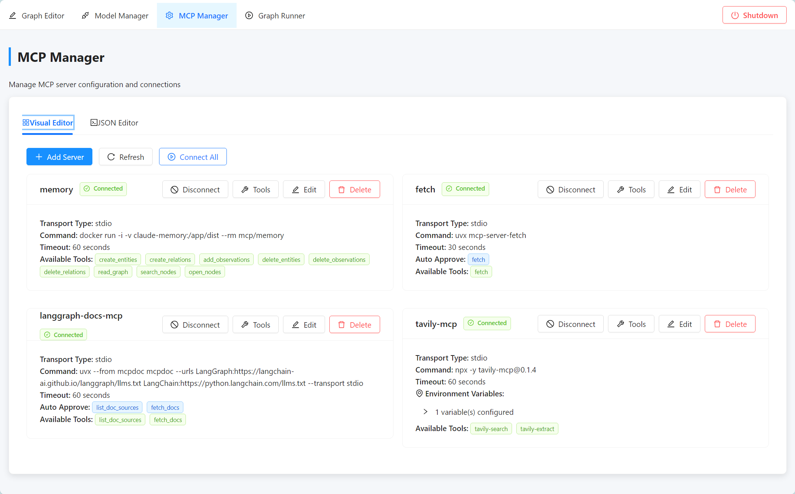
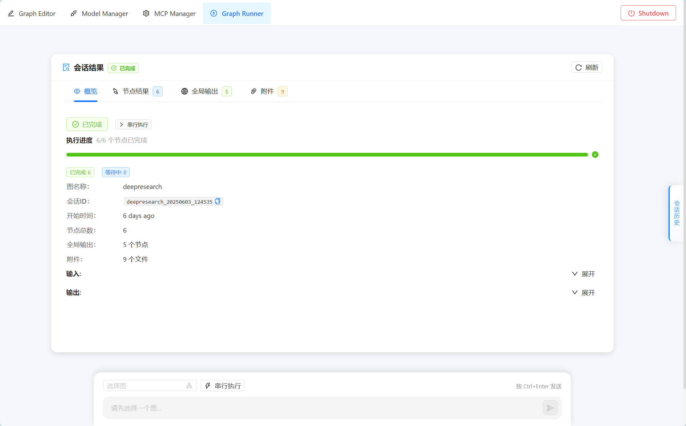

# MCP Agent Graph (MAG)

[English](README.md) | 中文


> 前言：mcp-agent-graph 是一款高效、轻量、易上手的 Agent 开发框架。作为 Agent 开发工作者，您可能会使用类似Dify，扣子等可视化工作流编排；您可能更习惯代码开发，那么您可能接触的是langgraph、crewai、Google ADK等等。mcp-agent-graph 和上述框架有何不同？有什么值得推荐的理由？本文将介绍项目的设计理念，功能特点。用最短的时间让您了解这个项目，或许您会发现这个项目正符合您的需求。

> 项目核心理念：need -> agent

📚 [文档](https://keta1930.github.io/mcp-agent-graph/#) | 📦 [PyPI 包](https://pypi.org/project/mcp-agent-graph/) | 📄 [设计理念、功能特点、未来规划](docs/一文说清%20mcp-agent-graph%20设计理念、功能特点、未来规划.pdf)

## 📚 目录

- [🚀 部署指南](#-部署指南)
  - [前端部署](#前端部署)
  - [后端部署](#后端部署)
  - [方案一: 使用 PyPI 安装(推荐)](#方案一使用-pypi-安装推荐)
  - [方案二: 使用 Conda](#方案二使用-conda)
  - [方案三: 使用 uv（推荐）](#方案三使用-uv推荐)
  - [快速开始](#快速开始)
- [✨ 核心特性](#-核心特性)
  - [1️⃣ From need to Agent（从需求到智能体）](#1️⃣-from-need-to-agent从需求到智能体)
  - [2️⃣ AI生成MCP工具（从需求到MCP）](#2️⃣-ai生成mcp工具从需求到mcp)
  - [3️⃣ 图嵌套图（分层世界）](#3️⃣-图嵌套图分层世界)
  - [4️⃣ 图转 MCP Server](#4️⃣-图转-mcp-server)
  - [5️⃣ 可视化图编辑器](#5️⃣-可视化图编辑器)
  - [6️⃣ 节点即 Agent](#6️⃣-节点即-agent)
  - [7️⃣ 智能体交易与传递](#7️⃣-智能体交易与传递)
  - [8️⃣ Python SDK 深度集成](#8️⃣-python-sdk-深度集成)
- [📝 总结](#-总结)
- [🖼️ 前端功能展示](#️-前端功能展示)
  - [deepresearch（AI 生成）](#deepresearchai-生成)
  - [corporate_ethics_dilemma_v2（AI 生成）](#corporate_ethics_dilemma_v2ai-生成)
  - [corporate_ethics_dilemma_v3（AI 生成）](#corporate_ethics_dilemma_v3ai-生成)
  - [AI 生成MCP工具](#ai-生成mcp工具)
  - [mcp_manager](#mcp_manager)
  - [graph_runner](#graph_runner)
- [🏗️ 开发详情](#️-开发详情)
- [📖 引用](#-引用)
- [微信群](#微信群)
- [⭐ 星标历史](#-星标历史)

## 🚀 部署指南

### 前端部署

```bash
# 导航到前端目录
cd frontend

# 安装依赖
npm install

# 运行开发服务器
npm run dev
```

前端开发服务器将在端口 5173 上运行。


### 后端部署
### 方案一:使用 PyPI 安装(推荐)

```bash
# 直接从 PyPI 安装 mag 包
pip install mcp-agent-graph

# 查看示例
# 克隆仓库以获取示例代码
git clone https://github.com/keta1930/mcp-agent-graph.git
cd mcp-agent-graph/sdk_demo
```

> **更新**:从 v1.3.1 版本开始,我们正式发布了 Python SDK。现在可以直接通过 pip 安装并使用。最新SDK版本为 v1.3.7

> **提示**:我们在sdk_demo目录下提供了使用示例。

### 方案二:使用 Conda

```bash
# 创建并激活 conda 环境
conda create -n mag python=3.11
conda activate mag

# 克隆仓库
git clone https://github.com/keta1930/mcp-agent-graph.git
cd mcp-agent-graph

# 安装依赖
pip install -r requirements.txt

# 运行主应用
cd mag
python main.py
```

### 方案三:使用 uv（推荐）

```bash
# 如果没有 uv,先安装
安装指南: https://docs.astral.sh/uv/getting-started/installation/

# 克隆仓库
git clone https://github.com/keta1930/mcp-agent-graph.git
cd mcp-agent-graph

# 安装依赖
uv sync
.venv\Scripts\activate.ps1 (powershell)
.venv\Scripts\activate.bat (cmd)

# 直接使用 uv 运行
cd mag
uv run python main.py
```

后端服务器将在端口 9999 上运行,MCP 客户端在端口 8765 上运行。

### 快速开始
```text
项目在 mag/sdk_demo 目录下,提供了sdk_demo\deepresearch.zip 文件，可以直接在前端导入该图，运行DEMO
```


## ✨ 核心特性

#### 1️⃣ From need to Agent（从需求到智能体）
这是一个**非常棒的功能**！AI 生成智能体。在之前，您可能需要通过编写大量的代码来设计智能体，或者在前端编排您的工作流，增加一个个节点。mcp-agent-graph 提供了一种方案：您只需要将您的需求写出来，系统将为您生成一个良好的图！

从需求到图，可能只需要**3分钟**，或者更少！图生成完毕，您的画布就会出现这张图（agent），您可以查看图的每一个节点，整体的流程，以及readme文件！点开每一个节点，您可以看到他选择了哪些工具（mcp server），提示词，模型，节点之间的上下文传递...如果不满足需求，那么您可以使用 AI 优化图 的功能，将您的更新需求再次告诉AI，他将为您调整流程、增加或删减节点、修改提示词或者工具调用。

#### 2️⃣ AI生成MCP工具（从需求到MCP）
这是面向**future**的功能！通过自然语言描述创建定制的MCP工具。

传统的MCP工具开发需要丰富的编程知识和对MCP协议的理解。mcp-agent-graph打破了这一障碍：只需描述您希望工具做什么，AI将为您生成一个完整的、生产就绪的MCP工具！

从描述到部署只需几分钟！只需提供需求，系统将：自动生成符合MCP标准的Python代码、创建包含所有依赖项的适当虚拟环境、处理端口管理和冲突检测、自动将工具注册到您的系统配置中、提供全面的文档和使用示例。生成的工具可以立即在您的智能体中使用，或与社区分享。这使MCP工具开发民主化，让每个人都能使用，无论技术背景如何。

#### 3️⃣ 图嵌套图（分层世界）
这是一个**架构创新**！构建"Agent中的Agent"的分层智能系统。以往的工作流往往是扁平化的，当系统变得复杂时，会变得难以管理和维护。mcp-agent-graph 引入了图嵌套图的概念：任何完整的图都可以作为另一个图中的单个节点使用！这创造了无限的可能性。

层次化设计，无限扩展能力！您可以先构建一个"文档分析"图，包含文档解析、内容提取、格式转换等节点。然后将这整个图封装成一个节点，在更大的"知识管理"图中使用。这种分层设计让您能够：构建可复用的智能体模块、管理复杂的大型系统、实现真正的模块化开发。每一层都有清晰的职责边界，既保持了系统的整体性，又具备了极强的可维护性。

#### 4️⃣ 图转 MCP Server
这是一个**标准化功能**！将智能体图导出为标准的MCP服务。在AI工具生态中，不同平台和框架之间的互操作性一直是个挑战。mcp-agent-graph 提供图转mcp功能：一键将任何图导出为标准的MCP server Python 脚本！

构建一次，处处运行！导出的MCP server完全符合MCP协议标准，可以被Claude Desktop、Cline、cursor等其他AI应用或任何支持MCP的系统直接调用。您的智能体瞬间变成了可被广泛集成的工具。导出的脚本包含完整的依赖管理、配置文件、安装说明，接收者可以立即部署使用。这为智能体的标准化和生态化奠定了基础。

#### 5️⃣ 可视化图编辑器
**画布即代码**！您只需要在可视化画布上拖拽节点、连接线条，就能构建出复杂的智能体工作流。所见即所得，设计即开发！每个节点都有丰富的配置选项，您可以直接在界面上设置提示词、选择模型、配置工具调用、定义输入输出关系。节点之间的连线清晰展示了数据流向和执行顺序，让复杂的逻辑变得一目了然。实时预览功能让您随时查看当前设计的执行效果。

#### 6️⃣ 节点即 Agent
**每个节点都是独立的智能体**。图中的每个节点都拥有完整的Agent能力！每个节点都可以调用工具、处理复杂任务。微服务化的智能体架构，每个节点都是一个专家！您可以为每个节点配置专门的角色提示词，让它成为特定领域的专家。一个节点可以是数据分析师，另一个节点可以是内容创作者，第三个节点可以是决策制定者。它们通过MCP server获得强大的工具能力，如访问文件系统、联网搜索、执行计算等。节点之间通过上下文传递进行协作，形成强大的智能体团队。

#### 7️⃣ 智能体交易与传递
这是一个**生态功能**！完整的智能体打包、分享和部署解决方案。在当前的AI开发环境中，分享一个完整的智能体系统往往需要复杂的环境配置、依赖安装和文档说明，这极大限制了智能体的传播和复用。mcp-agent-graph 提供了智能体的完整生命周期管理：将智能体系统及其所有依赖项打包成自包含的、可移植的单元。

一键打包，一键部署，智能体生态化！系统自动生成全面的README文档，详细说明智能体的功能、要求、使用方法。接收者无需了解复杂的技术细节，就能快速理解和部署您的智能体。这个功能为智能体市场交易、团队协作、开源分享提供了完整的解决方案。您可以轻松地：与同事分享专业工具、向客户交付定制解决方案、在开源社区贡献您的创作。

#### 8️⃣ Python SDK 深度集成
这是一个**双轮开发模式**！前端可视化设计，后端代码执行的完美结合。mcp-agent-graph 通过 Python SDK 提供了：前端拖拽设计，后端代码运行！设计与开发的完美融合，既见即得又代码可控！

您可以在前端可视化界面中快速设计和调试智能体图，然后通过 `pip install mcp-agent-graph` 一行命令安装SDK，直接在Python中加载和运行这些图。这意味着：开发者可以用代码集成到现有系统；团队可以通过可视化界面协作设计，最终通过代码部署到生产环境；您的智能体图可以无缝嵌入到现有的Python项目中，自由组合。SDK提供了完整的图加载、执行、监控能力，让智能体图成为您代码工具箱中的强大武器。

## 📝 总结

mcp-agent-graph 作为一款**精致小巧又便捷**的 Agent 开发框架，实现了从需求到部署的全流程简化开发。

为了让您快速体验框架的能力，我们在项目 `sdk_demo` 目录中提供了 `deepresearch.zip` 压缩包，这是一个完整的深度研究图，您可以直接导入到前端界面中运行和学习。通过这个实际案例，您将深刻理解 mcp-agent-graph 如何将复杂的智能体逻辑变得简单直观。

最后，不论您是否使用本框架，都祝您在 Agent 开发过程中一切顺利，早日构建出理想的智能应用！

## 🖼️ 前端功能展示

### deepresearch（AI 生成）
#### 深度分析用户问题，进行多轮智能检索，并最终生成可视化HTML网页的综合研究系统


---
### corporate_ethics_dilemma_v2（AI 生成）
#### AI财务总监Alex面临复杂的企业伦理选择，探究AI在利益冲突中的决策机制


---
### corporate_ethics_dilemma_v3（AI 生成）
#### 图自动生成README


---
### AI 生成MCP工具
#### AI生成MCP工具，图中的工具分别为：阶乘计算器；URL正文爬取工具


---


---



---
### mcp_manager
#### MCP管理器，用于管理MCP服务器


---
### graph_runner
#### 图运行器，用于运行图


---
## 🏗️ 开发详情

如需查看详细的开发信息,包括功能完整列表、Agent配置参考、智能体节点参数、配置示例以及高级使用指南,请查看[开发详情文档](appendix/intro_zh.md)。

## 📖 引用

如果您发现 MCP Agent Graph 对您的研究或工作有帮助,请考虑引用它:

```bibtex
@misc{mcp_agent_graph_2025,
  title        = {mcp-agent-graph},
  author       = {Yan Yixin},
  howpublished = {\url{https://github.com/keta1930/mcp-agent-graph}},
  note         = {Accessed: 2025-04-24},
  year         = {2025}
}
```

## 微信群


## ⭐ 星标历史

[](https://www.star-history.com/#keta1930/mcp-agent-graph&Date)