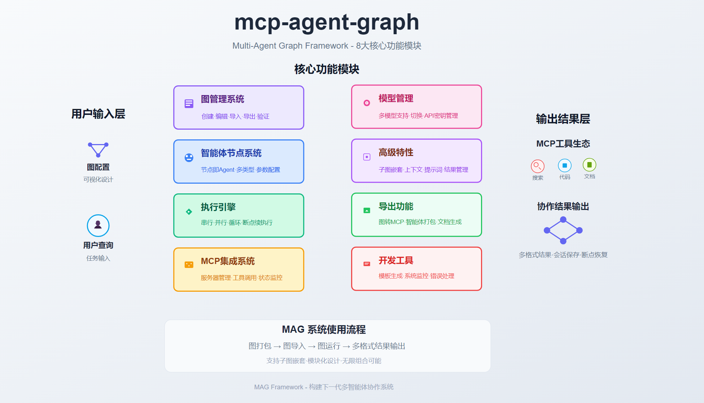
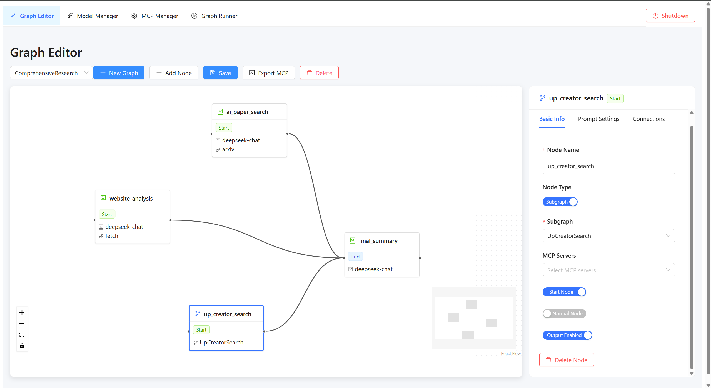
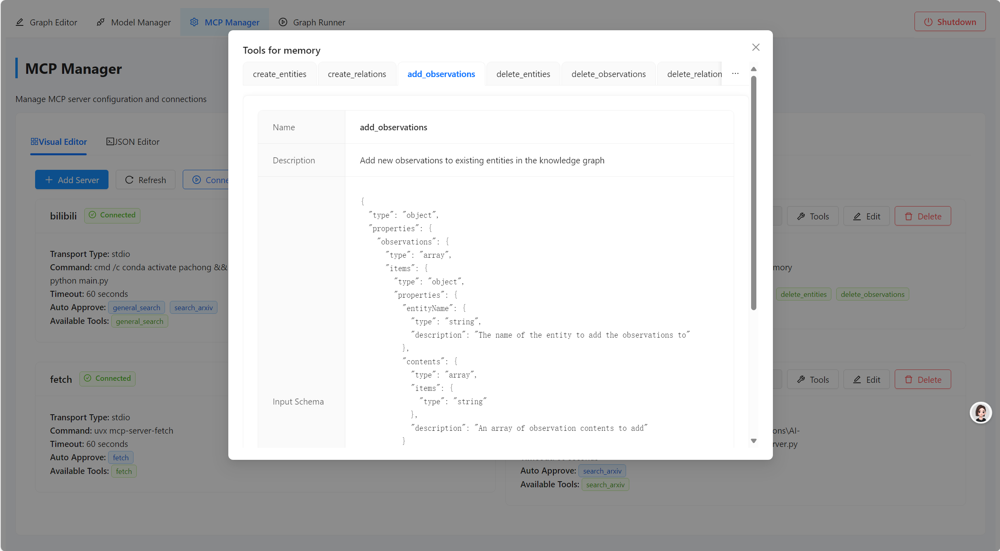
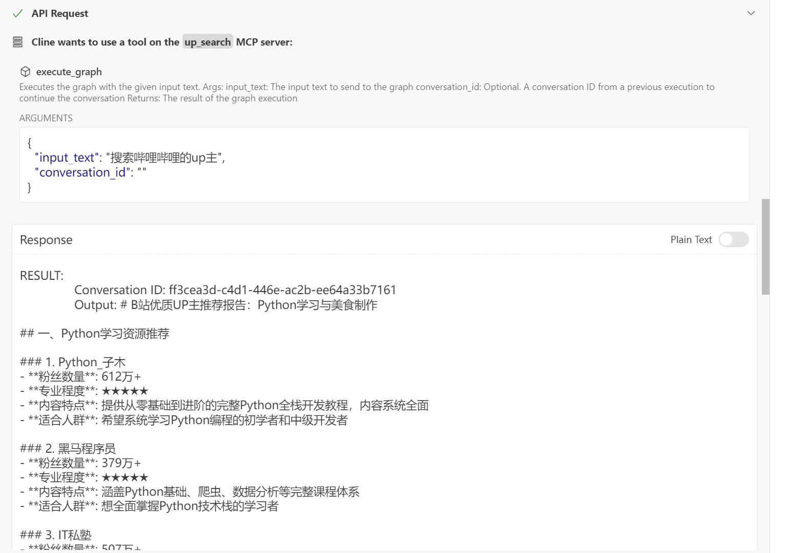

# MCP Agent Graph (MAG)

[English](README.md) | 中文

> MCP Agent Graph (MAG) 是一个 agent 开发框架,用于快速构建agent系统。本项目基于图、节点、mcp来快速构建复杂Agent系统。

📚 [文档](https://keta1930.github.io/mcp-agent-graph/#) | 📦 [PyPI 包](https://pypi.org/project/mcp-agent-graph/)


<div align="center">



</div>

## 📚 目录

- [🚀 部署指南](#-部署指南)
  - [方案一: 使用 PyPI 安装(推荐)](#方案一使用-pypi-安装推荐)
  - [方案二: 使用 Conda](#方案二使用-conda)
  - [方案三: 使用 uv](#方案三使用-uv)
  - [前端部署](#前端部署)
- [✨ 核心特性](#-核心特性)
- [🏗️ 开发详情](#️-开发详情)
- [🖼️ 前端功能展示](#️-前端功能展示)
  - [可视化智能体图编辑器](#可视化智能体图编辑器)
  - [MCP 服务器集成](#mcp-服务器集成)
  - [嵌套图(图即节点)](#嵌套图图即节点)
  - [图到 MCP 服务器的导出](#图到-mcp-服务器的导出)
- [📖 引用](#-引用)
- [⭐ 星标历史](#-星标历史)

## 🚀 部署指南

### 方案一:使用 PyPI 安装(推荐)

```bash
# 直接从 PyPI 安装 mag 包
pip install mcp-agent-graph

# 查看示例
# 克隆仓库以获取示例代码
git clone https://github.com/keta1930/mcp-agent-graph.git
cd mcp-agent-graph/sdk_demo
```

> **更新**:从 v1.3.1 版本开始,我们正式发布了 Python SDK。现在可以直接通过 pip 安装并使用。

> **提示**:我们在sdk_demo目录下提供了使用示例。

### 方案二:使用 Conda

```bash
# 创建并激活 conda 环境
conda create -n mag python=3.11
conda activate mag

# 克隆仓库
git clone https://github.com/keta1930/mcp-agent-graph.git
cd mcp-agent-graph

# 安装依赖
pip install -r requirements.txt

# 运行主应用
cd mag
python main.py
```

### 方案三:使用 uv（推荐）

```bash
# 如果没有 uv,先安装
安装指南: https://docs.astral.sh/uv/getting-started/installation/

# 克隆仓库
git clone https://github.com/keta1930/mcp-agent-graph.git
cd mcp-agent-graph

# 安装依赖
uv sync
.venv\Scripts\activate.ps1 (powershell)
.venv\Scripts\activate.bat (cmd)

# 直接使用 uv 运行
cd mag
uv run python main.py
```

后端服务器将在端口 9999 上运行,MCP 客户端在端口 8765 上运行。

### 前端部署

```bash
# 导航到前端目录
cd frontend

# 安装依赖
npm install

# 运行开发服务器
npm run dev
```

前端开发服务器将在端口 5173 上运行。

## ✨ 核心特性

#### 1️⃣ 基于图的 Agent 开发框架
提供直观的可视化环境,让您轻松设计和构建复杂的智能体系统。

#### 2️⃣ 节点即 Agent
图中的每个节点都是一个独立的智能体,可以利用 MCP server 的工具能力完成特定任务。

#### 3️⃣ 图嵌套图(分层世界)
支持将整个图作为另一个图中的节点使用,实现层次化的智能体架构,构建"Agent中的Agent"。

#### 4️⃣ 图转 MCP Server
将任何图导出为标准的 MCP server Python 脚本,使其可作为独立工具被其他系统调用。

#### 5️⃣ 智能体交易与传递
将完整的智能体系统与所有依赖项(配置、提示词、文档)打包成自包含的、可移植的单元,可以在不同环境之间轻松共享、传递和部署。自动文档生成功能创建全面的README文件,使接收者能够快速了解您的智能体的功能和要求。此功能提供了智能体市场交易、组织内共享和组织外共享的解决方案。

#### 6️⃣ 智能体快速开发
本项目提供了提示词模版功能,可以快速生成开发智能体的提示词模版,模版让LLM更好地理解本项目,更好地生成节点和图。系统将自动识别项目当中注册的model和mcp server,并包含在模版当中。
实现:提示词模版生成->需求填入->LLM生成图->导入图->运行图 的快速开发流程。

<details>
<summary>🌐 系统架构</summary>

MAG 遵循 HOST-CLIENT-SERVER 架构:
- **HOST**:中央服务,管理图执行并协调各组件之间的通信
- **CLIENT**:MCP 客户端,与 MCP 服务器交互
- **SERVER**:MCP 服务器,提供专业工具和功能

```
HOST  → CLIENT  → SERVER 
(图) → (智能体) <==> (MCP 服务器)
```
</details>

## 🏗️ 开发详情

如需查看详细的开发信息,包括功能完整列表、Agent配置参考、智能体节点参数、配置示例以及高级使用指南,请查看[开发详情文档](appendix/intro_zh.md)。

## 🖼️ 前端功能展示

> 前端为V1.1.0版本,还没有跟进到后端的更新内容。

### 可视化智能体图编辑器

通过在图中连接节点来可视化地创建智能体工作流。每个节点代表一个具有自己配置、行为和能力的智能体。

***图编辑器界面 - 节点与连接的可视化设计***



***图执行器界面 - 运行智能体工作流***


***图执行器界面 - 查看工作流结果***


### MCP 服务器集成

通过 MCP 服务器增强您的智能体功能。每个智能体节点可以利用多个 MCP 服务器访问专业能力,如网络搜索、代码执行、数据分析等。

***MCP管理器界面 - 服务器概览***


***MCP管理器界面 - 服务器详细配置***


***MCP管理器界面 - 工具能力管理***



### 嵌套图(图即节点)

通过将整个图用作更大图中的节点来构建层次化智能体系统。这创建了模块化、可重用的智能体组件,实现了"世界中的世界"架构。

> 这是一个套娃功能 😉

***嵌套图界面 - 分层智能体系统设计***


### 图到 MCP 服务器的导出

将任何图导出为独立的 MCP 服务器,使其可作为其他智能体或应用程序的工具使用。此功能将您的智能体图转换为可重用的服务,可组合成更大的系统。

> 这是套套娃功能 😉

***导出MCP服务器界面 - 将图转换为独立服务***


***在Cline中调用 - 示例1***


***在Cline中调用 - 示例2***



---

## 📖 引用

如果您发现 MCP Agent Graph 对您的研究或工作有帮助,请考虑引用它:

```bibtex
@misc{mcp_agent_graph_2025,
  title        = {mcp-agent-graph},
  author       = {Yan Yixin},
  howpublished = {\url{https://github.com/keta1930/mcp-agent-graph}},
  note         = {Accessed: 2025-04-24},
  year         = {2025}
}
```

## ⭐ 星标历史

[](https://www.star-history.com/#keta1930/mcp-agent-graph&Date)