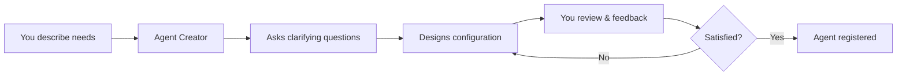

# Create Agent with Agent

Let Agents design and create other Agents through natural conversation.

## Overview

Instead of manually configuring Agents, use the **Agent Creator** built-in tool to have Agents help you design specialized Agents through guided conversation.

| Capability | Description |
|------------|-------------|
| **Conversational Design** | Agent asks questions to understand your needs |
| **Smart Recommendations** | Suggests models, tools, and configurations |
| **Learn from Examples** | Export existing Agents to study successful patterns |
| **Iterative Refinement** | Adjust designs based on your feedback |

## How It Works

**Typical conversation:**

1. You: "I need an Agent to review Python code"
2. Agent asks about: code style focus, security checks, which model to use
3. Agent designs configuration and creates draft file
4. You review and suggest changes
5. Agent refines until you approve
6. Agent registers new code reviewer to system

## Why Use Agent Creator

| Without Agent Creator | With Agent Creator |
|---------------------|-------------------|
| Learn technical configuration format | Natural conversation |
| Look up parameter meanings | Agent explains options |
| Guess appropriate settings | Agent recommends based on needs |
| Start from scratch | Learn from existing Agents |

## Quick Example

**You:** "Create an Agent for data analysis"

**Agent Creator:**
- Asks about data types, analysis methods, output format
- Gets design specification
- Suggests models and tools (file tools, memory tools)
- Creates `agent/data_analyst.json` configuration
- Waits for your approval
- Registers Agent when you're satisfied

## Related Documentation

**Full details:** [Agent Creator Tool](../tools/agent-creator.md)

**Related:**
- [Agent Configuration](config.md) - Understand Agent parameters
- [Built-in Tools](../tools/index.md) - All available system tools
