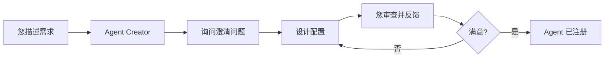

# 用 Agent 创建 Agent

让 Agent 通过自然对话帮您设计和创建其他 Agent。

## 概述

无需手动配置 Agent，使用 **Agent Creator** 内置工具，让 Agent 通过引导式对话帮您设计专业的 Agent。

| 能力 | 说明 |
|-----|------|
| **对话式设计** | Agent 询问问题以理解您的需求 |
| **智能推荐** | 建议合适的模型、工具和配置 |
| **学习范例** | 导出现有 Agent 研究成功模式 |
| **迭代优化** | 根据您的反馈调整设计 |

## 工作原理

**典型对话流程：**

1. 您："我需要一个 Python 代码审查 Agent"
2. Agent 询问：代码风格重点、安全检查、使用哪个模型
3. Agent 设计配置并创建草稿文件
4. 您审查并提出修改建议
5. Agent 优化直到您批准
6. Agent 将新代码审查员注册到系统

## 为什么使用 Agent Creator

| 不使用 Agent Creator | 使用 Agent Creator |
|-------------------|------------------|
| 学习技术配置格式 | 自然语言对话 |
| 查找参数含义 | Agent 解释选项 |
| 猜测合适的设置 | Agent 根据需求推荐 |
| 从零开始 | 从现有 Agent 学习 |

## 快速示例

**您：** "创建一个数据分析 Agent"

**Agent Creator：**
- 询问数据类型、分析方法、输出格式
- 获取设计规范
- 建议模型和工具（文件工具、记忆工具）
- 创建 `agent/data_analyst.json` 配置
- 等待您的批准
- 您满意后注册 Agent

## 相关文档

**完整详情：** [Agent Creator 工具](../tools/agent-creator.zh.md)

**相关：**
- [Agent 配置](config.zh.md) - 理解 Agent 参数
- [内置工具](../tools/index.zh.md) - 所有可用系统工具
