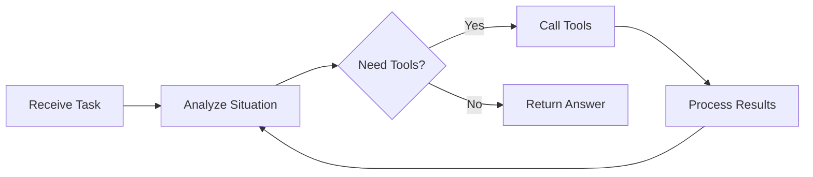

# Agent

An **Agent** is an AI-powered entity that can:

- **Understand goals** - Interprets your requests and breaks them into steps
- **Use tools** - Invokes MCP servers and system tools to accomplish tasks
- **Iterate solutions** - Refines answers through multiple rounds of thinking and action
- **Maintain context** - Remembers conversation history across multiple exchanges
- **Long-term memory** - Stores and retrieves important information across sessions

Unlike simple chat models, agents take **autonomous actions** to solve problems.

## Core Concepts

### Agent Loop

The execution pattern agents follow:

Each cycle, the agent decides whether to respond directly or use tools to gather more information.

### Configuration

Every agent has:

| Component | Purpose |
|-----------|---------|
| **Model** | The LLM powering reasoning (required) |
| **Instruction** | Custom behavior and personality |
| **Tools** | MCP servers + system tools available |
| **Max Actions** | Iteration limit (1-200, default: 50) |

### Tool Access

Agents gain capabilities through tools:

- **MCP Servers** - Service APIs, company database connections, code execution, web search...
- **System Tools** - File operations, subagent, memory tools, system operations...

## When to Use Agents

| Use Case | Example |
|----------|---------|
| Multi-step tasks | "Analyze this codebase and create documentation" |
| Tool-based workflows | "Search the web and summarize top 5 results" |
| Interactive problem solving | "Debug this error by checking logs and code" |
| Autonomous execution | "Monitor data and alert on anomalies" |

## Agent vs. Graph

Choose the right approach:

| Feature | Agent | Graph (Workflow) |
|---------|-------|------------------|
| **Structure** | Free-form, autonomous | Predefined nodes and edges |
| **Best for** | Open-ended tasks | Structured processes |
| **Control** | Model decides next steps | You design the flow |
| **Complexity** | Single reasoning loop | Multiple specialized agents |

Use **Agents** for flexibility. Use **Graphs** for reliability.

## Next Steps

- **[Build Your First Agent](first-agent.md)** - Create and run your first agent
- **[Agent Configuration](config.md)** - Customize behavior and tools
- **[Agent Loop](loop.md)** - Understand execution mechanics
- **[Multi-Agent Systems](multi-agent.md)** - Coordinate multiple agents
