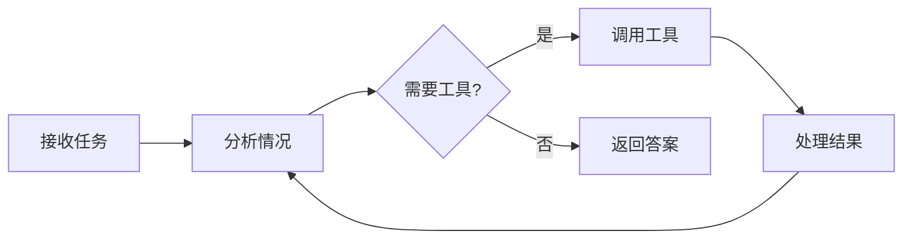

# Agent（智能体）

**Agent（智能体）** 是具备以下能力的 AI 实体：

- **理解目标** - 解读您的需求并分解为步骤
- **使用工具** - 调用 MCP 服务器和系统工具完成任务
- **迭代优化** - 通过多轮思考和行动改进答案
- **维护上下文** - 在多轮对话中记住历史信息
- **长期记忆** - 跨会话存储和检索重要信息

与简单的聊天模型不同，智能体能**自主执行动作**解决问题。

## 核心概念

### Agent 循环

智能体遵循的执行模式：

每个周期中，智能体决定是直接回复还是使用工具收集更多信息。

### 配置项

每个智能体包含：

| 组件 | 用途 |
|------|------|
| **模型** | 驱动推理的大语言模型（必填） |
| **系统指令** | 自定义行为和个性 |
| **工具** | 可用的 MCP 服务器 + 系统工具 |
| **最大动作数** | 迭代上限（1-200，默认：50） |

### 工具访问

智能体通过工具获得能力：

- **MCP 服务器** - 服务 API，公司数据库连接，代码执行，网络搜索...
- **系统工具** - 文件操作，subagent，记忆工具，系统运维...

## 何时使用 Agent

| 使用场景 | 示例 |
|---------|------|
| 多步骤任务 | "分析这个代码库并生成文档" |
| 基于工具的工作流 | "搜索网络并总结前 5 条结果" |
| 交互式问题解决 | "通过检查日志和代码调试这个错误" |
| 自主执行 | "监控数据并在异常时发出警报" |

## Agent vs. Graph

选择合适的方式：

| 特性 | Agent（智能体） | Graph（工作流） |
|------|----------------|----------------|
| **结构** | 自由形式，自主决策 | 预定义节点和边 |
| **最适合** | 开放式任务 | 结构化流程 |
| **控制** | 模型决定下一步 | 您设计流程 |
| **复杂度** | 单一推理循环 | 多个专业智能体 |

使用 **Agent** 获得灵活性，使用 **Graph** 获得可靠性。

## 下一步

- **[构建第一个 Agent](first-agent.zh.md)** - 创建并运行您的第一个智能体
- **[Agent 配置](config.zh.md)** - 自定义行为和工具
- **[Agent 循环](loop.zh.md)** - 理解执行机制
- **[多智能体系统](multi-agent.zh.md)** - 协调多个智能体
