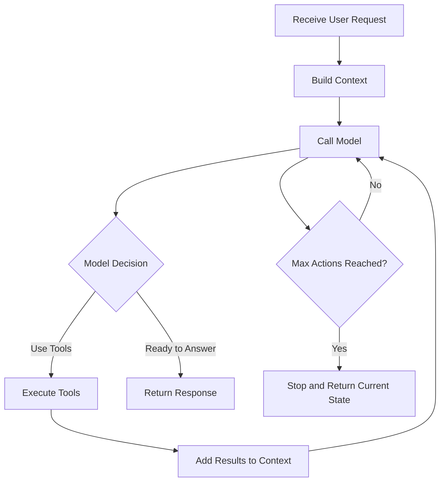

# Agent Execution Loop

How agents think, act, and iterate to solve problems.

## Agent Loop Concept

Unlike simple chatbots that respond once, agents **iterate** through a cycle of thinking and acting until they solve the problem or reach a limit.

**Core Pattern:**

From user input to final response is one cycle. Within each cycle, each tool call counts as one **iteration** or **action**.

## Next Steps

- **[Multi-Agent Systems](multi-agent.md)** - Use specialized agents for complex workflows
- **[Graph Workflows](../graph/index.md)** - Orchestrate multiple agent loops
- **[System Tools](../tools/index.md)** - Explore tools that extend agent capabilities
