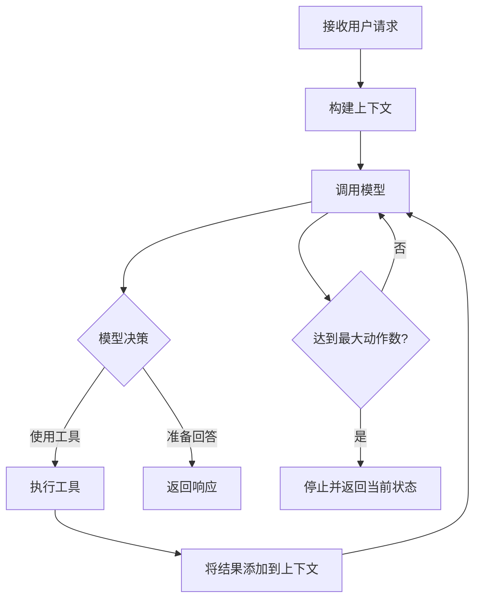

# Agent 执行循环

智能体如何思考、行动和迭代以解决问题。

## Agent 循环概念

与只响应一次的简单聊天机器人不同,智能体会 **迭代** 执行思考和行动的循环,直到解决问题或达到限制。

**核心模式:**

从用户输入到最终响应为一个周期，每一个周期中，每一次工具调用算一次 **迭代** 或 **动作**。

## 下一步

- **[多智能体系统](multi-agent.zh.md)** - 在复杂工作流中使用专业智能体
- **[Graph 工作流](../graph/index.zh.md)** - 编排多个智能体循环
- **[系统工具](../tools/index.zh.md)** - 探索扩展智能体能力的工具
