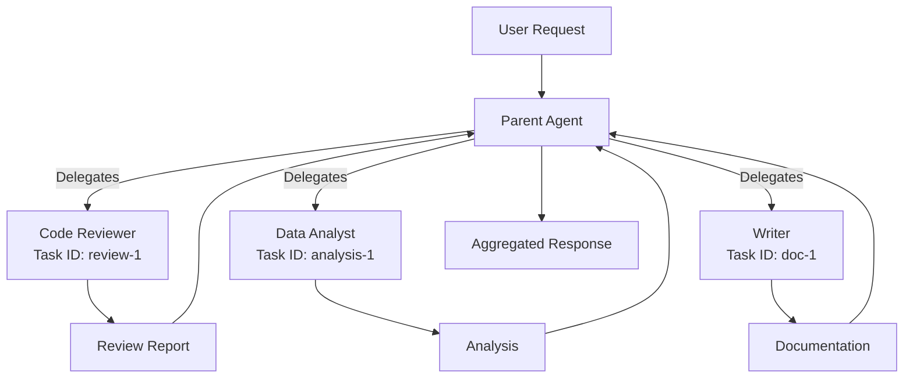

# Multi-Agent Systems

Coordinate multiple agents through workflows or sub-agent delegation.

## Understanding Multi-Agent

When a single agent isn't enough, use **multiple agents** working together:

| Approach | Structure | Use Case |
|----------|-----------|----------|
| **Graph (Workflow)** | Predefined flow with agent nodes | Structured multi-stage processes |
| **Sub-agent** | Dynamic delegation from parent agent | Flexible task decomposition |

## Graph-Based Multi-Agent

Graphs orchestrate multiple agents in a **fixed workflow**.

### Key Characteristics

- **Predefined structure** - You design node sequence and edges
- **Specialized agents per node** - Each node runs a different agent
- **Reliable execution** - Same flow every time
- **Visual design** - Build workflows in Graph Designer

**Learn more:** [Graph (Workflow) Documentation](../graph/index.md)

## Sub-Agent Delegation

Sub-agent lets agents **dynamically delegate tasks** to other specialists.

### Key Characteristics

- **Flexible delegation** - Parent agent chooses when to delegate
- **Isolated contexts** - Each sub-task has independent conversation history
- **Task persistence** - Track multi-round iterations with task IDs
- **Tool-based** - Enabled via the `agent_task_executor` system tool

### How It Works

### Task IDs

Control task continuity:

- **New task ID** → Fresh sub-agent context
- **Existing task ID** → Continue with full history from previous rounds

Example: Use same task ID across iterations for "draft → feedback → revision" loops.

**Learn more:** [Sub-Agent Tool Documentation](../tools/sub-agent.md)

## Choosing the Right Approach

| Criteria | Use Graph | Use Sub-Agent |
|----------|-----------|---------------|
| **Workflow predictability** | Known upfront | Discovered dynamically |
| **Structure** | Fixed, repeatable | Flexible, adaptive |
| **Visual design** | Yes, via Graph Designer | No, delegation in code |
| **Specialist coordination** | Explicit node connections | Parent orchestrates |
| **Iteration tracking** | Per-graph execution | Per-task ID |

**Combine both:** Graphs can use agents configured with sub-agent tool for hybrid workflows.

## Related Documentation

- **[Graph (Workflow)](../graph/index.md)** - Build structured multi-agent workflows
- **[Sub-Agent Tool](../tools/sub-agent.md)** - Enable dynamic task delegation
- **[File Tool](../tools/file-tool.md)** - Pass data between agents
- **[Agent Configuration](config.md)** - Configure specialist capabilities
