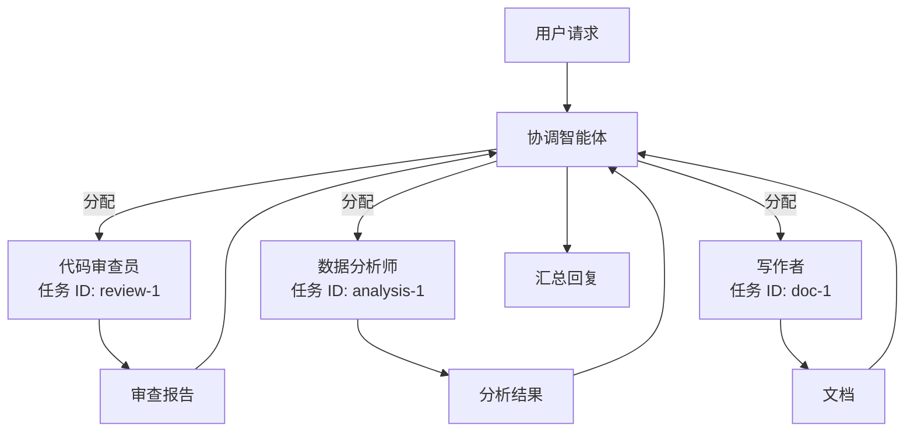

# 多智能体与子智能体

通过工作流或子智能体委托协调多个智能体。

## 理解多智能体

当单个智能体无法满足需求时，使用**多个智能体协同工作**：

| 方式 | 结构 | 使用场景 |
|-----|------|---------|
| **Graph（工作流）** | 预定义的智能体节点流程 | 结构化多阶段流程 |
| **Sub-agent（子智能体）** | 父智能体动态委托 | 灵活任务分解 |

## 基于 Graph 的多智能体

Graph 在**固定工作流**中编排多个智能体。

### 核心特点

- **预定义结构** - 您设计节点序列和边
- **每个节点专属智能体** - 每个节点运行不同的智能体
- **可靠执行** - 每次执行相同流程
- **可视化设计** - 在 Graph 设计器中构建工作流

**了解更多：** [Graph（工作流）文档](../graph/index.zh.md)

## Sub-Agent 委托

Sub-agent 实现**智能任务分解**，让复杂请求自动分配给专业智能体处理。

### 核心特点

- **自动分工** - 复杂任务自动分解并分配给合适的专家
- **独立执行** - 每个子任务在独立环境中完成，互不干扰
- **持续跟踪** - 任务 ID 记录完整执行历史，支持多轮迭代
- **专家协作** - 不同领域的专家智能体协同完成复杂工作

### 工作原理

### 任务 ID 机制

任务 ID 控制执行的延续性：

- **新任务 ID** → 启动全新任务，从零开始
- **相同任务 ID** → 继续之前的任务，保留完整历史

示例：代码审查任务使用相同 ID 进行多轮修改和验证。

**了解更多：** [Sub-Agent 工具文档](../tools/sub-agent.zh.md)

## 选择合适的方式

| 标准 | 使用 Graph | 使用 Sub-Agent |
|-----|-----------|---------------|
| **工作流可预测性** | 提前已知 | 动态发现 |
| **结构** | 固定、可重复 | 灵活、自适应 |
| **可视化设计** | 是，通过 Graph 设计器 | 否，在代码中委托 |
| **专家协调** | 显式节点连接 | 父智能体编排 |
| **迭代跟踪** | 每次 Graph 执行 | 每个任务 ID |

**组合使用：** Graph 可以使用配置了 sub-agent 工具的智能体实现混合工作流。

## 相关文档

- **[Graph（工作流）](../graph/index.zh.md)** - 构建结构化多智能体工作流
- **[Sub-Agent 工具](../tools/sub-agent.zh.md)** - 启用动态任务委托
- **[文件工具](../tools/file-tool.zh.md)** - 在智能体间传递数据
- **[Agent 配置](config.zh.md)** - 配置专家能力
