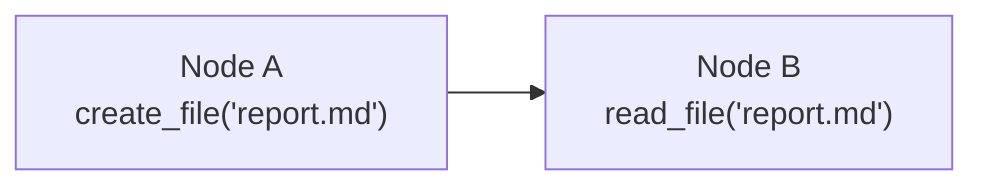

# Prompt References vs File Handoffs

Two ways to pass data between workflow nodes: template placeholder references and file tool handoffs. It's recommended to choose one as the primary data passing mechanism for your graph to ensure workflow clarity and consistency. Both approaches can also be used together, but avoid confusion.

## Prompt References

### How It Works

The system automatically replaces `{{node_name}}` with that node's output content.

```
system_prompt: "You are a review expert"
user_prompt: "Review the following research report:\n\n{{researcher}}"
```

During execution, `{{researcher}}` is replaced with the actual output from the researcher node.

### Reference Syntax

| Syntax | Meaning | Example |
|--------|---------|---------|
| `{{node_name}}` | Latest output from the node | `{{writer}}` |
| `{{node_name:N}}` | Most recent N outputs | `{{validator:3}}` - last 3 |
| `{{node_name:all}}` | All historical outputs | `{{analyzer:all}}` |
| `{{nodeA\|nodeB}}` | Multi-node joint reference (interleaved by round) | `{{search\|filter}}` |
| `{{nodeA:2\|nodeB:3}}` | Joint reference with counts | A's last 2, B's last 3 |

**Note:** Joint references interleave outputs by execution round, formatted as `node_name-round1output: content`.

### Advantages & Disadvantages

**Advantages:**
- Precise injection control: Insert data at exact prompt positions
- Template workflows: Pre-design complete prompt structure
- Suitable for concise outputs: Code snippets, bullet points, short texts

**Disadvantages:**
- Depends on upstream quality: Messy upstream output corrupts downstream prompts
- High prompt design threshold: Requires careful placeholder positioning
- Unsuitable for large content: Long texts create bloated prompts

## File Handoffs

### How It Works

Nodes use File Creator system tools to create, read, and modify files. Data passes between nodes via agreed file names.



### Core Tools

| Tool | Purpose | Typical Scenario |
|------|---------|------------------|
| `create_file` | Create new file | Node A outputs research to `research.md` |
| `read_file` | Read file content | Node B reads `research.md` for analysis |
| `update_file` | Partial modification (string replacement) | Node C corrects errors in `research.md` |
| `rewrite_file` | Complete rewrite | Node D reorganizes `research.md` structure |

### Configuration Method

**Upstream Node (Data Producer):**

```
system_prompt: "You are a research assistant who collects info and writes to research.md"
user_prompt: "Research topic: {{start}}\n\nUse create_file tool to save results to research.md"
system_tools: ["file_creator"]
```

**Downstream Node (Data Consumer):**

```
system_prompt: "You are a writer who creates articles based on research files"
user_prompt: "Read research.md (use read_file tool), then write article and save to article.md"
system_tools: ["file_creator"]
```

### Advantages & Disadvantages

**Advantages:**
- Decoupled node logic: Nodes depend on file conventions, not prompt references
- Suitable for large content: Long texts stored in files without polluting prompts
- Version history: Automatic recording of modifications and operation logs
- Flexible processing: Nodes can selectively read fields (summary, content, logs)

**Disadvantages:**
- Requires file conventions: Teams need unified naming standards
- Tool call overhead: Extra LLM calls to generate tool parameters
- Depends on Agent understanding: LLM must correctly interpret file operation instructions

## Core Differences

### Conceptual Differences

| Dimension | Prompt References | File Handoffs |
|-----------|------------------|---------------|
| **Core Concept** | Define node's **final output content** | Define **files maintained** by nodes |
| **Focus** | What the node outputs (regardless of process) | Which files the node reads/writes |
| **Agreement Object** | Output text format and content | File names and operation conventions |

**Prompt References**: Pre-design the output content format for each node. Downstream nodes reference this output via `{{node_name}}`, and the system automatically embeds it into prompt templates. Nodes only care about "what to output," not how to process data in between.

**File Handoffs**: Pre-agree on the files involved in the workflow and which files each node is responsible for maintaining. Each node can read upstream files, create its own files, and modify existing files. Nodes need to know explicitly "which files to read, which files to write," making the file system a shared workspace between nodes.

**Example Comparison:**

```
Prompt Reference Mode:
- researcher node → Output research report text
- writer node    → Reference {{researcher}}, output article text
- reviewer node  → Reference {{writer}}, output review comments

File Handoff Mode:
- researcher node → Create research.md
- writer node    → Read research.md, create article.md
- reviewer node  → Read article.md, create review.md
```

### Mechanism Comparison

| Dimension | Prompt References | File Handoffs |
|-----------|------------------|---------------|
| **Data Flow** | Output content automatically passed downstream | Share data through file system |
| **Use Cases** | Data needs direct injection into LLM context | Structured data, large content, persistence required |
| **Control Granularity** | Precisely control injection position and format | Pass data via file name and field conventions |
| **Risk Points** | Poor upstream output degrades downstream prompt quality | Requires naming and file structure conventions |

## Selection Guidelines

| Scenario | Recommended | Reason |
|----------|------------|--------|
| Short text (< 500 words) | Prompt references | Direct injection, no extra calls |
| Long documents (> 1000 words) | File handoffs | Avoid bloated prompts, support persistence |
| Need precise injection control | Prompt references | Template placeholders specify positions |
| Need version history and traceability | File handoffs | Auto-maintain operation logs |
| Iterative content modification | File handoffs | update/rewrite tools support incremental edits |
| Multi-node data sharing | File handoffs | Multiple nodes can read the same file |
| Simple linear flow | Prompt references | Simple config, efficient execution |

## Common Questions

| Question | Answer |
|----------|--------|
| **What if prompt reference fails?** | If the referenced node doesn't exist or hasn't executed, the placeholder is replaced with an empty string |
| **How to handle file name conflicts?** | Files are stored at conversation level; files in different conversations are isolated |
| **Is there a file size limit?** | Supports large files, but recommend < 10MB per file for performance |
| **Can I reference files from other conversations?** | No, files are only accessible within the current conversation |
| **What's the output order for joint references?** | Interleaved by round: all nodes from round1 → all nodes from round2 → ... |

## Related Documentation

- [Graph Execution](execution.md) - Node execution and data flow
- [File Tools](../tools/file-tool.md) - File Creator detailed documentation
- [Complex Workflows](complex-workflows.md) - Advanced node orchestration
