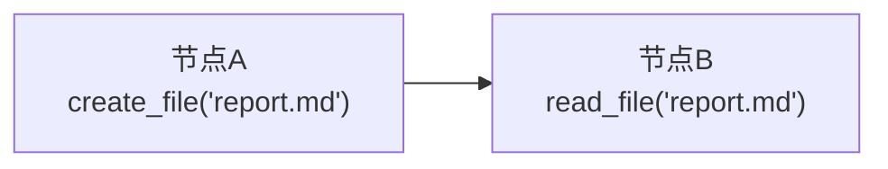

# 提示词引用 vs 文件交接

工作流中节点间传递数据的两种方式：模板占位符引用和文件工具交接。建议选择其中一种作为graph的数据传递机制，以保证工作流的清晰和一致性，也可以同时使用两种方式，但需注意避免混淆。

## 提示词引用

### 工作原理

系统自动将 `{{节点名}}` 替换为该节点的输出内容。

```
system_prompt: "你是评审专家"
user_prompt: "评审以下研究报告：\n\n{{researcher}}"
```

执行时，`{{researcher}}` 会被替换为 researcher 节点的实际输出。

### 引用语法

| 语法 | 含义 | 示例 |
|------|------|------|
| `{{节点名}}` | 该节点的最新输出 | `{{writer}}` |
| `{{节点名:N}}` | 最近 N 次输出 | `{{validator:3}}` - 最近 3 次 |
| `{{节点名:all}}` | 所有历史输出 | `{{analyzer:all}}` |
| `{{节点A\|节点B}}` | 多节点联合引用（按轮次交错） | `{{search\|filter}}` |
| `{{节点A:2\|节点B:3}}` | 带计数的联合引用 | A 最近 2 次，B 最近 3 次 |

**注意：** 联合引用会按执行轮次交错输出，格式为 `节点名-round1output: 内容`。

### 优势与劣势

**优势：**
- 精准控制注入位置：将数据插入提示词的确切位置
- 模板化工作流：提前设计完整提示词结构
- 适合简洁输出：代码片段、要点列表、短文本

**劣势：**
- 依赖上游质量：上游输出混乱会破坏下游提示词
- 提示词设计门槛高：需要精心设计占位符位置
- 不适合大段内容：长文本嵌入会导致提示词冗长

## 文件交接

### 工作原理

节点使用 File Creator 系统工具创建、读取、修改文件。通过约定的文件名在节点间传递数据。



### 核心工具

| 工具 | 用途 | 典型场景 |
|------|------|----------|
| `create_file` | 创建新文件 | 节点 A 输出研究结果到 `research.md` |
| `read_file` | 读取文件内容 | 节点 B 读取 `research.md` 进行分析 |
| `update_file` | 局部修改（字符串替换） | 节点 C 修正 `research.md` 中的错误 |
| `rewrite_file` | 完全重写 | 节点 D 重新组织 `research.md` 结构 |

### 配置方法

**上游节点（数据生产者）：**

```
system_prompt: "你是研究助手，收集信息并写入 research.md 文件"
user_prompt: "研究主题：{{start}}\n\n请使用 create_file 工具将结果保存到 research.md"
system_tools: ["file_creator"]
```

**下游节点（数据消费者）：**

```
system_prompt: "你是撰稿人，基于研究文件创作文章"
user_prompt: "阅读 research.md 文件（使用 read_file 工具），然后创作文章并保存到 article.md"
system_tools: ["file_creator"]
```

### 优势与劣势

**优势：**
- 解耦节点逻辑：节点不依赖提示词引用，只依赖文件约定
- 适合大段内容：长文本存储在文件，不污染提示词
- 版本历史：自动记录每次修改和操作日志
- 灵活处理：节点可以选择读取部分字段（summary、content、logs）

**劣势：**
- 需要文件约定：团队需统一文件命名规范
- 工具调用开销：需额外 LLM 调用生成工具参数
- 依赖 Agent 理解：LLM 需正确解读提示词中的文件操作指令

## 核心区别

### 理念差异

| 维度 | 提示词引用 | 文件交接 |
|------|----------|----------|
| **核心理念** | 约定节点的**最终输出内容** | 约定节点**维护的文件** |
| **关注点** | 节点输出什么（不管过程） | 节点读写哪些文件 |
| **约定对象** | 输出文本的格式和内容 | 文件名称和操作规范 |

**提示词引用**：提前设计好每个节点最终输出的内容格式。下游节点通过 `{{节点名}}` 直接引用这个输出，系统自动将其嵌入到提示词模板中。节点只需关心"输出什么"，不关心中间如何处理数据。

**文件交接**：提前约定整个工作流中涉及的文件以及每个节点负责维护的文件。每个节点可以读取上游文件、创建自己的文件、修改现有文件。节点需要明确知道"读哪些文件、写哪些文件"，文件系统成为节点间的共享工作空间。

**示例对比：**

```
提示词引用模式：
- researcher节点 → 输出研究报告文本
- writer节点   → 引用{{researcher}}，输出文章文本
- reviewer节点 → 引用{{writer}}，输出审核意见

文件交接模式：
- researcher节点 → 创建 research.md
- writer节点   → 读取 research.md，创建 article.md
- reviewer节点 → 读取 article.md，创建 review.md
```

### 机制对比

| 维度 | 提示词引用 | 文件交接 |
|------|----------|----------|
| **数据流动** | 输出内容自动传递给下游 | 通过文件系统共享数据 |
| **适用场景** | 数据需要直接注入 LLM 上下文 | 结构化数据、大段内容、需要持久化 |
| **控制粒度** | 精确控制注入内容的位置和格式 | 通过文件名和字段约定传递数据 |
| **风险点** | 上游输出质量差会影响下游提示词质量 | 需要规范命名和文件结构 |

## 选择建议

| 场景 | 推荐方式 | 原因 |
|------|---------|------|
| 短文本传递（< 500 字） | 提示词引用 | 直接注入，无额外调用 |
| 长文档传递（> 1000 字） | 文件交接 | 避免提示词过长，支持持久化 |
| 需要精确控制注入位置 | 提示词引用 | 模板占位符指定位置 |
| 需要版本历史和追溯 | 文件交接 | 自动维护操作日志 |
| 迭代修改内容 | 文件交接 | update/rewrite 工具支持增量修改 |
| 多节点共享数据 | 文件交接 | 多个节点可读取同一文件 |
| 简单线性流程 | 提示词引用 | 配置简单，执行高效 |

## 常见问题

| 问题 | 答案 |
|------|------|
| **提示词引用失败会怎样？** | 如果引用的节点不存在或未执行，占位符会被替换为空字符串 |
| **文件名冲突怎么办？** | 文件存储在对话级别，不同对话的文件互相隔离 |
| **文件是否有大小限制？** | 支持大文件，但建议单文件 < 10MB 以保证性能 |
| **能否引用其他对话的文件？** | 不能，文件仅在当前对话内可访问 |
| **联合引用的输出顺序？** | 按轮次交错：round1 的所有节点 → round2 的所有节点 → ... |

## 相关文档

- [Graph 执行](execution.zh.md) - 节点执行和数据流
- [文件工具](../tools/file-tool.zh.md) - File Creator 详细文档
- [复杂工作流](complex-workflows.zh.md) - 高级节点编排
