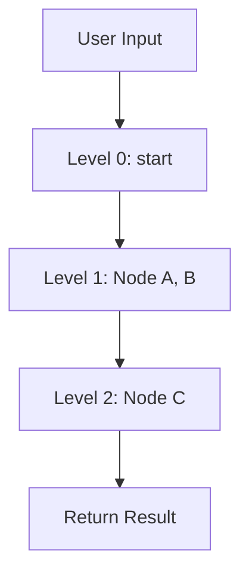
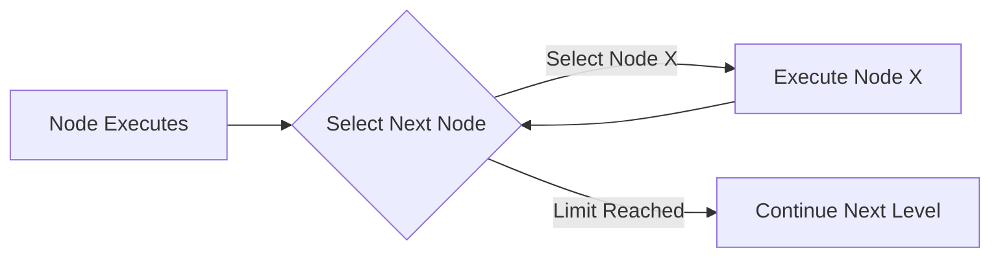

# Graph Execution

Graphs execute nodes level by level.

## Execution Flow

**Execution Rules:**
- Nodes at the same level execute sequentially
- Each node waits for upstream nodes to complete
- Nodes receive upstream outputs as input

## Execution Modes

| Mode | Response | Use Case |
|------|----------|----------|
| **Stream** | Each node streams content output | Interactive tasks |
| **Background** | Immediate conversation ID | Long-running tasks |

## Handoffs Execution

Nodes with Handoffs can dynamically choose the next step:

Each Handoffs node has a selection count limit, automatically continues normal flow when limit is reached.

## Final Output

| Method | Description |
|--------|-------------|
| **Use Template** | Configure `end_template`, use `{{node_name}}` to reference node outputs |
| **Last Node** | Use output from the last executed node |

## Next Steps

- **[Graph Configuration](config.md)** - Learn how to configure graphs
- **[Handoffs](handoffs.md)** - Implement dynamic routing
- **[Subgraphs](subgraph.md)** - Build modular workflows
