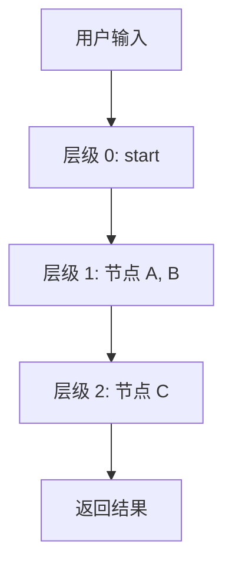
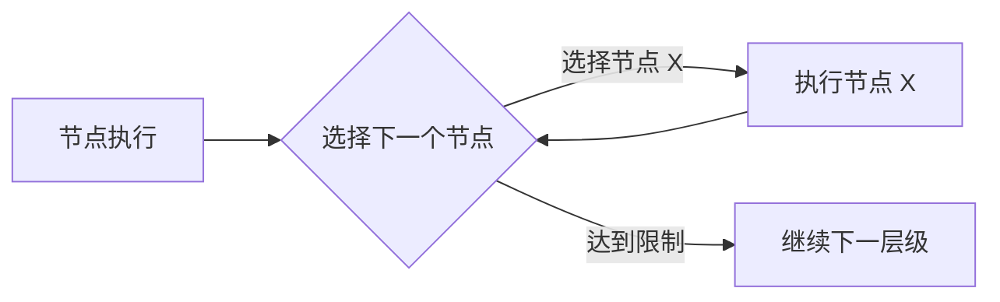

# Graph 执行

Graph 按层级逐层执行节点。

## 执行流程

**执行规则：**
- 同一层级的节点按顺序执行
- 每个节点等待上游节点完成
- 节点接收上游输出作为输入

## 执行模式

| 模式 | 响应方式 | 适用场景 |
|------|---------|---------|
| **流式** | 每个节点流式输出内容 | 交互式任务 |
| **后台** | 立即返回会话 ID | 长时间任务 |

## Handoffs 执行

带 Handoffs 的节点可以动态选择下一步：

每个 Handoffs 节点有选择次数限制，达到限制后自动继续正常流程。

## 最终输出

| 方式 | 说明 |
|------|------|
| **使用模板** | 配置 `end_template`，用 `{{节点名}}` 引用节点输出 |
| **最后节点** | 使用最后执行节点的输出 |

## 下一步

- **[Graph 配置](config.zh.md)** - 了解如何配置 Graph
- **[Handoffs](handoffs.zh.md)** - 实现动态路由
- **[子图](subgraph.zh.md)** - 构建模块化工作流
