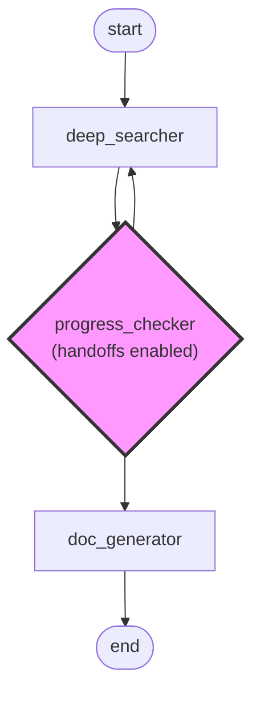

# Agent Handoffs

Enable nodes to dynamically choose the next execution path based on runtime conditions.

## What are Handoffs

Traditional graph execution follows fixed edges for routing. Handoffs allow Agents to intelligently select the next node at runtime. The system generates `transfer_to_*` tools for each available node, and the Agent completes routing by calling these tools.

**Core Value:** Replace hardcoded branching logic with LLM reasoning.

## How It Works

**Diagram Explanation:**

In this example workflow, `progress_checker` is a handoffs-enabled node (highlighted in pink) that dynamically decides the next execution path:

- **deep_searcher**: Performs deep search operations and passes results to the progress checker
- **progress_checker** (handoffs node): Evaluates the search progress and intelligently chooses between:
  - `transfer_to_doc_generator`: If sufficient information is gathered, proceed to documentation generation
  - `transfer_to_deep_searcher`: If more research is needed, loop back for additional searching
- **doc_generator**: Generates documentation based on collected information
- **end**: Workflow completion

The handoffs mechanism allows `progress_checker` to make runtime decisions based on the quality and completeness of search results, rather than following a predetermined path. This creates an intelligent feedback loop where the Agent can iteratively refine research until it meets quality standards.

When a node enables Handoffs, the system automatically generates transfer tools. The Agent analyzes the context and calls a tool to select the execution path.

## Configuration

| Parameter | Purpose | Example | Notes |
|-----------|---------|---------|-------|
| `handoffs` | Maximum selection count | `3` | `null` disables Handoffs |
| `output_nodes` | Available target nodes | `["review", "approve"]` | At least 2 nodes required |
| `node.description` | Node purpose description | `"Fix code issues"` | Helps Agent make decisions |

**Configuration Tips:**
- Set reasonable `handoffs` values: 2-3 for review loops, 5-10 for retry logic
- Write clear `description` for each node, explaining when to select it
- Use semantic node names: `review_code`, `fix_issues`, `approve`

## Key Mechanisms

### Selection Counter

Each call to a `transfer_to_*` tool decrements the counter by 1. When the `handoffs` limit is reached:
- Transfer tools are no longer generated
- Workflow continues to next level nodes
- Prevents infinite loops

### Conditional Routing

The Agent decides routing based on:
- Upstream node output content
- Error or exception information
- Task completion status
- Business logic judgment

**Example:** A code review node analyzes code quality and decides to `transfer_to_fix` (issues found) or `transfer_to_approve` (passed).

## FAQ

| Question | Answer |
|----------|--------|
| **Difference between Handoffs and regular edges?** | Regular edges execute all connected nodes, Handoffs let the Agent choose one from multiple options |
| **Can it cause infinite loops?** | No, the `handoffs` limit prevents infinite loops, automatically continuing after reaching the limit |
| **What happens after reaching the limit?** | Stops generating transfer tools, workflow enters next level or ends |
| **Do simple branches need Handoffs?** | No. Deterministic routing (e.g., errors always go to error handler) can use regular edges |
| **Can multiple nodes use Handoffs?** | Yes, each node counts independently |
| **How to debug Handoffs?** | Check the Agent's tool call logs to understand routing decisions |

## Design Recommendations

**Clear Exit Paths:** Always include termination nodes (e.g., `approve`, `reject`, `end`) to avoid accidentally exhausting the limit.

**Reasonable Limits:** Set `handoffs` based on business needs. Too low causes premature termination, too high increases runtime.

**Optimize Node Descriptions:** Write clear `description` like "Fix code issues based on review feedback" instead of "Processing node".

## Related Documentation

- [Graph Configuration](config.md) - Graph structure and node connections
- [Complex Workflows](complex-workflows.md) - Advanced multi-node patterns
- [Graph Execution](execution.md) - Node execution and dat