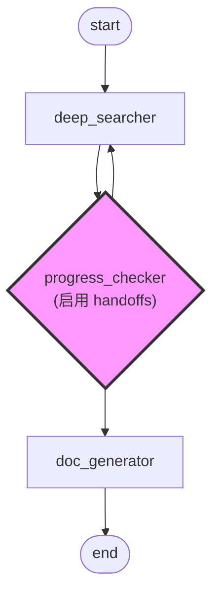

# Agent Handoffs

让节点根据运行情况动态选择下一步执行路径。

## 什么是 Handoffs

传统图执行按固定边路由，Handoffs 让 Agent 在运行时智能选择下一个节点。系统为每个可选节点生成 `transfer_to_*` 工具，Agent 调用工具完成路由。

**核心价值：** 用 LLM 推理替代硬编码分支逻辑。

## 工作原理

**流程图说明：**

在这个示例工作流中，`progress_checker` 是一个启用了 handoffs 的节点（粉色高亮），它动态决定下一步执行路径：

- **deep_searcher**：执行深度搜索操作，将结果传递给进度检查器
- **progress_checker**（handoffs 节点）：评估搜索进度，智能选择：
  - `transfer_to_doc_generator`：如果收集到足够信息，进入文档生成阶段
  - `transfer_to_deep_searcher`：如果需要更多研究，循环回去继续搜索
- **doc_generator**：基于收集的信息生成文档
- **end**：工作流完成

Handoffs 机制让 `progress_checker` 能够根据搜索结果的质量和完整性做出运行时决策，而不是遵循预定路径。这创建了一个智能反馈循环，Agent 可以迭代优化研究过程，直到满足质量标准。

节点启用 Handoffs 后，系统自动生成传递工具。Agent 分析上下文后调用工具，选择执行路径。

## 配置说明

| 参数 | 作用 | 示例 | 说明 |
|------|------|------|------|
| `handoffs` | 最大选择次数 | `3` | `null` 表示禁用 Handoffs |
| `output_nodes` | 可选目标节点 | `["review", "approve"]` | 至少 2 个节点 |
| `node.description` | 节点用途说明 | `"Fix code issues"` | 帮助 Agent 做选择 |

**配置建议：**
- 设置合理的 `handoffs` 值：审核循环 2-3 次，重试逻辑 5-10 次
- 为每个节点写清晰的 `description`，说明何时选择该节点
- 使用语义化节点名：`review_code`、`fix_issues`、`approve`

## 关键机制

### 选择计数器

每次调用 `transfer_to_*` 工具，计数器减 1。达到 `handoffs` 限制后：
- 不再生成传递工具
- 工作流继续执行下一层级节点
- 防止无限循环

### 条件路由

Agent 根据以下信息决定路由：
- 上游节点输出内容
- 错误或异常信息
- 任务完成状态
- 业务逻辑判断

**示例：** 代码审核节点分析代码质量，决定 `transfer_to_fix`（有问题）或 `transfer_to_approve`（通过）。

## 常见问题

| 问题 | 答案 |
|------|------|
| **Handoffs 和普通边的区别？** | 普通边执行所有连接节点，Handoffs 让 Agent 从多个选项中选择一个 |
| **会造成无限循环吗？** | 不会，`handoffs` 限制防止无限循环，达到上限后自动继续 |
| **达到限制后会怎样？** | 停止生成传递工具，工作流进入下一层级或结束 |
| **简单分支需要 Handoffs 吗？** | 不需要。确定性路由（如错误总是进错误处理器）用普通边即可 |
| **多个节点都能用 Handoffs？** | 可以，每个节点独立计数。 |
| **如何调试 Handoffs？** | 查看 Agent 的工具调用记录，了解路由决策过程 |

## 设计建议

**明确退出路径：** 始终包含终止节点（如 `approve`、`reject`、`end`），避免意外耗尽限制。

**合理设置限制：** 根据业务需求设置 `handoffs`。过低导致提前终止，过高增加运行时间。

**优化节点描述：** 写明确的 `description`，如 "根据审核反馈修复代码问题"，而非 "处理节点"。

## 相关文档

- [图配置](config.md) - 图结构和节点连接
- [复杂工作流](complex-workflows.md) - 高级多节点模式
- [图执行](execution.md) - 节点执行和数据传递
