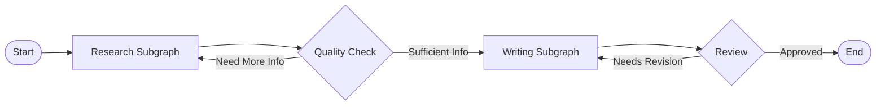
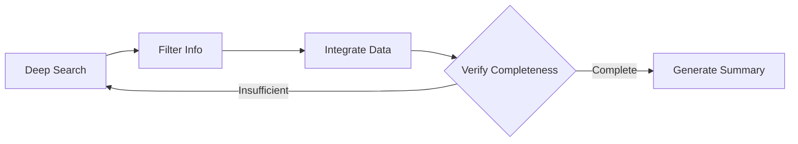
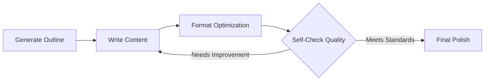
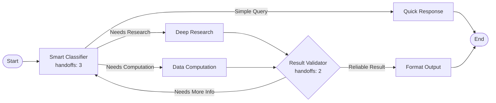

# Graph (Workflow)

Orchestrate multiple agents into structured workflows to solve complex tasks.

## Core Concepts

### Nodes and Edges

| Component | Description |
|-----------|-------------|
| **Node** | An agent or subgraph that performs a task |
| **Edge** | Connection showing data flow between nodes |
| **start** | Entry point that receives user input |
| **end** | Exit point that returns final output |

### Execution Flow

Graphs execute level by level:

1. **Level calculation** - System determines execution order from connections
2. **Sequential execution** - Nodes at the same level run one by one
3. **Data passing** - Each node receives output from its input nodes
4. **Final output** - Use templates to combine results from multiple nodes

### Graph Types

| Type | Description | Use When |
|------|-------------|----------|
| **Linear** | Simple chain: A → B → C → D | Single path with clear steps |
| **Parallel** | Multiple paths that merge | Independent tasks combine results |
| **Conditional** | Branches based on handoffs | Need to choose paths dynamically |
| **Nested** | Graphs containing subgraphs | Reuse complex workflows |

## Key Features

### Subgraphs

Nest entire graphs as single nodes to modularize and reuse complex workflows.

**Main Workflow:**

**Research Subgraph Internal Structure:**

**Writing Subgraph Internal Structure:**

**Example Explanation:**

This complex workflow demonstrates collaboration between two subgraphs:

- **Research Subgraph**: Deep search → filter info → integrate data → verify completeness (loop if insufficient) → generate summary
- **Writing Subgraph**: Generate outline → write content → format optimization → self-check quality (loop if needs improvement) → final polish
- **Quality Check Loop**: If research information is insufficient, loop back to research subgraph
- **Review Loop**: If writing quality doesn't meet standards, loop back to writing subgraph for revision
- **Internal Subgraph Loops**: Each subgraph has its own quality verification and iteration mechanism

Benefits:
- Reuse complex workflows
- Organize large graphs
- Share logic across projects
- Support iterative refinement loops

### Handoffs

Let nodes dynamically choose the next node, enabling intelligent routing and iterative refinement:

**Example Explanation:**

This workflow demonstrates multi-level intelligent decision-making with Handoffs:

- **Smart Classifier** (handoffs node): Dynamically selects one of three paths based on query complexity
  - Simple query → Quick response and end
  - Needs research → Deep research node
  - Needs computation → Data computation node
- **Result Validator** (handoffs node): Evaluates reliability of research or computation results
  - If more information needed, loop back to classifier for reprocessing
  - If result is reliable, proceed to format output
- **Iterative Refinement**: Up to 3 classification attempts and 2 validation loops ensure output quality

Handoffs enable Agents to intelligently choose execution paths based on actual conditions, rather than following fixed branching logic.

## When to Use Graphs

| Use Case | Example |
|----------|---------|
| Multi-stage pipelines | Research → Analysis → Report generation |
| Specialized agents | SEO expert + Writer + Editor working together |
| Reliable workflows | Production systems needing predictable behavior |
| Reusable processes | Common workflows shared across projects |

## Graph vs. Agent

Choose the right approach:

| Feature | Graph (Workflow) | Agent |
|---------|-----------------|-------|
| **Structure** | Predefined nodes and edges | Free-form, autonomous |
| **Best for** | Structured processes | Open-ended tasks |
| **Control** | You design the flow | Model decides next steps |
| **Predictability** | High - same path each time | Variable - adapts to situation |

Use **Graphs** for reliability, use **Agents** for flexibility.

## Next Steps

- **[Build Your First Graph](first-graph.md)** - Create a simple workflow
- **[Graph Configuration](config.md)** - Understand all configuration options
- **[Graph Execution](execution.md)** - Learn how graphs run
- **[Subgraphs](subgraph.md)** - Nest graphs within graphs
- **[Handoffs](handoffs.md)** - Implement dynamic routing
- **[Tasks](task.md)** - Schedule graphs to run automatically
- **[Build Complex Workflows](complex-workflows.md)** - Advanced patterns and best practices
