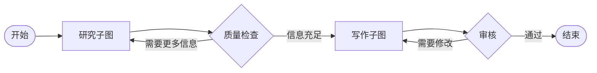
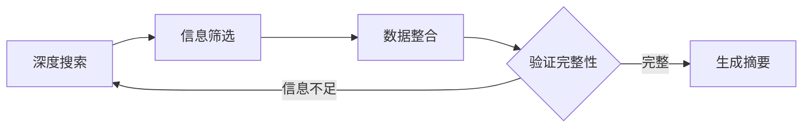
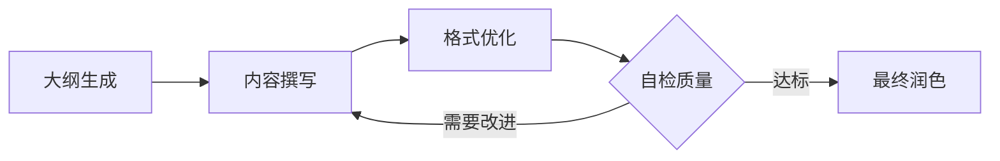
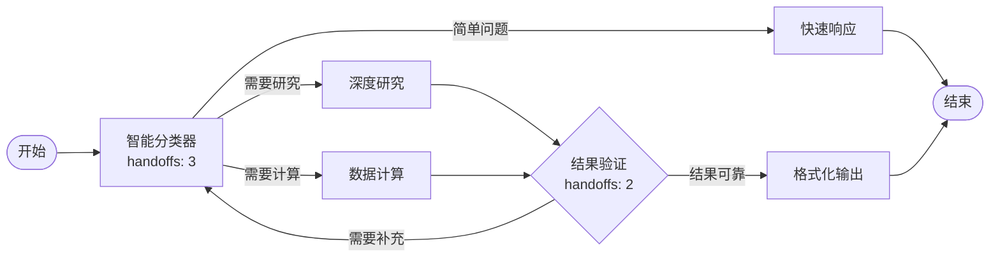

# Graph（工作流）

将多个智能体编排为结构化工作流，解决复杂任务。

## 核心概念

### 节点与边

| 组件 | 说明 |
|------|------|
| **节点** | 执行任务的智能体或子图 |
| **边** | 显示节点间数据流的连接 |
| **start** | 接收用户输入的入口 |
| **end** | 返回最终输出的出口 |

### 执行流程

图按层级逐层执行：

1. **层级计算** - 系统根据连接关系确定执行顺序
2. **顺序执行** - 同一层级的节点依次运行
3. **数据传递** - 每个节点接收其输入节点的输出
4. **最终输出** - 使用模板组合多个节点的结果

### 图类型

| 类型 | 说明 | 适用场景 |
|------|------|---------|
| **线性图** | 简单链式：A → B → C → D | 路径单一，步骤清晰 |
| **并行图** | 多路径最终汇聚 | 独立任务合并结果 |
| **条件图** | 基于 Handoffs 的分支 | 需要动态选择路径 |
| **嵌套图** | 包含子图的图 | 复用复杂工作流 |

## 核心功能

### 子图

将整个图嵌套为单个节点，实现复杂工作流的模块化和复用。

**主工作流：**

**研究子图内部结构：**

**写作子图内部结构：**

**示例说明：**

这个复杂工作流展示了两个子图的协作：

- **研究子图**：深度搜索 → 信息筛选 → 数据整合 → 验证完整性（不足则循环）→ 生成摘要
- **写作子图**：大纲生成 → 内容撰写 → 格式优化 → 自检质量（需改进则循环）→ 最终润色
- **质量检查循环**：如果研究信息不足，循环回研究子图继续收集
- **审核循环**：如果写作质量不达标，循环回写作子图进行修改
- **子图内部循环**：每个子图内部也有自己的质量验证和迭代机制

优势：
- 复用复杂工作流
- 组织大型图
- 跨项目共享逻辑
- 支持迭代优化循环

### Handoffs

让节点动态选择下一个节点，实现智能路由和迭代优化：

**示例说明：**

这个工作流展示了 Handoffs 的多层智能决策能力：

- **智能分类器**（handoffs 节点）：根据问题复杂度动态选择三条路径之一
  - 简单问题 → 快速响应直接结束
  - 需要研究 → 深度研究节点
  - 需要计算 → 数据计算节点
- **结果验证**（handoffs 节点）：评估研究或计算结果的可靠性
  - 如果需要补充信息，循环回分类器重新处理
  - 如果结果可靠，进入格式化输出
- **迭代优化**：最多 3 次分类尝试和 2 次验证循环，确保输出质量

Handoffs 让 Agent 根据实际情况智能选择执行路径，而不是遵循固定的分支逻辑。

## 何时使用 Graph

| 使用场景 | 示例 |
|---------|------|
| 多阶段流程 | 研究 → 分析 → 报告生成 |
| 专业智能体协作 | SEO 专家 + 撰稿人 + 编辑协同工作 |
| 可靠工作流 | 需要可预测行为的生产系统 |
| 可复用流程 | 跨项目共享的常用工作流 |

## Graph vs. Agent

选择合适的方式：

| 特性 | Graph（工作流） | Agent（智能体） |
|------|---------------|---------------|
| **结构** | 预定义节点和边 | 自由形式，自主决策 |
| **最适合** | 结构化流程 | 开放式任务 |
| **控制** | 您设计流程 | 模型决定下一步 |
| **可预测性** | 高 - 每次路径相同 | 可变 - 适应具体情况 |

使用 **Graph** 获得可靠性，使用 **Agent** 获得灵活性。

## 下一步

- **[构建您的第一个 Graph](first-graph.zh.md)** - 创建简单工作流
- **[Graph 配置](config.zh.md)** - 理解所有配置选项
- **[Graph 执行](execution.zh.md)** - 了解图的运行方式
- **[子图](subgraph.zh.md)** - 在图中嵌套图
- **[Handoffs](handoffs.zh.md)** - 实现动态路由
- **[任务](task.zh.md)** - 定时自动执行图
- **[构建复杂工作流](complex-workflows.zh.md)** - 高级模式与最佳实践
