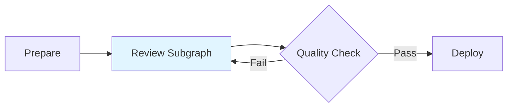
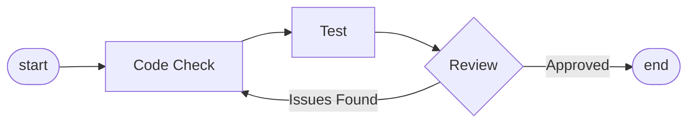
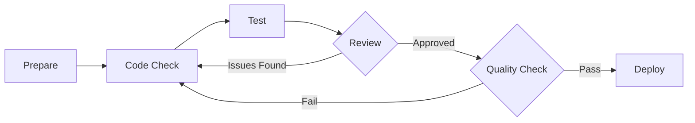

# Subgraphs

Embed a complete Graph as a node within another Graph.

## How It Works

Subgraphs automatically expand before execution, integrating internal nodes into the main graph:

**Main Graph with Subgraph:**



**Review Subgraph Internal Structure:**



**After Expansion:**



The system automatically handles connections, loops, and level calculations.

## How to Use

When adding a node in the main graph, select "Subgraph" type, then choose the Graph name to reference.

The subgraph node automatically inherits upstream and downstream connections.

## Connection Replacement

`start` and `end` inside subgraphs are automatically replaced with actual connections:

| Inside Subgraph | Replaced With |
|----------------|---------------|
| `input_nodes: ["start"]` | Main graph's `input_nodes` |
| `output_nodes: ["end"]` | Main graph's `output_nodes` |

## Nested Subgraphs

Subgraphs can contain other subgraphs, the system recursively expands all levels.

## Cycle Detection

The system automatically detects and rejects circular references:

```
Main Graph → Subgraph A → Subgraph B → Subgraph A  ❌ Circular reference
```

## Common Use Cases

| Scenario | Effect |
|----------|--------|
| **Code Review Process** | Reuse same review process across projects |
| **Data Pipeline** | Standardize data processing steps |
| **Test Suite** | Unified testing workflow |
| **Deployment Flow** | Standardize deployment steps |

## Best Practices

**Reasonable Splitting:** Extract frequently reused processes into subgraphs.

**Clear Naming:** Subgraph names should accurately describe their function.

**Avoid Deep Nesting:** Keep nesting levels under 3.

**Independent Testing:** Subgraphs should be executable and testable independently.

## Next Steps

- **[Graph Configuration](config.md)** - Learn how to configure graphs
- **[Graph Execution](execution.md)** - Understand execution flow
- **[Handoffs](handoffs.md)** - Implement dynamic routing
