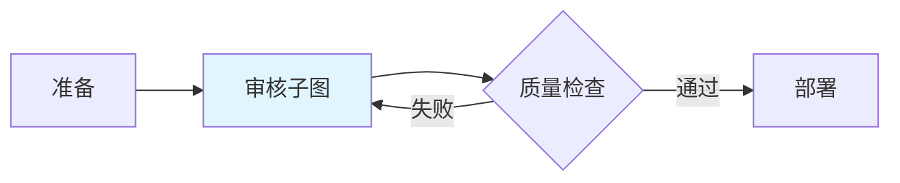
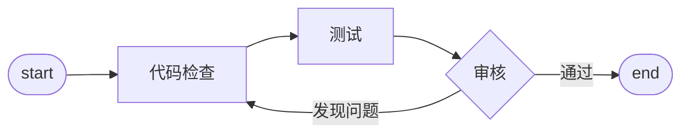
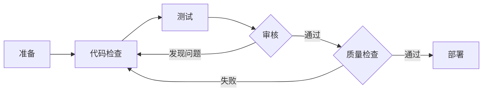

# 子图

将完整的 Graph 作为节点嵌入到另一个 Graph 中。

## 工作原理

子图在执行前自动展开，内部节点融入主图：

**主图包含子图：**



**审核子图内部结构：**



**展开后：**



系统自动处理连接关系、循环和层级计算。

## 使用方式

在主图中添加节点时，选择"子图"类型，然后选择要引用的 Graph 名称。

子图节点会自动继承上游和下游的连接关系。

## 连接替换

子图内部的 `start` 和 `end` 自动替换为实际连接：

| 子图内部 | 替换为 |
|---------|--------|
| `input_nodes: ["start"]` | 主图的 `input_nodes` |
| `output_nodes: ["end"]` | 主图的 `output_nodes` |

## 嵌套子图

子图内部可以包含其他子图，系统递归展开所有层级。

## 循环检测

系统自动检测并拒绝循环引用：

```
主图 → 子图A → 子图B → 子图A  ❌ 循环引用
```

## 典型应用

| 场景 | 效果 |
|------|------|
| **代码审核流程** | 多个项目复用同一审核流程 |
| **数据处理管道** | 标准化数据处理步骤 |
| **测试套件** | 统一测试流程 |
| **部署流程** | 标准化部署步骤 |

## 使用建议

**合理拆分：** 将重复使用的流程抽取为子图。

**清晰命名：** 子图名称应准确描述功能。

**避免过深嵌套：** 嵌套层级不超过 3 层。

**独立测试：** 子图应该能够独立执行和测试。

## 下一步

- **[Graph 配置](config.zh.md)** - 了解如何配置 Graph
- **[Graph 执行](execution.zh.md)** - 了解执行流程
- **[Handoffs](handoffs.zh.md)** - 实现动态路由
