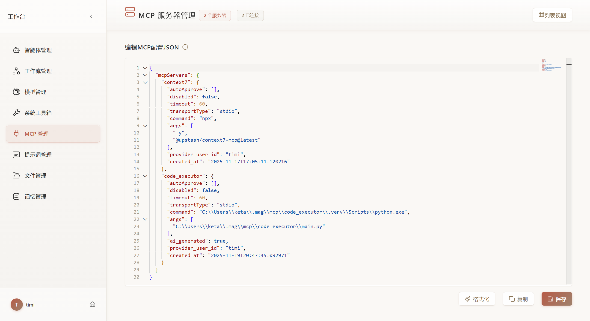
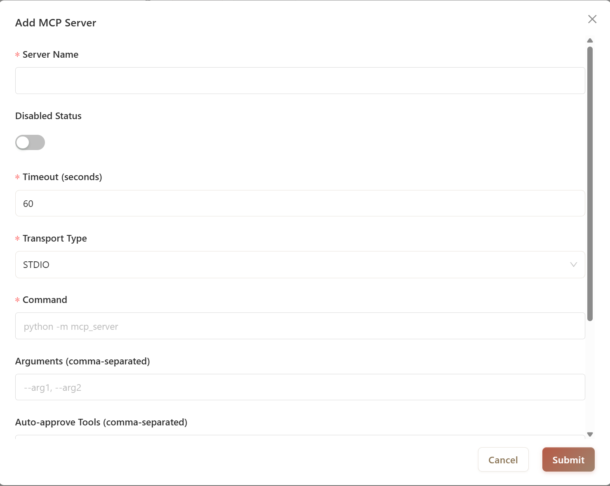

# Add Your First MCP Server

Connect an MCP server to enable new tools for your agents.

## Prerequisites

Find an MCP server from:

- [MCP.so](https://mcp.so/) - Community registry
- [GitHub Registry](https://github.com/modelcontextprotocol) - Official servers
- [ModelScope](https://www.modelscope.cn/mcp) - Chinese servers
- [FastMCP](https://gofastmcp.com) - Python framework

## Add via JSON Editor

For advanced configuration, switch to JSON view in MCP Manager.



### STDIO Example

```json
{
  "mcpServers": {
    "filesystem": {
      "autoApprove": ["read_file", "list_directory"],
      "disabled": false,
      "timeout": 60,
      "transportType": "stdio",
      "command": "npx",
      "args": ["-y", "@modelcontextprotocol/server-filesystem", "/home/user/projects"]
    }
  }
}
```

### SSE Example

```json
{
  "mcpServers": {
    "tavily": {
      "autoApprove": ["search"],
      "disabled": false,
      "timeout": 60,
      "transportType": "sse",
      "url": "https://mcp.api-inference.modelscope.cn/bd902138dc1a4d/sse",
      "env": {
        "TAVILY_API_KEY": "tvly-xxxxx"
      }
    }
  }
}
```

### HTTP Example

```json
{
  "mcpServers": {
    "weather": {
      "autoApprove": [],
      "disabled": false,
      "timeout": 60,
      "transportType": "streamable_http",
      "url": "https://fastmcp.cloud/mcp"
    }
  }
}
```

## Add via Form

Navigate to **MCP Manager** from the workspace sidebar.

### STDIO Server

For local Python/Node.js servers:



| Field | Description | Example |
|-------|-------------|---------|
| **Server Name** | Unique identifier | `filesystem` |
| **Transport Type** | Select `STDIO` | - |
| **Command** | Server executable | `npx` or `python` |
| **Arguments** | Startup parameters (comma-separated) | `-y, @modelcontextprotocol/server-filesystem, /path/to/dir` |
| **Timeout** | Connection timeout in seconds | `60` |
| **Auto-approve** | Tools that skip confirmation (comma-separated) | `read_file, list_directory` |
| **Environment Variables** | One per line as `KEY=VALUE` | `API_KEY=sk-xxx` |

**Common STDIO Servers:**

```
# Filesystem (Node.js)
Command: npx
Arguments: -y, @modelcontextprotocol/server-filesystem, /home/user/projects

# Git (Node.js)
Command: npx
Arguments: -y, @modelcontextprotocol/server-git, --repository, /path/to/repo

# Tavily Search (Python via uvx)
Command: uvx
Arguments: mcp-server-tavily
Environment: TAVILY_API_KEY=tvly-xxxxx
```

### SSE Server

For HTTP streaming servers:

| Field | Description | Example |
|-------|-------------|---------|
| **Server Name** | Unique identifier | `tavily_sse` |
| **Transport Type** | Select `SSE` | - |
| **SSE Address** | Server endpoint URL | `https://mcp.api-inference.modelscope.cn/bd902138dc1a4d/sse` |
| **Timeout** | Connection timeout in seconds | `60` |
| **Auto-approve** | Tools that skip confirmation | `search` |
| **Environment Variables** | One per line as `KEY=VALUE` | `API_KEY=your-key` |

### Streaming HTTP Server

For FastMCP and compatible servers:

| Field | Description | Example |
|-------|-------------|---------|
| **Server Name** | Unique identifier | `weather_http` |
| **Transport Type** | Select `Streaming HTTP` | - |
| **HTTP Address** | Server endpoint URL | `https://fastmcp.cloud/mcp` |
| **Timeout** | Connection timeout in seconds | `60` |

## Connect and Test

After adding a server:

1. Click **Connect** on the server card
2. Check status indicator (green = connected)
3. Click **View Tools** to see available tools
4. Use **MCP Inspector** for detailed testing (see [Inspector Guide](inspector.md))

## Common Issues

| Problem | Solution |
|---------|----------|
| Connection timeout | Increase timeout value or check server availability |
| Command not found | Verify command is installed (`npx`, `uvx`, `python`) |
| Environment variables not working | Check syntax: `KEY=VALUE` with one variable per line |
| Tools not appearing | Disconnect and reconnect; check server logs |

## Next Steps

- **[MCP Inspector](inspector.md)** - Test tools before using in agents
- **[Build with Agent](build-with-agent.md)** - Create custom MCP servers
- **[Use in Agent](../agent/config.md#mcp-servers)** - Attach servers to agents
