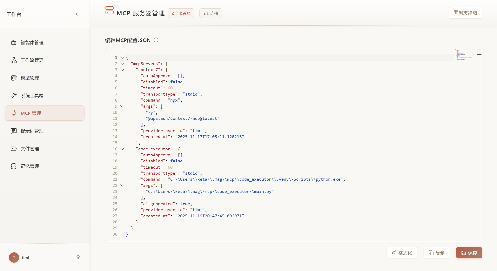
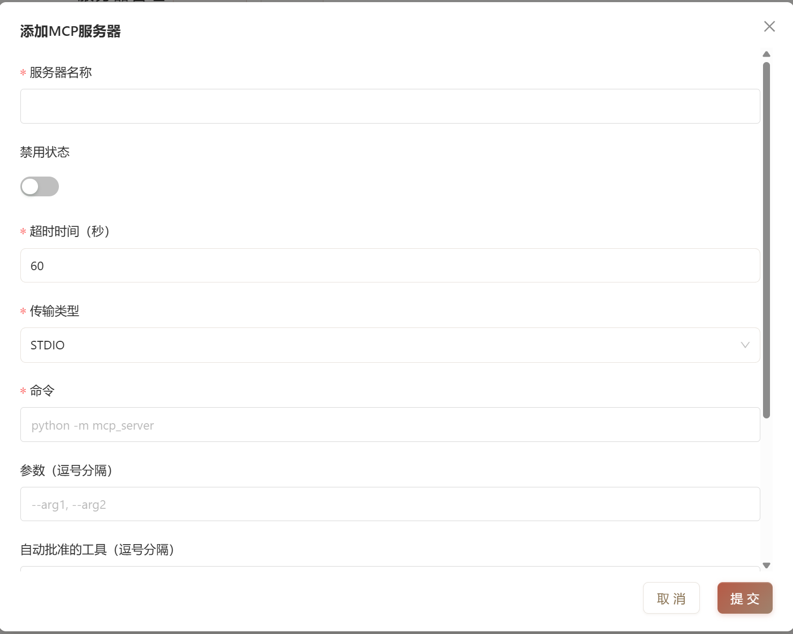

# 添加首个 MCP 服务器

连接 MCP 服务器为智能体启用新工具。

## 准备工作

从以下平台查找 MCP 服务器：

- [MCP.so](https://mcp.so/) - 社区注册表
- [GitHub Registry](https://github.com/modelcontextprotocol) - 官方服务器
- [ModelScope](https://www.modelscope.cn/mcp) - 国内服务器
- [FastMCP](https://gofastmcp.com) - Python 框架

## JSON 编辑器添加



### STDIO 示例

```json
{
  "mcpServers": {
    "filesystem": {
      "autoApprove": ["read_file", "list_directory"],
      "disabled": false,
      "timeout": 60,
      "transportType": "stdio",
      "command": "npx",
      "args": ["-y", "@modelcontextprotocol/server-filesystem", "/home/user/projects"]
    }
  }
}
```

### SSE 示例

```json
{
  "mcpServers": {
    "tavily": {
      "autoApprove": ["search"],
      "disabled": false,
      "timeout": 60,
      "transportType": "sse",
      "url": "https://mcp.api-inference.modelscope.cn/bd902138dc1a4d/sse",
      "env": {
        "TAVILY_API_KEY": "tvly-xxxxx"
      }
    }
  }
}
```

### HTTP 示例

```json
{
  "mcpServers": {
    "weather": {
      "autoApprove": [],
      "disabled": false,
      "timeout": 60,
      "transportType": "streamable_http",
      "url": "https://fastmcp.cloud/mcp"
    }
  }
}
```

## 表单添加

从工作台侧边栏进入 **MCP 管理**。

### STDIO 服务器

适用于本地 Python/Node.js 服务器：



| 字段 | 说明 | 示例 |
|------|------|------|
| **服务器名称** | 唯一标识符 | `filesystem` |
| **传输类型** | 选择 `STDIO` | - |
| **命令** | 服务器可执行文件 | `npx` 或 `python` |
| **参数** | 启动参数（逗号分隔） | `-y, @modelcontextprotocol/server-filesystem, /path/to/dir` |
| **超时时间** | 连接超时（秒） | `60` |
| **自动批准** | 跳过确认的工具（逗号分隔） | `read_file, list_directory` |
| **环境变量** | 每行一个，格式为 `KEY=VALUE` | `API_KEY=sk-xxx` |

**常用 STDIO 服务器：**

```
# 文件系统（Node.js）
命令: npx
参数: -y, @modelcontextprotocol/server-filesystem, /home/user/projects

# Git（Node.js）
命令: npx
参数: -y, @modelcontextprotocol/server-git, --repository, /path/to/repo

# Tavily 搜索（Python via uvx）
命令: uvx
参数: mcp-server-tavily
环境变量: TAVILY_API_KEY=tvly-xxxxx
```

### SSE 服务器

适用于 HTTP 流式服务器：

| 字段 | 说明 | 示例 |
|------|------|------|
| **服务器名称** | 唯一标识符 | `tavily_sse` |
| **传输类型** | 选择 `SSE` | - |
| **SSE 地址** | 服务器端点 URL | `https://mcp.api-inference.modelscope.cn/bd902138dc1a4d/sse` |
| **超时时间** | 连接超时（秒） | `60` |
| **自动批准** | 跳过确认的工具 | `search` |
| **环境变量** | 每行一个，格式为 `KEY=VALUE` | `API_KEY=your-key` |

### 流式 HTTP 服务器

适用于 FastMCP 及兼容服务器：

| 字段 | 说明 | 示例 |
|------|------|------|
| **服务器名称** | 唯一标识符 | `weather_http` |
| **传输类型** | 选择 `流式HTTP` | - |
| **HTTP 地址** | 服务器端点 URL | `https://fastmcp.cloud/mcp` |
| **超时时间** | 连接超时（秒） | `60` |

## 连接测试

添加服务器后：

1. 点击服务器卡片上的**连接**按钮
2. 检查状态指示器（绿色 = 已连接）
3. 点击**查看工具**查看可用工具
4. 使用 **MCP Inspector** 进行详细测试（参见[检查器指南](inspector.zh.md)）

## 常见问题

| 问题 | 解决方案 |
|------|----------|
| 连接超时 | 增加超时时间或检查服务器可用性 |
| 找不到命令 | 确认已安装命令（`npx`、`uvx`、`python`） |
| 环境变量无效 | 检查语法：每行一个 `KEY=VALUE` |
| 工具未显示 | 断开重连；检查服务器日志 |

## 下一步

- **[MCP Inspector](inspector.zh.md)** - 在智能体中使用前测试工具
- **[使用智能体构建](build-with-agent.zh.md)** - 创建自定义 MCP 服务器
- **[在智能体中使用](../agent/config.zh.md#mcp-服务器)** - 将服务器附加到智能体
