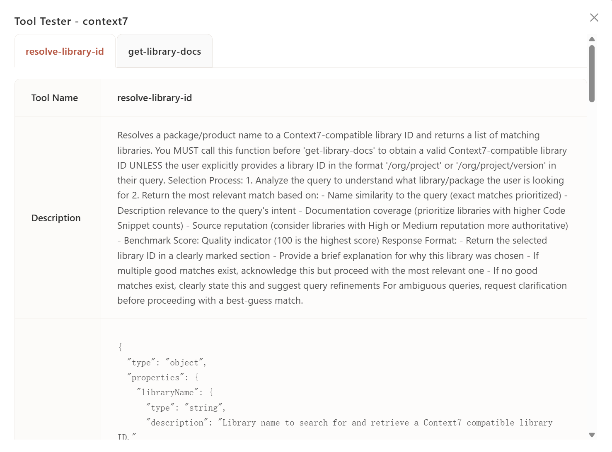
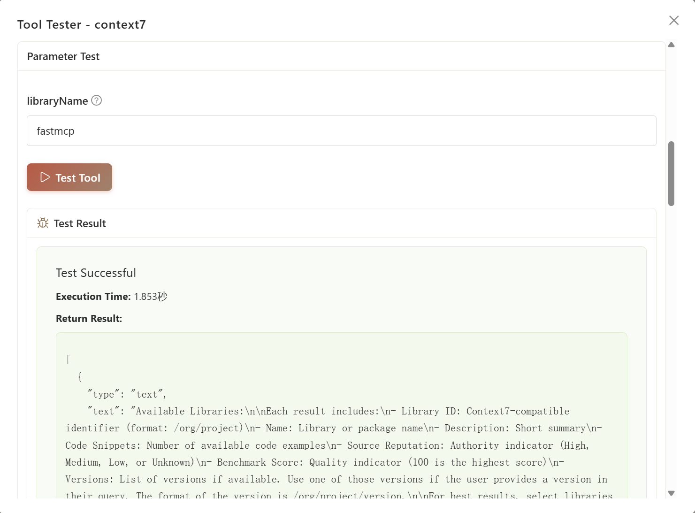

# MCP Inspector

Test MCP server tools before using them in agents.

## What is MCP Inspector

MCP Inspector is a testing interface that lets you:

- View all tools from connected MCP servers
- Test tools with custom parameters
- See execution results and timing
- Debug server connections

Use it to verify tools work correctly before adding them to your agents.

## Access Inspector

Navigate to **MCP Manager** from workspace sidebar, then:

1. Ensure server is **connected** (green status indicator)
2. Click the **wrench icon** on any connected server card
3. Inspector opens showing all available tools

## Tool Interface

Each tool displays in its own tab with:

| Section | Content |
|---------|---------|
| **Tool Name** | Tool identifier used by agents |
| **Description** | What the tool does and how it works |
| **Parameter Schema** | JSON schema showing required/optional parameters |
| **Test Form** | Input fields generated from parameter types |

## Test a Tool

### 1. Fill Parameters

The form automatically generates inputs based on parameter types

### 2. Run Test

Click **Test Tool** button to execute.

## Next Steps

- **[Add MCP Server](first-server.md)** - Connect more servers
- **[Use in Agents](../agent/config.md#mcp-servers)** - Attach tested tools to agents
- **[Build Custom Server](build-with-agent.md)** - Create your own MCP tools
