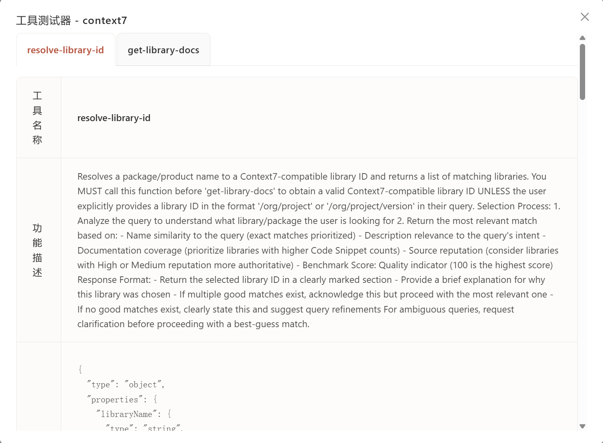
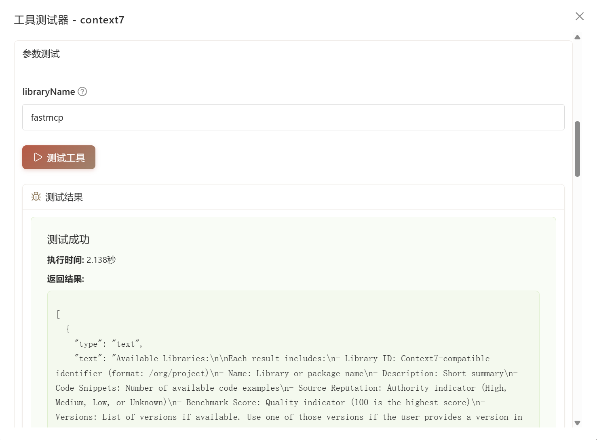

# MCP Inspector

在智能体中使用前测试 MCP 服务器工具。

## 什么是 MCP Inspector

MCP Inspector 是测试界面,用于:

- 查看已连接 MCP 服务器的所有工具
- 使用自定义参数测试工具
- 查看执行结果和耗时
- 调试服务器连接

用它验证工具正常工作后再添加到智能体。

## 访问检查器

从工作台侧边栏进入 **MCP 管理**,然后:

1. 确保服务器**已连接**(绿色状态指示器)
2. 点击已连接服务器卡片上的**扳手图标**
3. 检查器打开,显示所有可用工具

## 工具界面

每个工具显示在独立标签页中,包含:

| 部分 | 内容 |
|------|------|
| **工具名称** | 智能体使用的工具标识符 |
| **功能描述** | 工具的作用和工作方式 |
| **参数结构** | JSON Schema 显示必需/可选参数 |
| **测试表单** | 根据参数类型生成的输入字段 |

## 测试工具

### 1. 填写参数

表单根据参数类型自动生成输入框

### 2. 运行测试

点击**测试工具**按钮执行。

## 下一步

- **[添加 MCP 服务器](first-server.zh.md)** - 连接更多服务器
- **[在智能体中使用](../agent/config.zh.md#mcp-服务器)** - 将测试过的工具附加到智能体
- **[构建自定义服务器](build-with-agent.zh.md)** - 创建自己的 MCP 工具
