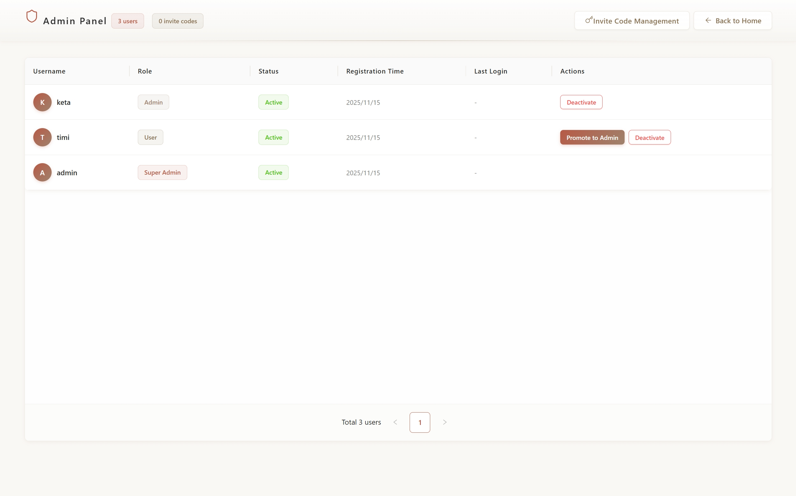

# Manage Your Team

Admin Panel provides centralized team management capabilities.

## Access Admin Panel

Only administrators can access the Admin Panel. Navigate to the admin interface through the user menu.

## User Management

### User Information

| Column | Description |
|--------|-------------|
| Username | User identifier with avatar |
| Role | User, Admin, or Super Admin |
| Status | Active or Deactivated |
| Registration Time | Account creation date |
| Last Login | Most recent login timestamp |

### User Actions

| Action | Availability | Effect |
|--------|-------------|--------|
| Promote to Admin | Active users only | Grants admin privileges |
| Deactivate | Active users except Super Admin | Prevents login access |

**Role Hierarchy**

- **Super Admin**: Cannot be deactivated
- **Admin**: Can manage users and invite codes
- **User**: Standard access level

## Team Settings

Administrators can update team information:

| Setting | Description |
|---------|-------------|
| Team Name | Display name for your organization |
| Updated By | Last admin who modified settings |
| Update Time | Last modification timestamp |

Team settings are accessible from the Admin Panel.
