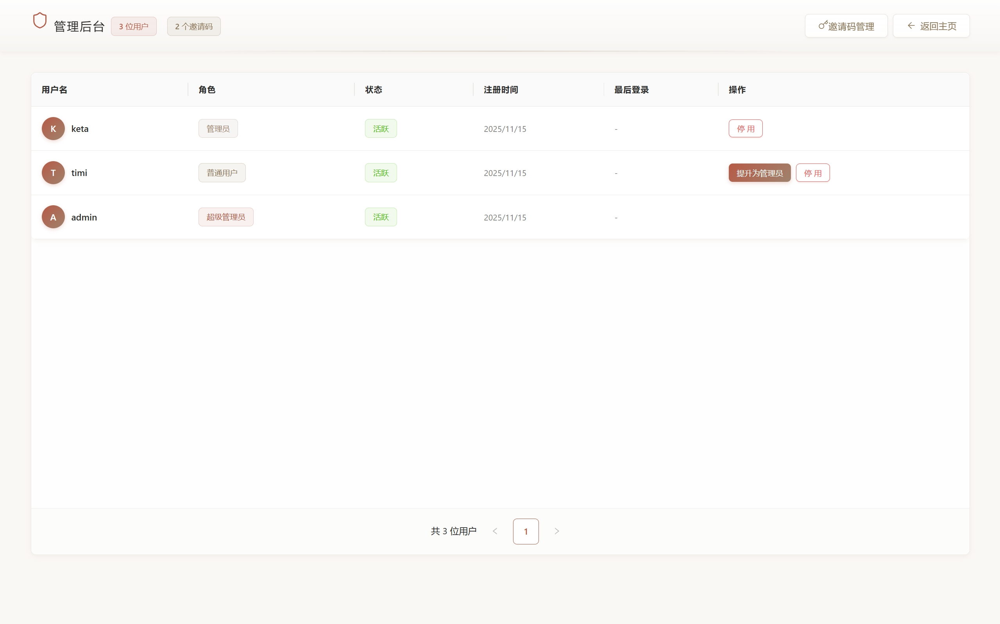

# 管理您的团队

管理后台提供集中化的团队管理功能。

## 访问管理后台

仅管理员可访问管理后台。通过用户菜单进入管理界面。

## 用户管理

### 用户信息

| 列名 | 说明 |
|------|------|
| 用户名 | 用户标识和头像 |
| 角色 | 普通用户、管理员或超级管理员 |
| 状态 | 活跃或已停用 |
| 注册时间 | 账户创建日期 |
| 最后登录 | 最近登录时间 |

### 用户操作

| 操作 | 适用范围 | 效果 |
|------|---------|------|
| 提升为管理员 | 仅活跃用户 | 授予管理员权限 |
| 停用 | 活跃用户(超级管理员除外) | 禁止登录访问 |

**角色层级**

- **超级管理员**:无法被停用
- **管理员**:可管理用户和邀请码
- **普通用户**:标准访问级别

## 团队设置

管理员可更新团队信息:

| 设置 | 说明 |
|------|------|
| 团队名称 | 组织的显示名称 |
| 更新者 | 最后修改设置的管理员 |
| 更新时间 | 最后修改时间戳 |

团队设置可从管理后台访问。
