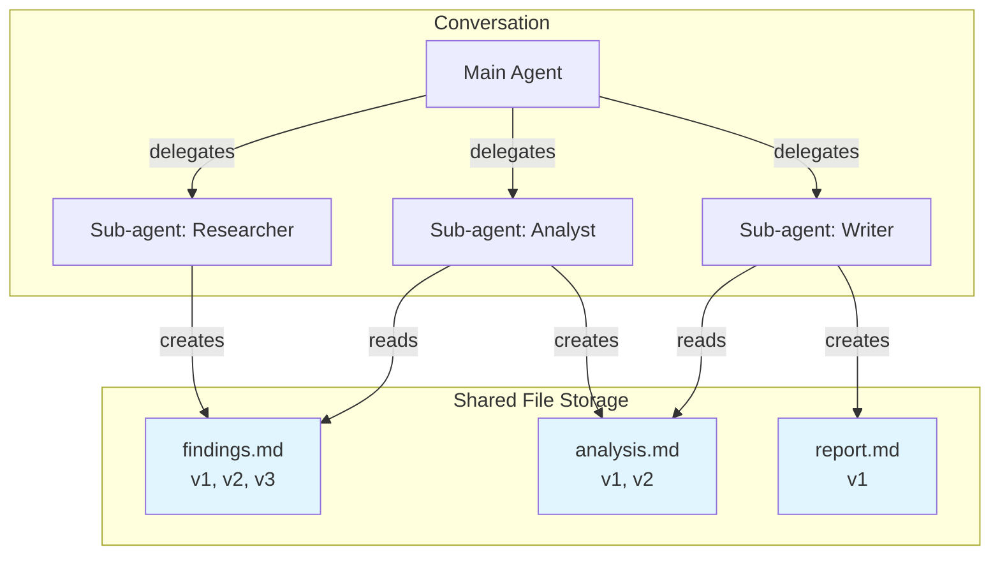

# File Tool

Enable Agents to create, manage, and share documents within conversations, with automatic version control.

## Core Capabilities

File Tool provides conversation-level document management with advanced features:

| Capability | Benefit | Example |
|------------|---------|---------|
| **Conversation-Scoped Storage** | All files belong to the conversation, accessible by any Agent in that conversation | Main Agent creates `requirements.md`, Sub-agent reads and updates it |
| **Multi-Agent Sharing** | Multiple Agents collaborate on the same files without manual handoff | Code reviewer creates `issues.md`, Developer reads it, updates with fixes |
| **Automatic Versioning** | Every file operation creates a new version, preserving complete history | Track document evolution: v1 draft → v2 revised → v3 final |
| **Operation Audit Trail** | Each change records who (which Agent) did what and why | See full history: "Agent A created file", "Agent B updated section X" |
| **Structured Organization** | Support directory hierarchies for organized file management | `docs/api.md`, `code/main.py`, `notes/review.txt` |

## Why Use File Tool

- Persistent, structured document storage
- Explicit handoff mechanism between Agents
- Version history preserves all iterations
- Clear separation between conversation and deliverables

## How It Works



**Key Mechanism:**

1. All Agents in the same conversation share the same file storage
2. Each file operation automatically creates a new version
3. Operation logs track which Agent made what changes
4. Files persist across the entire conversation lifecycle

## Key Features

### Conversation-Scoped Files

Files are stored at the conversation level:
- Any Agent in the conversation can access any file
- Perfect for multi-agent collaboration workflows
- Files persist even after Agents complete tasks
- User can export files at any time

### Automatic Version Control

Every write operation creates a new version:
- `create_file` → version 1
- `update_file` → new version with incremental changes
- `rewrite_file` → new version with complete rewrite
- Read any historical version when needed

### Operation Audit Trail

Each operation records metadata:
- **Agent**: Which Agent performed the operation
- **Log**: Why this operation was performed
- **Timestamp**: When it happened
- **Version ID**: Unique version identifier

This creates complete traceability of document evolution.

### Flexible Reading

Read files with customizable detail level:
- **Content only**: Just the file text
- **Summary only**: Quick overview
- **Logs only**: Operation history
- **Any combination**: Mix and match as needed

## Available Operations

| Operation | Purpose | Use Case |
|-----------|---------|----------|
| `create_file` | Create new file with initial content | Start a new document or deliverable |
| `read_file` | Read file content, summary, or logs | Access existing documents or history |
| `update_file` | Make targeted changes via string replacement | Fix specific sections or add content |
| `rewrite_file` | Replace entire file content | Major restructuring or complete revisions |
| `delete_files` | Remove files from conversation | Clean up temporary or obsolete files |
| `list_all_files` | See all files in conversation | Discover what documents exist |
| `list_files_by_directory` | Browse files by folder | Organize and navigate hierarchies |

## Common Workflows

### Multi-Agent Document Pipeline

| Stage | Agent | File Operation | File Created |
|-------|-------|----------------|--------------|
| 1. Research | Research Agent | `create_file` | `research/findings.md` (v1) |
| 2. Analysis | Data Analyst | `read_file` (findings)<br/>`create_file` | `analysis/insights.md` (v1) |
| 3. Writing | Content Writer | `read_file` (insights)<br/>`create_file` | `drafts/report.md` (v1) |
| 4. Review | Editor Agent | `read_file` (report)<br/>`update_file` | `drafts/report.md` (v2) |

### Iterative Code Review

| Round | Agent | Operation | Result |
|-------|-------|-----------|--------|
| 1 | Code Reviewer | `create_file` | `reviews/pr-123.md` (v1) - Initial issues |
| 2 | Developer | `read_file` → Fix code<br/>`update_file` | `reviews/pr-123.md` (v2) - Add fix notes |
| 3 | Code Reviewer | `read_file` → Check fixes<br/>`update_file` | `reviews/pr-123.md` (v3) - Approval |

### Project Documentation

| Phase | Agent | Files | Structure |
|-------|-------|-------|-----------|
| Planning | Project Agent | `docs/requirements.md`<br/>`docs/architecture.md` | Design documents |
| Development | Dev Agent | `code/main.py`<br/>`code/utils.py` | Implementation |
| Testing | QA Agent | `tests/results.md`<br/>`tests/issues.md` | Test reports |
| Delivery | Main Agent | `README.md`<br/>`CHANGELOG.md` | Final docs |

## Integration with Sub-agent

File Tool + Sub-agent = Powerful collaboration:

**Pattern 1: Sequential Work**
```
Main Agent → Sub-agent A creates file → Sub-agent B reads & extends → Main reviews
```

**Pattern 2: Parallel Contributions**
```
Main Agent → Sub-agent A creates file1 ┐
           → Sub-agent B creates file2 ├→ Main aggregates all files
           → Sub-agent C creates file3 ┘
```

**Pattern 3: Review Cycles**
```
Writer creates draft → Reviewer reads & creates feedback →
Writer reads feedback & updates draft → Repeat until approved
```

## Related Documentation

- [Sub-agent](sub-agent.md) - Delegate tasks to specialists who use files
- [Multi-Agent Systems](../agent/multi-agent.md) - Coordination patterns
- [Agent Configuration](../agent/config.md) - Configure Agents with File Tool
