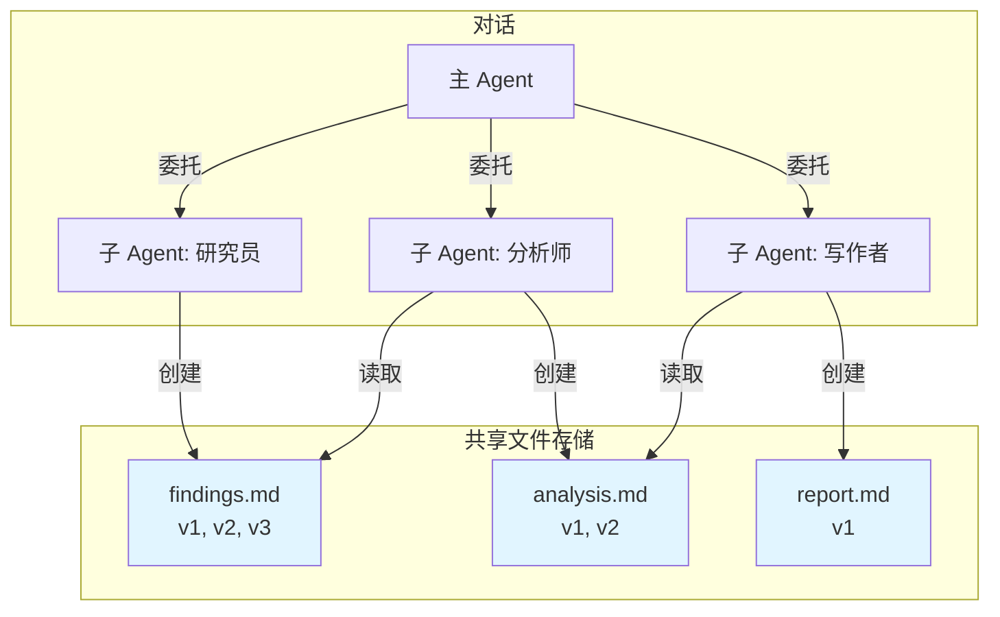

# 文件工具

让 Agent 能够在对话中创建、管理和共享文档，并自动进行版本控制。

## 核心能力

文件工具提供对话级别的文档管理和高级特性：

| 能力 | 优势 | 示例 |
|------|------|------|
| **对话级别存储** | 所有文件属于对话，该对话中的任何 Agent 都能访问 | 主 Agent 创建 `requirements.md`，子 Agent 读取并更新 |
| **多 Agent 共享** | 多个 Agent 在同一文件上协作，无需手动交接 | 代码审查员创建 `issues.md`，开发者读取并更新修复内容 |
| **自动版本控制** | 每次文件操作创建新版本，保留完整历史 | 追踪文档演进：v1 草稿 → v2 修订 → v3 定稿 |
| **操作审计轨迹** | 每次更改记录是谁（哪个 Agent）做了什么以及为什么 | 查看完整历史："Agent A 创建文件"、"Agent B 更新 X 部分" |
| **结构化组织** | 支持目录层次结构，实现有序的文件管理 | `docs/api.md`、`code/main.py`、`notes/review.txt` |

## 为什么使用文件工具

- 持久化的结构化文档存储
- Agent 之间的显式交接机制
- 版本历史保留所有迭代
- 对话和交付物清晰分离

## 工作原理



**关键机制：**

1. 同一对话中的所有 Agent 共享相同的文件存储
2. 每次文件操作自动创建新版本
3. 操作日志追踪哪个 Agent 做了什么更改
4. 文件在整个对话生命周期内持久存在

## 关键特性

### 对话级别文件

文件存储在对话层面：
- 对话中的任何 Agent 都能访问任何文件
- 非常适合多 Agent 协作工作流
- 即使 Agent 完成任务后文件仍然存在
- 用户可随时导出文件

### 自动版本控制

每次写入操作创建新版本：
- `create_file` → 版本 1
- `update_file` → 增量更改的新版本
- `rewrite_file` → 完全重写的新版本
- 可随时读取任何历史版本

### 操作审计轨迹

每次操作记录元数据：
- **Agent**：哪个 Agent 执行了操作
- **日志**：为什么执行此操作
- **时间戳**：何时发生
- **版本 ID**：唯一版本标识符

这创建了文档演进的完整可追溯性。

### 灵活读取

以可定制的详细程度读取文件：
- **仅内容**：只读文件文本
- **仅摘要**：快速概览
- **仅日志**：操作历史
- **任意组合**：按需混合搭配

## 可用操作

| 操作 | 目的 | 使用场景 |
|------|------|---------|
| `create_file` | 创建带初始内容的新文件 | 开始新文档或交付物 |
| `read_file` | 读取文件内容、摘要或日志 | 访问现有文档或历史 |
| `update_file` | 通过字符串替换进行针对性更改 | 修复特定部分或添加内容 |
| `rewrite_file` | 替换整个文件内容 | 大规模重构或完全修订 |
| `delete_files` | 从对话中删除文件 | 清理临时或过时文件 |
| `list_all_files` | 查看对话中的所有文件 | 发现存在哪些文档 |
| `list_files_by_directory` | 按文件夹浏览文件 | 组织和导航层次结构 |

## 常见工作流

### 多 Agent 文档流水线

| 阶段 | Agent | 文件操作 | 创建的文件 |
|------|-------|---------|-----------|
| 1. 研究 | 研究 Agent | `create_file` | `research/findings.md` (v1) |
| 2. 分析 | 数据分析师 | `read_file` (findings)<br/>`create_file` | `analysis/insights.md` (v1) |
| 3. 写作 | 内容写作者 | `read_file` (insights)<br/>`create_file` | `drafts/report.md` (v1) |
| 4. 审查 | 编辑 Agent | `read_file` (report)<br/>`update_file` | `drafts/report.md` (v2) |

### 迭代代码审查

| 轮次 | Agent | 操作 | 结果 |
|------|-------|------|------|
| 1 | 代码审查员 | `create_file` | `reviews/pr-123.md` (v1) - 初始问题 |
| 2 | 开发者 | `read_file` → 修复代码<br/>`update_file` | `reviews/pr-123.md` (v2) - 添加修复说明 |
| 3 | 代码审查员 | `read_file` → 检查修复<br/>`update_file` | `reviews/pr-123.md` (v3) - 批准 |

### 项目文档

| 阶段 | Agent | 文件 | 结构 |
|------|-------|------|------|
| 规划 | 项目 Agent | `docs/requirements.md`<br/>`docs/architecture.md` | 设计文档 |
| 开发 | 开发 Agent | `code/main.py`<br/>`code/utils.py` | 实现代码 |
| 测试 | QA Agent | `tests/results.md`<br/>`tests/issues.md` | 测试报告 |
| 交付 | 主 Agent | `README.md`<br/>`CHANGELOG.md` | 最终文档 |

## 与 Sub-agent 集成

文件工具 + Sub-agent = 强大的协作：

**模式 1：顺序工作**
```
主 Agent → 子 Agent A 创建文件 → 子 Agent B 读取并扩展 → 主 Agent 审查
```

**模式 2：并行贡献**
```
主 Agent → 子 Agent A 创建 file1 ┐
        → 子 Agent B 创建 file2 ├→ 主 Agent 汇总所有文件
        → 子 Agent C 创建 file3 ┘
```

**模式 3：审查循环**
```
写作者创建草稿 → 审查者读取并创建反馈 →
写作者读取反馈并更新草稿 → 重复直到批准
```

## 相关文档

- [Sub-agent](sub-agent.zh.md) - 委托任务给使用文件的专家
- [多 Agent 系统](../agent/multi-agent.zh.md) - 协调模式
- [Agent 配置](../agent/config.zh.md) - 为 Agent 配置文件工具
