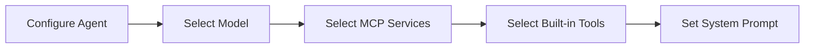

# Built-in Tools

Toolsets that extend Agent capabilities within the system.

## What are Built-in Tools

Built-in tools are pre-configured capability enhancers provided by the platform for Agents, enabling them to perform operations beyond basic conversations. Through these tools, Agents can create resources, manage files, invoke other Agents for collaboration, and accomplish complex automated tasks.

Differences between Built-in Tools and MCP Servers:

| Aspect | Built-in Tools | MCP Servers |
|--------|---------------|-------------|
| **Source** | Platform pre-configured | External extensions |
| **Setup** | Direct selection | Requires server registration |
| **Purpose** | Manage platform resources | Connect external data and services |

## Tool Categories

### Resource Creation Tools

Help Agents create and manage core platform resources.

| Tool | Function | Typical Use Cases |
|------|----------|-------------------|
| [Agent Creator](agent-creator.md) | Create and configure new Agents | Design specialized Agents based on needs |
| [Graph Designer](graph-designer.md) | Design multi-agent workflows | Build complex collaboration systems |
| [MCP Builder](mcp-builder.md) | Build MCP tool servers | Extend external capabilities |
| [Prompt Generator](prompt-generator.md) | Create prompt templates | Manage reusable prompts centrally |
| [Task Manager](task-manager.md) | Set up scheduled tasks | Automate workflow execution |

### Collaboration Tools

Enable Agents to invoke other Agents or manage conversation files.

| Tool | Function | Typical Use Cases |
|------|----------|-------------------|
| [Sub-agent](sub-agent.md) | Delegate tasks to specialized Agents | Multi-Agent collaboration for complex tasks |
| [File Tool](file-tool.md) | Manage files in conversations | Create structured document systems |

### Memory & Query Tools

Provide persistent storage and system resource query capabilities.

| Tool | Function | Typical Use Cases |
|------|----------|-------------------|
| [Memory Tool](memory-tool.md) | Store user preferences and Agent experiences | Maintain continuity across conversations |
| [System Operations](system-operations.md) | Query system resources and configurations | Understand available models and tools |

## How to Use Tools

Select tools when configuring an Agent:

Tools automatically display descriptions in the Agent's current language. Agents can invoke tools during conversations to complete tasks.

## Next Steps

**Resource Creation:**
- [Agent Creator](agent-creator.md) - Create specialized Agents
- [Graph Designer](graph-designer.md) - Design workflows
- [MCP Builder](mcp-builder.md) - Build MCP tools
- [Prompt Generator](prompt-generator.md) - Manage prompts
- [Task Manager](task-manager.md) - Schedule tasks

**Collaboration & Files:**
- [Sub-agent](sub-agent.md) - Multi-Agent collaboration
- [File Tool](file-tool.md) - File management

**Memory & Queries:**
- [Memory Tool](memory-tool.md) - Persistent memory
- [System Operations](system-operations.md) - System queries
