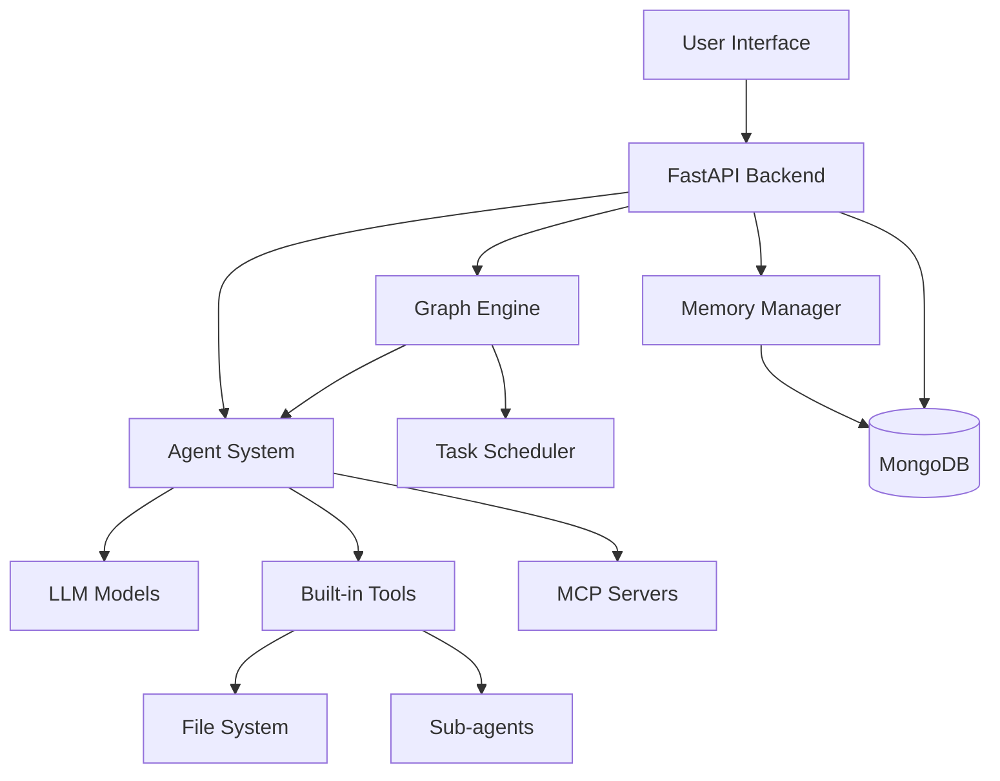

# Welcome to MAG Documentation

**Multi-Agent Graph (MAG)** is a powerful platform for building and orchestrating multi-agent systems with workflow management capabilities.

## What is MAG?

MAG provides a comprehensive framework for creating, managing, and executing complex agent-based workflows. It combines the power of:

- **Agents**: Intelligent autonomous units that can execute tasks
- **Graphs**: Visual workflow orchestration for multi-agent coordination
- **MCP Integration**: Model Context Protocol for extended capabilities
- **Memory Systems**: Both short-term and long-term memory management
- **Built-in Tools**: Rich set of tools for agent operations

## Key Features

- 🤖 **Multi-Agent Support**: Create and manage multiple specialized agents
- 🔀 **Workflow Orchestration**: Design complex workflows with graph-based execution
- 🧠 **Memory Management**: Persistent memory for agents and users
- 🔧 **Extensible Tools**: Built-in tools and MCP server integration
- 👥 **Team Collaboration**: Multi-user support with team management
- 📊 **Task Scheduling**: Automated task execution with cron-like scheduling

## Quick Links

-   :material-rocket-launch:{ .lg .middle } __Getting Started__

    ---

    Install MAG and run your first agent in minutes

    [:octicons-arrow-right-24: Quickstart](first-steps/quickstart.md)

-   :material-robot:{ .lg .middle } __Build Your First Agent__

    ---

    Learn how to create and configure your first agent

    [:octicons-arrow-right-24: Agent Guide](core-components/agent/first-agent.md)

-   :material-graph:{ .lg .middle } __Create Workflows__

    ---

    Design multi-agent workflows with graphs

    [:octicons-arrow-right-24: Graph Guide](core-components/graph/first-graph.md)

-   :material-puzzle:{ .lg .middle } __MCP Integration__

    ---

    Extend agent capabilities with MCP servers

    [:octicons-arrow-right-24: MCP Guide](core-components/mcp/first-server.md)

## Architecture Overview

## Community & Support

- **GitHub**: [mcp-agent-graph](https://github.com/yourusername/mcp-agent-graph-p)
- **Issues**: Report bugs or request features
- **Discussions**: Join the community discussions

## Next Steps

1. [Install MAG](first-steps/install.md) on your system
2. Follow the [Quickstart Guide](first-steps/quickstart.md)
3. Explore [Core Components](core-components/index.md)
4. Check out the [Future Roadmap](roadmap/index.md)

---

!!! tip "Documentation Version"
    This documentation is version controlled. You can switch between versions using the version selector in the header.
