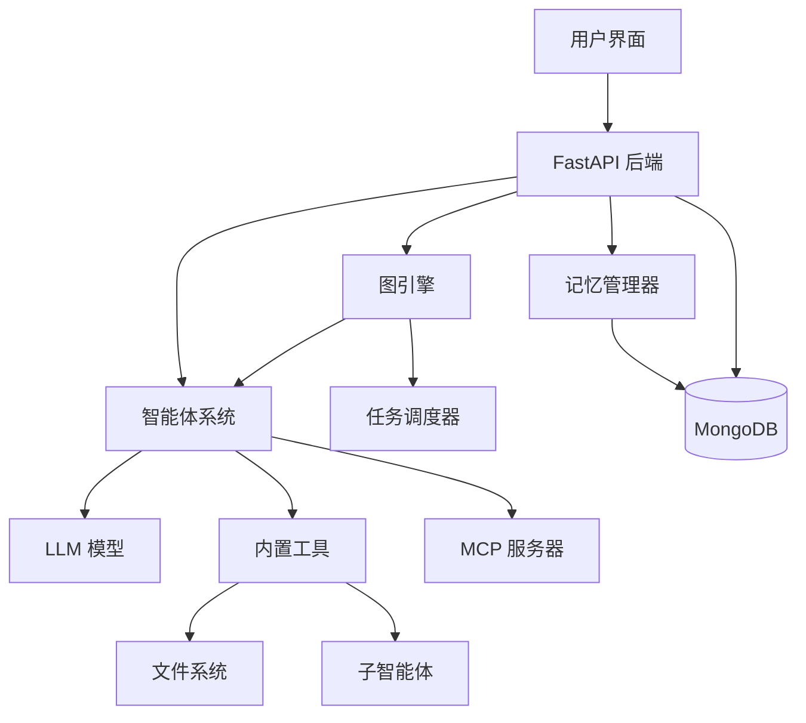

# 欢迎来到 MAG 文档

**多智能体图 (MAG)** 是一个功能强大的平台，用于构建和编排具有工作流管理能力的多智能体系统。

## 什么是 MAG？

MAG 提供了一个全面的框架，用于创建、管理和执行复杂的基于智能体的工作流。它结合了以下强大功能：

- **智能体**: 能够执行任务的智能自主单元
- **图工作流**: 用于多智能体协调的可视化工作流编排
- **MCP 集成**: 模型上下文协议，扩展功能
- **记忆系统**: 短期和长期记忆管理
- **内置工具**: 丰富的智能体操作工具集

## 核心特性

- 🤖 **多智能体支持**: 创建和管理多个专业化智能体
- 🔀 **工作流编排**: 使用基于图的执行设计复杂工作流
- 🧠 **记忆管理**: 为智能体和用户提供持久化记忆
- 🔧 **可扩展工具**: 内置工具和 MCP 服务器集成
- 👥 **团队协作**: 多用户支持与团队管理
- 📊 **任务调度**: 使用类似 cron 的调度自动执行任务

## 快速链接

-   :material-rocket-launch:{ .lg .middle } __快速开始__

    ---

    几分钟内安装 MAG 并运行你的第一个智能体

    [:octicons-arrow-right-24: 快速入门](first-steps/quickstart.md)

-   :material-robot:{ .lg .middle } __构建你的第一个智能体__

    ---

    学习如何创建和配置你的第一个智能体

    [:octicons-arrow-right-24: 智能体指南](core-components/agent/first-agent.md)

-   :material-graph:{ .lg .middle } __创建工作流__

    ---

    使用图设计多智能体工作流

    [:octicons-arrow-right-24: 图工作流指南](core-components/graph/first-graph.md)

-   :material-puzzle:{ .lg .middle } __MCP 集成__

    ---

    使用 MCP 服务器扩展智能体能力

    [:octicons-arrow-right-24: MCP 指南](core-components/mcp/first-server.md)

## 架构概览

## 社区与支持

- **GitHub**: [mcp-agent-graph](https://github.com/yourusername/mcp-agent-graph-p)
- **问题反馈**: 报告错误或请求新功能
- **讨论区**: 加入社区讨论

## 下一步

1. 在你的系统上[安装 MAG](first-steps/install.md)
2. 跟随[快速入门指南](first-steps/quickstart.md)
3. 探索[核心组件](core-components/index.md)
4. 查看[未来规划](roadmap/index.md)

---

!!! tip "文档版本"
    本文档支持版本控制。你可以使用页眉中的版本选择器切换不同版本。
