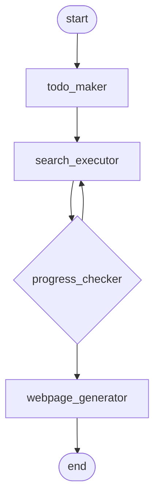

# deepresearch
保留研究计划制作的深度研究系统，自动分析问题并制定TODO，然后执行多轮智能检索并生成可视化HTML网页

## 流程图

## 节点列表
### todo_maker
- 描述: 分析用户问题并制作系统性的研究计划，将复杂问题分解为具体可执行的研究任务并确定优先级
- 使用模型: deepseek-chat

### search_executor
- 描述: 执行信息检索任务，根据研究计划选择重要任务并使用搜索工具获取高质量的相关信息
- 使用模型: MiniMax/MiniMax-M1-80k
- MCP服务器: tavily-mcp

### progress_checker
- 描述: 评估研究进度和完成情况，判断信息收集是否充分，决定继续检索还是开始生成最终网页
- 使用模型: PaddlePaddle/ERNIE-4.5-300B-A47B-PT
- 最大决策次数: 3

### webpage_generator
- 描述: 基于完整的研究成果创建可视化HTML网页，将所有收集的信息整合成最终的展示页面
- 使用模型: Qwen/Qwen3-Coder-480B-A35B-Instruct

## 使用的MCP服务器
### tavily-mcp
- 状态: 启用
- 超时: 60秒

## 使用的模型
### MiniMax/MiniMax-M1-80k
- 基础URL: https://api-inference.modelscope.cn/v1
- 模型标识符: MiniMax/MiniMax-M1-80k

### PaddlePaddle/ERNIE-4.5-300B-A47B-PT
- 基础URL: https://api-inference.modelscope.cn/v1
- 模型标识符: PaddlePaddle/ERNIE-4.5-300B-A47B-PT

### Qwen/Qwen3-Coder-480B-A35B-Instruct
- 基础URL: https://api-inference.modelscope.cn/v1
- 模型标识符: Qwen/Qwen3-Coder-480B-A35B-Instruct

### deepseek-chat
- 基础URL: https://gateway.ai.cloudflare.com/v1/79dc4e1b350a1ac66b63c0f6a9e0c7a6/deepseek/deepseek
- 模型标识符: deepseek-chat
