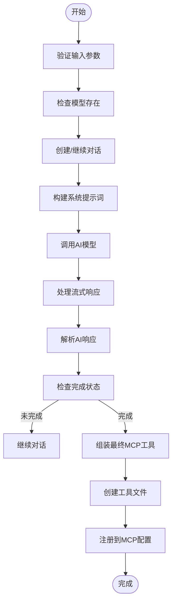
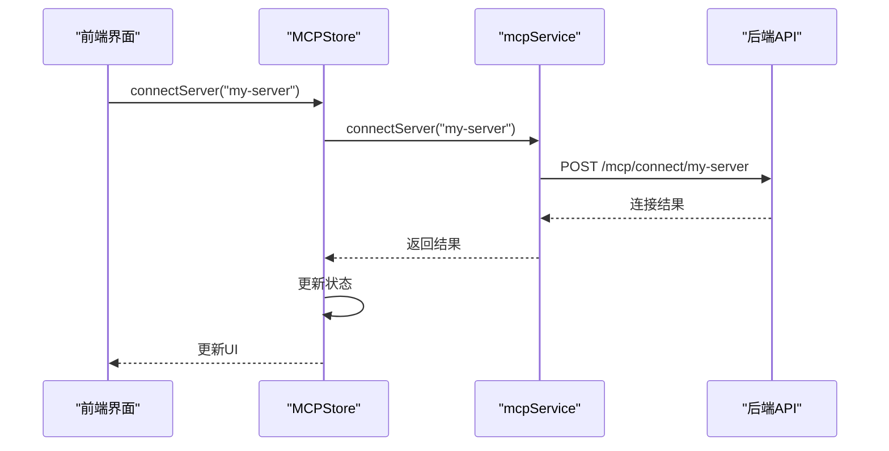
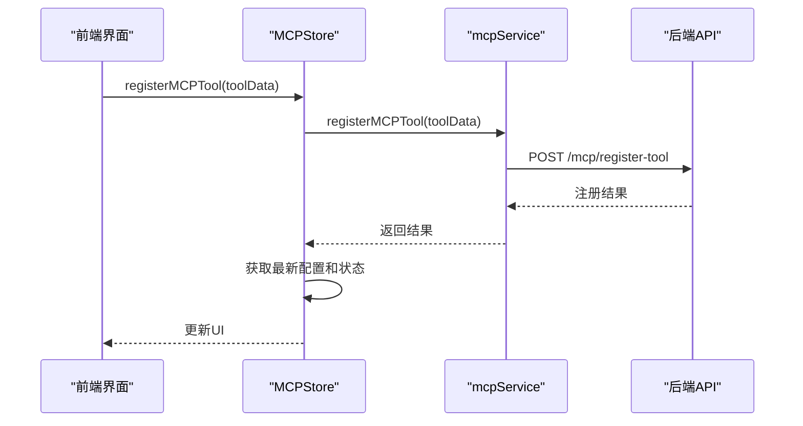

# MCP管理API

<cite>
**本文档引用的文件**  
- [mcp_routes.py](file://mag/app/api/mcp_routes.py)
- [mcp_schema.py](file://mag/app/models/mcp_schema.py)
- [ai_mcp_generator.py](file://mag/app/services/mcp/ai_mcp_generator.py)
- [mcpService.ts](file://frontend/src/services/mcpService.ts)
- [mcp.ts](file://frontend/src/types/mcp.ts)
- [mcp.py](file://mag/client/mcp.py)
</cite>

## 目录
1. [简介](#简介)
2. [API端点参考](#api端点参考)
3. [MCP工具JSON-RPC协议](#mcp工具json-rpc协议)
4. [AI生成MCP工具](#ai生成mcp工具)
5. [MCP服务器配置](#mcp服务器配置)
6. [前端交互示例](#前端交互示例)
7. [Python SDK集成](#python-sdk集成)

## 简介
MCP（Model Context Protocol）管理API提供了一套完整的接口，用于管理MCP服务器、生成和调用MCP工具。本系统支持传统MCP服务器的注册与连接，以及通过AI生成符合MCP规范的工具。API设计遵循RESTful原则，支持流式SSE响应，便于实时获取AI生成工具的进度。系统通过`mcpServers`配置管理所有MCP服务，每个服务可以提供多个工具，这些工具可以在聊天、图谱等场景中被调用。

## API端点参考

### MCP服务器注册 (/mcp/add)
添加新的MCP服务器配置到系统中。该端点接收包含`mcpServers`字段的JSON对象，其中键为服务器名称，值为服务器配置。

**请求示例**:
```json
{
  "mcpServers": {
    "my-server": {
      "command": "python",
      "args": ["server.py"],
      "transportType": "stdio",
      "autoApprove": []
    }
  }
}
```

**响应**:
- `status`: 操作状态（success, partial_success, no_changes, error）
- `message`: 操作结果描述
- `added_servers`: 成功添加的服务器列表
- `duplicate_servers`: 已存在的服务器列表

**Section sources**
- [mcp_routes.py](file://mag/app/api/mcp_routes.py#L157-L197)

### 连接测试 (/mcp/connect/{server_name})
连接指定的MCP服务器或连接所有服务器（当`server_name`为`all`时）。系统会自动处理服务器的初始化和工具发现过程。

**特殊路径**:
- `/mcp/connect/all`: 连接所有配置的服务器
- `/mcp/connect/{server_name}`: 连接指定名称的服务器

**响应**:
返回连接结果，包括状态、服务器名称和连接信息。如果服务器已连接，会返回现有连接状态。

**Section sources**
- [mcp_routes.py](file://mag/app/api/mcp_routes.py#L338-L374)

### AI生成MCP工具 (/mcp/generate)
通过AI流式生成符合MCP规范的工具。该端点采用SSE（Server-Sent Events）协议，实时返回生成进度。

**请求参数 (MCPGenerationRequest)**:
- `requirement`: 工具需求描述（必填）
- `model_name`: 使用的AI模型名称（必填）
- `conversation_id`: 对话ID（可选，用于多轮交互）
- `user_id`: 用户ID（可选）

**响应**:
流式SSE响应，包含以下事件类型：
- `data`: 原始流式数据块
- `completion`: 生成完成事件
- `incomplete`: 生成未完成事件
- `error`: 错误事件
- `[DONE]`: 流结束标记

**Section sources**
- [mcp_routes.py](file://mag/app/api/mcp_routes.py#L465-L501)

### 获取工具列表 (/mcp/tools/list)
获取所有可用MCP工具的详细信息。返回按服务器分组的工具列表，包含工具名称、描述和输入模式。

**响应结构**:
```json
{
  "server1": [
    {
      "name": "tool1",
      "description": "工具描述",
      "input_schema": {}
    }
  ]
}
```

**Section sources**
- [mcp_routes.py](file://mag/app/api/mcp_routes.py#L439-L463)

### 工具调用 (/mcp/tools/call)
调用指定MCP服务器上的工具。系统会自动处理服务器连接、工具发现和JSON-RPC通信。

**请求参数 (MCPToolTestRequest)**:
- `server_name`: 服务器名称
- `tool_name`: 工具名称
- `params`: 工具调用参数（可选）

**响应 (MCPToolTestResponse)**:
- `status`: 调用状态（success或error）
- `result`: 成功时的返回结果
- `error`: 错误信息
- `execution_time`: 执行时间（秒）

**Section sources**
- [mcp_routes.py](file://mag/app/api/mcp_routes.py#L376-L400)

## MCP工具JSON-RPC协议
MCP工具通过JSON-RPC 2.0协议进行通信，支持stdio、SSE和streamable_http三种传输类型。协议定义了工具发现、工具调用和结果返回的标准格式。

**工具发现**:
服务器启动后，通过`server.discover`方法返回工具列表，包含工具名称、描述和输入模式。

**工具调用**:
```json
{
  "jsonrpc": "2.0",
  "id": "1",
  "method": "tool.execute",
  "params": {
    "tool_name": "tool1",
    "arguments": {}
  }
}
```

**结果返回**:
```json
{
  "jsonrpc": "2.0",
  "id": "1",
  "result": {}
}
```

**Section sources**
- [mcp_schema.py](file://mag/app/models/mcp_schema.py#L104-L119)

## AI生成MCP工具
`ai_mcp_generator.py`模块实现了通过自然语言描述生成MCP工具的完整流程。系统采用多轮对话模式，逐步生成工具所需的各个组件。

### 生成流程


**Diagram sources**
- [ai_mcp_generator.py](file://mag/app/services/mcp/ai_mcp_generator.py#L0-L618)

### 核心功能
1. **对话管理**: 支持多轮交互式生成，通过`conversation_id`维护对话状态
2. **模板构建**: 动态生成包含现有工具列表的提示词模板，避免功能重复
3. **结果解析**: 解析AI返回的结构化数据，包括分析、待办事项、脚本文件等
4. **工具组装**: 将生成的组件组装成完整的MCP工具，创建虚拟环境和依赖

**Section sources**
- [ai_mcp_generator.py](file://mag/app/services/mcp/ai_mcp_generator.py#L0-L618)

## MCP服务器配置
`MCPServerConfig`定义了MCP服务器的配置结构和验证规则，确保配置的正确性和一致性。

### 数据结构
```typescript
interface MCPServerConfig {
  autoApprove: string[];
  disabled: boolean;
  timeout: number;
  command?: string;
  args: string[];
  transportType: 'stdio' | 'sse' | 'streamable_http';
  url?: string;
  base_url?: string;
  env?: Record<string, string>;
}
```

### 验证规则
1. **传输类型验证**:
   - `stdio`: 必须提供`command`字段
   - `sse`或`streamable_http`: 必须提供`url`字段
2. **字段规范化**:
   - `type`字段自动转换为`transportType`
   - `transportType`中的连字符自动替换为下划线
3. **字段过滤**:
   - `stdio`类型过滤`url`字段
   - `sse`和`streamable_http`类型过滤`command`和`args`字段

**Section sources**
- [mcp_schema.py](file://mag/app/models/mcp_schema.py#L0-L83)

## 前端交互示例
前端MCPManager界面通过`mcpService`与后端API进行交互，提供直观的服务器和工具管理功能。

### 服务连接流程


**Diagram sources**
- [mcpService.ts](file://frontend/src/services/mcpService.ts#L0-L47)
- [mcpStore.ts](file://frontend/src/store/mcpStore.ts#L81-L126)

### 工具注册流程


**Diagram sources**
- [mcpService.ts](file://frontend/src/services/mcpService.ts#L48-L66)
- [mcpStore.ts](file://frontend/src/store/mcpStore.ts#L169-L220)

## Python SDK集成
Python SDK提供了简洁的接口，便于在Python应用中集成MCP功能。

### 基本用法
```python
from mag.client.mcp import (
    add_mcp_server, 
    connect_server,
    generate_mcp_tool,
    register_mcp_tool
)

# 添加服务器
config = {
    "command": "python",
    "args": ["server.py"],
    "transportType": "stdio"
}
add_mcp_server("my-server", config)

# 连接服务器
connect_server("my-server")

# AI生成工具
result = generate_mcp_tool(
    requirement="创建一个天气查询工具",
    model_name="gpt-4"
)

# 手动注册工具
register_mcp_tool(
    folder_name="weather_tool",
    script_files={"main.py": "# 天气查询脚本"},
    readme="# 天气工具",
    dependencies="requests"
)
```

### 核心函数
- `add_mcp_server()`: 添加MCP服务器配置
- `connect_server()`: 连接指定服务器
- `generate_mcp_tool()`: AI生成MCP工具
- `register_mcp_tool()`: 手动注册MCP工具
- `test_tool()`: 测试工具调用
- `list_ai_mcp_tools()`: 列出AI生成的工具

**Section sources**
- [mcp.py](file://mag/client/mcp.py#L175-L284)