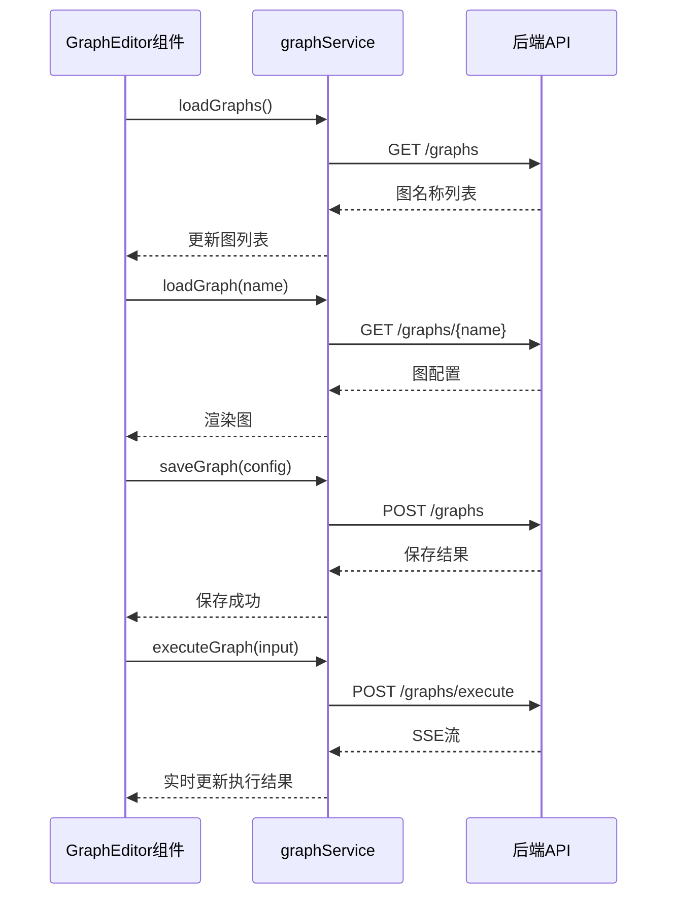

# 图管理API

<cite>
**本文档引用的文件**
- [graph_routes.py](file://mag/app/api/graph_routes.py)
- [graph_import_export_routes.py](file://mag/app/api/graph_import_export_routes.py)
- [graph_schema.py](file://mag/app/models/graph_schema.py)
- [ai_graph_generator.py](file://mag/app/services/graph/ai_graph_generator.py)
- [graphService.ts](file://frontend/src/services/graphService.ts)
</cite>

## 目录
1. [简介](#简介)
2. [图操作API](#图操作api)
   - [创建图](#创建图)
   - [获取图列表](#获取图列表)
   - [加载图](#加载图)
   - [执行图](#执行图)
   - [保存图](#保存图)
   - [删除图](#删除图)
   - [导入图](#导入图)
   - [导出为MCP服务](#导出为mcp服务)
3. [图嵌套机制](#图嵌套机制)
4. [AI生成图接口](#ai生成图接口)
5. [前端交互流程](#前端交互流程)

## 简介
本文档详细描述了 `mcp-agent-graph-p` 项目中与图管理相关的所有API端点。涵盖图的创建、加载、执行、保存、删除、导入、导出等核心功能，并解释了图嵌套和AI生成图的实现机制。所有API均基于FastAPI框架实现，支持JSON Schema验证和流式响应。

## 图操作API

### 创建图
创建新图或更新现有图的配置。

**HTTP方法**: `POST`  
**URL路径**: `/graphs`  
**请求体结构**:
```json
{
  "name": "string",
  "nodes": [
    {
      "id": "string",
      "type": "string",
      "position": {
        "x": 0,
        "y": 0
      },
      "data": {
        "label": "string"
      }
    }
  ],
  "edges": [
    {
      "id": "string",
      "source": "string",
      "target": "string",
      "type": "string"
    }
  ]
}
```

**响应格式**:
```json
{
  "status": "success",
  "message": "图 'example_graph' 保存成功"
}
```

**可能的错误码**:
- `400 Bad Request`: 图配置无效
- `500 Internal Server Error`: 保存图失败

**curl调用示例**:
```bash
curl -X POST http://localhost:8000/graphs \
  -H "Content-Type: application/json" \
  -d '{
    "name": "test_graph",
    "nodes": [],
    "edges": []
  }'
```

**Python SDK调用示例**:
```python
from mag.client.graph import GraphClient

client = GraphClient()
graph_config = {
    "name": "test_graph",
    "nodes": [],
    "edges": []
}
response = client.create_graph(graph_config)
```

**Section sources**
- [graph_routes.py](file://mag/app/api/graph_routes.py#L50-L100)

### 获取图列表
获取所有可用的图名称列表。

**HTTP方法**: `GET`  
**URL路径**: `/graphs`  
**请求参数**: 无  
**响应格式**:
```json
["graph1", "graph2", "graph3"]
```

**可能的错误码**:
- `500 Internal Server Error`: 获取图列表时出错

**curl调用示例**:
```bash
curl http://localhost:8000/graphs
```

**Python SDK调用示例**:
```python
graphs = client.list_graphs()
```

**Section sources**
- [graph_routes.py](file://mag/app/api/graph_routes.py#L15-L25)

### 加载图
获取特定图的完整配置。

**HTTP方法**: `GET`  
**URL路径**: `/graphs/{graph_name}`  
**请求参数**:
- `graph_name` (路径参数): 图的名称

**响应格式**:
```json
{
  "name": "string",
  "nodes": [],
  "edges": []
}
```

**可能的错误码**:
- `404 Not Found`: 找不到指定的图
- `500 Internal Server Error`: 获取图时出错

**curl调用示例**:
```bash
curl http://localhost:8000/graphs/test_graph
```

**Python SDK调用示例**:
```python
config = client.get_graph("test_graph")
```

**Section sources**
- [graph_routes.py](file://mag/app/api/graph_routes.py#L27-L48)

### 执行图
执行指定的图并返回流式结果。

**HTTP方法**: `POST`  
**URL路径**: `/graphs/execute`  
**请求体结构**:
```json
{
  "graph_name": "string",
  "input_text": "string",
  "conversation_id": "string"
}
```

**响应格式**: `text/event-stream`  
**可能的错误码**:
- `404 Not Found`: 找不到指定的图
- `500 Internal Server Error`: 执行图时出错

**curl调用示例**:
```bash
curl -X POST http://localhost:8000/graphs/execute \
  -H "Content-Type: application/json" \
  -d '{
    "graph_name": "test_graph",
    "input_text": "hello"
  }'
```

**Python SDK调用示例**:
```python
async for event in client.execute_graph("test_graph", "hello"):
    print(event)
```

**Section sources**
- [graph_routes.py](file://mag/app/api/graph_routes.py#L250-L340)

### 保存图
保存图的配置（与创建图使用同一端点）。

**HTTP方法**: `POST`  
**URL路径**: `/graphs`  
**请求参数**: 同[创建图](#创建图)  
**响应格式**: 同[创建图](#创建图)  
**可能的错误码**: 同[创建图](#创建图)

**Section sources**
- [graph_routes.py](file://mag/app/api/graph_routes.py#L50-L100)

### 删除图
删除指定名称的图。

**HTTP方法**: `DELETE`  
**URL路径**: `/graphs/{graph_name}`  
**请求参数**:
- `graph_name` (路径参数): 要删除的图名称

**响应格式**:
```json
{
  "status": "success",
  "message": "图 'test_graph' 删除成功"
}
```

**可能的错误码**:
- `404 Not Found`: 找不到指定的图
- `500 Internal Server Error`: 删除图失败

**curl调用示例**:
```bash
curl -X DELETE http://localhost:8000/graphs/test_graph
```

**Python SDK调用示例**:
```python
response = client.delete_graph("test_graph")
```

**Section sources**
- [graph_routes.py](file://mag/app/api/graph_routes.py#L102-L130)

### 导入图
从JSON文件导入图配置。

**HTTP方法**: `POST`  
**URL路径**: `/graphs/import`  
**请求体结构**:
```json
{
  "file_path": "/path/to/graph.json"
}
```

**响应格式**:
```json
{
  "status": "success",
  "message": "图 'imported_graph' 导入成功"
}
```

**可能的错误码**:
- `400 Bad Request`: 文件不是有效的JSON格式
- `404 Not Found`: 找不到文件
- `409 Conflict`: 已存在同名图
- `500 Internal Server Error`: 导入图失败

**curl调用示例**:
```bash
curl -X POST http://localhost:8000/graphs/import \
  -H "Content-Type: application/json" \
  -d '{"file_path": "/tmp/graph.json"}'
```

**Python SDK调用示例**:
```python
response = client.import_graph("/tmp/graph.json")
```

**Section sources**
- [graph_import_export_routes.py](file://mag/app/api/graph_import_export_routes.py#L15-L150)

### 导出为MCP服务
生成MCP服务器脚本。

**HTTP方法**: `GET`  
**URL路径**: `/graphs/{graph_name}/generate_mcp`  
**请求参数**:
- `graph_name` (路径参数): 图的名称

**响应格式**:
```json
{
  "graph_name": "string",
  "script": "string"
}
```

**可能的错误码**:
- `404 Not Found`: 找不到指定的图
- `500 Internal Server Error`: 生成MCP脚本时出错

**curl调用示例**:
```bash
curl http://localhost:8000/graphs/test_graph/generate_mcp
```

**Python SDK调用示例**:
```python
result = client.generate_mcp_script("test_graph")
```

**Section sources**
- [graph_routes.py](file://mag/app/api/graph_routes.py#L225-L248)

## 图嵌套机制
图嵌套在API层面通过节点类型和配置实现。当一个节点的类型为"nested_graph"时，其数据中包含子图的引用。系统在执行时会递归加载并执行子图。数据结构如下：

```json
{
  "id": "nested_node_1",
  "type": "nested_graph",
  "data": {
    "label": "子图节点",
    "graph_name": "sub_graph_name",
    "input_mapping": {},
    "output_mapping": {}
  }
}
```

**Section sources**
- [graph_schema.py](file://mag/app/models/graph_schema.py)

## AI生成图接口
`/graph/generate` 接口将自然语言需求转换为可执行的图结构。

**HTTP方法**: `POST`  
**URL路径**: `/graph/generate`  
**请求体结构**:
```json
{
  "prompt": "自然语言描述",
  "model_name": "模型名称"
}
```

该接口调用 `ai_graph_generator.py` 中的逻辑，使用指定模型分析自然语言描述，生成符合 `graph_schema.py` 定义的图结构。生成过程包括：
1. 解析用户需求
2. 设计节点和边的拓扑结构
3. 配置节点参数
4. 验证生成的图结构

**Section sources**
- [graph_gen_routes.py](file://mag/app/api/graph_gen_routes.py)
- [ai_graph_generator.py](file://mag/app/services/graph/ai_graph_generator.py)

## 前端交互流程
前端 `GraphEditor` 组件通过 `graphService.ts` 与后端API交互，主要流程如下：



**Diagram sources**
- [GraphEditor.tsx](file://frontend/src/pages/GraphEditor.tsx)
- [graphService.ts](file://frontend/src/services/graphService.ts)
- [graph_routes.py](file://mag/app/api/graph_routes.py)

**Section sources**
- [GraphEditor.tsx](file://frontend/src/pages/GraphEditor.tsx)
- [graphService.ts](file://frontend/src/services/graphService.ts)