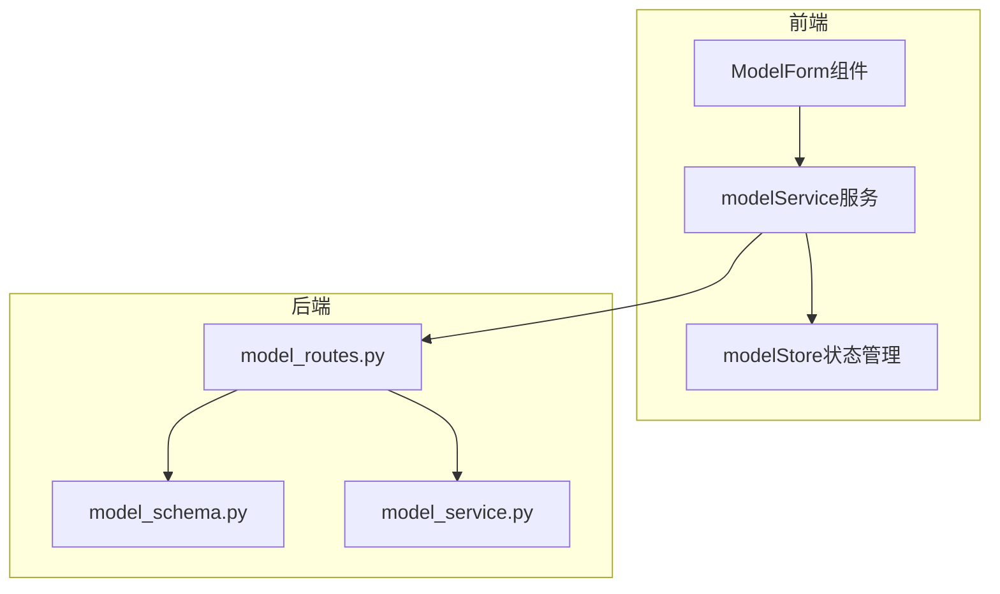
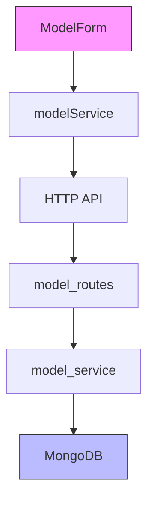
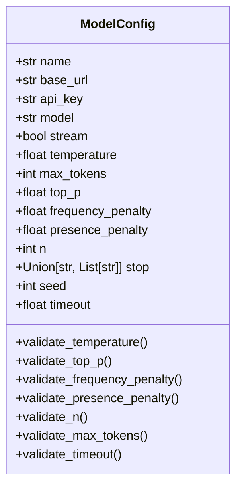
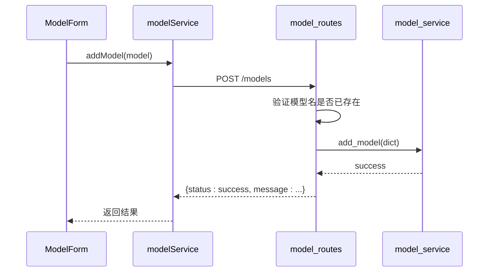
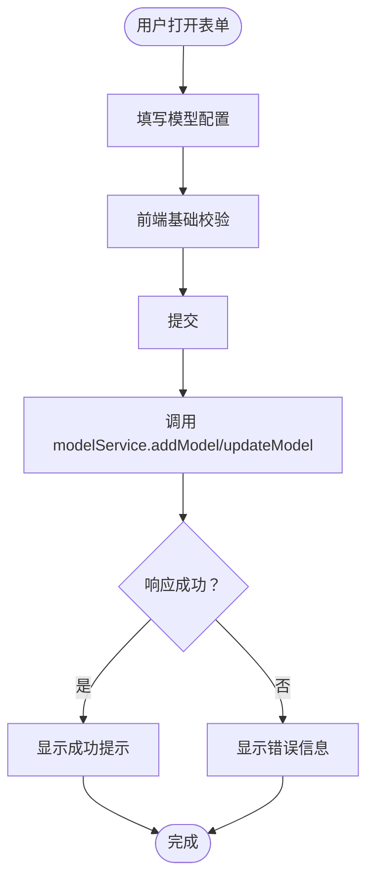
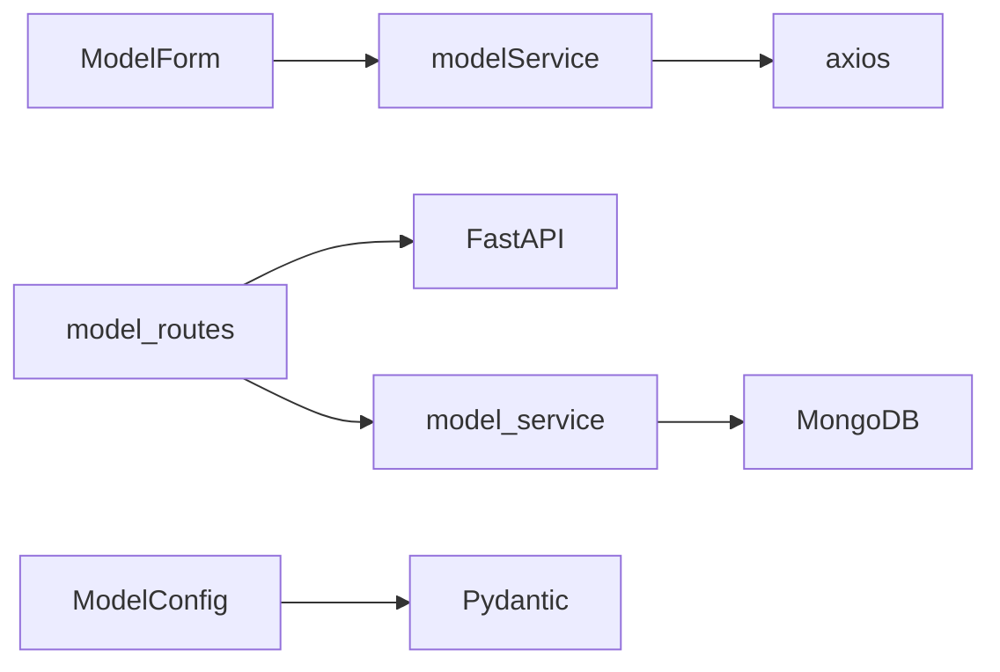

# 模型管理API

<cite>
**本文档引用的文件**  
- [model_routes.py](file://mag/app/api/model_routes.py)
- [model_schema.py](file://mag/app/models/model_schema.py)
- [modelService.ts](file://frontend/src/services/modelService.ts)
- [ModelForm.tsx](file://frontend/src/components/model-manager/ModelForm.tsx)
- [modelStore.ts](file://frontend/src/store/modelStore.ts)
</cite>

## 目录
1. [简介](#简介)
2. [项目结构](#项目结构)
3. [核心组件](#核心组件)
4. [架构概览](#架构概览)
5. [详细组件分析](#详细组件分析)
6. [依赖分析](#依赖分析)
7. [性能考虑](#性能考虑)
8. [故障排除指南](#故障排除指南)
9. [结论](#结论)

## 简介
本文档详细描述了模型管理API的功能与实现机制，涵盖模型的增删改查操作（CRUD），包括添加模型配置（`/models` POST）、获取模型列表（`/models` GET）、更新模型配置（`/models/{model_name}` PUT）和删除模型（`/models/{model_name}` DELETE）。同时说明了模型配置中支持的各项字段，如模型名称、基础URL、API密钥、上下文长度等参数，并阐述这些配置如何在图节点和聊天系统中被引用。文档还提供了请求体的JSON Schema定义、错误处理机制（如API密钥验证失败或模型名称冲突），并结合前端`ModelForm`组件说明配置表单与后端API之间的数据流。

## 项目结构
模型管理功能分布在前后端两个主要部分：
- 后端API位于 `mag/app/api/model_routes.py`
- 模型数据结构定义于 `mag/app/models/model_schema.py`
- 前端服务调用封装在 `frontend/src/services/modelService.ts`
- 前端表单组件为 `frontend/src/components/model-manager/ModelForm.tsx`
- 状态管理使用 `frontend/src/store/modelStore.ts`

该结构体现了典型的前后端分离架构，通过RESTful接口进行通信。



**图示来源**  
- [model_routes.py](file://mag/app/api/model_routes.py#L1-L152)
- [model_schema.py](file://mag/app/models/model_schema.py#L1-L88)
- [modelService.ts](file://frontend/src/services/modelService.ts#L1-L30)
- [ModelForm.tsx](file://frontend/src/components/model-manager/ModelForm.tsx)
- [modelStore.ts](file://frontend/src/store/modelStore.ts)

**本节来源**  
- [model_routes.py](file://mag/app/api/model_routes.py#L1-L152)
- [model_schema.py](file://mag/app/models/model_schema.py#L1-L88)
- [modelService.ts](file://frontend/src/services/modelService.ts#L1-L30)

## 核心组件

模型管理的核心功能由以下组件构成：
- **ModelConfig**：定义模型配置的数据结构，包含必填和可选参数。
- **model_routes.py**：提供REST API接口，处理增删改查请求。
- **modelService.ts**：前端对API的封装，供UI组件调用。
- **ModelForm.tsx**：用户输入界面，用于创建和编辑模型配置。
- **modelStore.ts**：全局状态管理，存储当前模型列表及选中模型。

这些组件协同工作，确保模型配置能够安全、高效地被管理与使用。

**本节来源**  
- [model_schema.py](file://mag/app/models/model_schema.py#L1-L88)
- [model_routes.py](file://mag/app/api/model_routes.py#L1-L152)
- [modelService.ts](file://frontend/src/services/modelService.ts#L1-L30)
- [ModelForm.tsx](file://frontend/src/components/model-manager/ModelForm.tsx)
- [modelStore.ts](file://frontend/src/store/modelStore.ts)

## 架构概览

系统采用分层架构设计，从前端UI到后端服务逐层解耦：



用户通过`ModelForm`提交配置 → `modelService`发起HTTP请求 → `model_routes`接收并解析 → `model_service`执行业务逻辑 → 数据持久化至MongoDB。

**图示来源**  
- [model_routes.py](file://mag/app/api/model_routes.py#L1-L152)
- [modelService.ts](file://frontend/src/services/modelService.ts#L1-L30)
- [model_schema.py](file://mag/app/models/model_schema.py#L1-L88)

## 详细组件分析

### 模型配置结构分析

`ModelConfig` 类基于 Pydantic 定义，支持 OpenAI 兼容的所有参数。

#### 支持字段说明

| 字段名 | 类型 | 是否必填 | 描述 |
|-------|------|----------|------|
| `name` | string | 是 | 模型唯一名称 |
| `base_url` | string | 是 | API基础URL（如 https://api.openai.com/v1） |
| `api_key` | string | 是 | 认证密钥 |
| `model` | string | 是 | 实际调用的模型标识（如 gpt-3.5-turbo） |
| `stream` | boolean | 否 | 是否启用流式响应 |
| `temperature` | float | 否 | 控制输出随机性（0.0~2.0） |
| `max_tokens` | int | 否 | 最大生成令牌数 |
| `top_p` | float | 否 | 核采样比例（0.0~1.0） |
| `frequency_penalty` | float | 否 | 频率惩罚（-2.0~2.0） |
| `presence_penalty` | float | 否 | 存在惩罚（-2.0~2.0） |
| `n` | int | 否 | 生成完成数量 |
| `stop` | string 或 string数组 | 否 | 停止序列 |
| `seed` | int | 否 | 随机种子 |
| `timeout` | float | 否 | 请求超时时间（秒） |

所有字段均带有验证器，防止非法值写入。



**图示来源**  
- [model_schema.py](file://mag/app/models/model_schema.py#L1-L88)

**本节来源**  
- [model_schema.py](file://mag/app/models/model_schema.py#L1-L88)

### API接口分析

#### 接口列表

| 方法 | 路径 | 功能 | 请求体 | 响应 |
|------|------|------|--------|-------|
| GET | `/models` | 获取所有模型（不含API密钥） | 无 | `List[Dict]` |
| GET | `/models/{model_name}` | 获取特定模型（用于编辑） | 无 | `{status: success, data: ModelConfig}` |
| POST | `/models` | 添加新模型 | `ModelConfig` | `{status: success, message: ...}` |
| PUT | `/models/{model_name}` | 更新模型 | `ModelConfig` | `{status: success, message: ...}` |
| DELETE | `/models/{model_name}` | 删除模型 | 无 | `{status: success, message: ...}` |

#### 请求流程（以添加模型为例）



**图示来源**  
- [model_routes.py](file://mag/app/api/model_routes.py#L1-L152)
- [modelService.ts](file://frontend/src/services/modelService.ts#L1-L30)

**本节来源**  
- [model_routes.py](file://mag/app/api/model_routes.py#L1-L152)
- [modelService.ts](file://frontend/src/services/modelService.ts#L1-L30)

### 前端表单与数据流分析

`ModelForm` 组件负责收集用户输入，并通过 `modelService` 与后端交互。

#### 数据流图



表单支持创建和编辑两种模式，通过 `modelName` 是否存在判断操作类型。

**图示来源**  
- [ModelForm.tsx](file://frontend/src/components/model-manager/ModelForm.tsx)
- [modelService.ts](file://frontend/src/services/modelService.ts#L1-L30)

**本节来源**  
- [ModelForm.tsx](file://frontend/src/components/model-manager/ModelForm.tsx)
- [modelService.ts](file://frontend/src/services/modelService.ts#L1-L30)

## 依赖分析

模型管理模块依赖以下内部和外部组件：



- **前端依赖**：React组件、Axios（通过api.ts封装）
- **后端依赖**：FastAPI框架、Pydantic数据验证、MongoDB持久化
- **交叉依赖**：`model_schema.py` 被前后端共同参考（结构一致性）

**图示来源**  
- [model_routes.py](file://mag/app/api/model_routes.py#L1-L152)
- [model_schema.py](file://mag/app/models/model_schema.py#L1-L88)
- [modelService.ts](file://frontend/src/services/modelService.ts#L1-L30)

**本节来源**  
- [model_routes.py](file://mag/app/api/model_routes.py#L1-L152)
- [model_schema.py](file://mag/app/models/model_schema.py#L1-L88)
- [modelService.ts](file://frontend/src/services/modelService.ts#L1-L30)

## 性能考虑

- 所有模型配置缓存在内存中，避免频繁数据库查询。
- API密钥不返回给前端列表接口（`/models`），仅在编辑时通过 `/models/{model_name}` 返回，提升安全性。
- 使用Pydantic进行请求体验证，确保数据合法性，减少无效请求处理开销。
- 路径参数使用 `:path` 类型以支持包含斜杠的模型名称，并进行URL解码。

## 故障排除指南

常见错误及其处理方式：

| 错误码 | 场景 | 原因 | 解决方案 |
|--------|------|------|---------|
| 400 Bad Request | 添加/更新模型 | 模型名称已存在 | 更换模型名称 |
| 404 Not Found | 获取/更新/删除模型 | 模型不存在 | 检查模型名称是否正确 |
| 500 Internal Server Error | 任意操作 | 服务端异常（如数据库连接失败） | 查看日志 `logger.error` 输出 |
| 422 Unprocessable Entity | 提交表单 | 参数格式错误（如temperature超出范围） | 检查字段验证规则 |

前端应捕获HTTP异常并友好提示用户，例如：

```ts
try {
  await addModel(model);
  showNotification("模型添加成功");
} catch (error) {
  showError("操作失败：" + error.response?.data?.detail);
}
```

**本节来源**  
- [model_routes.py](file://mag/app/api/model_routes.py#L1-L152)
- [modelService.ts](file://frontend/src/services/modelService.ts#L1-L30)

## 结论

模型管理API设计清晰、职责分明，支持完整的CRUD操作，并具备良好的数据验证与错误处理机制。前后端通过标准化接口协作，`ModelForm`组件提供了直观的用户交互体验。建议在后续开发中增加模型测试功能（如“连接测试”按钮），进一步提升可用性。