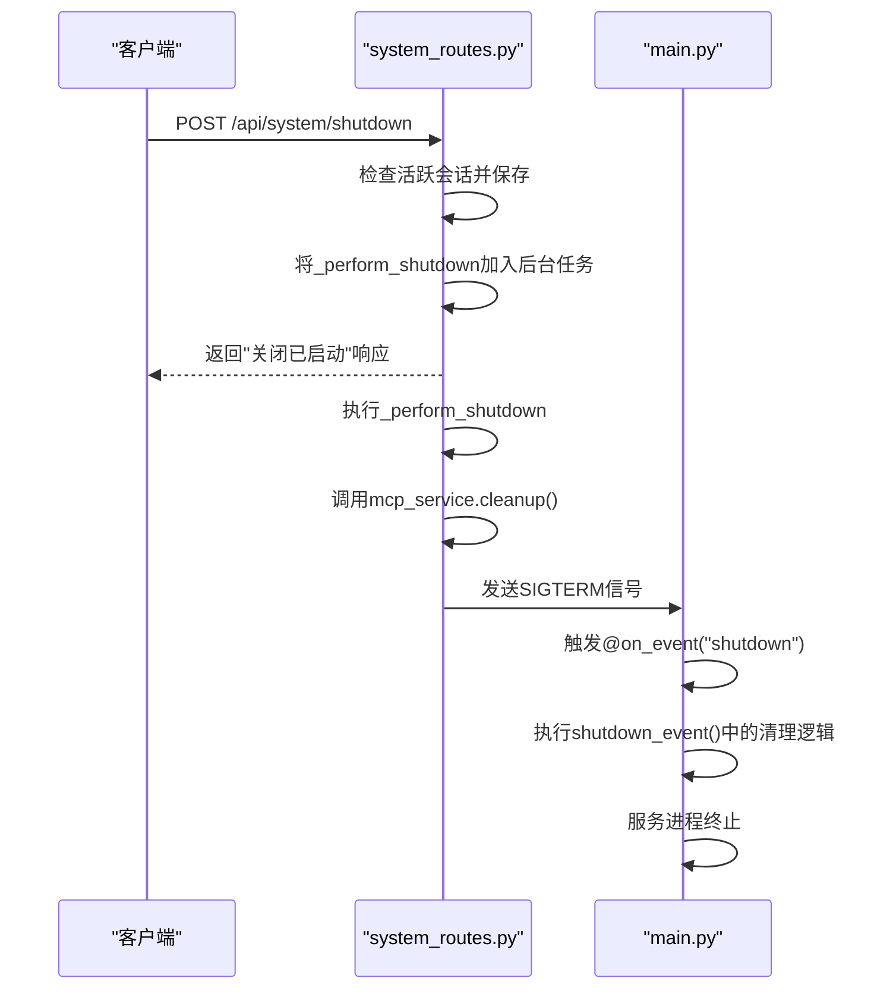

# 系统控制API

<cite>
**本文档中引用的文件**  
- [main.py](file://mag/main.py)
- [system_routes.py](file://mag/app/api/system_routes.py)
- [systemService.ts](file://frontend/src/services/systemService.ts)
- [api.ts](file://frontend/src/services/api.ts)
</cite>

## 目录
1. [简介](#简介)
2. [系统关闭API](#系统关闭api)
3. [系统状态查询API](#系统状态查询api)
4. [安全建议与使用场景](#安全建议与使用场景)
5. [系统生命周期事件](#系统生命周期事件)
6. [前端调用示例](#前端调用示例)

## 简介
本文档详细描述MAG（MCP Agent Graph）系统的控制类API，重点介绍用于终止服务的`/system/shutdown`端点及其相关机制。同时涵盖用于健康检查的`/health`端点。文档说明了API的调用方式、认证要求、执行流程以及与应用生命周期事件的集成，为系统管理员和开发者提供安全操作指导。

## 系统关闭API

`/system/shutdown` 是一个敏感的POST端点，用于优雅地关闭MAG后端服务。该操作会触发一系列清理流程，确保数据不丢失并安全终止所有子服务。

### HTTP方法
- **方法**: `POST`
- **路径**: `/api/system/shutdown`

### 认证与权限
当前代码实现中，该端点**未显式要求认证或管理员权限**。任何能够访问该端点的客户端均可触发关闭流程。这表明系统设计上可能依赖于网络层（如防火墙）来保护此敏感接口。

### 请求与响应
- **请求体**: 无
- **成功响应 (200 OK)**:
  ```json
  {
    "status": "success",
    "message": "服务关闭过程已启动",
    "active_sessions": 0
  }
  ```
  响应中的 `active_sessions` 字段表示在关闭前检测到的活跃会话数量。

- **错误响应 (500 Internal Server Error)**:
  如果启动关闭流程时发生内部错误，将返回500状态码及错误详情。

### 执行后的系统行为
1.  **会话保存**: 系统首先检查 `graph_service` 中是否存在活跃的会话（`active_conversations`）。如果存在，它会遍历这些会话并调用 `update_conversation_file` 方法，将当前会话状态持久化到文件系统中，防止数据丢失。
2.  **异步关闭**: 实际的关闭操作 `_perform_shutdown` 被添加到 `BackgroundTasks` 中执行。这使得API可以立即向客户端返回响应，告知关闭流程已启动，而不会因长时间的清理操作而超时。
3.  **服务清理**: 在 `_perform_shutdown` 函数中，系统会：
    - 通知MCP客户端即将关闭（`notify_client_shutdown`）。
    - 调用 `mcp_service.cleanup()` 方法来终止所有MCP服务器进程并释放相关资源。
4.  **进程终止**: 清理完成后，系统通过 `os.kill(os.getpid(), signal.SIGTERM)` 向自身的主进程发送 `SIGTERM` 信号，触发FastAPI的 `shutdown` 事件，最终导致服务进程退出。

**Section sources**
- [system_routes.py](file://mag/app/api/system_routes.py#L0-L62)
- [main.py](file://mag/main.py#L100-L119)

## 系统状态查询API

除了关闭端点，系统还提供了用于监控和诊断的查询接口。

### 健康检查 (`/health`)
- **HTTP方法**: `GET`
- **路径**: `/api/health`
- **功能**: 返回一个简单的JSON响应，表明服务当前处于健康状态。它包含应用名称和版本号，可用于负载均衡器或监控工具进行存活探针（liveness probe）和就绪探针（readiness probe）。
- **响应示例**:
  ```json
  {
    "status": "healthy",
    "app_name": "MAG",
    "version": "2.0.0"
  }
  ```

**Section sources**
- [main.py](file://mag/main.py#L111-L116)

## 安全建议与使用场景

### 安全建议
由于 `/system/shutdown` 是一个高危操作，尽管当前实现未内置认证，但强烈建议采取以下措施：
1.  **网络隔离**: 将MAG服务部署在受保护的网络中，仅允许来自可信管理网络或特定IP地址的请求访问 `/system/shutdown` 端点。
2.  **反向代理认证**: 在Nginx或Apache等反向代理层添加HTTP基本认证或API密钥验证，为该端点增加访问控制。
3.  **环境限制**: 仅在开发或测试环境中开放此端点，在生产环境中应禁用或严格保护。
4.  **操作审计**: 记录所有对 `/system/shutdown` 的调用，以便进行安全审计。

### 使用场景示例
- **自动化部署流水线**: 在CI/CD流程中，部署新版本前，脚本可以调用此API来安全地停止旧的MAG服务实例。
- **资源维护**: 当需要对服务器进行重启、升级或维护时，管理员可以使用此API确保应用优雅关闭。
- **开发调试**: 开发者在本地测试时，可以通过调用此API快速重启服务，而无需手动终止进程。

## 系统生命周期事件

MAG应用的生命周期由FastAPI的事件处理器管理，`/system/shutdown` API的执行流程与这些事件紧密集成，确保了资源清理的完整性。



**Diagram sources**
- [system_routes.py](file://mag/app/api/system_routes.py#L0-L62)
- [main.py](file://mag/main.py#L100-L119)

### 启动事件 (`@on_event("startup")`)
当应用启动时，`startup_event` 函数会被调用。它负责初始化所有核心服务，包括文件系统、模型服务、图服务、MCP服务和MongoDB服务。这确保了应用在接收请求前，所有依赖项都已准备就绪。

### 关闭事件 (`@on_event("shutdown")`)
当主进程收到 `SIGTERM` 信号（由 `/system/shutdown` API触发）后，`shutdown_event` 函数会被调用。其主要职责是：
- 记录关闭日志。
- 调用 `mcp_service.cleanup()` 进行最终的资源清理。
- 确保所有MCP子进程被正确终止。

这与 `/system/shutdown` API中的清理形成了双重保障：API先进行应用层的会话保存和MCP服务通知，而 `shutdown` 事件则作为最后的防线，确保即使在异常情况下，关键的清理工作也能被执行。

**Section sources**
- [main.py](file://mag/main.py#L74-L108)

## 前端调用示例

前端应用通过 `systemService.ts` 中的 `shutdownSystem` 函数来调用此API。该函数使用 `axios` 库向 `/api/system/shutdown` 发起POST请求。

```typescript
// src/services/systemService.ts
export const shutdownSystem = async (): Promise<any> => {
  try {
    const response = await api.post('/system/shutdown');
    return response.data;
  } catch (error) {
    console.error('Error shutting down system:', error);
    throw error;
  }
};
```

此调用依赖于 `api.ts` 中配置的 `API_BASE_URL`（默认为 `http://localhost:9999/api`）。这表明前端与后端在同一主机上运行，或通过代理进行通信。

**Section sources**
- [systemService.ts](file://frontend/src/services/systemService.ts#L0-L11)
- [api.ts](file://frontend/src/services/api.ts#L0-L13)