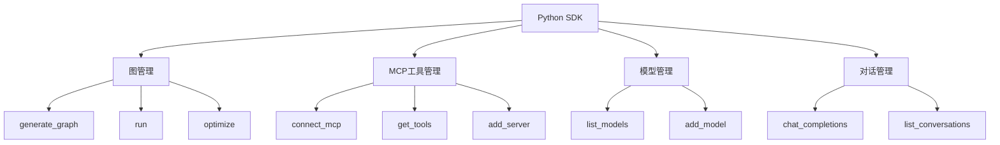

# SDK使用指南

<cite>
**本文档中引用的文件**  
- [app.ipynb](file://sdk_demo/app.ipynb)
- [__init__.py](file://mag/__init__.py)
- [graph.py](file://mag/client/graph.py)
- [mcp.py](file://mag/client/mcp.py)
- [model.py](file://mag/client/model.py)
- [conversation.py](file://mag/client/conversation.py)
- [main.py](file://mag/main.py)
- [mcp_client.py](file://mag/mcp_client.py)
- [pyproject.toml](file://pyproject.toml)
</cite>

## 目录
1. [简介](#简介)
2. [安装与认证](#安装与认证)
3. [核心功能概览](#核心功能概览)
4. [图管理](#图管理)
5. [MCP工具管理](#mcp工具管理)
6. [模型管理](#模型管理)
7. [对话管理](#对话管理)
8. [自动化工作流示例](#自动化工作流示例)
9. [底层API封装说明](#底层api封装说明)

## 简介

本指南旨在帮助开发者通过Python SDK与`mcp-agent-graph-p`系统进行交互。该SDK提供了一套简洁的接口，用于创建和管理工作流图、调用MCP（Model Control Protocol）工具、发送聊天消息以及构建自动化AI代理工作流。通过本指南，您将学习如何使用SDK的核心功能，并基于Jupyter Notebook中的示例（`app.ipynb`）快速上手。

系统架构分为两个主要服务：
- **MAG服务器**：由`main.py`启动，提供REST API接口。
- **MCP客户端**：由`mcp_client.py`启动，负责与外部MCP工具通信。

SDK通过封装这些服务的HTTP调用，为开发者提供同步、易用的Python接口。

**文档来源**
- [__init__.py](file://mag/__init__.py#L1-L248)
- [main.py](file://mag/main.py#L1-L120)
- [mcp_client.py](file://mag/mcp_client.py#L1-L835)

## 安装与认证

### 安装SDK

该SDK已打包为Python包，可通过pip安装：

```bash
pip install --upgrade mcp-agent-graph
```

项目依赖在`pyproject.toml`中定义，包括FastAPI、Requests、MCP SDK等核心库。安装后，即可在Python环境中导入`mag`模块。

### 初始化与服务启动

使用SDK前，必须先启动底层服务。SDK提供了便捷的启动和关闭方法：

```python
import mag

# 启动MAG服务器和MCP客户端
mag.start()

# 检查服务状态
is_running = mag.is_running()
print(f"服务运行状态: {is_running}")

# 关闭服务
mag.shutdown()
```

`mag.start()`方法会自动启动`main.py`和`mcp_client.py`两个后台进程，并将日志输出到临时目录（如`C:\Users\...\AppData\Local\Temp\mag_sdk_logs\`）。这是使用SDK的必要前置步骤。

**文档来源**
- [__init__.py](file://mag/__init__.py#L1-L248)
- [pyproject.toml](file://pyproject.toml#L1-L64)

## 核心功能概览

SDK的核心功能模块化地封装在`mag/client/`目录下，主要包括：

- **图管理** (`graph.py`)：创建、运行、优化工作流图。
- **MCP工具管理** (`mcp.py`)：连接、配置和调用外部工具。
- **模型管理** (`model.py`)：管理AI模型的配置。
- **对话管理** (`conversation.py`)：处理聊天会话和消息。

所有功能均可通过`import mag`后直接调用，例如`mag.list_graphs()`或`mag.run()`。



**图表来源**
- [__init__.py](file://mag/__init__.py#L1-L248)
- [graph.py](file://mag/client/graph.py#L1-L490)
- [mcp.py](file://mag/client/mcp.py#L1-L285)
- [model.py](file://mag/client/model.py#L1-L117)
- [conversation.py](file://mag/client/conversation.py#L1-L253)

## 图管理

图（Graph）是系统中的核心工作流单元，代表一个由多个节点（如AI模型、MCP工具）组成的自动化流程。

### 创建与导入图

可以通过AI生成或从文件导入的方式创建图。

- **AI生成图**：使用自然语言描述需求，由AI自动生成图配置。
  ```python
  result = mag.generate_graph(
      requirement="创建一个能够搜索网络信息并生成报告的工作流",
      model_name="deepseek-chat"
  )
  ```

- **导入图**：从JSON或ZIP文件导入现有配置。
  ```python
  graph = mag.import_graph("deepsearch.json")
  ```

### 运行与控制图

运行图是执行工作流的核心操作。

- **运行图**：
  ```python
  result = mag.run("search", input_text="您的查询", parallel=True)
  ```

- **断点续传**：支持从会话中断点继续执行，或使用新输入重新开始。
  ```python
  # 从断点继续
  mag.continue_run(conversation_id, continue_from_checkpoint=True)
  # 使用新输入继续
  mag.continue_run(conversation_id, input_text="新输入", parallel=False)
  ```

### 优化与导出

- **优化图**：根据需求描述，利用AI对现有图进行性能或结构优化。
  ```python
  result = mag.optimize(
      graph_name="web_research_report_v2",
      optimization_requirement="优化性能，改进提示词质量",
      model_name="deepseek-chat"
  )
  ```

- **导出为脚本**：将图导出为可独立运行的Python脚本（并行或顺序执行）。
  ```python
  mcp = mag.generate_mcp_script("news_processing_workflow")
  ```

**文档来源**
- [graph.py](file://mag/client/graph.py#L1-L490)
- [app.ipynb](file://sdk_demo/app.ipynb#L1-L890)

## MCP工具管理

MCP工具是系统可调用的外部能力，如网络搜索、记忆存储等。

### 配置与连接

- **添加服务器**：通过JSON配置添加新的MCP服务器。
  ```python
  servers = {
    "mcpServers": {
      "fetch": {
        "command": "uvx",
        "args": ["mcp-server-fetch"],
        "transportType": "stdio"
      }
    }
  }
  mag.add_server(servers=servers)
  ```

- **连接服务器**：连接单个或所有已配置的服务器。
  ```python
  mag.connect_mcp("tavily-mcp")  # 连接单个
  mag.connect_mcp("all")         # 连接所有
  ```

### 查询与调用

- **获取工具列表**：查看已连接服务器提供的所有工具。
  ```python
  tools = mag.get_tools()
  ```

- **获取MCP状态**：检查各服务器的连接状态和可用工具。
  ```python
  status = mag.get_mcp_status()
  ```

**文档来源**
- [mcp.py](file://mag/client/mcp.py#L1-L285)
- [app.ipynb](file://sdk_demo/app.ipynb#L1-L890)
- [mcp_client.py](file://mag/mcp_client.py#L1-L835)

## 模型管理

管理与系统交互的AI模型配置。

### 增删改查操作

- **新增模型**：
  ```python
  new_model = {
      "name": "deepseek-chat",
      "base_url": "https://api.deepseek.com",
      "api_key": "",
      "model": "deepseek-chat"
  }
  mag.add_model(new_model)
  ```

- **列出模型**：
  ```python
  models = mag.list_models()
  ```

- **更新与删除**：
  ```python
  mag.update_model("deepseek-chat", updated_model)
  mag.delete_model("deepseek-chat")
  ```

所有模型配置最终通过HTTP请求发送到`/api/models`端点进行持久化。

**文档来源**
- [model.py](file://mag/client/model.py#L1-L117)
- [app.ipynb](file://sdk_demo/app.ipynb#L1-L890)

## 对话管理

处理与AI的聊天会话，支持流式和非流式响应。

### 会话操作

- **发送消息**：
  ```python
  response = mag.chat_completions(
      user_prompt="你好",
      model="deepseek-chat",
      mcp=["fetch"]  # 可选，指定可用的MCP工具
  )
  ```

- **流式响应**：适用于实时显示AI输出。
  ```python
  for chunk in mag.chat_completions_stream(user_prompt="...", model="..."):
      print(chunk)
  ```

- **会话管理**：列出、获取、更新或删除会话。
  ```python
  conversations = mag.list_conversations()
  detail = mag.get_conversation_detail("conv_123")
  ```

**文档来源**
- [conversation.py](file://mag/client/conversation.py#L1-L253)
- [app.ipynb](file://sdk_demo/app.ipynb#L1-L890)

## 自动化工作流示例

以下是一个完整的自动化工作流构建示例，从零开始：

```python
import mag
import json

# 1. 启动服务
mag.start()

# 2. 添加并连接MCP工具（如网络搜索）
servers = {"mcpServers": {"fetch": {"command": "uvx", "args": ["mcp-server-fetch"], "transportType": "stdio"}}}
mag.add_server(servers)
mag.connect_mcp("fetch")

# 3. 确保有可用模型
models = mag.list_models()
if not models:
    print("请先配置模型")

# 4. AI生成工作流图
result = mag.generate_graph(
    requirement="创建一个能搜索网络并总结信息的自动化工作流",
    model_name=models[0]["name"]
)

if result["status"] == "success":
    graph_name = result["graph_name"]
    print(f"成功生成图: {graph_name}")

    # 5. 运行工作流
    run_result = mag.run(
        name=graph_name,
        input_text="搜索关于量子计算的最新进展",
        parallel=True
    )
    print(f"执行结果: {run_result.get('output')}")
else:
    print(f"生成失败: {result['message']}")

# 6. 清理
mag.shutdown()
```

**文档来源**
- [app.ipynb](file://sdk_demo/app.ipynb#L1-L890)

## 底层API封装说明

SDK模块（如`graph.py`, `mcp.py`）通过`requests`库封装了对MAG服务器REST API的调用。

### 封装模式

以`graph.py`为例，其`list()`函数封装了对`GET /api/graphs`的调用：

```python
def list() -> List[str]:
    _ensure_server_running() # 确保服务已启动
    response = requests.get(f"{API_BASE}/graphs") # 封装HTTP请求
    response.raise_for_status()
    return response.json() # 返回结构化数据
```

所有模块均遵循此模式：
1. 确保服务运行 (`_ensure_server_running`)。
2. 构造HTTP请求（URL、方法、载荷）。
3. 处理响应，返回Python对象。

### API端点映射

| SDK方法 | HTTP方法 | API端点 |
| :--- | :--- | :--- |
| `list_graphs()` | GET | `/api/graphs` |
| `run()` | POST | `/api/graphs/execute` |
| `get_mcp_status()` | GET | `/api/mcp/status` |
| `add_model()` | POST | `/api/models` |

这种封装使得开发者无需关心底层通信细节，即可高效地与系统交互。

**文档来源**
- [graph.py](file://mag/client/graph.py#L1-L490)
- [mcp.py](file://mag/client/mcp.py#L1-L285)
- [model.py](file://mag/client/model.py#L1-L117)
- [conversation.py](file://mag/client/conversation.py#L1-L253)
- [main.py](file://mag/main.py#L1-L120)