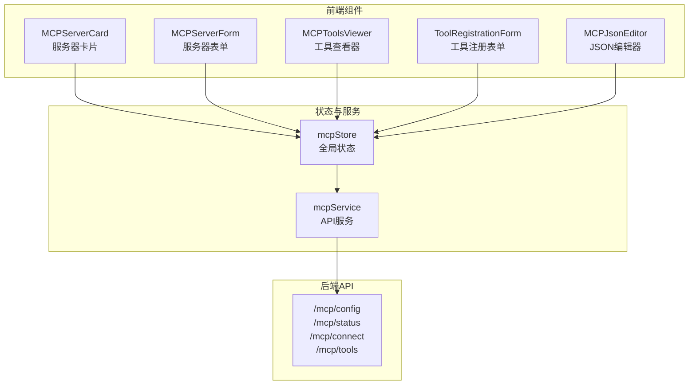
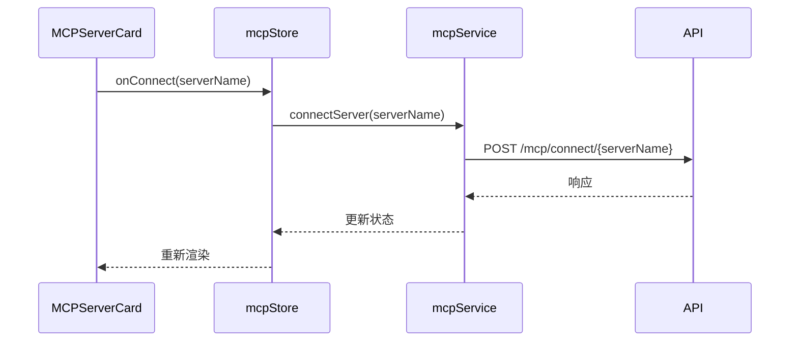
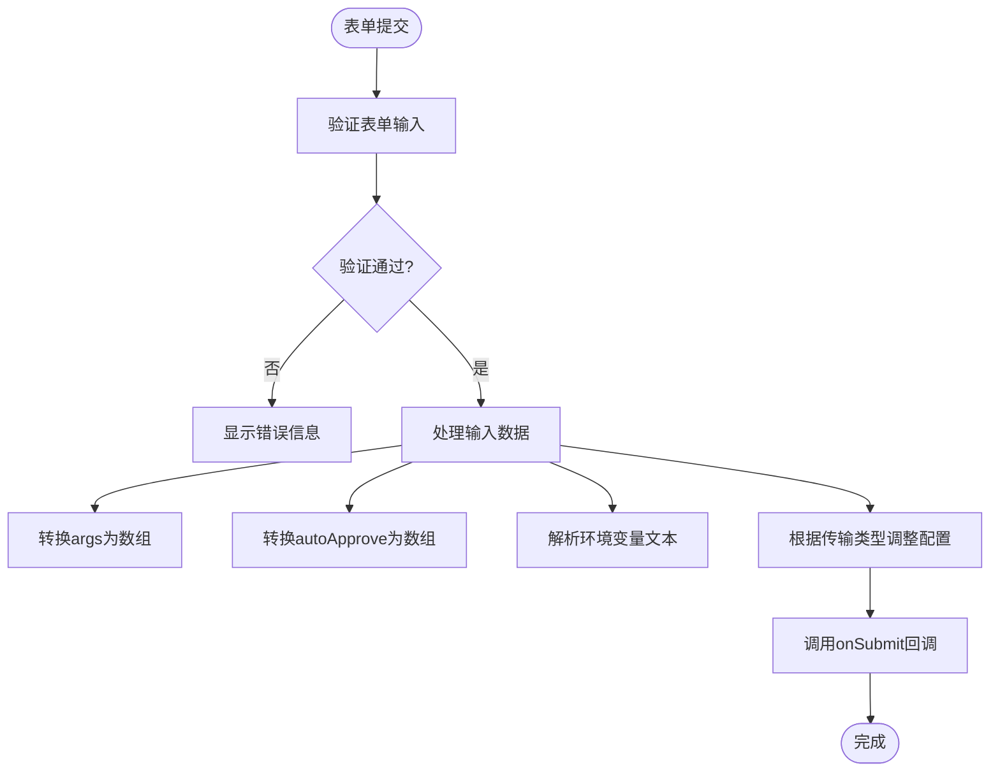
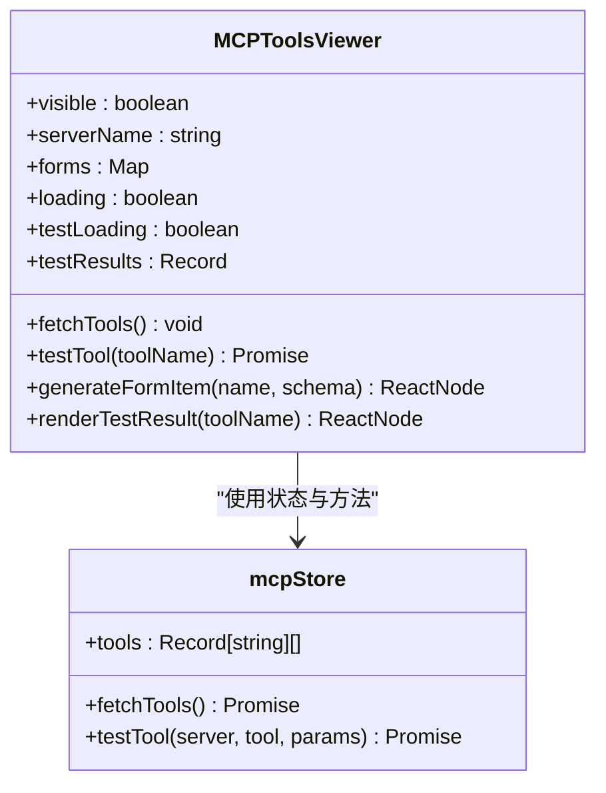
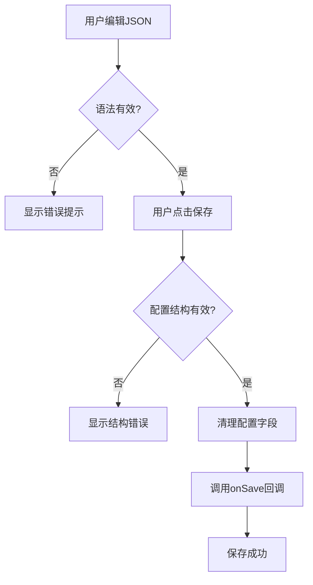
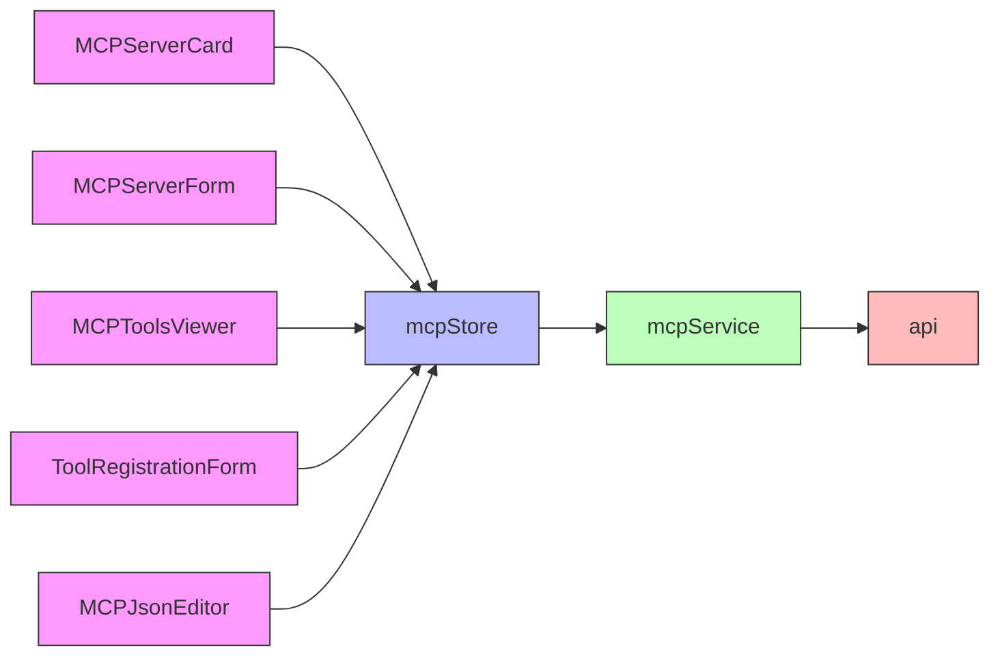

# MCP管理组件

<cite>
**本文档引用的文件**  
- [MCPServerCard.tsx](file://frontend/src/components/mcp-manager/MCPServerCard.tsx)
- [MCPServerForm.tsx](file://frontend/src/components/mcp-manager/MCPServerForm.tsx)
- [MCPToolsViewer.tsx](file://frontend/src/components/mcp-manager/MCPToolsViewer.tsx)
- [ToolRegistrationForm.tsx](file://frontend/src/components/mcp-manager/ToolRegistrationForm.tsx)
- [MCPJsonEditor.tsx](file://frontend/src/components/mcp-manager/MCPJsonEditor.tsx)
- [mcpStore.ts](file://frontend/src/store/mcpStore.ts)
- [mcpService.ts](file://frontend/src/services/mcpService.ts)
- [mcp.ts](file://frontend/src/types/mcp.ts)
</cite>

## 目录
1. [简介](#简介)
2. [项目结构](#项目结构)
3. [核心组件](#核心组件)
4. [架构概览](#架构概览)
5. [详细组件分析](#详细组件分析)
6. [依赖分析](#依赖分析)
7. [性能考虑](#性能考虑)
8. [故障排除指南](#故障排除指南)
9. [结论](#结论)

## 简介
本文档深入解析MCP前端管理界面的核心组件，涵盖服务器管理、工具注册、状态监控与配置编辑功能。重点分析MCPServerCard、MCPServerForm、MCPToolsViewer、ToolRegistrationForm和MCPJsonEditor五大组件的实现机制、状态同步逻辑与用户交互流程，为开发者提供完整的组件使用与扩展指南。

## 项目结构
MCP管理功能集中于`frontend/src/components/mcp-manager`目录，通过`mcpStore`统一管理状态，并与后端`/mcp`系列API进行交互。整体结构遵循React组件化设计原则，结合Ant Design UI库实现现代化界面。



**图示来源**  
- [MCPServerCard.tsx](file://frontend/src/components/mcp-manager/MCPServerCard.tsx#L1-L237)
- [mcpStore.ts](file://frontend/src/store/mcpStore.ts#L1-L221)
- [mcpService.ts](file://frontend/src/services/mcpService.ts#L1-L67)

## 核心组件
MCP管理界面由五个核心组件构成，分别负责服务器展示、配置编辑、工具测试、工具注册和高级JSON配置。所有组件通过`useMCPStore`共享状态，确保数据一致性。

**组件来源**  
- [MCPServerCard.tsx](file://frontend/src/components/mcp-manager/MCPServerCard.tsx#L1-L237)
- [MCPServerForm.tsx](file://frontend/src/components/mcp-manager/MCPServerForm.tsx#L1-L225)
- [MCPToolsViewer.tsx](file://frontend/src/components/mcp-manager/MCPToolsViewer.tsx#L1-L343)

## 架构概览
系统采用分层架构，UI组件层、状态管理层、服务层与后端API层职责分明。状态通过Zustand集中管理，支持组件间高效通信与状态同步。

```mermaid
graph TD
A[UI组件] --> B[状态管理]
B --> C[服务层]
C --> D[后端API]
D --> E[MCP服务器]
A --> |用户操作| B
B --> |状态变更| A
C --> |HTTP请求| D
D --> |SSE流| B
subgraph "UI组件"
A1[MCPServerCard]
A2[MCPServerForm]
A3[MCPToolsViewer]
A4[ToolRegistrationForm]
A5[MCPJsonEditor]
end
subgraph "状态管理"
B1[mcpStore]
end
subgraph "服务层"
C1[mcpService]
end
subgraph "后端API"
C1 --> D1[/mcp/config]
C1 --> D2[/mcp/status]
C1 --> D3[/mcp/connect]
C1 --> D4[/mcp/tools]
C1 --> D5[/mcp/register-tool]
end
```

**图示来源**  
- [mcpStore.ts](file://frontend/src/store/mcpStore.ts#L1-L221)
- [mcpService.ts](file://frontend/src/services/mcpService.ts#L1-L67)

## 详细组件分析

### MCPServerCard 组件分析
`MCPServerCard`组件用于展示单个MCP服务器的详细信息，包括连接状态、传输类型、环境变量和可用工具。

#### 属性接口定义
```typescript
interface MCPServerCardProps {
  serverName: string;
  config: MCPServerConfig;
  status?: {
    connected: boolean;
    init_attempted: boolean;
    tools: string[];
    error?: string;
    transport_type?: string;
  };
  onConnect: (serverName: string) => void;
  onDisconnect?: (serverName: string) => void;
  onEdit: (serverName: string) => void;
  onDelete: (serverName: string) => void;
  onViewTools: (serverName: string) => void;
  loading: boolean;
}
```

#### 状态同步机制
组件通过`mcpStore`获取服务器配置与状态，状态变更通过`onConnect`、`onDisconnect`等回调触发store更新。



**图示来源**  
- [MCPServerCard.tsx](file://frontend/src/components/mcp-manager/MCPServerCard.tsx#L1-L237)
- [mcpStore.ts](file://frontend/src/store/mcpStore.ts#L1-L221)

**组件来源**  
- [MCPServerCard.tsx](file://frontend/src/components/mcp-manager/MCPServerCard.tsx#L1-L237)

### MCPServerForm 组件分析
`MCPServerForm`提供服务器配置的表单输入界面，支持多种传输类型和参数配置。

#### 表单验证逻辑
组件使用Ant Design Form进行输入验证，包括：
- 服务器名称必填
- 超时时间范围（1-300秒）
- 传输类型选择
- 环境变量格式（KEY=VALUE，每行一个）

#### 配置提交流程


**图示来源**  
- [MCPServerForm.tsx](file://frontend/src/components/mcp-manager/MCPServerForm.tsx#L1-L225)
- [mcpStore.ts](file://frontend/src/store/mcpStore.ts#L1-L221)

**组件来源**  
- [MCPServerForm.tsx](file://frontend/src/components/mcp-manager/MCPServerForm.tsx#L1-L225)

### MCPToolsViewer 组件分析
`MCPToolsViewer`提供工具列表渲染与调用测试功能，支持动态表单生成与结果展示。

#### 工具列表渲染
组件根据`mcpStore`中的`tools`状态渲染工具列表，每个工具以Tab页形式展示。

#### JSON Schema 表单生成
基于工具的`input_schema`动态生成测试表单，支持多种数据类型：
- 字符串：普通输入框或URL验证
- 数字：数字输入框（支持范围）
- 布尔值：开关控件
- 数组：多行文本输入
- 对象：JSON文本输入



**图示来源**  
- [MCPToolsViewer.tsx](file://frontend/src/components/mcp-manager/MCPToolsViewer.tsx#L1-L343)
- [mcpStore.ts](file://frontend/src/store/mcpStore.ts#L1-L221)

**组件来源**  
- [MCPToolsViewer.tsx](file://frontend/src/components/mcp-manager/MCPToolsViewer.tsx#L1-L343)

### ToolRegistrationForm 组件分析
`ToolRegistrationForm`实现MCP工具的手动注册功能，支持脚本上传与端口配置。

#### 表单结构
- 工具文件夹名称：小写字母、数字、下划线
- 端口号：8001-9099范围内，避免冲突
- 主脚本文件名与内容
- 依赖包列表
- README说明

#### JSON Schema 校验
组件内置字段校验规则：
- `folderName`：正则`/^[a-z0-9_]+$/`
- `port`：数值范围8001-9099
- `mainScript`：必填

**组件来源**  
- [ToolRegistrationForm.tsx](file://frontend/src/components/mcp-manager/ToolRegistrationForm.tsx#L1-L161)

### MCPJsonEditor 组件分析
`MCPJsonEditor`集成Monaco编辑器，提供高级JSON配置编辑功能。

#### 编辑器集成
- 使用`@monaco-editor/react`包装器
- 语法高亮与错误提示
- 自动格式化（formatOnPaste）
- 折叠代码块（folding）

#### 错误处理策略
- JSON解析错误：实时提示
- 配置结构验证：保存时检查`mcpServers`结构
- 字段清理：移除无效字段，确保配置纯净



**图示来源**  
- [MCPJsonEditor.tsx](file://frontend/src/components/mcp-manager/MCPJsonEditor.tsx#L1-L246)
- [mcpStore.ts](file://frontend/src/store/mcpStore.ts#L1-L221)

**组件来源**  
- [MCPJsonEditor.tsx](file://frontend/src/components/mcp-manager/MCPJsonEditor.tsx#L1-L246)

## 依赖分析
各组件依赖关系清晰，通过`mcpStore`实现状态共享，避免直接组件间耦合。



**图示来源**  
- [mcpStore.ts](file://frontend/src/store/mcpStore.ts#L1-L221)
- [mcpService.ts](file://frontend/src/services/mcpService.ts#L1-L67)

## 性能考虑
- **状态管理**：使用Zustand实现细粒度订阅，避免不必要的重渲染
- **表单处理**：`Form.useWatch`优化表单联动性能
- **编辑器**：Monaco编辑器按需加载，减少初始包体积
- **API调用**：合理使用`fetchStatus`轮询，避免频繁请求

## 故障排除指南
常见问题及解决方案：

| 问题现象 | 可能原因 | 解决方案 |
|--------|--------|--------|
| 服务器连接失败 | URL错误或服务未启动 | 检查SSE/HTTP地址，确认服务运行 |
| 工具列表为空 | 未成功连接服务器 | 先连接服务器，再获取工具列表 |
| JSON保存失败 | 配置结构无效 | 检查`mcpServers`对象结构 |
| 端口冲突 | 端口号已被占用 | 使用`getUsedPorts`检查可用端口 |

**组件来源**  
- [mcpStore.ts](file://frontend/src/store/mcpStore.ts#L1-L221)
- [mcpService.ts](file://frontend/src/services/mcpService.ts#L1-L67)

## 结论
MCP管理组件通过模块化设计实现了完整的服务器与工具管理功能。各组件职责分明，通过统一的状态管理实现高效协作。建议开发者优先使用`MCPServerForm`进行配置，高级用户可使用`MCPJsonEditor`进行批量操作。未来可扩展SSE状态实时更新功能，提升用户体验。