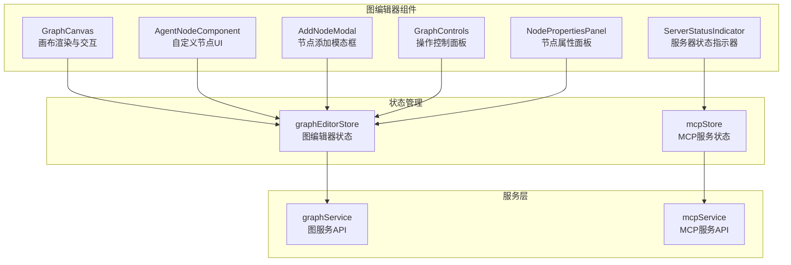
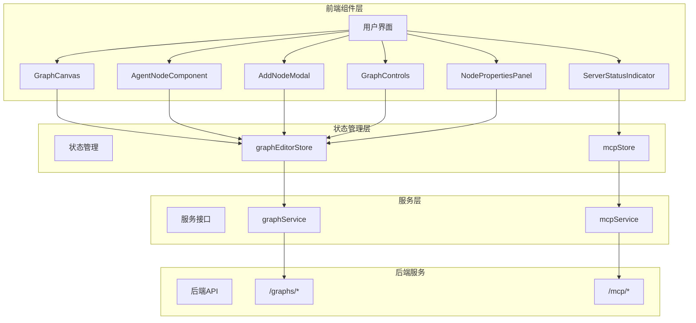
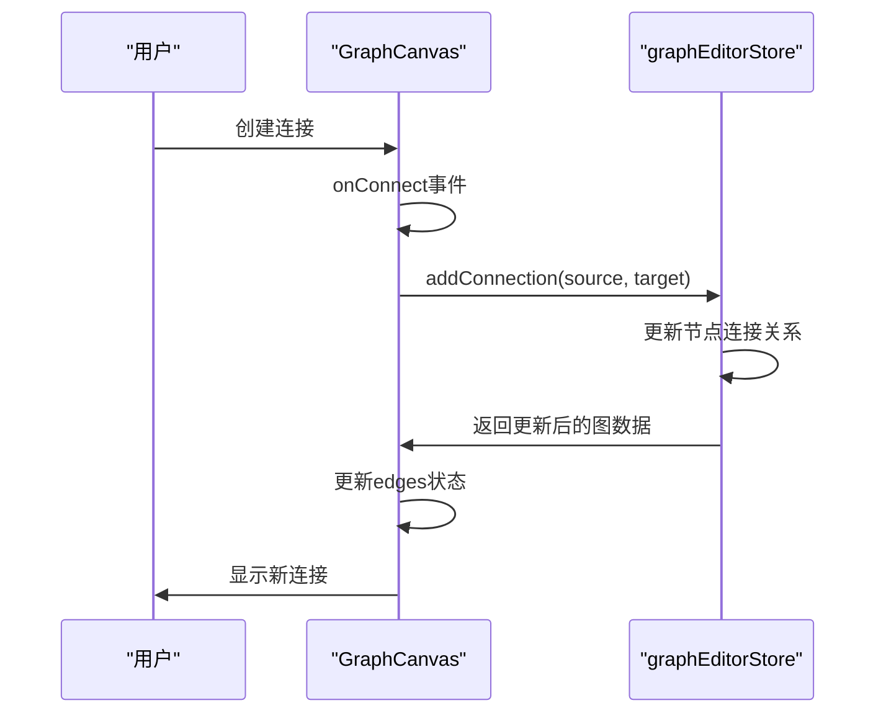
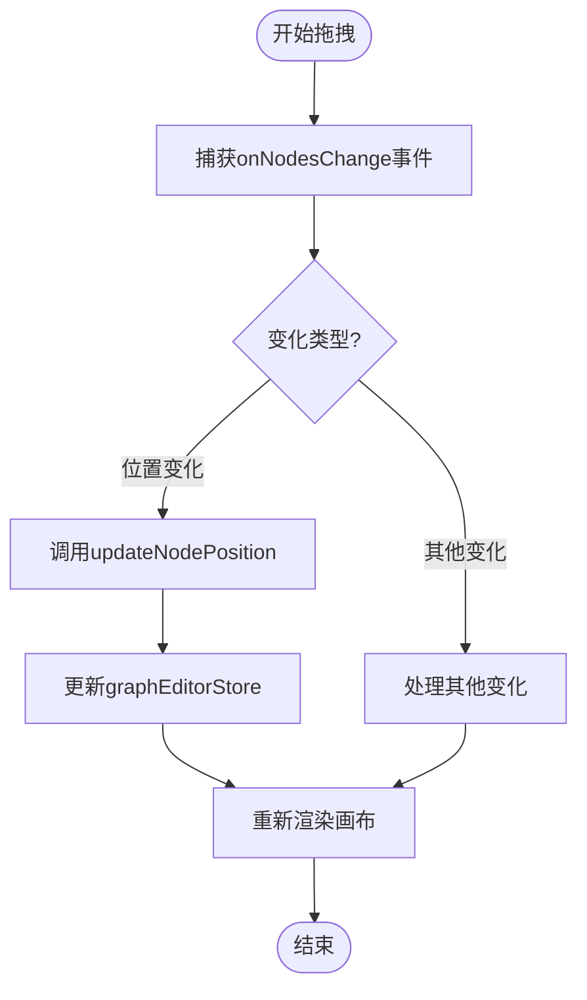
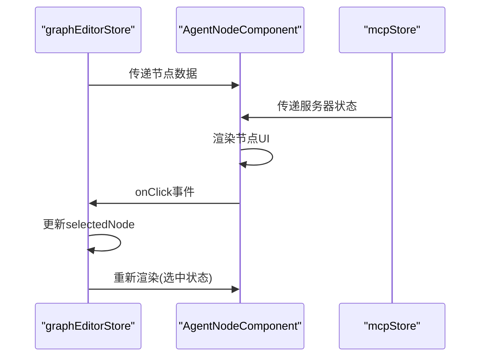
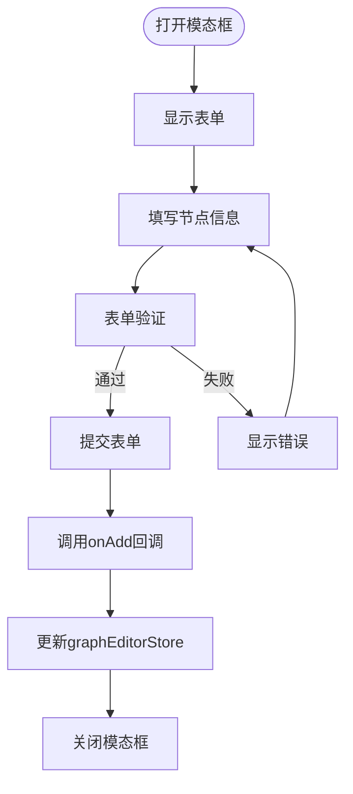
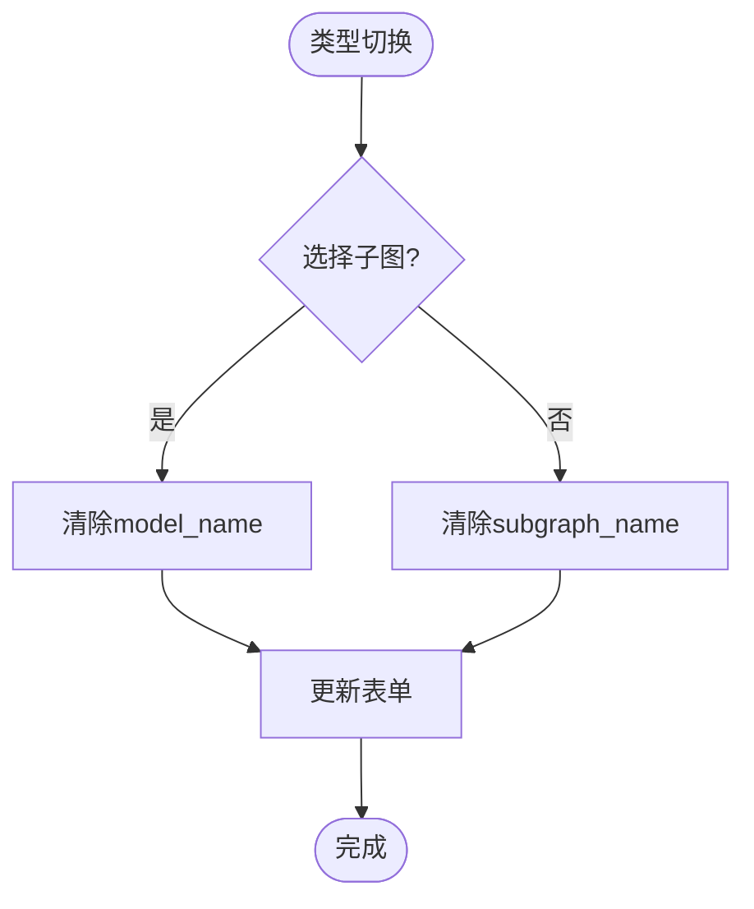
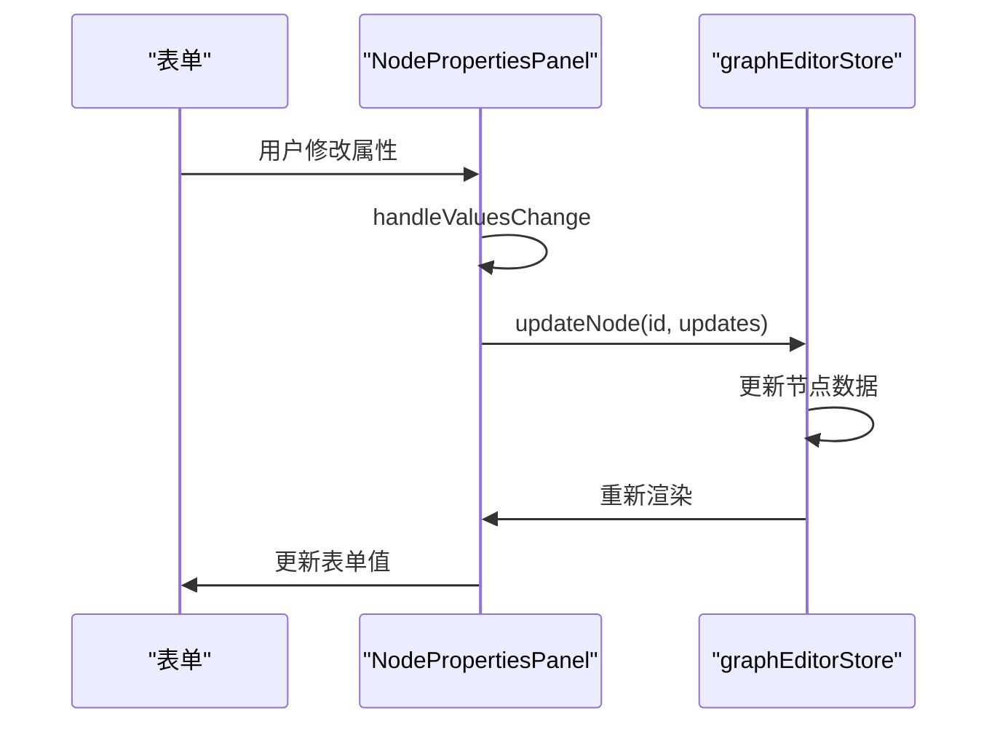
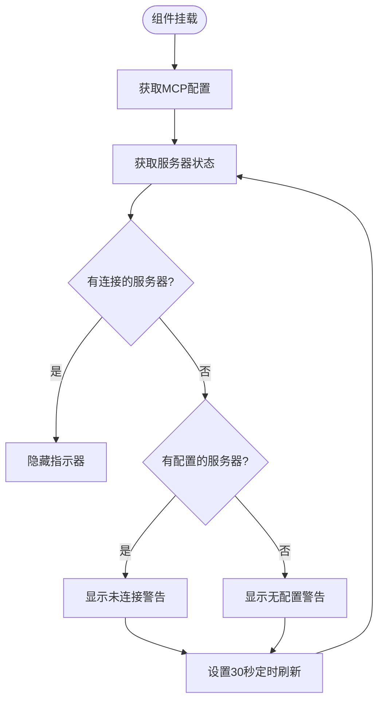
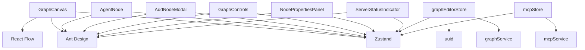

# 图编辑器组件

<cite>
**本文档引用的文件**
- [GraphCanvas.tsx](file://frontend/src/components/graph-editor/GraphCanvas.tsx)
- [AgentNodeComponent.tsx](file://frontend/src/components/graph-editor/AgentNodeComponent.tsx)
- [AddNodeModal.tsx](file://frontend/src/components/graph-editor/AddNodeModal.tsx)
- [GraphControls.tsx](file://frontend/src/components/graph-editor/GraphControls.tsx)
- [NodePropertiesPanel.tsx](file://frontend/src/components/graph-editor/NodePropertiesPanel.tsx)
- [ServerStatusIndicator.tsx](file://frontend/src/components/graph-editor/ServerStatusIndicator.tsx)
- [graphEditorStore.ts](file://frontend/src/store/graphEditorStore.ts)
- [graph.ts](file://frontend/src/types/graph.ts)
- [graphService.ts](file://frontend/src/services/graphService.ts)
- [mcpStore.ts](file://frontend/src/store/mcpStore.ts)
</cite>

## 目录
1. [简介](#简介)
2. [项目结构](#项目结构)
3. [核心组件](#核心组件)
4. [架构概述](#架构概述)
5. [详细组件分析](#详细组件分析)
6. [依赖分析](#依赖分析)
7. [性能考虑](#性能考虑)
8. [故障排除指南](#故障排除指南)
9. [结论](#结论)

## 简介
本文档深入解析基于React Flow构建的可视化工作流图编辑器组件。重点阐述了图编辑器各核心组件的实现机制，包括画布渲染、节点交互、状态管理与后端服务通信等关键功能。文档详细描述了GraphCanvas组件的画布渲染机制、AgentNodeComponent的自定义节点UI结构、AddNodeModal的节点添加流程、GraphControls的操作控制功能、NodePropertiesPanel的属性编辑机制以及ServerStatusIndicator的状态同步策略。通过Zustand状态管理库实现组件间的解耦，并支持实时SSE状态更新，为开发者提供完整的组件使用指南和定制化选项。

## 项目结构
图编辑器组件位于`frontend/src/components/graph-editor`目录下，采用模块化设计，各组件职责分明。组件通过Zustand状态管理库与后端服务进行通信，实现数据的集中管理和状态同步。



**图来源**
- [GraphCanvas.tsx](file://frontend/src/components/graph-editor/GraphCanvas.tsx)
- [AgentNodeComponent.tsx](file://frontend/src/components/graph-editor/AgentNodeComponent.tsx)
- [AddNodeModal.tsx](file://frontend/src/components/graph-editor/AddNodeModal.tsx)
- [GraphControls.tsx](file://frontend/src/components/graph-editor/GraphControls.tsx)
- [NodePropertiesPanel.tsx](file://frontend/src/components/graph-editor/NodePropertiesPanel.tsx)
- [ServerStatusIndicator.tsx](file://frontend/src/components/graph-editor/ServerStatusIndicator.tsx)
- [graphEditorStore.ts](file://frontend/src/store/graphEditorStore.ts)
- [mcpStore.ts](file://frontend/src/store/mcpStore.ts)
- [graphService.ts](file://frontend/src/services/graphService.ts)

**章节来源**
- [GraphCanvas.tsx](file://frontend/src/components/graph-editor/GraphCanvas.tsx)
- [AgentNodeComponent.tsx](file://frontend/src/components/graph-editor/AgentNodeComponent.tsx)
- [AddNodeModal.tsx](file://frontend/src/components/graph-editor/AddNodeModal.tsx)
- [GraphControls.tsx](file://frontend/src/components/graph-editor/GraphControls.tsx)
- [NodePropertiesPanel.tsx](file://frontend/src/components/graph-editor/NodePropertiesPanel.tsx)
- [ServerStatusIndicator.tsx](file://frontend/src/components/graph-editor/ServerStatusIndicator.tsx)

## 核心组件
图编辑器由多个核心组件构成，每个组件负责特定的功能模块。GraphCanvas组件作为画布容器，负责渲染节点和边的可视化展示；AgentNodeComponent实现自定义节点的UI结构和状态展示；AddNodeModal提供节点添加的交互界面；GraphControls集成各种操作控制功能；NodePropertiesPanel用于节点属性的动态编辑；ServerStatusIndicator监控后端MCP服务的连接状态。

**章节来源**
- [GraphCanvas.tsx](file://frontend/src/components/graph-editor/GraphCanvas.tsx)
- [AgentNodeComponent.tsx](file://frontend/src/components/graph-editor/AgentNodeComponent.tsx)
- [AddNodeModal.tsx](file://frontend/src/components/graph-editor/AddNodeModal.tsx)
- [GraphControls.tsx](file://frontend/src/components/graph-editor/GraphControls.tsx)
- [NodePropertiesPanel.tsx](file://frontend/src/components/graph-editor/NodePropertiesPanel.tsx)
- [ServerStatusIndicator.tsx](file://frontend/src/components/graph-editor/ServerStatusIndicator.tsx)

## 架构概述
图编辑器采用分层架构设计，前端组件层、状态管理层和后端服务层分离。前端组件通过Zustand状态管理库与后端服务进行通信，实现数据的集中管理和状态同步。组件间通过props传递回调函数和状态，实现松耦合。



**图来源**
- [GraphCanvas.tsx](file://frontend/src/components/graph-editor/GraphCanvas.tsx)
- [AgentNodeComponent.tsx](file://frontend/src/components/graph-editor/AgentNodeComponent.tsx)
- [AddNodeModal.tsx](file://frontend/src/components/graph-editor/AddNodeModal.tsx)
- [GraphControls.tsx](file://frontend/src/components/graph-editor/GraphControls.tsx)
- [NodePropertiesPanel.tsx](file://frontend/src/components/graph-editor/NodePropertiesPanel.tsx)
- [ServerStatusIndicator.tsx](file://frontend/src/components/graph-editor/ServerStatusIndicator.tsx)
- [graphEditorStore.ts](file://frontend/src/store/graphEditorStore.ts)
- [mcpStore.ts](file://frontend/src/store/mcpStore.ts)
- [graphService.ts](file://frontend/src/services/graphService.ts)

## 详细组件分析

### GraphCanvas组件分析
GraphCanvas组件是图编辑器的核心画布容器，基于React Flow库构建。它负责渲染节点和边的可视化展示，处理用户的拖拽交互和连接操作。

#### 画布渲染机制
GraphCanvas组件通过React Flow的`ReactFlow`组件渲染画布，使用`nodeTypes`注册自定义节点类型，将`AgentNodeComponent`作为节点渲染器。组件通过`useGraphEditorStore`钩子订阅当前图的状态，当图数据变化时，自动转换为React Flow所需的节点和边数据结构。

```mermaid
classDiagram
class GraphCanvas {
+nodes : Node[]
+edges : Edge[]
+backgroundType : BackgroundType
+useEffect() 更新节点和边
+onNodesChange() 处理节点变化
+onEdgesChange() 处理边变化
+onConnect() 处理连接
+onPaneClick() 处理画布点击
}
class AgentNodeComponent {
+data : AgentNodeData
+onClick() 节点点击事件
}
GraphCanvas --> AgentNodeComponent : "使用"
GraphCanvas --> "ReactFlow" : "渲染"
```

**图来源**
- [GraphCanvas.tsx](file://frontend/src/components/graph-editor/GraphCanvas.tsx#L1-L744)

**章节来源**
- [GraphCanvas.tsx](file://frontend/src/components/graph-editor/GraphCanvas.tsx#L1-L744)

#### 节点连接逻辑
GraphCanvas组件实现了复杂的节点连接逻辑，支持常规连接和循环连接（handoffs）两种类型。通过`edgeTypes`注册自定义边类型，`ButtonEdge`用于常规连接，`ArcEdge`用于循环连接。连接逻辑通过`onConnect`回调处理，当用户创建新连接时，调用`addConnection`方法更新状态。



**图来源**
- [GraphCanvas.tsx](file://frontend/src/components/graph-editor/GraphCanvas.tsx#L1-L744)
- [graphEditorStore.ts](file://frontend/src/store/graphEditorStore.ts#L1-L707)

**章节来源**
- [GraphCanvas.tsx](file://frontend/src/components/graph-editor/GraphCanvas.tsx#L1-L744)
- [graphEditorStore.ts](file://frontend/src/store/graphEditorStore.ts#L1-L707)

#### 拖拽交互实现
GraphCanvas组件通过`onNodesChange`和`onEdgesChange`回调处理节点和边的变化。当用户拖拽节点时，`onNodesChange`捕获位置变化，调用`updateNodePosition`方法更新节点位置。组件还实现了背景控制面板，允许用户切换不同的背景样式。



**图来源**
- [GraphCanvas.tsx](file://frontend/src/components/graph-editor/GraphCanvas.tsx#L1-L744)
- [graphEditorStore.ts](file://frontend/src/store/graphEditorStore.ts#L1-L707)

**章节来源**
- [GraphCanvas.tsx](file://frontend/src/components/graph-editor/GraphCanvas.tsx#L1-L744)
- [graphEditorStore.ts](file://frontend/src/store/graphEditorStore.ts#L1-L707)

### AgentNodeComponent组件分析
AgentNodeComponent是图编辑器中的自定义节点组件，负责渲染节点的UI结构和状态展示。

#### 自定义节点UI结构
AgentNodeComponent采用卡片式设计，包含标题区、内容区和标签区。组件使用Ant Design的`Card`组件构建基础UI，通过`Handle`组件添加输入/输出句柄。节点根据类型（智能体或子图）显示不同的图标和样式。

```mermaid
classDiagram
class AgentNodeComponent {
+data : AgentNodeProps
+renderNodeTitle() 渲染标题
+renderNodeContent() 渲染内容
+renderNodeTags() 渲染标签
+getNodeStyle() 获取节点样式
}
AgentNodeComponent --> "Card" : "使用"
AgentNodeComponent --> "Handle" : "使用"
AgentNodeComponent --> "Icon" : "使用"
```

**图来源**
- [AgentNodeComponent.tsx](file://frontend/src/components/graph-editor/AgentNodeComponent.tsx#L1-L383)

**章节来源**
- [AgentNodeComponent.tsx](file://frontend/src/components/graph-editor/AgentNodeComponent.tsx#L1-L383)

#### 状态展示及与Zustand状态的绑定
AgentNodeComponent通过`data`属性接收节点状态，包括名称、描述、模型、服务器等信息。组件使用`useMCPStore`钩子获取服务器连接状态，当节点使用的服务器断开连接时，显示警告图标。节点的选中状态通过`selected`属性控制，与`graphEditorStore`中的`selectedNode`状态同步。



**图来源**
- [AgentNodeComponent.tsx](file://frontend/src/components/graph-editor/AgentNodeComponent.tsx#L1-L383)
- [graphEditorStore.ts](file://frontend/src/store/graphEditorStore.ts#L1-L707)
- [mcpStore.ts](file://frontend/src/store/mcpStore.ts#L1-L221)

**章节来源**
- [AgentNodeComponent.tsx](file://frontend/src/components/graph-editor/AgentNodeComponent.tsx#L1-L383)
- [graphEditorStore.ts](file://frontend/src/store/graphEditorStore.ts#L1-L707)
- [mcpStore.ts](file://frontend/src/store/mcpStore.ts#L1-L221)

### AddNodeModal组件分析
AddNodeModal组件提供节点添加的交互界面，支持多种节点类型和配置选项。

#### 节点添加流程
AddNodeModal通过表单收集节点配置信息，包括名称、描述、类型、模型/子图选择、服务器配置等。表单分为多个卡片区域，分别处理基础信息、服务器与输出控制、节点连接配置和执行控制。



**图来源**
- [AddNodeModal.tsx](file://frontend/src/components/graph-editor/AddNodeModal.tsx#L1-L704)

**章节来源**
- [AddNodeModal.tsx](file://frontend/src/components/graph-editor/AddNodeModal.tsx#L1-L704)

#### 类型选择逻辑
AddNodeModal支持智能体和子图两种节点类型。当用户切换类型时，`handleTypeChange`回调会重置相关字段：选择子图时清除模型选择，选择智能体时清除子图选择。这种互斥逻辑确保了节点配置的一致性。



**图来源**
- [AddNodeModal.tsx](file://frontend/src/components/graph-editor/AddNodeModal.tsx#L1-L704)

**章节来源**
- [AddNodeModal.tsx](file://frontend/src/components/graph-editor/AddNodeModal.tsx#L1-L704)

### GraphControls组件分析
GraphControls组件提供图编辑器的操作控制功能，包括图选择、保存、导入导出等。

#### 缩放、对齐等操作控制功能
GraphControls集成了多种操作控制功能，包括图选择、新建图、保存、导入导出、自动布局等。组件通过`Dropdown`菜单组织相关操作，提供清晰的用户界面。

```mermaid
classDiagram
class GraphControls {
+onAddNode() 添加节点
+handleSave() 保存图
+handleCreateNewGraph() 创建新图
+handleGraphChange() 切换图
+handleDeleteGraph() 删除图
+handleExportMCP() 导出MCP
+handleImport() 导入
+handleExport() 导出
+handleViewReadme() 查看README
+handleGetPromptTemplate() 获取提示词模板
+handleAutoLayout() 自动布局
}
GraphControls --> "ServerStatusIndicator" : "使用"
GraphControls --> "Modal" : "使用"
GraphControls --> "Form" : "使用"
```

**图来源**
- [GraphControls.tsx](file://frontend/src/components/graph-editor/GraphControls.tsx#L1-L799)

**章节来源**
- [GraphControls.tsx](file://frontend/src/components/graph-editor/GraphControls.tsx#L1-L799)

### NodePropertiesPanel组件分析
NodePropertiesPanel组件提供节点属性的动态编辑功能，支持多标签页的属性管理。

#### 属性动态编辑与表单验证机制
NodePropertiesPanel采用多标签页设计，将节点属性分为基础信息、提示词设置、执行控制、上下文管理和连接信息。组件使用Ant Design的`Form`组件实现表单验证，当用户修改属性时，通过`handleValuesChange`回调实时更新`graphEditorStore`中的节点数据。



**图来源**
- [NodePropertiesPanel.tsx](file://frontend/src/components/graph-editor/NodePropertiesPanel.tsx#L1-L693)
- [graphEditorStore.ts](file://frontend/src/store/graphEditorStore.ts#L1-L707)

**章节来源**
- [NodePropertiesPanel.tsx](file://frontend/src/components/graph-editor/NodePropertiesPanel.tsx#L1-L693)
- [graphEditorStore.ts](file://frontend/src/store/graphEditorStore.ts#L1-L707)

### ServerStatusIndicator组件分析
ServerStatusIndicator组件监控后端MCP服务的连接状态，并在界面上显示状态指示。

#### 连接状态同步策略
ServerStatusIndicator通过`useMCPStore`钩子订阅MCP服务的状态，定期（每30秒）刷新状态。组件根据服务器连接状态显示不同的指示：当所有服务器都断开连接时显示警告，当有服务器连接时则不显示指示器。



**图来源**
- [ServerStatusIndicator.tsx](file://frontend/src/components/graph-editor/ServerStatusIndicator.tsx#L1-L45)
- [mcpStore.ts](file://frontend/src/store/mcpStore.ts#L1-L221)

**章节来源**
- [ServerStatusIndicator.tsx](file://frontend/src/components/graph-editor/ServerStatusIndicator.tsx#L1-L45)
- [mcpStore.ts](file://frontend/src/store/mcpStore.ts#L1-L221)

## 依赖分析
图编辑器组件依赖多个外部库和内部模块。主要依赖包括React Flow（可视化库）、Ant Design（UI组件库）、Zustand（状态管理）等。组件间通过props和状态管理库进行通信，形成清晰的依赖关系。



**图来源**
- [GraphCanvas.tsx](file://frontend/src/components/graph-editor/GraphCanvas.tsx#L1-L744)
- [AgentNodeComponent.tsx](file://frontend/src/components/graph-editor/AgentNodeComponent.tsx#L1-L383)
- [AddNodeModal.tsx](file://frontend/src/components/graph-editor/AddNodeModal.tsx#L1-L704)
- [GraphControls.tsx](file://frontend/src/components/graph-editor/GraphControls.tsx#L1-L799)
- [NodePropertiesPanel.tsx](file://frontend/src/components/graph-editor/NodePropertiesPanel.tsx#L1-L693)
- [ServerStatusIndicator.tsx](file://frontend/src/components/graph-editor/ServerStatusIndicator.tsx#L1-L45)
- [graphEditorStore.ts](file://frontend/src/store/graphEditorStore.ts#L1-L707)
- [mcpStore.ts](file://frontend/src/store/mcpStore.ts#L1-L221)

**章节来源**
- [GraphCanvas.tsx](file://frontend/src/components/graph-editor/GraphCanvas.tsx#L1-L744)
- [AgentNodeComponent.tsx](file://frontend/src/components/graph-editor/AgentNodeComponent.tsx#L1-L383)
- [AddNodeModal.tsx](file://frontend/src/components/graph-editor/AddNodeModal.tsx#L1-L704)
- [GraphControls.tsx](file://frontend/src/components/graph-editor/GraphControls.tsx#L1-L799)
- [NodePropertiesPanel.tsx](file://frontend/src/components/graph-editor/NodePropertiesPanel.tsx#L1-L693)
- [ServerStatusIndicator.tsx](file://frontend/src/components/graph-editor/ServerStatusIndicator.tsx#L1-L45)
- [graphEditorStore.ts](file://frontend/src/store/graphEditorStore.ts#L1-L707)
- [mcpStore.ts](file://frontend/src/store/mcpStore.ts#L1-L221)

## 性能考虑
图编辑器在性能方面进行了多项优化。使用`useCallback`和`useMemo`等React Hooks避免不必要的重新渲染。通过Zustand的细粒度状态订阅，确保只有相关组件在状态变化时重新渲染。对于大型图的渲染，建议使用虚拟滚动或分页加载策略。

## 故障排除指南
当图编辑器出现问题时，可参考以下排查步骤：
1. 检查MCP服务器连接状态，确保至少有一个服务器已连接
2. 验证图数据的完整性，确保节点名称不包含特殊字符
3. 检查浏览器控制台是否有JavaScript错误
4. 确认后端服务是否正常运行
5. 检查网络请求是否成功，特别是API调用

**章节来源**
- [GraphControls.tsx](file://frontend/src/components/graph-editor/GraphControls.tsx#L1-L799)
- [ServerStatusIndicator.tsx](file://frontend/src/components/graph-editor/ServerStatusIndicator.tsx#L1-L45)

## 结论
本文档详细解析了基于React Flow构建的可视化工作流图编辑器组件。通过Zustand状态管理库实现组件间的解耦，支持实时SSE状态更新。各组件职责分明，通过清晰的API接口进行通信，为开发者提供了完整的使用指南和定制化选项。图编辑器具有良好的扩展性和维护性，可作为复杂工作流可视化编辑的基础框架。