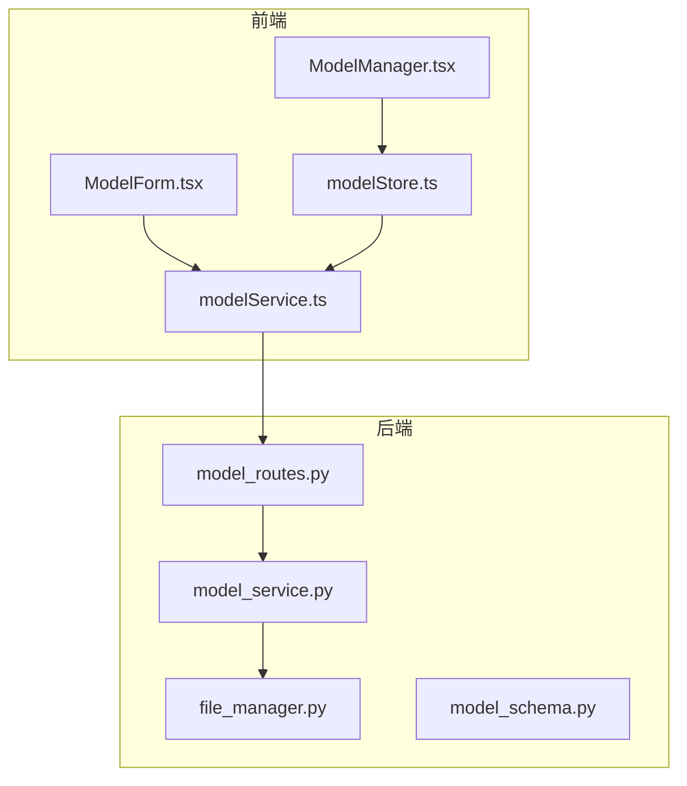
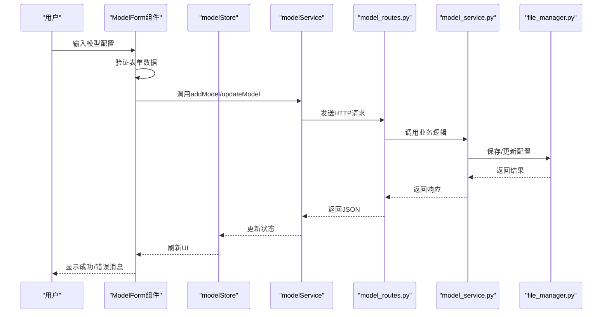
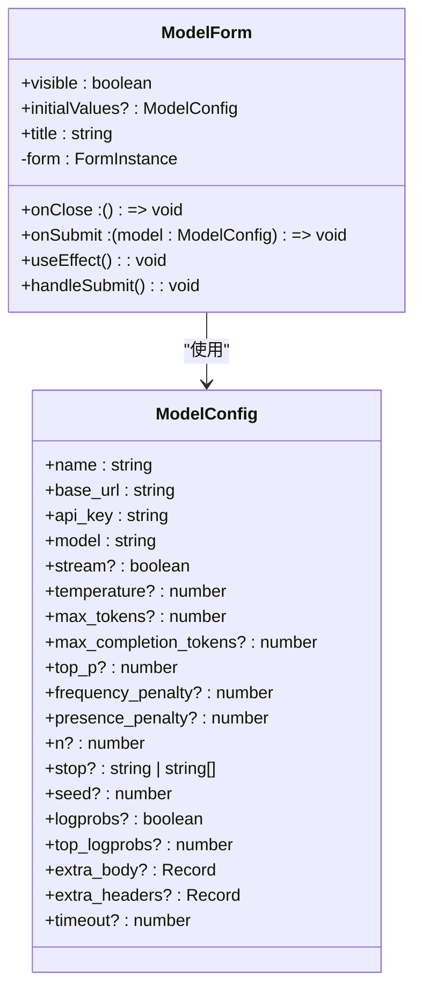
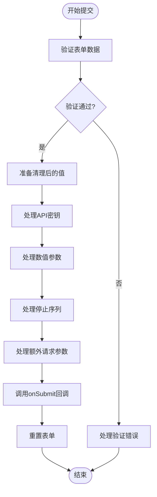
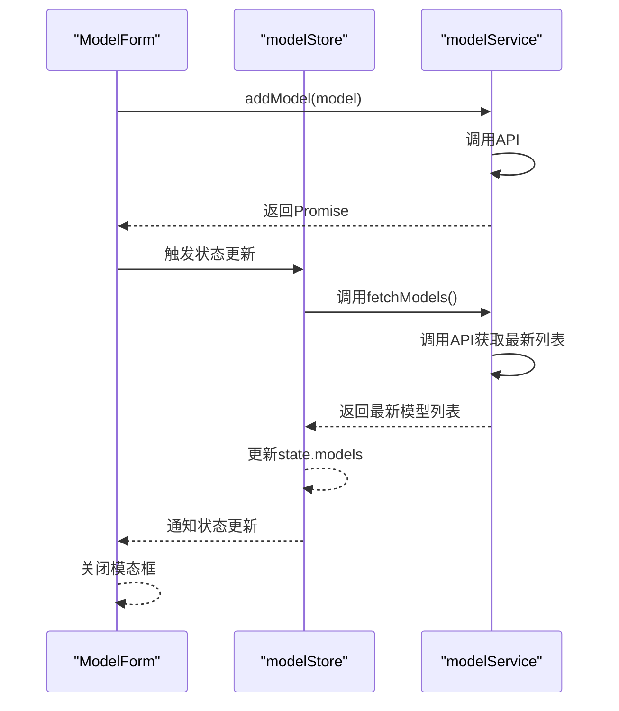
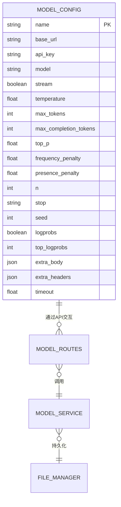
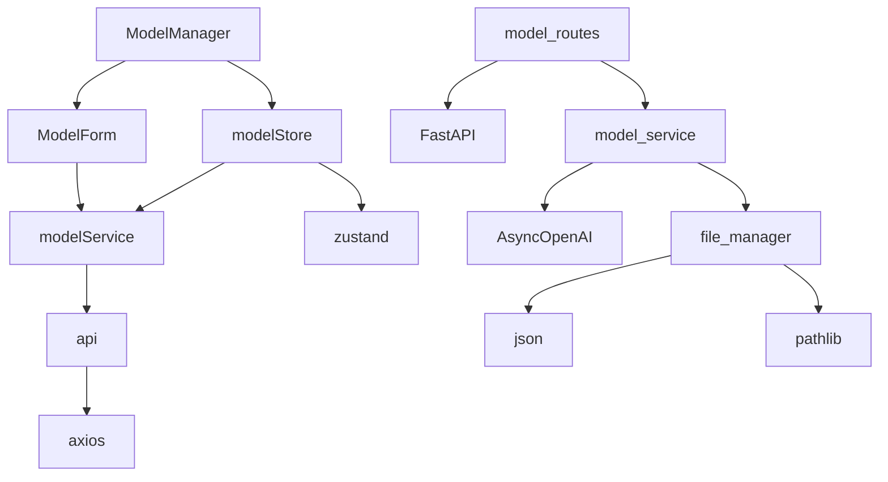

# 模型管理组件

<cite>
**本文档引用的文件**
- [ModelForm.tsx](file://frontend/src/components/model-manager/ModelForm.tsx)
- [model.ts](file://frontend/src/types/model.ts)
- [modelStore.ts](file://frontend/src/store/modelStore.ts)
- [modelService.ts](file://frontend/src/services/modelService.ts)
- [model_routes.py](file://mag/app/api/model_routes.py)
- [model_schema.py](file://mag/app/models/model_schema.py)
- [ModelManager.tsx](file://frontend/src/pages/ModelManager.tsx)
- [NodePropertiesPanel.tsx](file://frontend/src/components/graph-editor/NodePropertiesPanel.tsx)
- [file_manager.py](file://mag/app/core/file_manager.py)
- [model_service.py](file://mag/app/services/model_service.py)
</cite>

## 目录
1. [简介](#简介)
2. [项目结构](#项目结构)
3. [核心组件](#核心组件)
4. [架构概述](#架构概述)
5. [详细组件分析](#详细组件分析)
6. [依赖分析](#依赖分析)
7. [性能考虑](#性能考虑)
8. [故障排除指南](#故障排除指南)
9. [结论](#结论)

## 简介
本文档深入解析了模型管理组件，重点分析了`ModelForm`组件的实现细节。该组件是系统中用于配置和管理AI模型的核心界面，支持多种模型类型（如LLM、Embedding）的配置输入。文档详细描述了其表单结构设计、字段验证规则、与全局状态的同步机制以及提交逻辑。同时，阐述了该组件如何通过API与后端进行数据交互，并说明了其在图编辑器中作为节点依赖配置的集成方式。

## 项目结构
模型管理功能分布在前端和后端两个主要部分。前端组件位于`frontend/src/components/model-manager/`目录下，包含`ModelForm.tsx`表单组件和`ModelManager.tsx`管理页面。状态管理通过`frontend/src/store/modelStore.ts`实现，API服务封装在`frontend/src/services/modelService.ts`中。后端API路由定义在`mag/app/api/model_routes.py`，业务逻辑由`mag/app/services/model_service.py`处理，模型数据持久化通过`mag/app/core/file_manager.py`完成。

**图示来源**
- [ModelForm.tsx](file://frontend/src/components/model-manager/ModelForm.tsx)
- [ModelManager.tsx](file://frontend/src/pages/ModelManager.tsx)
- [modelStore.ts](file://frontend/src/store/modelStore.ts)
- [modelService.ts](file://frontend/src/services/modelService.ts)
- [model_routes.py](file://mag/app/api/model_routes.py)
- [model_service.py](file://mag/app/services/model_service.py)
- [file_manager.py](file://mag/app/core/file_manager.py)

**节来源**
- [ModelForm.tsx](file://frontend/src/components/model-manager/ModelForm.tsx)
- [ModelManager.tsx](file://frontend/src/pages/ModelManager.tsx)
- [model_routes.py](file://mag/app/api/model_routes.py)

## 核心组件
`ModelForm`组件是模型配置的核心UI组件，提供了一个模态对话框形式的表单界面，用于添加和编辑模型配置。它与`modelStore`状态管理器紧密集成，通过`modelService`与后端API进行数据交互。表单设计考虑了安全性和用户体验，对敏感信息如API密钥进行了特殊处理。

**节来源**
- [ModelForm.tsx](file://frontend/src/components/model-manager/ModelForm.tsx)
- [modelStore.ts](file://frontend/src/store/modelStore.ts)
- [modelService.ts](file://frontend/src/services/modelService.ts)

## 架构概述
模型管理组件采用典型的前后端分离架构。前端使用React和Ant Design构建用户界面，通过Zustand进行状态管理。后端使用FastAPI框架提供RESTful API，数据持久化到JSON文件中。整个流程从用户在`ModelForm`中输入配置开始，经过前端验证后，通过API调用传递到后端服务，最终由文件管理器保存到磁盘。

**图示来源**
- [ModelForm.tsx](file://frontend/src/components/model-manager/ModelForm.tsx)
- [modelStore.ts](file://frontend/src/store/modelStore.ts)
- [modelService.ts](file://frontend/src/services/modelService.ts)
- [model_routes.py](file://mag/app/api/model_routes.py)
- [model_service.py](file://mag/app/services/model_service.py)
- [file_manager.py](file://mag/app/core/file_manager.py)

## 详细组件分析

### ModelForm组件分析
`ModelForm`组件实现了模型配置的完整生命周期管理，包括表单渲染、数据验证、提交处理和状态同步。它支持新增和编辑两种模式，通过`initialValues`属性来区分。

#### 表单结构与字段验证

**图示来源**
- [ModelForm.tsx](file://frontend/src/components/model-manager/ModelForm.tsx)
- [model.ts](file://frontend/src/types/model.ts)

#### 提交逻辑与数据清理

**图示来源**
- [ModelForm.tsx](file://frontend/src/components/model-manager/ModelForm.tsx)

**节来源**
- [ModelForm.tsx](file://frontend/src/components/model-manager/ModelForm.tsx)

### 状态同步机制
`ModelForm`组件与`modelStore`通过`useModelStore` Hook进行状态同步。当表单提交成功后，`modelStore`会自动刷新模型列表，确保全局状态的一致性。

**图示来源**
- [ModelForm.tsx](file://frontend/src/components/model-manager/ModelForm.tsx)
- [modelStore.ts](file://frontend/src/store/modelStore.ts)
- [modelService.ts](file://frontend/src/services/modelService.ts)

### 后端API交互
`ModelForm`通过`modelService`与后端`model_routes.py`进行数据交互，支持CRUD操作。

**图示来源**
- [model_routes.py](file://mag/app/api/model_routes.py)
- [model_service.py](file://mag/app/services/model_service.py)
- [file_manager.py](file://mag/app/core/file_manager.py)
- [model_schema.py](file://mag/app/models/model_schema.py)

## 依赖分析
模型管理组件涉及多个层级的依赖关系，从前端UI组件到后端服务，再到数据持久化层。

**图示来源**
- [ModelForm.tsx](file://frontend/src/components/model-manager/ModelForm.tsx)
- [modelService.ts](file://frontend/src/services/modelService.ts)
- [modelStore.ts](file://frontend/src/store/modelStore.ts)
- [ModelManager.tsx](file://frontend/src/pages/ModelManager.tsx)
- [model_routes.py](file://mag/app/api/model_routes.py)
- [model_service.py](file://mag/app/services/model_service.py)
- [file_manager.py](file://mag/app/core/file_manager.py)

**节来源**
- [ModelForm.tsx](file://frontend/src/components/model-manager/ModelForm.tsx)
- [modelService.ts](file://frontend/src/services/modelService.ts)
- [modelStore.ts](file://frontend/src/store/modelStore.ts)
- [model_routes.py](file://mag/app/api/model_routes.py)
- [model_service.py](file://mag/app/services/model_service.py)
- [file_manager.py](file://mag/app/core/file_manager.py)

## 性能考虑
模型管理组件在性能方面做了多项优化。前端使用了React的`useForm` Hook来管理表单状态，避免不必要的重新渲染。后端API采用了异步处理，确保不会阻塞主线程。数据持久化使用了原子操作，防止并发写入导致的数据损坏。

## 故障排除指南
当模型管理功能出现问题时，可以按照以下步骤进行排查：
1. 检查前端控制台是否有JavaScript错误
2. 检查网络请求是否成功，查看HTTP状态码
3. 查看后端日志，特别是`model_routes.py`和`model_service.py`中的错误信息
4. 检查模型配置文件`models.json`是否格式正确
5. 验证API密钥和基础URL是否正确

**节来源**
- [model_routes.py](file://mag/app/api/model_routes.py)
- [model_service.py](file://mag/app/services/model_service.py)
- [file_manager.py](file://mag/app/core/file_manager.py)

## 结论
`ModelForm`组件是一个功能完整、设计合理的模型管理界面，它有效地整合了前端UI、状态管理和后端服务。通过清晰的架构设计和严谨的错误处理，为用户提供了一个安全、易用的模型配置体验。该组件不仅支持基本的CRUD操作，还考虑了敏感信息保护、数据验证和状态同步等关键问题，是系统中不可或缺的核心组件之一。