# 聊天界面组件

<cite>
**本文档引用的文件**
- [MessageDisplay.tsx](file://frontend/src/components/chat/MessageDisplay.tsx)
- [InputArea.tsx](file://frontend/src/components/chat/InputArea.tsx)
- [ConversationSidebar.tsx](file://frontend/src/components/chat/ConversationSidebar.tsx)
- [ModeSelector.tsx](file://frontend/src/components/chat/ModeSelector.tsx)
- [InfoPanel.tsx](file://frontend/src/components/chat/InfoPanel.tsx)
- [CompactConfigModal.tsx](file://frontend/src/components/chat/CompactConfigModal.tsx)
- [AgentXMLRenderer.tsx](file://frontend/src/components/chat/AgentXMLRenderer.tsx)
- [conversationStore.ts](file://frontend/src/store/conversationStore.ts)
- [conversation.ts](file://frontend/src/types/conversation.ts)
</cite>

## 目录
1. [简介](#简介)
2. [项目结构](#项目结构)
3. [核心组件](#核心组件)
4. [架构概述](#架构概述)
5. [详细组件分析](#详细组件分析)
6. [依赖分析](#依赖分析)
7. [性能考虑](#性能考虑)
8. [故障排除指南](#故障排除指南)
9. [结论](#结论)
10. [附录](#附录)（如有必要）

## 简介
本文档深入阐述了聊天界面的用户交互组件体系，系统解析了对话系统的各个核心组件。重点包括MessageDisplay的消息渲染逻辑、多格式内容处理及时间戳展示；InputArea的输入框控制、快捷键支持与发送事件触发机制；ConversationSidebar的会话列表管理、创建/删除操作与选中状态同步；ModeSelector的模式切换逻辑及其对后续流程的影响；InfoPanel的上下文信息展示与元数据提取；CompactConfigModal的轻量级配置编辑与临时参数设置；AgentXMLRenderer对Agent生成的XML结构化数据的解析与可视化呈现。

## 项目结构
聊天界面组件位于`frontend/src/components/chat`目录下，与其他组件共同构成了完整的用户交互体系。这些组件通过状态管理(store)和类型定义(types)实现数据共享和类型安全。

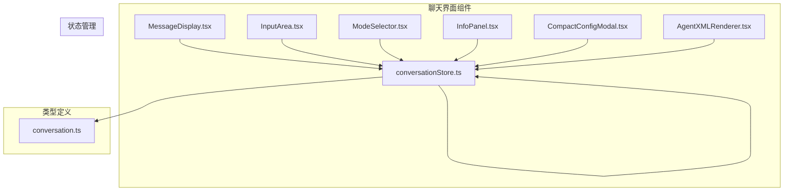

**图示来源**
- [MessageDisplay.tsx](file://frontend/src/components/chat/MessageDisplay.tsx)
- [InputArea.tsx](file://frontend/src/components/chat/InputArea.tsx)
- [ConversationSidebar.tsx](file://frontend/src/components/chat/ConversationSidebar.tsx)
- [ModeSelector.tsx](file://frontend/src/components/chat/ModeSelector.tsx)
- [InfoPanel.tsx](file://frontend/src/components/chat/InfoPanel.tsx)
- [CompactConfigModal.tsx](file://frontend/src/components/chat/CompactConfigModal.tsx)
- [AgentXMLRenderer.tsx](file://frontend/src/components/chat/AgentXMLRenderer.tsx)
- [conversationStore.ts](file://frontend/src/store/conversationStore.ts)
- [conversation.ts](file://frontend/src/types/conversation.ts)

**本节来源**
- [MessageDisplay.tsx](file://frontend/src/components/chat/MessageDisplay.tsx)
- [InputArea.tsx](file://frontend/src/components/chat/InputArea.tsx)
- [ConversationSidebar.tsx](file://frontend/src/components/chat/ConversationSidebar.tsx)

## 核心组件
聊天界面的核心组件体系包括消息显示、输入区域、会话侧边栏、模式选择器、信息面板、配置模态框和XML渲染器。这些组件通过`conversationStore`进行状态同步，并利用SSE实现实时消息接收处理。

**本节来源**
- [MessageDisplay.tsx](file://frontend/src/components/chat/MessageDisplay.tsx#L1-L50)
- [InputArea.tsx](file://frontend/src/components/chat/InputArea.tsx#L1-L50)
- [ConversationSidebar.tsx](file://frontend/src/components/chat/ConversationSidebar.tsx#L1-L50)

## 架构概述
聊天界面采用组件化架构，通过React的状态管理和Ant Design的UI组件库实现丰富的用户交互。各组件通过props传递配置和回调函数，与`conversationStore`中的状态进行绑定，形成完整的数据流闭环。

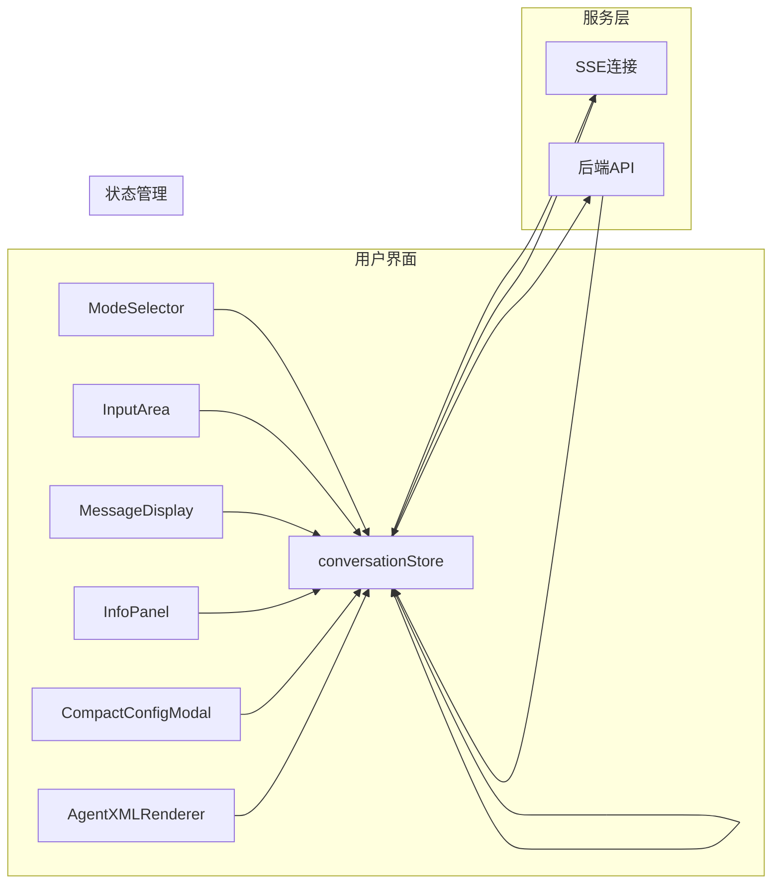

**图示来源**
- [conversationStore.ts](file://frontend/src/store/conversationStore.ts#L1-L50)
- [MessageDisplay.tsx](file://frontend/src/components/chat/MessageDisplay.tsx#L1-L50)
- [InputArea.tsx](file://frontend/src/components/chat/InputArea.tsx#L1-L50)

## 详细组件分析
对聊天界面的各个核心组件进行深入分析，包括其props定义、事件回调、状态绑定方式及SSE实时消息接收处理逻辑。

### MessageDisplay分析
MessageDisplay组件负责消息的渲染和展示，支持多格式内容处理和时间戳展示。

#### 消息渲染逻辑
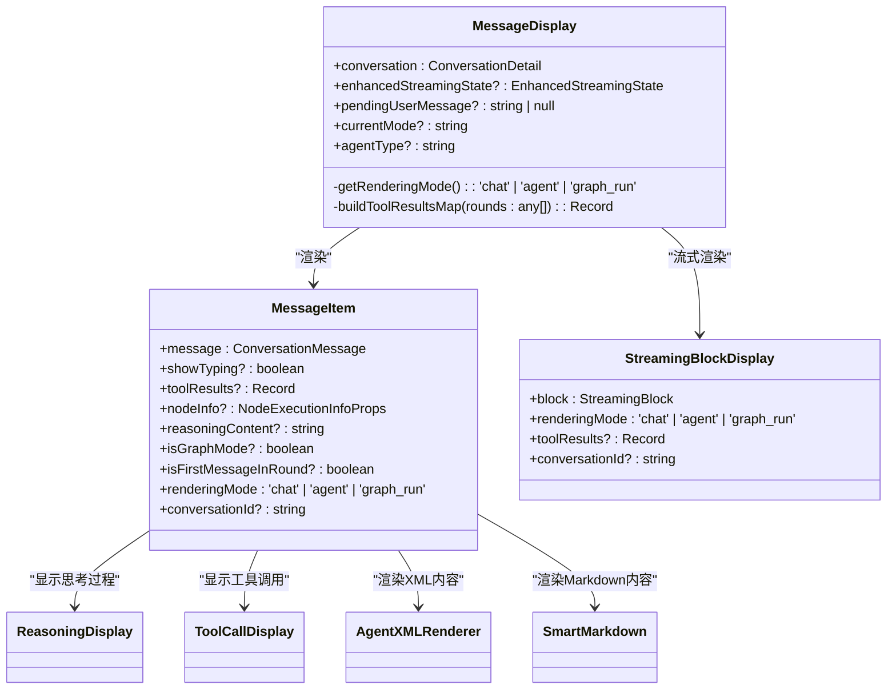

**图示来源**
- [MessageDisplay.tsx](file://frontend/src/components/chat/MessageDisplay.tsx#L15-L45)
- [conversation.ts](file://frontend/src/types/conversation.ts#L5-L20)

#### 多格式内容处理
MessageDisplay组件通过`SmartMarkdown`和`AgentXMLRenderer`组件实现多格式内容处理。对于普通聊天模式，使用Markdown渲染器；对于Agent模式，使用XML渲染器。

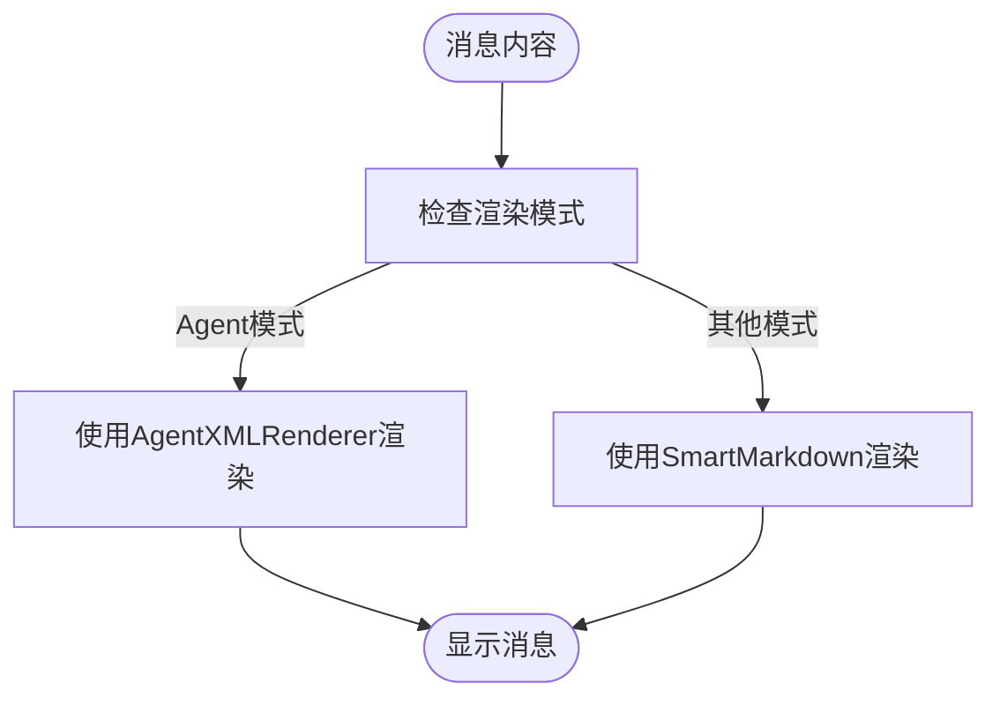

**图示来源**
- [MessageDisplay.tsx](file://frontend/src/components/chat/MessageDisplay.tsx#L45-L120)
- [AgentXMLRenderer.tsx](file://frontend/src/components/chat/AgentXMLRenderer.tsx#L15-L50)

**本节来源**
- [MessageDisplay.tsx](file://frontend/src/components/chat/MessageDisplay.tsx#L1-L100)
- [AgentXMLRenderer.tsx](file://frontend/src/components/chat/AgentXMLRenderer.tsx#L1-L50)

### InputArea分析
InputArea组件负责处理用户输入，支持输入框控制、快捷键支持与发送事件触发机制。

#### 输入框控制
```mermaid
classDiagram
class InputArea {
+onSendMessage : (message : string, options? : any) => void
+disabled? : boolean
+mode : ConversationMode
+inheritedConfig? : {
selectedModel? : string
selectedGraph? : string
systemPrompt? : string
selectedMCPServers? : string[]
}
-inputValue : string
-systemPrompt : string
-isSystemPromptMode : boolean
-selectedModel : string
-selectedGraph : string
-mcpServerStates : Record<string, boolean>
-showMcpTools : boolean
}
InputArea --> conversationStore : "使用"
InputArea --> modelStore : "使用"
InputArea --> graphEditorStore : "使用"
InputArea --> mcpStore : "使用"
```

**图示来源**
- [InputArea.tsx](file://frontend/src/components/chat/InputArea.tsx#L15-L45)
- [conversationStore.ts](file://frontend/src/store/conversationStore.ts#L5-L20)

#### 快捷键支持与发送事件
InputArea组件支持Ctrl+Enter快捷键发送消息，并根据当前模式构建相应的发送选项。

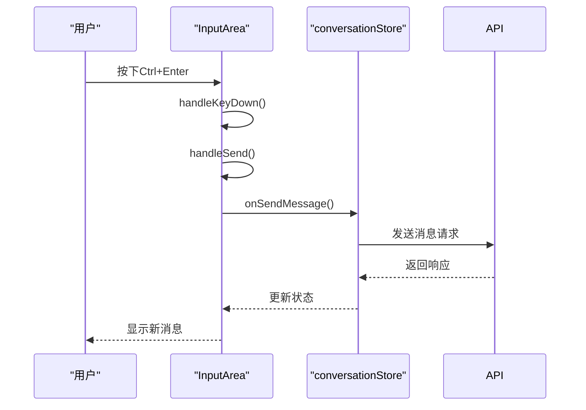

**图示来源**
- [InputArea.tsx](file://frontend/src/components/chat/InputArea.tsx#L20-L60)
- [conversationStore.ts](file://frontend/src/store/conversationStore.ts#L30-L80)

**本节来源**
- [InputArea.tsx](file://frontend/src/components/chat/InputArea.tsx#L1-L100)
- [conversationStore.ts](file://frontend/src/store/conversationStore.ts#L1-L50)

### ConversationSidebar分析
ConversationSidebar组件负责会话列表的管理，包括创建/删除操作与选中状态同步。

#### 会话列表管理
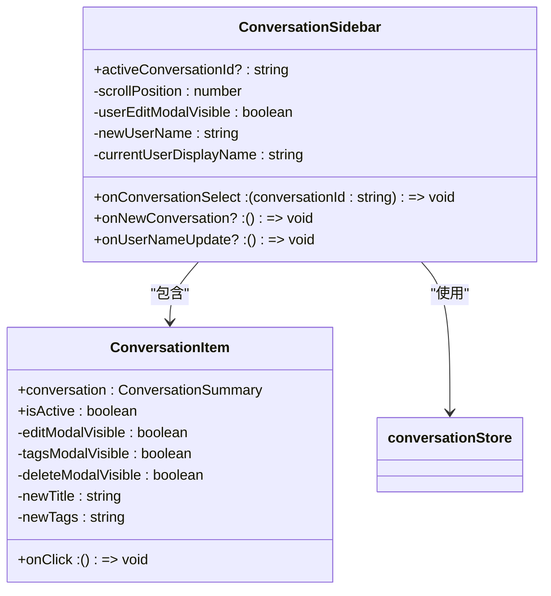

**图示来源**
- [ConversationSidebar.tsx](file://frontend/src/components/chat/ConversationSidebar.tsx#L15-L45)
- [conversationStore.ts](file://frontend/src/store/conversationStore.ts#L5-L20)

#### 创建/删除操作与选中状态同步
ConversationSidebar组件通过`useConversationStore`钩子与全局状态同步，实现会话的创建、删除和选中状态管理。

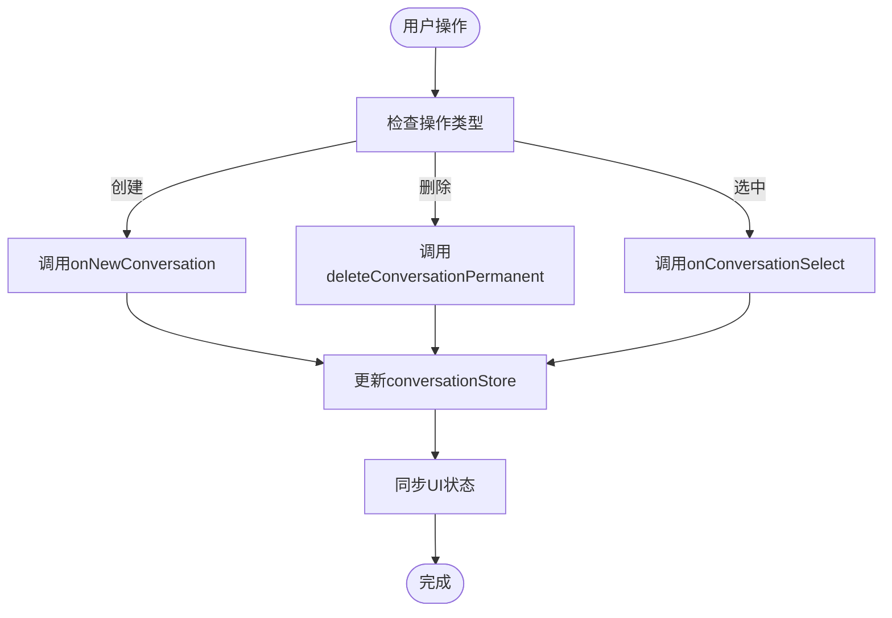

**图示来源**
- [ConversationSidebar.tsx](file://frontend/src/components/chat/ConversationSidebar.tsx#L45-L120)
- [conversationStore.ts](file://frontend/src/store/conversationStore.ts#L15-L50)

**本节来源**
- [ConversationSidebar.tsx](file://frontend/src/components/chat/ConversationSidebar.tsx#L1-L100)
- [conversationStore.ts](file://frontend/src/store/conversationStore.ts#L1-L50)

### ModeSelector分析
ModeSelector组件负责模式切换逻辑，包括Agent模式、调试模式等，及其对后续流程的影响。

#### 模式切换逻辑
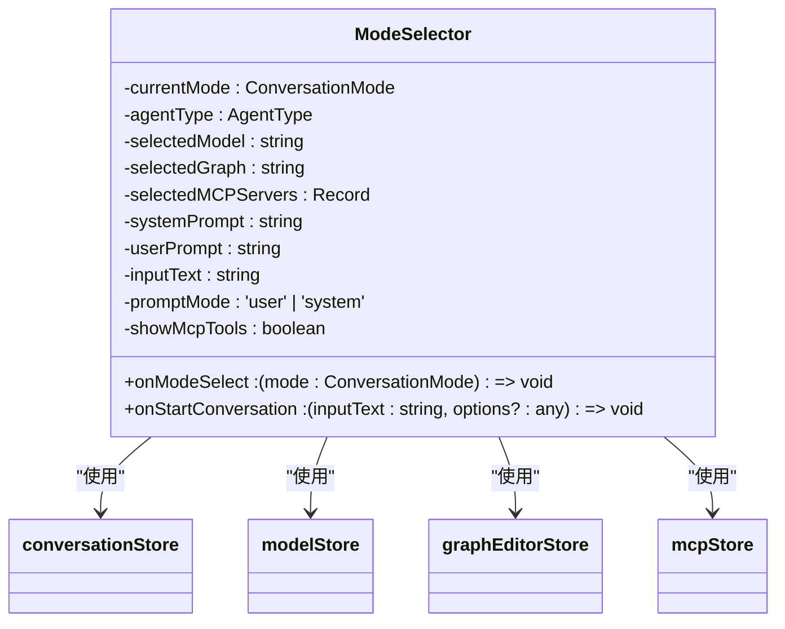

**图示来源**
- [ModeSelector.tsx](file://frontend/src/components/chat/ModeSelector.tsx#L15-L45)
- [conversationStore.ts](file://frontend/src/store/conversationStore.ts#L5-L20)

#### 模式对后续流程的影响
不同的模式选择会影响后续的对话流程和配置选项。

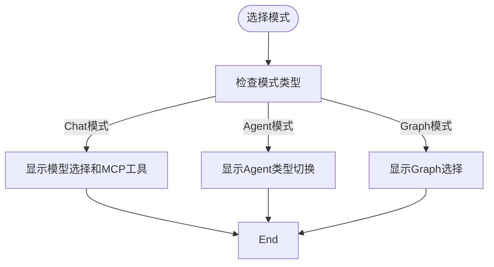

**图示来源**
- [ModeSelector.tsx](file://frontend/src/components/chat/ModeSelector.tsx#L45-L120)
- [conversationStore.ts](file://frontend/src/store/conversationStore.ts#L15-L50)

**本节来源**
- [ModeSelector.tsx](file://frontend/src/components/chat/ModeSelector.tsx#L1-L100)
- [conversationStore.ts](file://frontend/src/store/conversationStore.ts#L1-L50)

### InfoPanel分析
InfoPanel组件负责上下文信息的展示与元数据提取。

#### 上下文信息展示
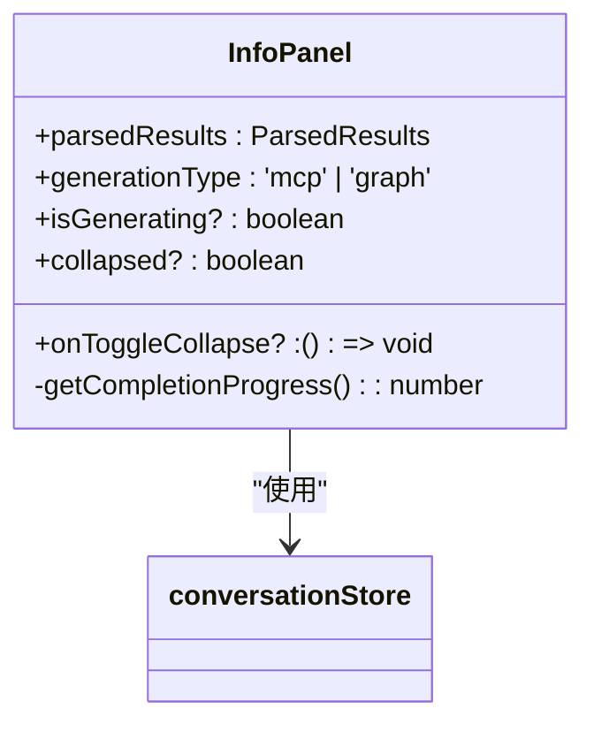

**图示来源**
- [InfoPanel.tsx](file://frontend/src/components/chat/InfoPanel.tsx#L15-L45)
- [conversationStore.ts](file://frontend/src/store/conversationStore.ts#L5-L20)

#### 元数据提取
InfoPanel根据`parsedResults`中的数据提取元信息并以结构化方式展示。

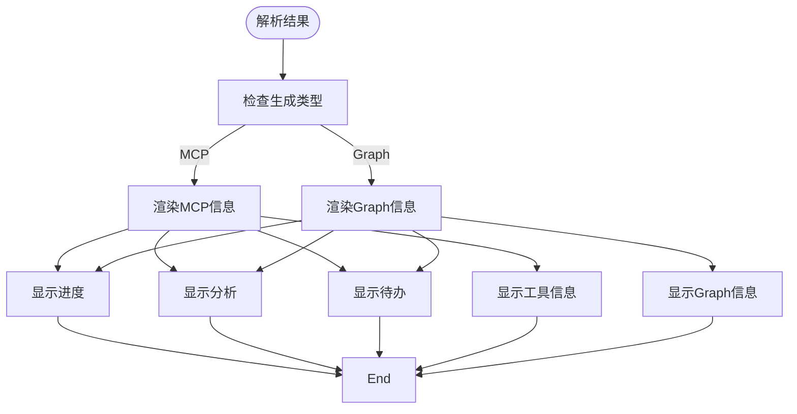

**图示来源**
- [InfoPanel.tsx](file://frontend/src/components/chat/InfoPanel.tsx#L45-L120)
- [conversationStore.ts](file://frontend/src/store/conversationStore.ts#L15-L50)

**本节来源**
- [InfoPanel.tsx](file://frontend/src/components/chat/InfoPanel.tsx#L1-L100)
- [conversationStore.ts](file://frontend/src/store/conversationStore.ts#L1-L50)

### CompactConfigModal分析
CompactConfigModal组件负责轻量级配置编辑与临时参数设置。

#### 轻量级配置编辑
```mermaid
classDiagram
class CompactConfigModal {
+visible : boolean
+onConfirm : (config : { modelName : string; compactType : 'brutal' | 'precise'; threshold : number }) => void
+onCancel : () => void
+compactType : 'brutal' | 'precise'
-form : Form
-selectedModel : string
-threshold : number
}
CompactConfigModal --> modelStore : "使用"
```

**图示来源**
- [CompactConfigModal.tsx](file://frontend/src/components/chat/CompactConfigModal.tsx#L15-L45)
- [modelStore.ts](file://frontend/src/store/modelStore.ts#L5-L20)

#### 临时参数设置
用户可以在模态框中设置压缩类型、模型和阈值等参数。

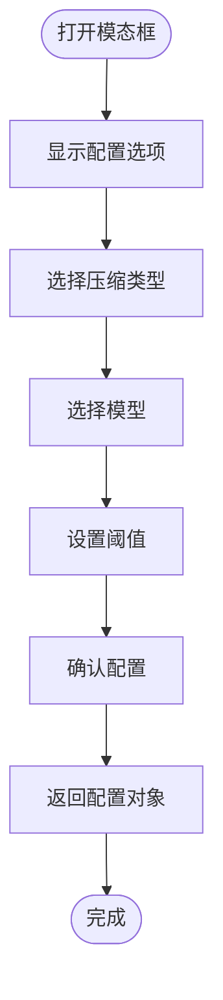

**图示来源**
- [CompactConfigModal.tsx](file://frontend/src/components/chat/CompactConfigModal.tsx#L45-L120)
- [modelStore.ts](file://frontend/src/store/modelStore.ts#L15-L50)

**本节来源**
- [CompactConfigModal.tsx](file://frontend/src/components/chat/CompactConfigModal.tsx#L1-L100)
- [modelStore.ts](file://frontend/src/store/modelStore.ts#L1-L50)

### AgentXMLRenderer分析
AgentXMLRenderer组件负责对Agent生成的XML结构化数据的解析与可视化呈现。

#### XML结构化解析
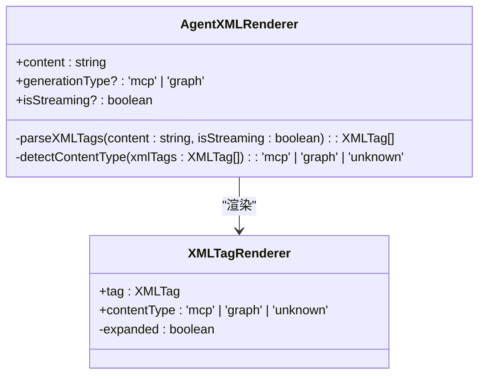

**图示来源**
- [AgentXMLRenderer.tsx](file://frontend/src/components/chat/AgentXMLRenderer.tsx#L15-L45)
- [conversation.ts](file://frontend/src/types/conversation.ts#L5-L20)

#### 可视化呈现
AgentXMLRenderer根据XML标签的类型和内容，以不同的方式可视化呈现。

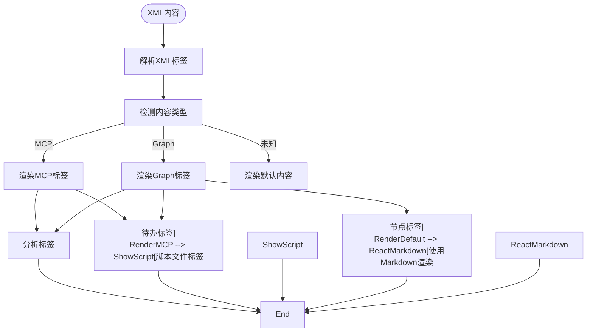

**图示来源**
- [AgentXMLRenderer.tsx](file://frontend/src/components/chat/AgentXMLRenderer.tsx#L45-L120)
- [conversation.ts](file://frontend/src/types/conversation.ts#L15-L50)

**本节来源**
- [AgentXMLRenderer.tsx](file://frontend/src/components/chat/AgentXMLRenderer.tsx#L1-L100)
- [conversation.ts](file://frontend/src/types/conversation.ts#L1-L50)

## 依赖分析
聊天界面组件之间存在复杂的依赖关系，通过状态管理实现数据共享。

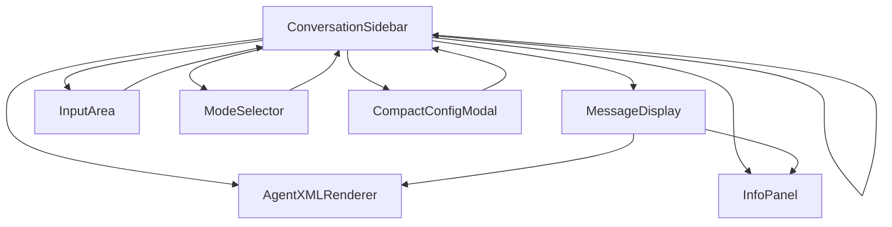

**图示来源**
- [conversationStore.ts](file://frontend/src/store/conversationStore.ts#L1-L20)
- [MessageDisplay.tsx](file://frontend/src/components/chat/MessageDisplay.tsx#L1-L15)

**本节来源**
- [conversationStore.ts](file://frontend/src/store/conversationStore.ts#L1-L30)
- [MessageDisplay.tsx](file://frontend/src/components/chat/MessageDisplay.tsx#L1-L50)

## 性能考虑
聊天界面在性能方面进行了多项优化，包括虚拟滚动、懒加载和缓存机制。

**本节来源**
- [ConversationSidebar.tsx](file://frontend/src/components/chat/ConversationSidebar.tsx#L10-L50)
- [conversationStore.ts](file://frontend/src/store/conversationStore.ts#L1-L50)

## 故障排除指南
当聊天界面出现异常时，可以检查SSE连接状态、对话状态和组件props。

**本节来源**
- [conversationStore.ts](file://frontend/src/store/conversationStore.ts#L10-L50)
- [MessageDisplay.tsx](file://frontend/src/components/chat/MessageDisplay.tsx#L15-L40)

## 结论
本文档详细解析了聊天界面的各个核心组件，包括其功能、实现和相互关系。通过深入理解这些组件，开发者可以更好地维护和扩展聊天系统。