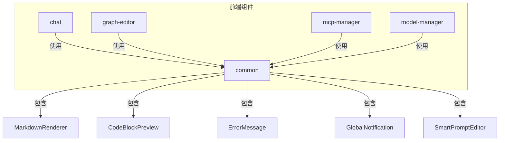
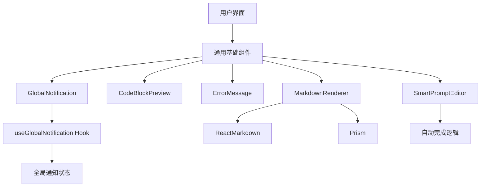
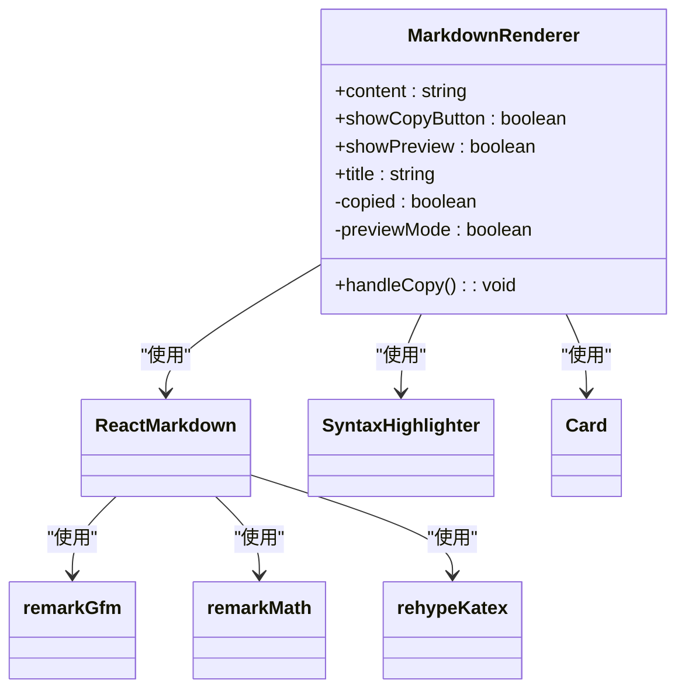
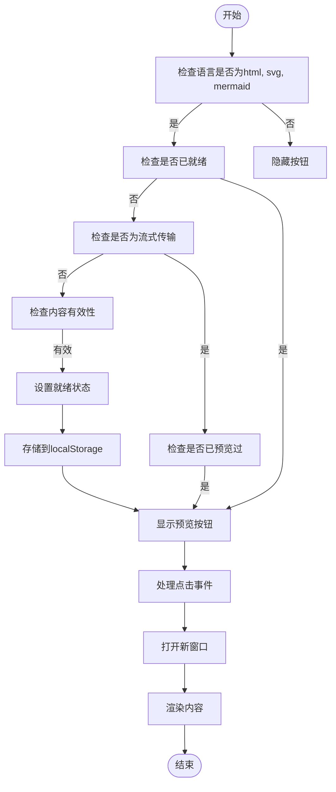
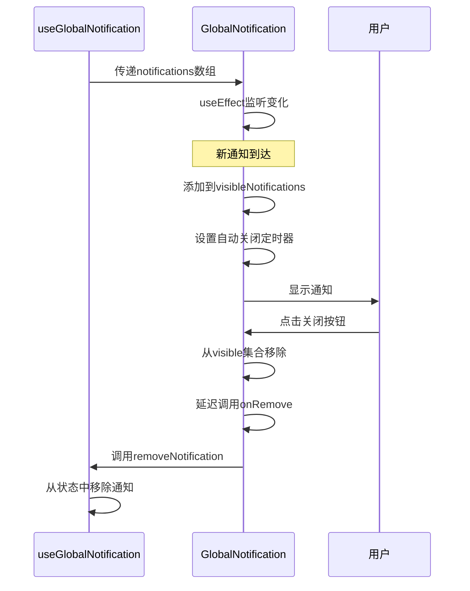
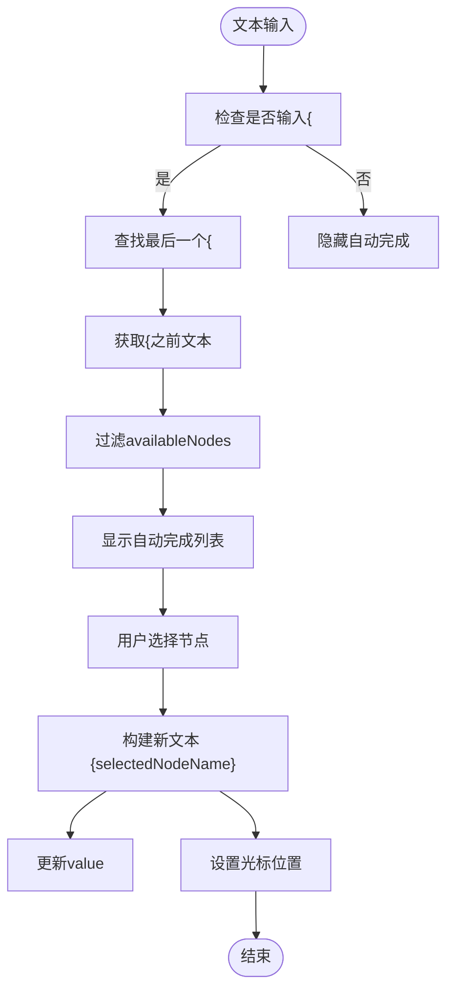
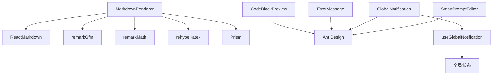

# 通用基础组件

<cite>
**本文档中引用的文件**  
- [MarkdownRenderer.tsx](file://frontend/src/components/common/MarkdownRenderer.tsx)
- [CodeBlockPreview.tsx](file://frontend/src/components/common/CodeBlockPreview.tsx)
- [ErrorMessage.tsx](file://frontend/src/components/common/ErrorMessage.tsx)
- [GlobalNotification.tsx](file://frontend/src/components/common/GlobalNotification.tsx)
- [GlobalNotification.css](file://frontend/src/components/common/GlobalNotification.css)
- [SmartPromptEditor.tsx](file://frontend/src/components/common/SmartPromptEditor.tsx)
- [useGlobalNotification.ts](file://frontend/src/hooks/useGlobalNotification.ts)
- [MessageDisplay.tsx](file://frontend/src/components/chat/MessageDisplay.tsx)
- [AgentXMLRenderer.tsx](file://frontend/src/components/chat/AgentXMLRenderer.tsx)
- [App.tsx](file://frontend/src/App.tsx)
</cite>

## 目录
1. [简介](#简介)
2. [项目结构](#项目结构)
3. [核心组件](#核心组件)
4. [架构概览](#架构概览)
5. [详细组件分析](#详细组件分析)
6. [依赖分析](#依赖分析)
7. [性能考虑](#性能考虑)
8. [故障排除指南](#故障排除指南)
9. [结论](#结论)

## 简介
本文档旨在深入解析前端项目中跨模块复用的通用基础UI组件。重点分析`MarkdownRenderer`、`CodeBlockPreview`、`ErrorMessage`、`GlobalNotification`和`SmartPromptEditor`等核心组件的实现机制、功能特性及集成方式。文档详细说明了这些组件如何通过Tailwind CSS实现视觉一致性，并与Zustand状态管理（如全局通知）进行集成，确保在整个应用中提供统一的用户体验。

## 项目结构
项目采用模块化结构，将通用组件集中存放在`frontend/src/components/common`目录下。这种组织方式便于跨功能模块复用，提高了代码的可维护性和一致性。

**图示来源**
- [App.tsx](file://frontend/src/App.tsx#L1-L68)

**本节来源**
- [App.tsx](file://frontend/src/App.tsx#L1-L68)

## 核心组件
本节深入分析了五个核心通用组件：`MarkdownRenderer`用于安全地渲染Markdown内容并支持代码高亮；`CodeBlockPreview`为特定语言的代码块提供预览功能；`ErrorMessage`以统一的样式展示错误信息；`GlobalNotification`实现了一个可管理的全局通知中心；`SmartPromptEditor`提供智能提示和语法高亮的输入编辑器。这些组件共同构成了应用的UI基础。

**本节来源**
- [MarkdownRenderer.tsx](file://frontend/src/components/common/MarkdownRenderer.tsx#L1-L138)
- [CodeBlockPreview.tsx](file://frontend/src/components/common/CodeBlockPreview.tsx#L1-L136)
- [ErrorMessage.tsx](file://frontend/src/components/common/ErrorMessage.tsx#L1-L12)
- [GlobalNotification.tsx](file://frontend/src/components/common/GlobalNotification.tsx#L1-L116)
- [SmartPromptEditor.tsx](file://frontend/src/components/common/SmartPromptEditor.tsx#L1-L233)

## 架构概览
系统采用React函数式组件和Hooks进行状态管理。UI组件通过Ant Design提供基础控件，并利用Tailwind CSS进行样式定制。`GlobalNotification`作为全局状态管理的典范，通过`useGlobalNotification` Hook在应用各处被调用，实现了通知的集中管理和分发。

**图示来源**
- [useGlobalNotification.ts](file://frontend/src/hooks/useGlobalNotification.ts#L1-L62)
- [GlobalNotification.tsx](file://frontend/src/components/common/GlobalNotification.tsx#L1-L116)

## 详细组件分析

### MarkdownRenderer分析
`MarkdownRenderer`组件负责将Markdown字符串安全地渲染为HTML。它集成了`remark-gfm`和`remark-math`插件以支持GitHub风格的Markdown和数学公式，并使用`rehype-katex`进行公式渲染。代码块通过`Prism`进行语法高亮，并内置了复制和预览切换功能。

#### 类图

**图示来源**
- [MarkdownRenderer.tsx](file://frontend/src/components/common/MarkdownRenderer.tsx#L1-L138)

**本节来源**
- [MarkdownRenderer.tsx](file://frontend/src/components/common/MarkdownRenderer.tsx#L1-L138)

### CodeBlockPreview分析
`CodeBlockPreview`组件为HTML、SVG和Mermaid代码块提供“在新窗口中预览”的功能。它通过`localStorage`记录预览状态，避免重复渲染。组件根据语言类型动态生成预览页面，并通过`window.open`打开新窗口进行展示。

#### 流程图

**图示来源**
- [CodeBlockPreview.tsx](file://frontend/src/components/common/CodeBlockPreview.tsx#L1-L136)

**本节来源**
- [CodeBlockPreview.tsx](file://frontend/src/components/common/CodeBlockPreview.tsx#L1-L136)

### ErrorMessage分析
`ErrorMessage`是一个极简的组件，用于以统一的样式展示错误信息。它使用Ant Design的`Alert`组件，将传入的`message`属性作为描述内容进行展示。

**本节来源**
- [ErrorMessage.tsx](file://frontend/src/components/common/ErrorMessage.tsx#L1-L12)

### GlobalNotification分析
`GlobalNotification`组件实现了一个可管理的全局通知中心。它接收一个通知列表，并为每个通知项提供图标、标题、消息和关闭按钮。通知支持自动关闭，并通过CSS类控制显示/隐藏动画。

#### 序列图

**图示来源**
- [GlobalNotification.tsx](file://frontend/src/components/common/GlobalNotification.tsx#L1-L116)
- [useGlobalNotification.ts](file://frontend/src/hooks/useGlobalNotification.ts#L1-L62)

**本节来源**
- [GlobalNotification.tsx](file://frontend/src/components/common/GlobalNotification.tsx#L1-L116)
- [useGlobalNotification.ts](file://frontend/src/hooks/useGlobalNotification.ts#L1-L62)

### SmartPromptEditor分析
`SmartPromptEditor`是一个智能提示编辑器，允许用户在输入时通过`{}`语法引用可用的节点。当用户输入`{`后，会弹出一个包含所有可用节点的下拉列表，支持过滤和选择。

#### 流程图

**图示来源**
- [SmartPromptEditor.tsx](file://frontend/src/components/common/SmartPromptEditor.tsx#L1-L233)

**本节来源**
- [SmartPromptEditor.tsx](file://frontend/src/components/common/SmartPromptEditor.tsx#L1-L233)

## 依赖分析
通用组件主要依赖于Ant Design提供UI控件，ReactMarkdown及其插件处理Markdown解析，以及Prism进行代码高亮。`GlobalNotification`与`useGlobalNotification` Hook紧密耦合，形成了一个完整的状态管理解决方案。

**图示来源**
- [MarkdownRenderer.tsx](file://frontend/src/components/common/MarkdownRenderer.tsx#L1-L138)
- [CodeBlockPreview.tsx](file://frontend/src/components/common/CodeBlockPreview.tsx#L1-L136)
- [ErrorMessage.tsx](file://frontend/src/components/common/ErrorMessage.tsx#L1-L12)
- [GlobalNotification.tsx](file://frontend/src/components/common/GlobalNotification.tsx#L1-L116)
- [SmartPromptEditor.tsx](file://frontend/src/components/common/SmartPromptEditor.tsx#L1-L233)

**本节来源**
- [MarkdownRenderer.tsx](file://frontend/src/components/common/MarkdownRenderer.tsx#L1-L138)
- [CodeBlockPreview.tsx](file://frontend/src/components/common/CodeBlockPreview.tsx#L1-L136)
- [ErrorMessage.tsx](file://frontend/src/components/common/ErrorMessage.tsx#L1-L12)
- [GlobalNotification.tsx](file://frontend/src/components/common/GlobalNotification.tsx#L1-L116)
- [SmartPromptEditor.tsx](file://frontend/src/components/common/SmartPromptEditor.tsx#L1-L233)

## 性能考虑
组件在设计时考虑了性能：
- `MarkdownRenderer`和`CodeBlockPreview`在流式传输时延迟渲染，避免频繁重绘。
- `SmartPromptEditor`的自动完成列表仅在输入`{`后激活，并通过`useRef`和`setTimeout`精确控制光标位置。
- `GlobalNotification`使用`Set`来管理可见状态，确保高效的更新。

## 故障排除指南
- **Markdown未正确渲染**：检查`remarkPlugins`和`rehypePlugins`是否正确配置。
- **代码高亮失效**：确认`Prism`的样式文件已正确导入。
- **通知不显示**：检查`useGlobalNotification`是否在父组件中正确使用，并确保`notifications`数组被正确传递。
- **智能提示不弹出**：确认`availableNodes`数组已正确传入，且输入符合`{`触发条件。

**本节来源**
- [MarkdownRenderer.tsx](file://frontend/src/components/common/MarkdownRenderer.tsx#L1-L138)
- [CodeBlockPreview.tsx](file://frontend/src/components/common/CodeBlockPreview.tsx#L1-L136)
- [GlobalNotification.tsx](file://frontend/src/components/common/GlobalNotification.tsx#L1-L116)
- [SmartPromptEditor.tsx](file://frontend/src/components/common/SmartPromptEditor.tsx#L1-L233)

## 结论
本文档系统地梳理了项目中的通用基础UI组件。这些组件通过模块化设计、一致的样式和强大的功能，为整个应用提供了坚实的基础。通过深入理解这些组件的实现和集成方式，开发者可以更高效地构建和维护应用的用户界面。