# 前端应用

<cite>
**本文档引用的文件**  
- [main.tsx](file://frontend/src/main.tsx)
- [App.tsx](file://frontend/src/App.tsx)
- [MainLayout.tsx](file://frontend/src/layouts/MainLayout.tsx)
- [WorkspaceLayout.tsx](file://frontend/src/layouts/WorkspaceLayout.tsx)
- [GraphEditor.tsx](file://frontend/src/pages/GraphEditor.tsx)
- [GraphCanvas.tsx](file://frontend/src/components/graph-editor/GraphCanvas.tsx)
- [AgentNodeComponent.tsx](file://frontend/src/components/graph-editor/AgentNodeComponent.tsx)
- [graphEditorStore.ts](file://frontend/src/store/graphEditorStore.ts)
- [graphService.ts](file://frontend/src/services/graphService.ts)
- [graph.ts](file://frontend/src/types/graph.ts)
</cite>

## 目录
1. [介绍](#介绍)
2. [项目结构](#项目结构)
3. [技术栈](#技术栈)
4. [主布局与路由](#主布局与路由)
5. [可视化图编辑器](#可视化图编辑器)
6. [状态管理](#状态管理)
7. [服务层与API调用](#服务层与api调用)
8. [关键UI组件](#关键ui组件)
9. [实时通信](#实时通信)
10. [总结](#总结)

## 介绍
本项目是一个基于React的前端应用，用于图形化构建和管理AI工作流。系统通过可视化方式让用户创建复杂的AI代理图，支持节点连接、属性配置、模型选择和MCP工具集成。前端采用现代化技术栈，提供直观的用户界面和流畅的交互体验。

## 项目结构
前端应用位于`frontend/src`目录下，采用模块化组织结构：

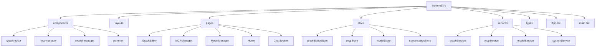

**图源**  
- [App.tsx](file://frontend/src/App.tsx#L1-L67)
- [MainLayout.tsx](file://frontend/src/layouts/MainLayout.tsx#L1-L115)

## 技术栈
本项目采用以下核心技术：

- **React**：作为核心UI框架，提供组件化开发能力
- **Vite**：现代化构建工具，提供快速的开发服务器和高效的生产构建
- **Tailwind CSS**：实用优先的CSS框架，实现快速样式开发
- **Ant Design**：企业级UI组件库，提供丰富的交互组件
- **React Flow**：用于构建可视化图编辑器的专业库
- **Zustand**：轻量级状态管理解决方案
- **React Router**：路由管理

这些技术共同构建了一个高性能、可维护的前端应用。

## 主布局与路由
应用采用两种布局模式：主布局（MainLayout）和工作台布局（WorkspaceLayout），通过React Router实现页面导航。

### 布局组件
主布局提供全局导航和系统控制，包含顶部菜单和关闭系统功能。工作台布局采用侧边栏设计，更适合复杂工作场景。

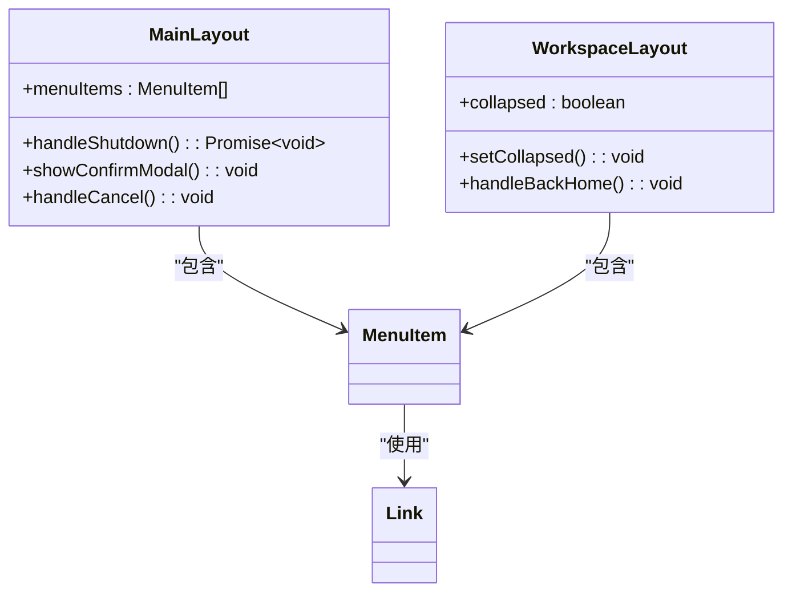

**图源**  
- [MainLayout.tsx](file://frontend/src/layouts/MainLayout.tsx#L1-L115)
- [WorkspaceLayout.tsx](file://frontend/src/layouts/WorkspaceLayout.tsx#L1-L189)

### 路由配置
应用路由定义在`App.tsx`中，支持多种页面和重定向规则：

```mermaid
flowchart TD
A[/] --> B[Home]
C[/chat] --> D[ChatSystem]
E[/workspace] --> F[Workspace]
G[/workspace/graph-editor] --> H[GraphEditor]
I[/workspace/model-manager] --> J[ModelManager]
K[/workspace/mcp-manager] --> L[MCPManager]
M[/graph-editor] --> N[重定向到/workspace/graph-editor]
O[/model-manager] --> P[重定向到/workspace/model-manager]
Q[/mcp-manager] --> R[重定向到/workspace/mcp-manager]
```

**图源**  
- [App.tsx](file://frontend/src/App.tsx#L1-L67)

**本节源**  
- [App.tsx](file://frontend/src/App.tsx#L1-L67)
- [MainLayout.tsx](file://frontend/src/layouts/MainLayout.tsx#L1-L115)
- [WorkspaceLayout.tsx](file://frontend/src/layouts/WorkspaceLayout.tsx#L1-L189)

## 可视化图编辑器
图编辑器是应用的核心功能，提供完整的图形化工作流设计能力。

### 整体架构
图编辑器页面由多个组件协同工作，形成完整的编辑体验：

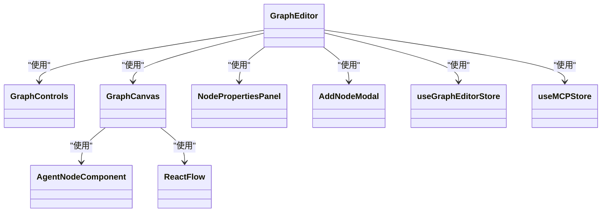

**图源**  
- [GraphEditor.tsx](file://frontend/src/pages/GraphEditor.tsx#L1-L658)
- [GraphCanvas.tsx](file://frontend/src/components/graph-editor/GraphCanvas.tsx#L1-L744)

### GraphCanvas组件
`GraphCanvas`组件基于React Flow库构建，负责渲染和交互图形画布。

#### 核心功能
- 使用React Flow的节点和边系统渲染图形
- 支持自定义节点类型（AgentNodeComponent）
- 实现多种边类型（常规连接和弧线连接）
- 提供背景样式切换功能
- 处理节点位置更新和连接管理

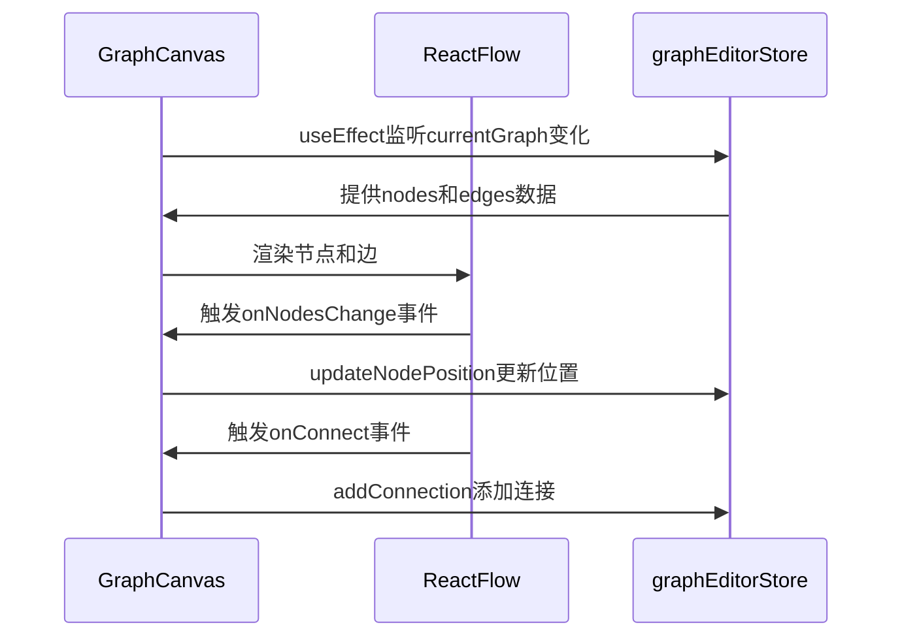

**图源**  
- [GraphCanvas.tsx](file://frontend/src/components/graph-editor/GraphCanvas.tsx#L1-L744)
- [graphEditorStore.ts](file://frontend/src/store/graphEditorStore.ts#L1-L707)

### AgentNodeComponent
`AgentNodeComponent`是自定义的节点渲染组件，展示节点的详细信息和状态。

#### 节点特性
- 显示节点名称、描述和类型（智能体或子图）
- 展示模型/子图名称和MCP服务器信息
- 可视化执行层级、循环次数和全局输出状态
- 提供输入/输出连接点
- 支持手柄（Handle）进行连接操作

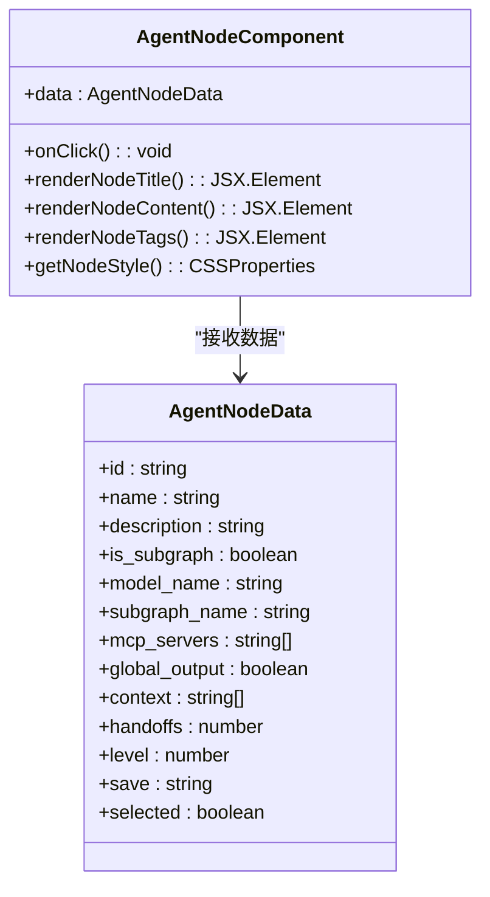

**图源**  
- [AgentNodeComponent.tsx](file://frontend/src/components/graph-editor/AgentNodeComponent.tsx#L1-L383)
- [graph.ts](file://frontend/src/types/graph.ts#L1-L113)

**本节源**  
- [GraphEditor.tsx](file://frontend/src/pages/GraphEditor.tsx#L1-L658)
- [GraphCanvas.tsx](file://frontend/src/components/graph-editor/GraphCanvas.tsx#L1-L744)
- [AgentNodeComponent.tsx](file://frontend/src/components/graph-editor/AgentNodeComponent.tsx#L1-L383)

## 状态管理
应用使用Zustand进行状态管理，提供高效的状态更新和组件通信。

### graphEditorStore
`graphEditorStore`是图编辑器的核心状态管理器，负责管理图形数据和操作。

#### 状态结构
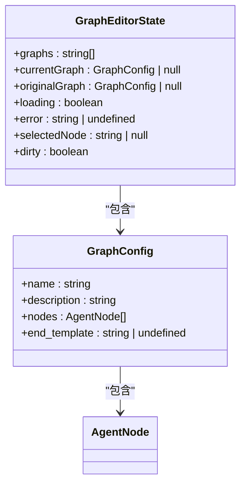

#### 关键操作
- `fetchGraphs`：获取所有图配置列表
- `loadGraph`：加载指定图配置
- `saveGraph`：保存当前图配置
- `addNode`：添加新节点
- `updateNode`：更新节点属性
- `removeNode`：删除节点
- `addConnection`：添加节点连接
- `removeConnection`：移除节点连接
- `autoLayout`：自动布局功能

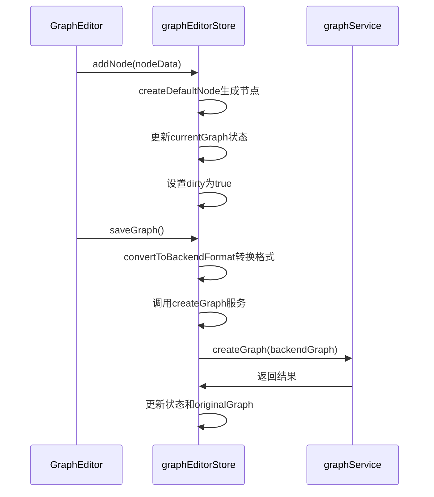

**图源**  
- [graphEditorStore.ts](file://frontend/src/store/graphEditorStore.ts#L1-L707)
- [graphService.ts](file://frontend/src/services/graphService.ts#L1-L223)

**本节源**  
- [graphEditorStore.ts](file://frontend/src/store/graphEditorStore.ts#L1-L707)

## 服务层与API调用
服务层封装了与后端API的交互，提供清晰的接口抽象。

### graphService
`graphService`模块负责所有与图相关的API调用。

#### 服务方法
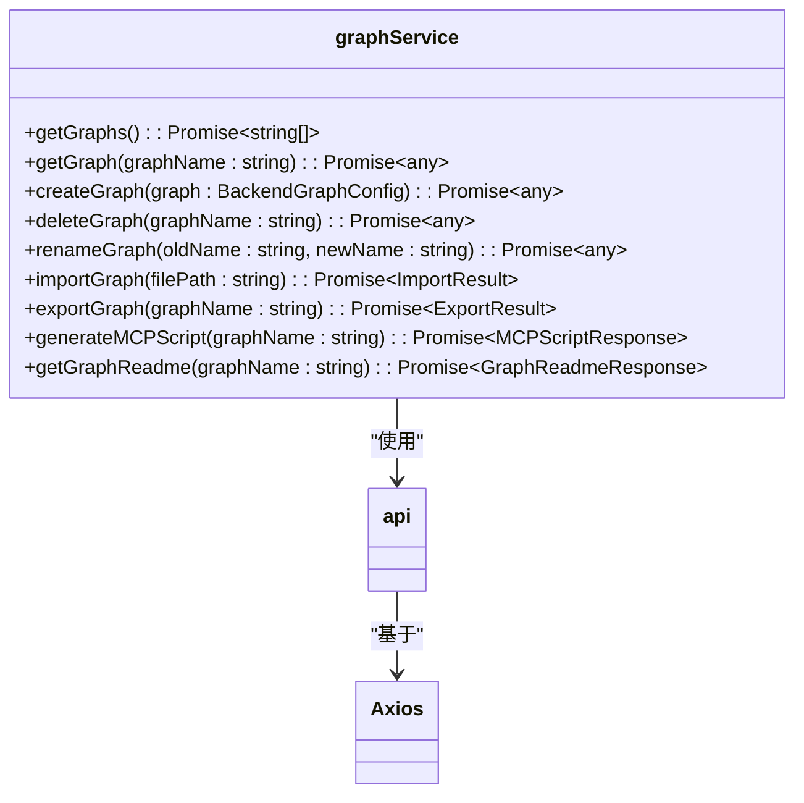

#### 请求流程
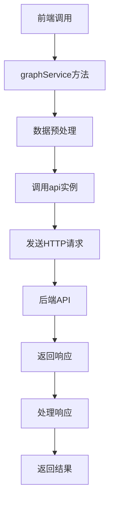

#### 数据转换
服务层负责前后端数据格式的转换：

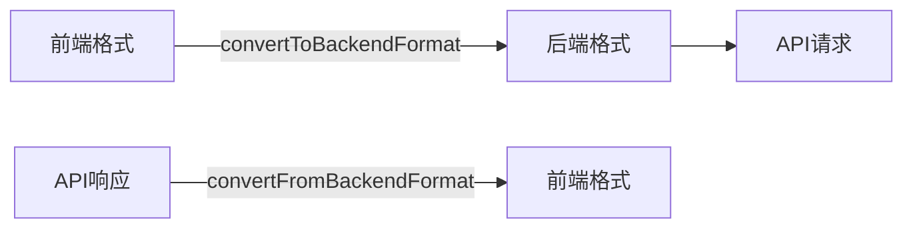

**图源**  
- [graphService.ts](file://frontend/src/services/graphService.ts#L1-L223)
- [graphEditorStore.ts](file://frontend/src/store/graphEditorStore.ts#L1-L707)

**本节源**  
- [graphService.ts](file://frontend/src/services/graphService.ts#L1-L223)

## 关键UI组件
应用包含多个可复用的关键UI组件，提升开发效率和用户体验。

### AddNodeModal
添加节点的模态框组件，提供节点创建界面。

### NodePropertiesPanel
节点属性面板，用于编辑选中节点的详细配置。

### GraphControls
图控件组件，包含添加节点、自动布局、导入导出等操作按钮。

### ServerStatusIndicator
服务器状态指示器，显示MCP服务器的连接状态。

这些组件通过props接收数据和回调函数，实现高内聚低耦合的设计。

**本节源**  
- [GraphEditor.tsx](file://frontend/src/pages/GraphEditor.tsx#L1-L658)
- [GraphCanvas.tsx](file://frontend/src/components/graph-editor/GraphCanvas.tsx#L1-L744)

## 实时通信
应用通过SSE（Server-Sent Events）实现与后端的实时通信。

### 连接管理
使用`useSSEConnection`自定义Hook管理SSE连接：

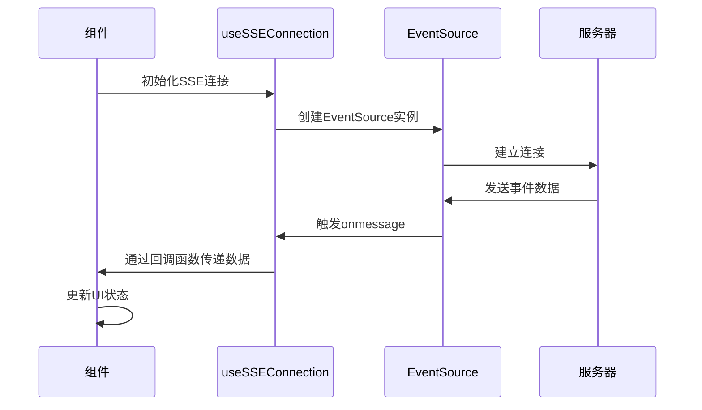

### 状态同步
定期轮询MCP服务器状态，确保前端显示最新连接信息：

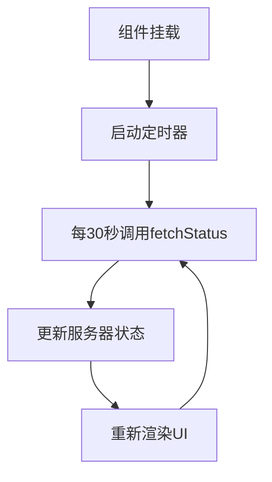

**本节源**  
- [GraphEditor.tsx](file://frontend/src/pages/GraphEditor.tsx#L1-L658)
- [useSSEConnection.ts](file://frontend/src/hooks/useSSEConnection.ts)

## 总结
本前端应用采用现代化技术栈，构建了一个功能完整的可视化AI工作流编辑器。通过React Flow实现图形化界面，Zustand管理复杂状态，服务层封装API调用，形成了清晰的架构分层。应用支持完整的图编辑功能，包括节点操作、连接管理、属性配置和实时状态同步，为用户提供直观高效的工作流设计体验。