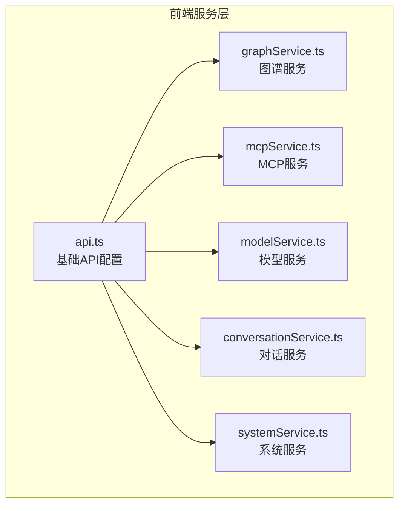
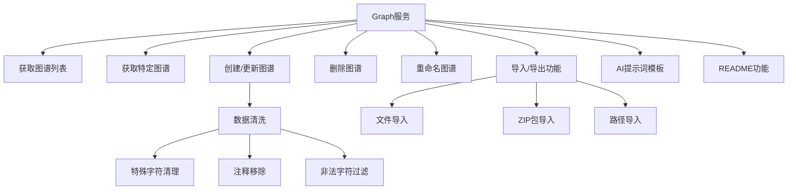
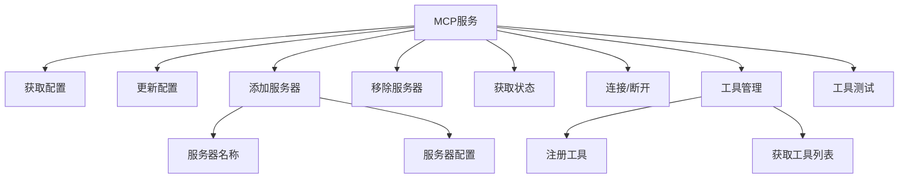
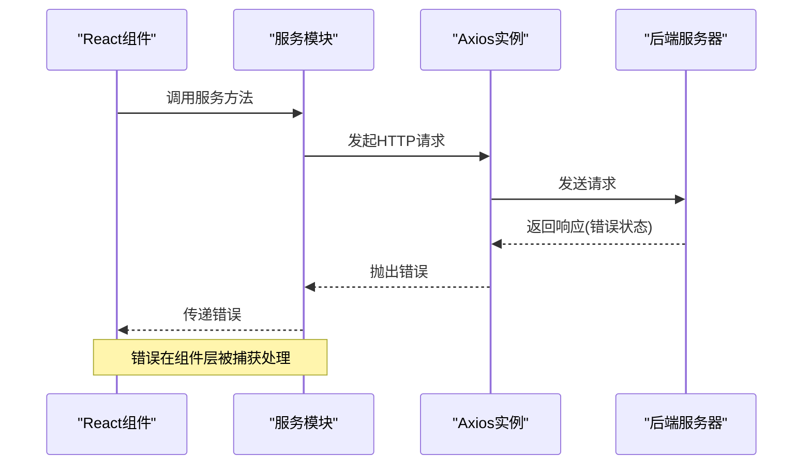
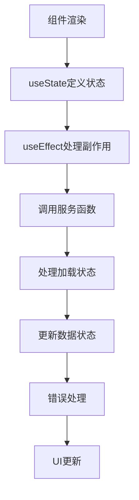

# REST API服务调用

<cite>
**本文档中引用的文件**   
- [api.ts](file://frontend/src/services/api.ts)
- [graphService.ts](file://frontend/src/services/graphService.ts)
- [mcpService.ts](file://frontend/src/services/mcpService.ts)
- [modelService.ts](file://frontend/src/services/modelService.ts)
- [conversationService.ts](file://frontend/src/services/conversationService.ts)
- [systemService.ts](file://frontend/src/services/systemService.ts)
</cite>

## 目录
1. [项目结构](#项目结构)
2. [核心组件](#核心组件)
3. [API封装架构](#api封装架构)
4. [业务服务模块实现](#业务服务模块实现)
5. [错误处理机制](#错误处理机制)
6. [React组件中的调用示例](#react组件中的调用示例)
7. [服务层可扩展性设计](#服务层可扩展性设计)

## 项目结构

前端服务相关代码位于`frontend/src/services`目录下，主要包含API基础配置和各业务模块的服务封装。



**Diagram sources**
- [api.ts](file://frontend/src/services/api.ts)
- [graphService.ts](file://frontend/src/services/graphService.ts)
- [mcpService.ts](file://frontend/src/services/mcpService.ts)

## 核心组件

前端REST API服务架构由基础API实例和多个业务服务模块组成，通过分层设计实现关注点分离。基础api.ts文件创建并配置Axios实例，为所有业务服务提供统一的HTTP通信能力。

**Section sources**
- [api.ts](file://frontend/src/services/api.ts)
- [graphService.ts](file://frontend/src/services/graphService.ts)

## API封装架构

### 基础实例化配置

api.ts文件通过Axios的create方法创建了一个预配置的HTTP客户端实例，实现了API调用的标准化。

```typescript
const api = axios.create({
  baseURL: API_BASE_URL,
  headers: {
    'Content-Type': 'application/json',
  },
});
```

该配置包含以下关键参数：
- **基础URL设置**：统一设置为`http://localhost:9999/api`，作为所有API请求的前缀
- **请求头配置**：默认设置Content-Type为application/json，确保请求体格式正确
- **无超时设置**：当前配置未设置超时限制，依赖浏览器默认行为
- **无跨域凭证**：未启用withCredentials，不自动发送Cookie等认证信息

**Section sources**
- [api.ts](file://frontend/src/services/api.ts#L1-L13)

## 业务服务模块实现

### Graph服务模块

graphService.ts封装了图谱管理相关的API端点，提供了完整的CRUD操作和特殊功能。



**Diagram sources**
- [graphService.ts](file://frontend/src/services/graphService.ts#L1-L223)

#### 请求参数处理

Graph服务实现了复杂的请求参数序列化策略：
- 使用sanitizeForJson函数清理JSON数据中的注释和特殊字符
- 对图谱节点数据进行规范化处理，确保输入/输出节点的有效性
- 在createGraph函数中构建标准化的请求体结构
- 支持路径参数（如graphName）和查询参数的正确编码

**Section sources**
- [graphService.ts](file://frontend/src/services/graphService.ts#L15-L108)

### MCP服务模块

mcpService.ts封装了MCP服务器管理相关的API端点。



**Diagram sources**
- [mcpService.ts](file://frontend/src/services/mcpService.ts#L1-L67)

#### POST请求体构造

MCP服务展示了标准的POST请求体构造规范：
- addMCPServer使用嵌套对象结构传递服务器配置
- removeMCPServers直接传递服务器名称数组
- registerMCPTool包含工具元数据和脚本文件的完整信息
- testMCPTool包含服务器名、工具名和参数的测试请求

**Section sources**
- [mcpService.ts](file://frontend/src/services/mcpService.ts#L1-L67)

### 其他服务模块

#### 模型服务（modelService.ts）
提供模型的增删改查操作，特别处理了模型名称的URL编码：
- 使用encodeURIComponent确保路径参数安全
- 实现标准的RESTful API模式（GET/POST/PUT/DELETE）

#### 对话服务（conversationService.ts）
提供对话管理功能，包括状态更新、标题修改、标签管理等。

#### 系统服务（systemService.ts）
提供系统级操作，如系统关闭。

**Section sources**
- [modelService.ts](file://frontend/src/services/modelService.ts#L1-L30)
- [conversationService.ts](file://frontend/src/services/conversationService.ts#L1-L254)
- [systemService.ts](file://frontend/src/services/systemService.ts#L1-L11)

## 错误处理机制

### HTTP状态码捕获

所有服务函数都依赖Axios的内置错误处理机制，当HTTP响应状态码表示错误时（4xx或5xx），Axios会自动拒绝Promise，触发catch块。



**Diagram sources**
- [mcpService.ts](file://frontend/src/services/mcpService.ts#L50-L67)
- [systemService.ts](file://frontend/src/services/systemService.ts#L5-L11)

### 网络异常处理

服务层实现了基本的网络异常处理：
- systemService.ts中的shutdownSystem函数包含try-catch块捕获网络错误
- conversationService.ts中的SSE连接创建包含完整的错误检查
- graphService.ts中的createGraph函数包含详细的错误日志记录

### 错误消息转换

虽然当前实现主要依赖原始错误信息，但提供了良好的错误调试支持：
- createGraph函数在捕获错误时同时记录错误详情和提交的数据
- 使用console.error输出错误信息，便于开发调试
- 服务函数通常将原始错误重新抛出，由调用方决定用户友好的错误显示

**Section sources**
- [graphService.ts](file://frontend/src/services/graphService.ts#L109-L156)
- [systemService.ts](file://frontend/src/services/systemService.ts#L5-L11)

## React组件中的调用示例

### 基本调用模式

在React组件中调用服务的典型模式如下：



### 状态管理示例

```typescript
// 伪代码示例
const MyComponent = () => {
  const [graphs, setGraphs] = useState<any[]>([]);
  const [loading, setLoading] = useState<boolean>(true);
  const [error, setError] = useState<string | null>(null);

  useEffect(() => {
    const fetchGraphs = async () => {
      setLoading(true);
      try {
        const result = await getGraphs();
        setGraphs(result);
        setError(null);
      } catch (err) {
        setError('获取图谱列表失败');
        console.error(err);
      } finally {
        setLoading(false);
      }
    };

    fetchGraphs();
  }, []);

  // 渲染逻辑...
};
```

此模式展示了如何结合useState管理数据、加载状态和错误状态，以及如何使用useEffect在组件挂载时发起API调用。

**Section sources**
- [graphService.ts](file://frontend/src/services/graphService.ts#L15-L25)
- [conversationService.ts](file://frontend/src/services/conversationService.ts#L5-L10)

## 服务层可扩展性设计

### 模块化架构

服务层采用清晰的模块化设计，便于新增API端点：
- 每个业务领域有独立的服务文件（graph、mcp、model等）
- 所有服务共享同一个基础API实例，确保配置一致性
- 类型定义分离到types目录，支持类型安全的API调用

### 新增API端点流程

新增API端点的标准流程：
1. 在相应服务文件中导入基础api实例
2. 定义新的异步函数，使用api.get/post/put/delete等方法
3. 根据需要定义请求和响应类型
4. 导出新函数供组件使用

### 一致性模式

所有服务模块遵循一致的实现模式：
- 使用async/await语法处理异步操作
- 直接返回response.data，简化调用方处理
- 依赖Axios的默认错误处理机制
- 保持函数命名清晰描述其功能

这种一致性设计降低了学习成本，提高了代码可维护性。

**Section sources**
- [graphService.ts](file://frontend/src/services/graphService.ts)
- [mcpService.ts](file://frontend/src/services/mcpService.ts)
- [modelService.ts](file://frontend/src/services/modelService.ts)